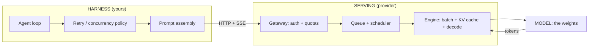
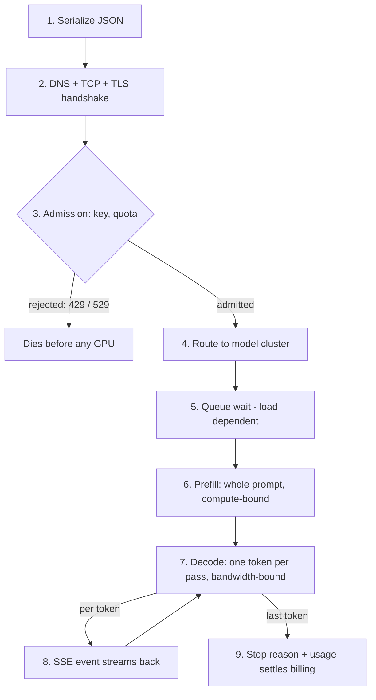

# 1. What inference engineering is

> **Part I — The layer beneath the prompt** — before you can reason about engines, you must be able to name the three machines that answer every call, and know which one broke.

You write a prompt. Two seconds later, tokens stream back. Between those two moments, three different machines did work for you, and each of them fails in its own way. One of them is the model — the trained weights that actually know things. One is the serving layer — the fleet of GPUs (graphics processing units), schedulers, and caches that turns your HTTP (hypertext transfer protocol) request into a stream of tokens. One is your harness — the agent loop you built, which decides what to send, when to send it, and what to do when the answer disappoints.

This book exists because almost everyone blames the wrong machine. The model gets credit for speed it does not control, and blame for slowness it cannot cause. This chapter gives you the map: the three layers, the life of one request through them, the ownership test that assigns every failure to exactly one layer, and the vocabulary the rest of the book builds on.

## 1.1 Words before machinery

This chapter opens a lot of vocabulary, so here is the entrance ramp. Each term gets its precise treatment in the section that follows — or in the chapter whose whole job it is.

| Term | Simple meaning | Everyday picture |
|---|---|---|
| Inference | Running a trained model to produce output, token by token | A chef cooking from a recipe they already know |
| Weights | The trained model artifact itself — billions of numbers | The recipe book the chef memorized |
| Serving | Everything between your HTTP request and the model's math | The kitchen: ovens, staff, order tickets |
| Serving engine | The software managing batching, memory, and decode loops | The head chef deciding which orders share an oven |
| Gateway | The provider front door: auth, quotas, routing | The host stand that can turn you away |
| Harness | Your code around the model: prompts, loops, retries, context | The waiter who writes and delivers the order |
| Prefill | Processing your prompt into memory before answering | Reading the whole order back to the kitchen |
| Decode | Generating the answer, one token per step | Plating and sending dishes one at a time |
| KV (key–value) cache | The per-request memory of what was already read and written | The kitchen's copy of your ticket so far |
| Batch | Multiple requests computed together in one pass | Several orders sharing one oven run |
| TTFT | Time to first token — how long until output starts | Time from ordering until the first plate lands |
| TPOT | Time per output token — the rhythm of the stream | Gap between consecutive plates |
| 429 / 529 | "You're over quota" / "we're overloaded" rejections | "You've ordered too fast" / "kitchen is slammed" |

Keep this table nearby. The rest of the chapter — and frankly the rest of the book — is these thirteen rows, given machinery and numbers.

## 1.2 A discipline with a birth certificate

> **ELI5:** A car company builds a great engine (the model). Another team builds the factory that installs engines into cars people can actually drive (serving). And the driver — that's you with your agent — decides where the car actually goes, and how hard it's flogged. A slow lap time can be the engine, the factory, or the driver. Inference engineering is the craft of the factory: making the engine deliver its power reliably, cheaply, at scale.

Inference engineering, as practitioners now define it, is "the discipline of making AI models run fast, reliably, and cheaply in production" — spanning the runtime that serves a single model on a GPU, the serving infrastructure around it, and the fleet-and-scheduling layer above that (Telnyx, retrieved 2026-08-27). It became a mainstream, named job in roughly a year: the Pragmatic Engineer's February 2026 deep-dive treats inference — running an existing model token by token — as the dominant production workload of the agent era, and 2026 as the year the title went from niche to hiring-queue staple (Pragmatic Engineer, Feb 12, 2026, retrieved 2026-08-27).

> **Dated snapshot — the role, mid-2026.** Anyscale posted a "Distributed LLM Inference Engineer" role (listed May 2026, salary band $170k–$245k/yr, San Francisco). Together AI posted "LLM Inference Frameworks and Optimization Engineer" in July 2026, asking candidates to "optimize inference frameworks, algorithms, and infrastructure." Fireworks AI hires LLM infrastructure engineers to serve "hundreds of state-of-the-art open models." (Job boards, retrieved 2026-08-27.)

The distinction that makes this a discipline rather than a buzzword: **prompt engineering optimizes what the model is told; inference engineering optimizes how the model runs.** The prompt engineer's lever is text. The inference engineer's levers are batch size, numerical precision, cache policy, engine choice, and fleet scheduling — and the canon is already written down. Chip Huyen's *AI Engineering* (2025) codifies the lever list: batching (especially continuous batching, which keeps GPUs busy by managing requests dynamically), quantization (shrinking numbers from 32-bit to 16-bit or less), KV caching (storing intermediate attention results instead of recomputing them), and service-level optimization. The vLLM/PagedAttention paper (Kwon et al., SOSP 2023) supplied the canonical justification: existing systems wasted KV-cache memory on fragmentation and duplication, which capped batch size — fix the memory management and throughput improves 2–4× at equal latency, with no change to the model or the prompt.

> **Field note.** In the operation reviews I've run, the single most expensive reflex is "the model is slow, let's try a different one." Swapping models is the most disruptive lever you own and the least likely to fix a serving problem. I have watched teams churn through three model migrations before someone noticed their retry loop had been quadrupling load against a provider that was already shedding it. The layer map below is the antidote: label the failure before you reach for a lever.

So where does the harness engineer fit? You are the third discipline. You don't tune kernels and you don't hand-optimize prompts in isolation — you design the system *around* the API (application programming interface): routing, caching discipline, concurrency, context curation, budgets. Volume I of this series was entirely about that layer. But every architectural choice you make either cooperates with the engine room or fights it. A cache-friendly prefix is an inference decision expressed in harness code. A retry storm is a serving incident manufactured by the client. This book is the missing manual for that interface.

## 1.3 Three layers, one request

> **ELI5:** Think of a restaurant. The **chef** is the model — talent, recipes, taste. The **kitchen** is the serving layer — how many orders it can juggle, how hot the ovens run, whether the ticket rail is jammed. The **waiter** is your harness — what gets written on the ticket, when it goes in, and what happens when the kitchen yells back. When the wrong dish arrives, that's the chef. When the right dish arrives cold because the kitchen is slammed, that's the kitchen. When the dish never arrives because the ticket blew off the rail, that's the waiter.

**The model layer** is the weights and their trained behavior. Its failures are wrong-but-confident answers, refusals, stale knowledge past the training cutoff, and position-dependent blindness — the model literally reads your long prompt but under-uses its middle (Liu et al., "Lost in the Middle," TACL 2023), and recall keeps degrading as context grows, a pattern Anthropic's engineers named "context rot" that "emerges across all models" (Anthropic engineering blog, 2025-09-29). No quantity of retries, capacity, or routing fixes these outputs — a rerun only resamples the noise, and noise is not what the weights lack. The fix lives here only: a different model, a different checkpoint, or a different prompt and context construction.

**The serving layer** is the machinery that turns requests into token streams: admission control, queues, batching, KV-cache management, decode loops, and the gateway in front of them. Its failures are overload, queueing collapse, quota enforcement, degraded throughput, and mid-stream aborts. Providers publish this layer's failures on their status pages — it is effectively a public ledger of serving incidents (more on that in 1.6). Two properties matter to you immediately: published rate limits "represent maximum allowed usage, not guaranteed minimums" — quota is an admission contract, not a capacity promise (Anthropic rate-limits docs, retrieved 2026-08-27) — and errors can arrive *after* HTTP 200, as error events inside an otherwise healthy-looking stream (Anthropic errors docs, retrieved 2026-08-27).

**The harness layer** is your code: retry policy, concurrency, prompt assembly, context curation, caching discipline. Its failures are manufactured by the caller, which is the uncomfortable and empowering truth of this layer. A retry loop without jitter turns a partial outage into a total one. A timestamp in a system prompt silently forfeits cache reuse. An 800k-token context induces model-layer recall loss. None of those are provider problems.

The boundary you actually touch is the provider API. As of this writing the three dominant contracts are OpenAI's Chat Completions (and the newer Responses API), Anthropic's Messages API, and Google's `generateContent` (verified against official docs, retrieved 2026-08-27) — and they converge on a shared anatomy: you send a message list plus parameters, you get generated content, a `usage` object with exact token counts, and a stop reason. Two details from that contract will recur through this whole book. First, `usage` is the billing interface — providers bill from their own server-side counts, so your client-side token estimate is a budgeting approximation, never a reconciliation. Second, the stop reason is the provider's exit code — normal stop, length truncation, tool handoff, safety interruption — and mapping it correctly is the difference between an agent loop that resumes cleanly and one that drops or duplicates turns. Part III dissects this contract hop by hop.

One direction of causality runs between the layers, and only one. Harness choices *induce* model failures (context bloat → context rot) and serving failures (jitterless retries → overload amplification). The reverse does not happen: the serving layer cannot change what the weights know, and the model cannot cause a 529. Remember this asymmetry; it is the backbone of the ownership test in 1.6.

## 1.4 Inference is not training run backwards

> **ELI5:** Training is a freight train: enormous cargo, fixed schedule, and the whole art is keeping the locomotive pulling at full power for weeks. Inference is a taxi fleet: trips arrive randomly, every trip is a different length, and speed is decided by how fast each car can get to your door, not by engine horsepower. Different business, different physics.

A natural first guess is that serving a model is just training's math with the direction reversed — same GPUs, same matrices, roughly the same efficiency. The measured record says otherwise. Training runs at a stable 40–46% Model FLOPs Utilization (MFU — the fraction of theoretical floating-point operations the hardware actually performs) at frontier scale: PaLM 540B sustained 46.2% across 6,144 TPU (tensor processing unit) v4 chips, and Llama 3's training reported 41–43% BF16 (bfloat16, a 16-bit number format) MFU on 8,192–16,384 GPUs (Chowdhery et al., 2022; Meta, 2024). Serving sits far from that ceiling: Google's inference-efficiency study of 500B+ class models measured 29 ms per token at low batch size on TPU v4 — a latency-versus-MFU Pareto frontier, not a utilization victory (Pope et al., 2022).

The reason is the shape of the work. Training walks a fixed dataset in huge, schedule-stable batches: every step does the same amount of math, so efficiency means keeping the feed full. Serving receives stochastic arrivals, each with its own context length and output plan. And during decode — the phase where your answer actually gets written — the engine emits one token per request per step. The arithmetic per step is tiny; the memory traffic is enormous, because every step streams the model's weights through the chip. NVIDIA's own optimization guide states it flatly: decode "is memory-bound" — "the speed at which the data (the model weights) is transferred to the GPU from memory dominates the latency" (NVIDIA, 2023).

Here is the arithmetic artifact of this chapter — do it once and you own it forever:

> **Arithmetic: the single-stream decode floor (derived, not a benchmark).**
> An 8-billion-parameter model ships roughly 16 GB of weights in BF16 (2 bytes per parameter). An NVIDIA H100 SXM offers 3.35 TB/s of high-bandwidth memory (NVIDIA product page, retrieved 2026-08-27). If decode at batch size 1 must stream all weights once per token:
>
> **16 GB ÷ 3.35 TB/s ≈ 4.8 ms per token → a ceiling near 208 tokens/s per GPU, bandwidth permitting.**
>
> FLOPs never entered the calculation. The memory bus set the number.

Bandwidth, not compute, sets the single-stream speed of generation. Every famous serving innovation is an attack on this wall from a different angle: batching (more requests per weight-streaming pass — Orca's iteration-level scheduling, OSDI 2022), KV-cache paging (fit more requests in memory — vLLM, 2–4× throughput), quantization (make the weights smaller — FP8, an 8-bit floating-point format, is "effectively lossless" across the Llama-3.1 family per 500,000+ evaluations, Databricks, arXiv 2411.02355), speculative decoding (guess several tokens, verify in one pass). You will meet each one in its own chapter. The takeaway for now: those levers move speed, cost, and capacity *without touching the weights* — which is exactly why the serving layer deserves its own engineering discipline, and why "make the agent faster" almost never requires "make the model smarter."

## 1.5 The life of one request

> **ELI5:** A request is a passenger. Book the flight (serialize the request into JSON, the web's standard data format), get to the airport (network), clear the ticket desk — where you can be turned away before any flying happens (admission), get your gate (routing), wait at the gate (queue), board and take off (prefill), cruise with one small movement at a time (decode), then land and collect bags (final events and billing). A passenger who says "flying was slow" might have been late to the airport, stuck at the gate, or sitting on the tarmac. Same complaint, five different causes.

Follow one streaming chat completion from your code to its last token:

1. **Serialize.** Your SDK (software development kit) encodes model ID, messages, tools, and `stream: true` as JSON. Any token count you compute here is an estimate; the canonical count arrives in the response's `usage` at the end.
2. **Connect.** DNS (domain name system) resolution, a TCP (transmission control protocol) handshake (one round trip by protocol definition), then TLS (transport layer security): one round trip on TLS 1.3, two on TLS 1.2, and essentially zero extra on session resumption (Cloudflare TLS 1.3 overview, retrieved 2026-08-27). This hop is pure geography and protocol — nothing model-shaped has happened yet.
3. **Admit.** The provider terminates TLS, checks your key, validates the request, and runs the rate-limit test. A rejected request never reaches a GPU — it dies here with a 429. Some 429s (spend caps) carry no `retry-after` and keep failing until access resumes; retrying them is pure waste (Anthropic rate-limits docs, retrieved 2026-08-27).
4. **Route.** A gateway maps the model ID to a cluster holding those weights and forwards the request to that cluster's internal queue.
5. **Queue.** The request waits until the engine's scheduler admits it. How long depends entirely on load; no major provider publishes queue-time distributions (no public number found as of 2026-08-27). This is the hop most often mistaken for "the model is slow."
6. **Prefill.** The engine processes your whole prompt in one parallel pass — compute-bound — producing the first output token and filling the KV cache. Long prompts mean long first-token waits; this is why chunked prefill exists (Sarathi-Serve, 2024).
7. **Decode.** One forward pass per token, batched across all running requests, each pass memory-bound. The KV cache grows by one entry per token — the dynamically growing memory that PagedAttention was built to manage (Kwon et al., 2023).
8. **Stream.** Each decoded token becomes a server-sent event (SSE) on the same connection. Anthropic's documented sequence is a typed event log: `message_start` → `content_block_start` → repeated `content_block_delta` → `content_block_stop` → `message_delta` (final stop reason and cumulative usage) → `message_stop`, with `ping` keepalives (Anthropic streaming docs, retrieved 2026-08-27).
9. **Settle.** The final events carry stop metadata; usage and billing are settled provider-side. From your timestamps: TTFT is first delta minus send; per-token gaps give you TPOT; last delta minus send is end-to-end.

Now the diagnostic payoff. The client-visible symptom of hops 2, 5, 6, and 7 is the same word — "slow" — but the hops have different owners and different fixes:

- First token late, then a smooth stream → the delay lives in network, admission, queue, or prefill.
- First token prompt, then chunky gaps → the delay lives in decode (or a throttle).
- Rejected instantly → admission control, before any model math.
- Died mid-stream after HTTP 200 → serving-layer abort, surfacing as an SSE error event.

Chapter 2 turns TTFT, TPOT, and inter-token latency into precise instruments; the point of the hop map is that *no single latency number can tell you which machine is slow*. You need per-hop timestamps. That is a harness responsibility, and it is the first thing tinyengine (the running companion we build in Parts III–IV) instruments.

## 1.6 Who owns which failure

> **ELI5:** A package arrives late, damaged, or not at all. Check the label on the failure before you complain: never shipped (your mistake), stuck at the depot (carrier), or the wrong item entirely (factory) — and only one of the three can make the failure impossible.

Every agent failure lands in exactly one of the three layers, and each layer has a near-monopoly on its own fix. The **ownership test**: ask *which single change makes this failure impossible?* A better model or checkpoint → model layer. More capacity, better scheduling, admission control → serving layer. A change to your client code — backoff, jitter, retry budgets, prefix stability, context pruning → harness layer. Misrouted fixes are wasted iterations: fixing a 529 by swapping model names, or "fixing" a refusal by retrying the identical prompt.

| Symptom you see | Layer that owns it | The fix only that layer can make |
|---|---|---|
| Wrong-but-confident answer, refusal, stale fact | Model | Different model/checkpoint, better prompt and context construction |
| Recall degrades when context grows long | Model (interaction induced by harness) | Cure the context bloat *and* possibly change model |
| 529 overloaded, elevated latency, interrupted streams | Serving | Provider capacity; you shed load or route away |
| 429 rate limit, with `retry-after` | Serving (quota) | Client-side scheduling; request a higher tier |
| 429 spend cap, no `retry-after` | Serving (billing) | Pay or wait — retries are pure waste |
| Retry storm during an incident | Harness | Backoff with jitter, retry budgets |
| Cache never hits despite repeated prompts | Harness | Stable prefixes, correct breakpoint placement |
| Mid-stream error after HTTP 200 | Serving (surface) | Normalize SSE error events; resume or fail cleanly |

The serving layer's failures are publicly documented if you know where to look. Anthropic logged a ~36-minute critical disruption on 2026-08-16 (21:58–22:34 UTC, coordinated universal time) spanning claude.ai, the API, and Claude Code, then a ~26-minute major incident of "elevated errors on requests to multiple models" on 2026-08-20; a few weeks earlier, OpenAI's log showed "elevated latency, timeouts, and interrupted streaming" scoped to *specific models* (gpt 5.1 mini, gpt 4.1 mini, resolved 2026-07-27) (provider status APIs, retrieved 2026-08-27). Read those carefully: a model-scoped degradation on one provider is a serving event, not an intelligence event. The weights did not get dumber that day; the pipeline serving them stumbled.

The harness layer's failures compound precisely because they look like someone else's. Google's SRE (site reliability engineering) book works the arithmetic: with a 3-attempt retry budget, retried volume can grow to just under 3× the original load during an overload — turning a partial outage into a total one. Cap each client at a 10% retry ratio and worst-case growth drops to 1.1× (Google SRE Book, ch. 21, "Handling Overload"). Both providers' guidance converges from the other side: treat `Retry-After` as a minimum, add jitter "so multiple clients don't retry at the same time," never retry quota or billing errors, and remember the official SDKs already retry transient failures twice by default — layer your own retries on top naively and you won't know how many attempts a "single" call really makes (OpenAI rate-limits guide; Anthropic errors docs, retrieved 2026-08-27).

> **Field note.** The cheapest reliability upgrade I know for an agent system costs one line of discipline: tag every failed call with its layer *before* escalating. 429/529 with a `retry-after` → serving, react with scheduling, never with retries. Quality complaints that correlate with deep context → harness-owned curation, model swap as last resort. This one habit ends the two most expensive production mistakes: paying for serving incidents by "upgrading" models, and paying for model limitations with retry loops.

## 1.7 Same weights, different engines

> **ELI5:** Two restaurants can cook from the identical recipe and still deliver wildly different experiences. One has a brigade and a blast furnace; one has a home stove and one pan. Same recipe — the *kitchen* decides how fast the dish arrives and what it costs. Model weights are the recipe. Providers are the kitchens.

If the serving layer were a thin, uniform wrapper, this chapter would be bookkeeping. It is not, and the proof is the same open weights served by different providers. As a dated snapshot (Artificial Analysis, retrieved 2026-08-27):

> **Dated snapshot — one model, many kitchens (retrieved 2026-08-27; rankings drift with infrastructure changes).**
> **Llama 4 Scout, identical weights, output speed:** Groq 446.7 tokens/s · Amazon Bedrock 172.0 · Google Vertex 152.8 · DeepInfra 53.5 — an **8.3× spread**.
> **TTFT for the same model:** DeepInfra 0.57 s · Google Vertex 0.72 s · Groq 0.75 s · Bedrock 0.80 s — note the inversion: the fastest *decoder* (Groq) was not the fastest to *first token* (DeepInfra).
> **Blended price** (7:2:1 cache-hit/input/output mix): DeepInfra $0.12 vs Cloudflare $0.33 per 1M tokens — **2.7×** for the same weights.
> **DeepSeek R1 0528:** output speed spread 6.1× (Google Vertex 154.8 vs DeepInfra 25.6 tokens/s); blended price spread 6.1× ($0.56 vs $3.40 per 1M tokens).

Why can identical weights produce an 8× speed spread? The providers differ in hardware (GPUs vs purpose-built silicon), in the precision they serve (one host's "Llama" is FP8 while another's is BF16 — see the snapshot below), in batching policy (more batching raises throughput and queueing together), and in margin. None of these appear on the model card.

> **Dated snapshot — precision, mid-2026 (retrieved 2026-08-27).** FP8 is measurably near-lossless (Databricks' study of 500,000+ evaluations, arXiv 2411.02355), and SemiAnalysis InferenceX measured it ~18% faster and cheaper per token on the same chip. Push all the way to 4-bit and quality can bend: one single-H100 benchmark measured INT4 running 2.7× faster than BF16 while dropping ~8 points on a code-generation benchmark (AIMultiple). Chapter 9 owns the full quantization menu.

The consequence for a harness engineer is structural: **"the model" is not a controlled variable across providers.** When you route `llama-4-scout` at two vendors and measure different latency, quality headroom, and cost, you are not seeing model variance — you are seeing serving stacks. Chapter 16 turns this into routing strategy. The habit to adopt now: pin the quantization variant you benchmarked, and re-benchmark quarterly, because provider performance shifts under you with infrastructure changes, load balancing, and silent updates (Artificial Analysis, retrieved 2026-08-27).

## 1.8 The map of this book

The three layers give the book its route. Part I finishes the foundation: tokens and the serial nature of generation (ch2), the arithmetic of waiting (ch3), and the KV cache — the memory that is not the model (ch4). Part II descends into the engine: batching (ch5), paging and prefix caching (ch6), prefill/decode separation (ch7), speculative decoding (ch8), quantization (ch9), parallelism and mixture-of-experts (ch10), long context (ch11). Part III climbs back to the contract you actually hold: streaming (ch12), structured output (ch13), prompt-cache economics (ch14), rate limits (ch15), routing and cost metering (ch16). Part IV is where you, the harness engineer, take the wheel: cache-aware harness design (ch17), and finally assembling **tinyengine** — a small TypeScript inference shim that normalizes streaming across providers, meters tokens and cost, schedules against rate limits, routes with fallbacks, and assembles cache-friendly prompts (ch18).

One durable equation organizes everything:

> **Agent economics = what the model knows × what the engine extracts × what the harness wastes.**

The model term is rented; you choose it from a catalog. The engine term is the provider's craft — but you choose the engine, the variant, and the route. The waste term is entirely yours. Volume I taught you to stop wasting the model. This volume teaches you to stop wasting the engine.

## Where the picture stops

The restaurant map earns its keep, and now it must be dismantled before it misleads you.

**A restaurant does not rebuild your table between courses.** A serving engine re-stores per-request memory — the KV cache — token by token, and may throw it away minutes after you leave. Chapter 4 shows why the memory that holds your conversation is not part of the model at all, and chapter 14 shows why a timestamp in a system prompt can quietly cost you a full-price recompute.

**One table does not share an oven with strangers.** In serving, your request shares a batch with other tenants' requests. Their prompt lengths, their output lengths, and the provider's batching policy all appear in *your* latency. There is no restaurant where the next table's order slows your courses — in inference, that is a normal Tuesday.

**The same recipe at two restaurants is still the same dish.** The same weights at two providers are not the same service — 8× different decode speed and 6× different price for identical weights (2026-08-27 snapshot). The kitchen, not the recipe, decides.

**"Slow" at a restaurant has about two causes.** At an API it has at least five hops (network, admission, queue, prefill, decode) that all produce the identical client-side symptom. No amount of intuition substitutes for per-hop timestamps — which is why the first tinyengine instrument is a tracer, not a prompt template.

**And the deepest break:** the layers influence each other in exactly one direction. Harness choices induce serving failures and model failures, never the reverse — a provider's stack can degrade how the weights *express* what they know (1.7), but it cannot change what they know. The restaurant's waiter really can jam the kitchen; the kitchen cannot make the chef misread the recipe.

## Checkpoint

Teach it back before moving on:

1. Your agent "feels slow" at 6 pm daily. Name the five hops a request passes through, and one timestamp-based measurement that discriminates each.
2. A 429 arrives with no `retry-after` header. Which layer owns it, and what is the correct reaction?
3. Compute from memory: why does an 8B model on an H100 top out near 200 tokens/s at batch 1 — and which resource, compute or bandwidth, set that ceiling?
4. Your teammate wants to migrate models because "the model got slower at 2 pm." What evidence would you demand before touching the model layer?
5. Two providers serve the same open weights; one is 3× faster and 2× more expensive. Which one should serve an interactive agent loop, and which should serve an overnight evaluation batch — and why does the answer flip?

If you can answer all five in your own words, you have this chapter. If you can answer question 1 with a straight face *and* a sketch of timestamps, you are already dangerous.

## Build it / Break it / Prove it / See it in the wild

### Build it

Take one real streaming call in your codebase and wrap it with three timestamps: request sent, first content delta received, last delta received. Compute TTFT, mean inter-token gap, and end-to-end time. Check the identity: end-to-end ≈ TTFT + (N − 1) × mean gap, where N is the token count from the response's `usage` field. Ten lines of code; you have just built the seed of tinyengine's call tracer, and you will never again have to guess which hop is slow.

### Break it

Try to fail each layer on purpose. Send a request with an invalid key (dies at admission — note the speed of the rejection; no GPU was consulted). Trip a rate limit and compare a quota 429's headers with the documented spend-cap behavior. Kill the connection mid-stream and observe what your SDK does — and whether the provider billed the tokens generated before the kill. Watch a provider's status page during the next incident and classify each entry as model, serving, or billing.

### Prove it

Verify the e2e identity from Build it on three real requests — the residual tells you how much queueing jitter hides inside your TPOT. Then reproduce the provider-spread claim in miniature: run the same prompt against the same open model on two different hosts (Artificial Analysis lists candidates) and measure your own TTFT and tokens/s. You won't match published medians exactly — that's the lesson: these are distributional, load-dependent numbers, which is precisely why the book teaches formulas and instruments rather than tables of constants.

### See it in the wild

Browse Artificial Analysis provider tables for a single open model and watch speed, TTFT, and price diverge per host. Skim the vLLM documentation's feature list — continuous batching, chunked prefill, prefix caching — and recognize every item as a named lever from this chapter, now standard equipment. Read Google's SRE Book chapter 21 on handling overload before your next incident, not during it. And search any job board for "inference engineer" — the birth-certificate evidence of Section 1.2, hiring at volume while you read this.
