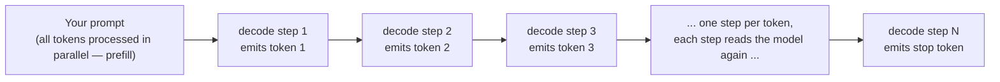
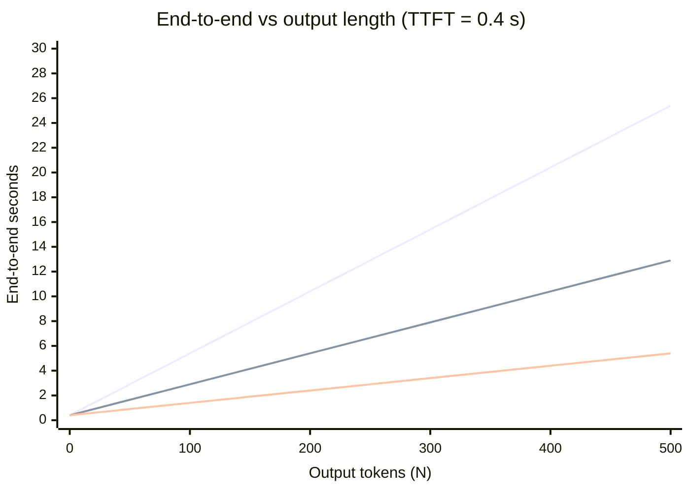

# 2. The shape of a token

> **Part I — The layer beneath the prompt** — the engine's unit of work is not the word and its clock is not yours. Learn the real unit and the real clock before you budget with the wrong ruler.

Every number you care about is denominated in a unit you have never actually seen. Your invoice: tokens. Your rate limit: tokens per minute. Your context window: tokens. The speed of your agent's replies: tokens per second. Not words, not characters — tokens. And the token is not a standard unit. It is a private currency minted by each model vendor, with an exchange rate against your text that changes with the vendor, the language, the digits, and even the punctuation.

This chapter is about that currency and the clock it creates. Four questions drive it. What shape does your text actually take inside the engine? Why is generation serial — why can't the model just produce all the tokens at once? How do you name the latencies you feel as a user (they have standard names: TTFT, TPOT, ITL, end-to-end)? And how do you convert those names into budgets you can enforce in harness code? By the end you will hold the single most reused piece of arithmetic in this book — the decode-time inequality — and you will never again estimate cost or latency in words.

Chapter 1 gave you the three layers and the request lifecycle. This chapter slows the film down on the two hops that produce everything you perceive as "speed": prefill, which reads your prompt, and decode, which writes the reply one token at a time.

## 2.1 Words before machinery

This chapter opens vocabulary, so here is the entrance ramp — the terms this chapter will give machinery and numbers. Keep it nearby while reading.

| Term | Simple meaning | Everyday picture |
|---|---|---|
| Token | The chunk of text the model reads or writes in one step | A puzzle piece: fixed shapes that snap together |
| Tokenizer | The table that converts your text into those chunks | A kitchen's chopping style: dice, julienne, or whole |
| Vocabulary | The learned list of legal chunks, ~50k–256k entries | The catalog of pieces the kitchen will ever cut |
| BPE (byte-pair encoding) | The recipe that builds the vocabulary by merging frequent byte pairs | Inventing shorthand for your most-used phrases |
| Pre-tokenizer | The pattern pass that decides chunk boundaries before merging | Scored lines on gift-wrap paper: cut here first |
| Autoregressive | Each token is generated from all tokens before it | Autocorrect suggesting the next word from what you just typed |
| Decode step | One pass of the model that emits exactly one token | One click of an odometer |
| TTFT (time to first token) | How long until output starts | Time from ordering until the first plate lands |
| ITL (inter-token latency) | One gap between two streamed tokens | The gap between two plates |
| TPOT (time per output token) | The average gap for a whole reply | Average plate-gap over the whole meal |
| End-to-end latency | Wall clock from send to last token | The whole meal, ordering to last plate |
| Decode-time inequality | e2e ≈ TTFT + N × TPOT | Taxi fare: flag-drop plus per-mile |

Twelve rows. The first five run the first half of the chapter; the last seven run the second.

## 2.2 The atom the engine counts

> **ELI5:** Travel to a foreign country. You think in dollars; the country runs in yen. The menu, the speed limit, the gas pump — everything is priced in yen, and the exchange rate depends on which country you're in. Model providers are countries. Tokens are their yen. Before you can reason about any bill or any speed, you need the local exchange rate — and there is no global one.

A token is a sequence of bytes from a fixed list — the vocabulary — and a tokenizer is the machine that chops your text into members of that list. Most modern tokenizers are built with byte-pair encoding: training starts from raw bytes and repeatedly merges the most frequently adjacent pair into a new entry until the vocabulary reaches its target size. Encoding new text is then a greedy longest-match against that learned merge table — the tokenizer walks your text and grabs the longest chunk it recognizes at each position. Two sibling methods differ in the details — WordPiece (the BERT lineage) marks sub-word continuations; SentencePiece treats raw text including spaces as the training stream, which makes it language-agnostic — but the architecture is the same: a learned compression codebook, then greedy matching at serving time.

Because every vendor trains its own merge table on its own corpus, vocabularies are private and wildly different in size:

> **Dated snapshot — published vocabulary sizes (fetched 2026-08-27).** GPT-2's BPE vocabulary: 50,257. GPT-3.5/GPT-4-era `cl100k_base`: 100,256. GPT-4o-era `o200k_base`: 199,998. Llama 3: 128,256. Qwen3: 151,936. DeepSeek-V3: 129,280. Gemma 2: 256,000. GLM-4.5: 151,552. Mistral Nemo ("Tekken"): 131,072. OpenAI's gpt-oss-20b: 201,088. (Hugging Face model configs and OpenAI's public tiktoken blobs.) That is a 5× spread in codebook size before any text is encoded.

There is no universal converter. The same paragraph is a different token count on every model — sometimes nearly the same, sometimes 30% different. Anthropic does not publish Claude's vocabulary size at all (no public number as of 2026-08-27); instead it ships a count-tokens API endpoint, which tells you the one thing you actually need: how many tokens *this model* sees in *this payload*. And Anthropic's own documentation carries the cautionary tale: "Claude 4.7 and later models … use a newer tokenizer. The same input text produces approximately 30 percent more tokens than on earlier models" (platform.claude.com, fetched 2026-08-27). A token budget computed against an older Claude silently inflated ~30% the day the tokenizer changed. Model versions are tokenizer versions.

For rough English intuition, one rule of thumb is official: 1 token ≈ 4 characters, and 100 tokens ≈ 75 words (OpenAI Help Center, fetched 2026-08-27). Treat it the way you treat "a mile is about a 20-minute walk" — fine for picnic planning, useless for billing. The next section is about why.

Everything downstream of the tokenizer is counted in the provider's tokens, not yours. Per-million pricing is per-million *provider tokens*. Anthropic's rate limits are denominated in requests, input tokens, and output tokens per minute (RPM, ITPM, OTPM), enforced by a token bucket that lets short bursts exceed the average rate — and, for most Claude models, only *uncached* input tokens count against your ITPM (Anthropic rate-limits doc, fetched 2026-08-27; the quota machinery gets its own chapter, 15). Even cache discounts are token arithmetic: DeepSeek bills cache-hit input at $0.007 per 1M tokens off-peak against $0.22 cache-miss — a ~31× gap derived from the published prices (DeepSeek pricing page, fetched 2026-08-27). When your prompt cache hits or misses, it hits or misses in tokens.

So the harness rule is already fixed: **budget with the target model's tokenizer, never a character heuristic.** Count representative prompts with the provider's tokenizer or count-tokens endpoint at design time; trust the `usage` counts the API returns at runtime (server-side counts are the billing truth); reconcile the two; and recount whenever the model version changes.

## 2.3 Same text, different shapes

> **ELI5:** Two grocery stores sell the same broccoli. One chops it into bite-size pieces before bagging; one sells whole heads. Same vegetable — but "ten pieces of broccoli" means something different at each store, and a recipe that says "add ten pieces" costs different amounts of broccoli depending on where you shop. Your text is the recipe. Tokenizers are the stores.

The 4-characters-per-token rule describes English prose on English-trained vocabularies. Step off that sidewalk and the shape of your text changes under you. Four edge cases matter enough to name.

**Digits.** Tiktoken-family tokenizers (the GPT-4/`cl100k` and GPT-4o/`o200k` lineage) split digit runs left-to-right in chunks of up to three — so `1234567` becomes `123|456|7` (3 tokens), and — the trap — `234567` becomes `234|567` (2 tokens). Chunk boundaries depend on the total length of the run, not on place value. Other families — Llama 2, Gemma, and the DeepSeek lineage — split every digit individually: a 12-digit number costs 12 tokens where the 3-chunk style pays 4, roughly a 2–3× multiplier on numeric-heavy text (derived from tokenizer analyses, 2025; approximate). Now the useful twist: a comma is a hard boundary, so `1,234,567` tokenizes as `1|,|234|,|567` — every comma-delimited group is right-aligned to a power of 1000, so the group `234` in `1,234,567` and the group `234` in `999,234,567` mean the same thing: 234 units of the same place value. That alignment is a documented factor in arithmetic reliability (dev.to tiktoken-regex analysis, 2025). When exact arithmetic matters in your agent's output, instruct it to emit comma-grouped numbers.

**Non-English text.** Chinese commonly costs 2–3 tokens per character on OpenAI-family tokenizers; a cl100k-era example sentence (我说你倒是快点啊!!!) tokenized to 27 tokens (community-documented, 2023–2024; approximate). Across 22 typologically diverse languages, the same information costs widely different token counts on commercial tokenizers — non-English users pay more, wait longer, and get less effective context for identical content (Petrov et al., EMNLP — the Empirical Methods in Natural Language Processing conference — 2023, arXiv:2305.13707). A later study reframes the metric as *fertility* — tokens per word — and finds it predicts downstream accuracy, with token doubling implying roughly quadrupled training cost (arXiv:2509.05486, 2025). For your harness: a bilingual product's Japanese leg is not the same product economically, even at the same price per token.

**Code.** Byte-level tokenizers preserve whitespace, and Python's significant indentation means every nesting level adds whitespace tokens on every line. A 2025 measurement across ten LLMs and four languages (Java, Python, C++, C#) found that stripping indentation and formatting from source code cut input tokens by an average of 24.5% while maintaining pass@1 — the standard one-shot success metric for code generation — the models simply did not need the readability scaffolding humans do (arXiv:2508.13666, 2025). A quarter of a code prompt's token bill can be formatting.

**The strawberry problem.** Ask a model how many r's are in "strawberry" and watch it fail. This is not stupidity; it is the tokenizer. If "strawberry" is one or two tokens, the model never sees the letters r, a, w individually — it must have memorized that token's spelling during training. Character-level questions probe a side channel of memorized spellings, not the model's actual input; a 2025 paper frames these failures as low mutual information between tokens and character-level concepts, consistent across 19 synthetic tasks (EMNLP 2025, arXiv:2505.14172). The deep lesson generalizes: **the model's input is tokens, not text.** Anything your harness needs to be *robust* on — counting, byte-exact edits, arithmetic — must either be delegated to a tool or made shape-friendly at the token level.

Put together, the harness consequences:

- Do not size `max_tokens` (the API parameter capping output length) from word counts. Numeric, non-English, and code-heavy outputs carry 2–3× the token density of English prose; a budget set from prose intuition truncates exactly the outputs that cost most to regenerate.
- Count with the target model's tokenizer per payload *type* — a numeric table and a chat reply are different shapes even in the same language.
- Recount on every model change; Anthropic's ~30% tokenizer shift is the documented incident class.
- Treat tokenizer efficiency as a model-selection criterion for high-volume harnesses: fewer tokens per task means a shorter serial chain (Section 2.4), less quota burn, and proportionally lower cost.

## 2.4 Generation is a relay race with one runner

> **ELI5:** Phone autocorrect. It suggests the next word based on everything you've typed so far. You cannot ask it for the fourth word without accepting the first three — the suggestion machine only runs on the text that exists. Language models are that suggestion machine with the "accept" key held down: each new token becomes input for the next suggestion. The whole reply is one long autocorrect session at machine speed.

Here is the mechanism in one sentence: an autoregressive model samples token t conditioned on tokens 1 through t−1, so producing K output tokens requires K serial runs of the model — there is no way to compute token 4 before tokens 1–3 exist, because they are its inputs (Leviathan et al., *Fast Inference from Transformers via Speculative Decoding*, arXiv:2211.17192, Nov 2022). This serial-by-construction property is why generation speed has a hard floor that no amount of compute hurries past, and it is the reason speculative decoding exists at all (chapter 8 runs a draft model ahead and verifies — the only mainstream escape from the serial tax).

Notice the asymmetry with your prompt. Your input was all present at once, so the engine processes it in parallel — every prompt token flows through the model together, in the phase called prefill. Only the *output* must be built one step at a time:



And each step is shockingly wasteful in a specific, measurable way. To emit one token, a decode step must stream essentially all of the model's weights through the chip — the arithmetic per byte is tiny, so the GPU's compute units mostly wait on memory. Decode is memory-bandwidth-bound, not compute-bound (NVIDIA inference-optimization blog, 2023). You can price the floor with public numbers: Llama-3-8B ships ~16 GB of weights in BF16 (bfloat16, the 2-byte-per-number format); an H100 SXM GPU offers 3.35 TB/s of memory bandwidth; one decode step must move those 16 GB, so the per-step floor is 16 GB ÷ 3.35 TB/s ≈ 4.8 ms — a single-stream ceiling near 208 tokens/s, before any efficiency losses (derived arithmetic from the inference-vs-training math; chapter 3 turns this into the roofline properly). Google's inference team measured the same regime at frontier scale: 29 ms per token at low batch for 500B-class models on Google's tensor processing unit (TPU) v4 chips (Pope et al., arXiv:2211.05102, 2022). The full arithmetic of *why* bandwidth sets the pace is chapter 3's job; what you need here is the consequence: **the slope of generation speed is set by bytes-per-second, not FLOPS** (floating-point operations per second). More chips do not speed up one stream much — tensor parallelism splits the weight stream across GPUs so the bandwidths add (chapter 10), but piling on replicas only adds parallel streams for other requests.

Now connect the two halves of the chapter. The tokenizer sets the length of the serial chain. If your domain jargon tokenizes into five tokens where another model's tokenizer uses two, everything serial pays: five decode steps instead of two, five tokens billed instead of two, five tokens of quota burned. The shape of your text *is* the length of your decode tax.

## 2.5 The four clocks

> **ELI5:** Back in the restaurant from chapter 1. Four different questions, four different clocks. How long until the *first* plate arrives? (You're hungry and wondering if the order was lost.) What's the gap between plates? (You're eating; a stutter ruins the meal even if the average is fine.) What's the average gap over the whole dinner? (Was the kitchen's rhythm acceptable?) How long was the whole meal, order to last plate? (Do you make your movie?) Four numbers, one dinner — and a fast kitchen can still ruin any one of them.

These four clocks have standard names, and the serving literature and every benchmark harness agrees on them. Learn them once; every latency conversation in the rest of the book uses them.

**TTFT — time to first token.** "The time it takes for the model to generate the first token of the response, from when the prompt was sent" (Anthropic latency docs, fetched 2026-08-27). One wrinkle from the benchmark world: for *reasoning* models, Artificial Analysis counts the first *reasoning* token as the first token — so a model can post an excellent TTFT while the user stares at nothing visible (Artificial Analysis methodology, fetched 2026-08-27). More on that trap below. TTFT absorbs network transit, admission, routing, queue wait, and prefill — five of the nine hops from chapter 1's lifecycle, plus the first decode step — all flattened into one number your stopwatch sees.

**ITL — inter-token latency.** One gap between two consecutive streamed tokens. ITL is a *sample*, not a number: a 200-token reply gives you 199 samples, and the distribution matters — the mean hides the stutter. vLLM's benchmark tooling reports percentile ITL alongside the others and uses 25 ms and 50 ms as its default "feels fine / feels chunky" coloring thresholds (vLLM bench docs, fetched 2026-08-27).

**TPOT — time per output token.** "The average latency between two subsequent generated tokens," per request (DistServe, Hao AI Lab; arXiv:2401.09670). TPOT is the mean of that request's ITL samples — a summary, not a new measurement.

**End-to-end latency (e2e).** "The total time to receive a complete response, including input processing time, model reasoning time, and answer generation time" (Artificial Analysis methodology, fetched 2026-08-27). Wall clock, send to last token.

These four are per-request distributions. Requests-per-second and tokens-per-second are fleet aggregates — different objects entirely, and the source of endless confusion: two engines with identical aggregate tokens/s can feel nothing alike, because one trades TTFT for throughput while the other doesn't (the DistServe authors' core observation about how engines were traditionally compared, 2024). Chapter 5 returns to this when batching bends your TPOT to help someone else's throughput.

The four clocks are not independent — they are tied by arithmetic. For an N-token streamed reply:

> **The identity:** e2e ≈ TTFT + (N − 1) × mean ITL, and equivalently TPOT = (e2e − TTFT) / (N − 1).
> The terms are measured; the identity is arithmetic. Worked: TTFT 400 ms, TPOT 25 ms, 200 output tokens → e2e ≈ 0.4 s + 199 × 0.025 s ≈ 5.4 s (worked arithmetic, not a benchmark).

Where do real numbers land? As a mid-2026 snapshot, with all the drift caveats a leaderboard deserves:

> **Dated snapshot — median output speed, first-party APIs (Artificial Analysis models page, fetched 2026-08-27; derived mean-ITL equivalents in parentheses).** Gemini 3.5 Flash-Lite ≈ 365 tokens/s (≈2.7 ms) · Gemini 3.7 Flash (high) ≈ 330 (≈3.0 ms) · GPT-5.6 Luna ≈ 131 (≈7.6 ms) · Claude 4.5 Haiku ≈ 119 (≈8.4 ms) · GLM-5.3 ≈ 67 (≈14.9 ms) · Claude Opus 5 ≈ 55 (≈18.2 ms) · Kimi K3 ≈ 39 (≈25.6 ms). A ~9× spread across the market, from "faster than any human can read" to "read-along pace."

Two product regimes fall out of the identity. **Short replies are TTFT-dominated:** an agentic tool-call turn that emits 20 tokens spends almost all its wall clock waiting for the first one — e2e ≈ TTFT plus a handful of gaps. The DistServe paper's chatbot example wants the initial response under 0.2 s but only asks that decoding "match human reading speed" — roughly 250 words per minute for silent reading (arXiv:2401.09670, 2024). **Long replies are TPOT-dominated:** at 200+ tokens the (N − 1) × TPOT term swamps TTFT, and first-token tricks amortize to nothing. Community user-experience (UX) thresholds (approximate, not primary-measured): below ~5–8 tokens/s streaming feels like crawling; 20–30 tokens/s feels fluid; above ~50 tokens/s extra speed is imperceptible for reading and only matters for agent chains and bulk consumption (LLM speed guides, fetched 2026-08-27; GMI Cloud pegs the practical threshold near 10 tokens/s, above which perceived lag shifts to TTFT).

Then the reasoning-model wrinkle bends both regimes. On Artificial Analysis' Intelligence Index workloads (long, reasoning-heavy prompts; fetched 2026-08-27), GLM-5.3 (max) spent ≈1.6 s processing input, ≈30.1 s emitting *reasoning* tokens before the first answer token, and ≈7.5 s generating the answer; Gemini 3.5 Flash-Lite, with no visible reasoning, spent ≈8.8 s on input and ≈1.4 s answering. Read that split carefully: if your stopwatch starts at "send" and stops at "first token," a reasoning model can look *fast* while the user watches a spinner for half a minute. The metric your user experiences is **time to first *visible* token** — a harness decision (do you surface the reasoning stream?) wrapped around a serving measurement. Make first-token timeouts TTFT-aware: a timeout tuned on non-reasoning models will kill healthy reasoning requests mid-flight.

## 2.6 The decode-time inequality

> **ELI5:** A taxi meter. There's a flag-drop charge the moment you get in, then a per-mile rate that ticks for the whole ride. You can shave the flag drop — hail from the corner, not the hotel — but the per-mile rate is set by the city. The one term fully under your control is the trip length. Agent replies are taxi rides: TTFT is the flag drop, TPOT is the per-mile rate, and your output length is the route you chose.

Here is the durable form, the one to write on the whiteboard:

> **The decode-time inequality:** e2e ≈ TTFT + N × TPOT
>
> where N is the number of output tokens. TTFT absorbs queueing, prefill, and network; TPOT is the steady-state inter-token gap (NVIDIA NIM benchmarking docs, fetched 2026-08-27). The exact identity from 2.5 uses (N − 1) gaps — the inequality's N absorbs that minus-one as approximation noise; use the identity when computing, the inequality when thinking.

Three consequences, in increasing order of practical value.

**First: linearity is brutal.** The decode term is strictly linear in output length — doubling TPOT doubles it, doubling N doubles it. Worked budgets for a 500-token reply (derived arithmetic): at 20 ms/token, 10.0 s of decode; at 40 ms/token, 20.0 s; at 80 ms/token, 40.0 s — plus TTFT in each case. The handy conversion used throughout this book: tokens/s = 1000 / TPOT_ms, so 20 ms → 50 t/s, 40 ms → 25 t/s, 80 ms → 12.5 t/s.



Even the benchmarking world concedes how steep this is. MLPerf Inference v5.0 (April 2025) tightened its interactive Llama-2-70B constraints to p99 TTFT ≤ 450 ms and p99 TPOT ≤ 40 ms (25 tokens/s) — from 2 s / 200 ms in v4.0 — based on a late-2024 analysis of ChatGPT and Perplexity targeting 20–50 tokens/s at the 50th percentile (MLCommons blog, 2025-04). But the same release added Llama-3.1-405B with p99 TTFT ≤ 6 s and p99 TPOT ≤ 175 ms — about 5.7 tokens/s. That is the standards body admitting frontier-scale models can miss comfortable read-along speed: streaming hundreds of gigabytes of weights per token takes the time it takes.

**Second: budgets invert the inequality.** Don't ask "how long will N tokens take?" — ask "given my deadline and my required pace, how many tokens may I spend?" Fix a UX deadline D (how long until the user has the useful answer) and a required perceived pace P (tokens/s at or above reading speed). Then:

> **max N ≤ (D − TTFT) × P**

Worked (derived, using the approximate 8 tokens/s reading-along pace and TTFT 0.5 s): a 3-second "user has the gist" deadline caps output at (3 − 0.5) × 8 ≈ 20 tokens ≈ 15 words. A 10-second deadline: ~76 tokens ≈ 57 words. Voice agents are crueler — speech pace is roughly 3–5 tokens/s, so the same deadlines buy far less prose. This is why the harness should carry an explicit latency budget object per call site — `{deadline_ms, max_output_tokens}` — and derive `max_tokens` from *measured* latency, not folklore:

```
max_tokens = floor((deadline_ms − p95_TTFT_ms) / p95_TPOT_ms)
```

Measure p95 TTFT and p95 TPOT for the deployed model (your ch12 tracer does this), derive the cap, and let the arithmetic own the truncation decision — instead of discovering it as mid-answer cutoffs in production.

**Third: serial hops multiply.** The inequality is per call, but agent chains are calls in series. A five-step chain emitting 500 tokens per step at 40 ms TPOT burns 5 × 500 × 0.04 = 100 s in decode alone, before any tool latency (derived). When the consumer of each step is another model — not a human — you can relax the pace requirement but never the length requirement, because N multiplies across every hop.

Which levers move which term? This table is the chapter in one view, and the next six chapters are its rows:

| Term | What moves it | Chapter |
|---|---|---|
| TTFT (the intercept) | Shorter prompts; prefix caching; chunked prefill; provider choice | 6, 7, 14 |
| TPOT (the slope) | Smaller model; quantization; tensor parallelism; speculative decoding; provider/variant choice | 8, 9, 10 |
| N (the length) | Prompt discipline; structured formats; progressive UI; and it is the only term 100% yours | 12, 17 |

> **Field note.** The most common budget incident I see is not a spike — it's drift. A team locks in token estimates at design time, ships, then six months later swaps the model behind the same API alias and assumes the arithmetic carried over. Anthropic's documented ~30% tokenizer shift between model generations is the canonical example: same-looking product, one-third more tokens per prompt, and every cap, every cost forecast, and every context budget silently off until something truncates in front of a customer. The fix costs one line of discipline: when the model id changes, the estimator re-baselines from live `usage` counts before anything else ships.

One more symmetry before moving on: the inequality has a twin in your bill. Cost ≈ input_tokens × input_price + N × output_price — also affine, also with a term you control (N) and terms you rent. The latency budget and the cost budget are the same shape, and chapter 16's metering will reuse exactly this arithmetic.

## Where the picture stops

The currency-and-taxi pictures earned their keep; now dismantle them before they mislead.

**A token is not a fixed denomination.** The foreign-currency picture implies a stable exchange rate. There isn't one — the rate varies by vendor (5× vocabulary spread), by payload (digits 2–3×, Chinese-Japanese-Korean (CJK) text 2–3×, code formatting ~25%), and by model generation (Claude's ~30% shift). There is no exchange rate to look up, only a tokenizer to run.

**Tokens are not compressed text.** Compression implies you could decompress back to what you sent. You can't — the tokenizer's output is the model's *native* input, and information that never entered (which letters are in "strawberry") is not recoverable by a smarter model. Tokens are the original, not the encoding of one.

**The one-runner relay can be beaten — two ways.** Speculative decoding runs a cheap draft model ahead and verifies batches of guesses (chapter 8), so "each token strictly waits for the last" is true of *accepted* tokens, not of wall-clock work. And batching interleaves strangers into each decode step (chapter 5): your runner shares the track, which is why your measured TPOT breathes with the provider's load even when nothing you sent changed.

**TTFT is one number hiding four hops.** Network, admission, queue, prefill — the stopwatch flattens them. Two identical TTFTs can have entirely different owners and entirely different fixes: a 2 s TTFT from a bloated prompt shrinks with prefix caching; a 2 s TTFT from queueing at 6 pm does not. Chapter 1's ownership test still applies inside the clock.

**TPOT is a mean, and users feel the tail.** The taxi's per-mile rate implies a smooth meter. Real streams stutter — ITL p99 is what a reader experiences as hesitation, and vLLM's 25/50 ms bands exist precisely because means hide this. Budget on percentiles, not averages.

**The inequality is a budget, not a law of nature.** Providers' schedulers will happily violate your assumptions under load — TPOT drifts with batching neighbors, TTFT drifts with time of day. The inequality tells you what to measure and how to plan; re-measurement is the part that keeps it true. Chapter 3 gives you the machinery for why the slope has a floor at all.

## Checkpoint

Teach it back before moving on:

1. Why does a 12-digit number cost 12 tokens on one tokenizer family and 4 on another — and which behavior makes arithmetic more reliable, the 3-chunk grouping or the comma?
2. Your product ships an English leg and a Japanese leg with identical features. Name three line items that inflate on the Japanese leg even at the same price per token, and by roughly how much.
3. Explain to a colleague, in two sentences, why buying ten more GPUs raises the tokens/s of your fleet but barely moves one user's stream — and name the two engineering moves that *do* move a single stream.
4. TTFT is 300 ms, mean ITL is 22 ms, and `usage` reports 250 output tokens. Compute e2e, say which term dominates, and name the cheapest lever for each term.
5. A reasoning model posts excellent TTFT, and users still complain it "feels slow." What did TTFT measure, what did users experience, and what should your harness measure instead?
6. Derive `max_tokens` for a call site with a 6-second perceived deadline, measured p95 TTFT of 800 ms, and p95 pace of 30 tokens/s.

If you can answer all six without looking back, you hold this chapter's machinery. If you can answer question 6 with the formula rather than a guess, you are already writing harness code that respects the engine.

## Build it / Break it / Prove it / See it in the wild

### Build it

Build a **token shape audit** for your own system. Take three real payloads — a numeric table or log excerpt, a non-English string if you have users who write one, and a source file — and count each with the target model's tokenizer (tiktoken for OpenAI-family models, the count-tokens endpoint for Claude, `countTokens` for Gemini). Compute tokens-per-word density for each and compare against the 4-chars rule; apply the 2–3× multipliers where they show up. Then extend chapter 1's tracer into a **latency budget probe**: for each call, record TTFT, every ITL sample, and e2e; report TPOT as the mean and also p50/p95/p99 ITL. You now have both halves of the inequality measured on your traffic — the estimator for `max_tokens` writes itself.

### Break it

Make tokenization betray you, on purpose. Send a large number with and without thousands separators and compare token counts (and, if you dare, arithmetic accuracy). Strip the indentation from a code payload and measure the input-token drop — check it against the ~25% finding. Set `max_tokens` from a word count on a numeric-heavy output and watch it truncate mid-answer. And reproduce the reasoning-model trap: take a first-token timeout tuned on a chat model and watch it kill a healthy reasoning request that would have answered at 35 s.

### Prove it

Verify the identity on real traffic: for ten streamed requests, check e2e ≈ TTFT + (N − 1) × mean ITL and study the residual — that gap is queueing and jitter your stopwatch can't attribute, which is the honest boundary of client-side measurement. Then prove linearity: same prompt, `max_tokens` set to 100, 200, and 400, three runs each; fit the slope of e2e against N — the slope is your TPOT, the intercept your TTFT, and the scatter is everything the inequality hides.

### See it in the wild

Play with a live tokenizer: OpenAI's tokenizer page (or tiktoken in a notebook) and watch digits, CJK, and whitespace split in real time; use Anthropic's count-tokens endpoint on a prompt with tools attached and see how much the tool schemas themselves cost. Read vLLM's benchmark documentation and note that exactly four latency metrics survive to reporting — `ttft`, `tpot`, `itl`, `e2el`, at p99 by default: the industry has already voted on the vocabulary. Skim the MLPerf Inference v5.0 results announcement (April 2025) and find the 70B and 405B SLO rows — a standards body's own numbers on how steep the decode slope is at frontier scale. And browse Artificial Analysis' methodology page to see how a benchmark defines "first token" for reasoning models — the definitional choice your TTFT timeout inherits.
