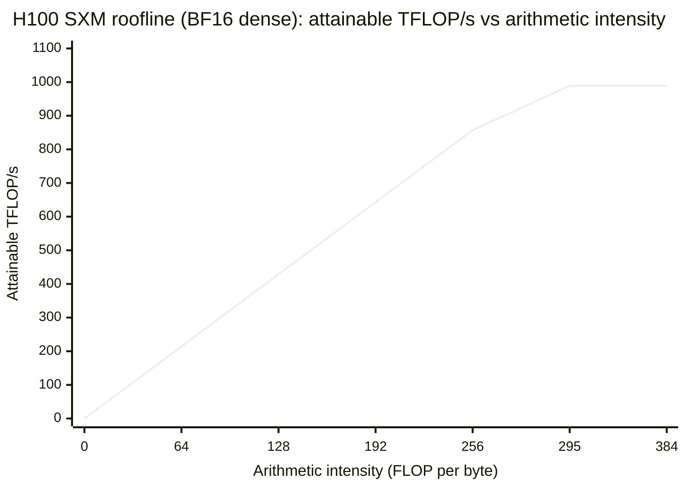

# 3. The arithmetic of waiting

> **Part I — The layer beneath the prompt** — before you blame the model, the provider, or your code, learn which physical resource actually set your wait time. Usually it wasn't compute.

Here is a mystery worth a chapter. The GPU (graphics processing unit) most commonly used to serve frontier models, NVIDIA's H100, can perform on the order of a thousand trillion elementary calculations per second — a quadrillion tiny arithmetic operations, far more than any single reply will ever use (NVIDIA H100 product page, retrieved 2026-08-27; the datasheet states this peak in its own vocabulary — TFLOPS in BF16 dense mode — which section 3.2 unpacks once the entrance ramp has armed you). While training, such chips sustain 40–46% of that peak — Google's PaLM 540B (a 540-billion-parameter model) at 46.2%, Meta's Llama 3 at 41–43% (Chowdhery et al., 2022; Meta, 2024). While *generating* one token for one user at batch size 1, the same silicon does useful arithmetic at about 0.3% of peak — derived in this chapter, from two numbers you will learn to divide. The chip is not broken; batch-1 generation simply cannot use the compute that was sold with it.

Here is the second mystery. Your invoice says a million input tokens cost a million times one token. Fine — that is pricing. But your *latency* disagrees: a prompt ten times longer does not wait ten times longer for its first token, and a request snappy at 8k context is sluggish at 100k. Something in the engine's cost is not proportional to token count.

Both mysteries resolve with one ratio and one picture: **arithmetic intensity** and the **roofline**. This chapter builds them from a kitchen analogy to datasheet arithmetic — the deepest math is one division and one multiplication. By the end you will divide any accelerator's two headline numbers and know whether a workload beggars its compute or starves its memory; you will know why your single-stream token rate has a floor no prompt engineering touches; and why the millionth token costs more than the first thousand. Chapter 2 gave you the clocks. This chapter explains what sets their pace.

## 3.1 Words before machinery

This chapter opens vocabulary, so here is the entrance ramp — the terms this chapter will give machinery and numbers. Keep it nearby while reading.

| Term | Simple meaning | Everyday picture |
|---|---|---|
| FLOP / FLOPS | One arithmetic operation / operations per second | One stir of a spoon / stirs per second |
| Weights | The model's learned knowledge, stored as numbers | The recipe book the chef memorized |
| Parameter | One of those learned numbers | One memorized recipe-step |
| Kernel | One small program the engine runs on the chip | One recipe executed start to finish |
| Compute-bound | The math units are the bottleneck | Twenty chefs, endless ingredients, all burners lit |
| Bandwidth-bound | The delivery of data is the bottleneck | One narrow pantry doorway; chefs waiting |
| Memory bandwidth | Bytes per second the chip can fetch | How fast the doorway lets carts through |
| HBM | High-bandwidth memory — the GPU's pantry, GB-scale, TB/s-speed | The basement storeroom with a wide stair |
| Arithmetic intensity | Arithmetic operations per byte moved | Dishes cooked per trip to the storeroom |
| Roofline | The chart of "how fast can this kernel go" | A ceiling made of two straight lines |
| Ridge point | The intensity where the two ceilings meet | Where the stair's limit meets the chefs' limit |
| GEMM | Big matrix multiply — many tokens' rows at once | Cooking a hundred steaks at once |
| GEMV | Matrix times one vector — one row at a time | Cooking one steak |
| Batch size | How many requests share one pass over the weights | Commuters per bus |
| TTFT | Time to first token — the wait for the reply's first piece | Time from ordering until the first plate lands |
| TPOT | Time per output token — the rhythm between reply pieces | The gap between plates |
| Memory hierarchy | Registers → SRAM (static random-access memory, on-chip) → HBM → RAM → disk, each tier slower but bigger | Counter → pantry → warehouse → cold storage |

Seventeen rows — sixteen run this chapter, and the memory-hierarchy row runs its final third.

## 3.2 Two ways to be slow

> **ELI5:** Picture a restaurant kitchen with twenty chefs, ten burners, and every gadget money can buy. Behind it, one storeroom, up a narrow staircase. If an order needs two hundred onions prepped at once, the chefs are the limit — the storeroom barely matters. But if the dinner service sends one egg at a time, one chef could handle the cooking, and everyone else stands at the bottom of the stairs waiting for the next egg to arrive. A kitchen can be slow for two opposite reasons: not enough hands, or not enough doorway. Buying more hands fixes only the first kind.

Every computation a chip runs is slow in one of two ways, and the two ways have opposite cures. **Compute-bound** means the arithmetic units are the scarce resource: feed the chip more bytes and nothing improves, because the math itself is the wait. Matrix multiplies over large batches — the workload of training — live here, which is why training reports make sense as a percentage of peak FLOPS (FLOP means floating-point operation; FLOPS, operations per second): Google's PaLM 540B training sustained 46.2% of peak on 6,144 TPU v4 chips — tensor processing units, Google's accelerators — and Meta reported 41–43% for Llama 3 (Chowdhery et al., arXiv:2204.02311, 2022; Meta, arXiv:2407.21783, 2024). In the compute-bound regime, "how big is your machine" is measured in FLOPS.

**Bandwidth-bound** (often called memory-bound) means the math units are idle, starved of inputs: the wait is the *movement* of data, not the arithmetic on it. The measure that matters is **memory bandwidth** — bytes per second between the chip's arithmetic and its memory — and the relevant memory is HBM, high-bandwidth memory: tens to hundreds of gigabytes stacked on the GPU package, moving at a few trillion bytes per second. An H100 SXM carries 80 GB of HBM3 at 3.35 TB/s; its arithmetic peak in BF16 (bfloat16, the 2-byte number format) dense mode is 989.5 TFLOPS — tera-FLOPS, trillions of operations per second (the 1,979 TFLOPS headline counts a shortcut that throws away half the numbers — real dense math is about half that) (NVIDIA product page, 2026-08-27).

Now the opening mystery, resolved: generation is serial (chapter 2), each decode step emits one token, and each step must consult essentially every weight the model owns. Llama-3-class 8B models — 8 billion parameters each — ship ~16 GB of weights in BF16 (2 bytes per parameter — Meta model card, 2024); a 70B model ships ~140 GB in BF16 or ~70 GB quantized to FP8 (8-bit floating point). Each generated token triggers a full pass over those bytes. Divide, and you have the floor — not the speed, the *floor*, the best case any kernel could achieve:

**8B BF16 on H100: 16 GB ÷ 3.35 TB/s ≈ 4.8 ms per token → about 208 tokens/s single-stream.**
**70B BF16 on H100: 140 GB ÷ 3.35 TB/s ≈ 42 ms per token → about 24 tokens/s single-stream.**

(Derived arithmetic from the constants above; chapter 1 previewed the first line.) While that 4.8 ms elapses, the arithmetic units see almost nothing to do — each 2-byte weight fetched buys about two operations. Two FLOPs of useful work per 2-byte weight is one FLOP per byte; against a machine that can sustain ~295 FLOPs per byte at peak (derived next section), batch-1 decode runs at **about 0.3% of peak compute** — show the division, as this chapter always will: 1 ÷ 295 ≈ 0.003, about one part in three hundred. Google measured the same regime at frontier scale — 29 ms per token at low batch for 500B-class models on TPUs (Pope et al., arXiv:2211.05102, 2022) — and NVIDIA's inference docs state it plainly: the decode phase is memory-bound; "the speed at which the data (the model weights) is transferred to the GPU from memory dominates the latency" (NVIDIA inference-optimization blog, 2023).

This is why ten GPUs barely speed up one stream: ten GPUs are ten kitchens, and one user's token still walks one kitchen's stairs.

## 3.3 One ratio to sort every workload

> **ELI5:** Every trip down to the storeroom costs the same staircase time. What matters is how much cooking one trip buys. If one trip hauls a twenty-pound bag of flour and the kitchen bakes forty loaves from it, the stairs were a bargain. If a trip hauls one egg to make one omelet, you are paying a whole staircase per omelet. Cooks call this nothing; engineers call it arithmetic intensity — work done per byte carried.

**Arithmetic intensity (AI)** is one division: floating-point operations performed, divided by bytes moved from memory to do them — FLOPs per byte. It is a property of the *workload and its batch size*, not of the chip; the same model on two different chips has the same intensity (Williams, Waterman & Patterson, "Roofline," CACM 2009). The chip supplies the two ceilings; the workload decides which one it hits.

Two shapes of matrix work bracket everything an engine does. A **GEMM** (general matrix-matrix multiply) processes many tokens' rows at once: a large block of prompt tokens against the weight matrices, each weight byte reused across every row — prefill's shape, intensity climbing into the hundreds of FLOPs per byte. A **GEMV** (general matrix-vector multiply) processes one row: one token's vector against the full weight matrix, each byte used about twice and discarded — batch-1 decode's shape.

Price the two shapes: a model with P parameters performs roughly 2·P FLOPs per token (multiply and add per weight consulted), and at batch 1 that token streams all P parameters from HBM — 2 bytes each in BF16 — so:

**Batch-1 decode AI ≈ (2·P FLOPs) ÷ (2·P bytes) = 1 FLOP per byte.**

One — two orders of magnitude below the ~295 FLOPs per byte where an H100's arithmetic turns on (next section derives it). That is the whole mystery of idle silicon: the workload does one operation per byte it carries, and the chip is built to do hundreds.

The fix is not a faster chip — it is more *reuse per trip*. Batch B requests into one decode step, and the engine fetches each weight byte once while applying it to B token vectors simultaneously. Weight traffic per token drops by B; arithmetic intensity becomes approximately B FLOPs per byte (BF16, batch-1 baseline). One bus, B commuters — section 3.5 quantifies the ride.

Prefill sits on the other side of the same ratio, which is why the two phases of one request are slow for *opposite* reasons. Prefill's GEMM blocks reuse each weight fetch across hundreds of prompt tokens at once: intensity well into the compute-bound zone, the chip's specialized matrix-math units busy, memory nearly idle. This asymmetry — prefill compute-bound, decode bandwidth-bound — is the structural fact the engine's whole scheduling architecture grows around (chapter 7 dedicates itself to it).

## 3.4 The roofline

> **ELI5:** Your morning shower is governed by two limits: how fast the water heater can heat, and how fast the pipe can deliver. The shower you actually get is whichever is worse. A giant heater with a skinny pipe still gives a weak, cold trickle; a fat pipe with a tiny heater gives a weak, warm one. "How fast can this go?" is always the answer to two questions at once — and the lower answer wins.

The **roofline model** formalizes the shower (Williams et al., CACM 2009). For any computation, attainable speed is:

**speed = min( peak compute (FLOP/s), memory bandwidth (bytes/s) × arithmetic intensity (FLOP/byte) )**

Plot it: arithmetic intensity on the x-axis, attainable FLOP/s on the y-axis — a rising diagonal (the bandwidth limit: more work per byte, more work per second) meeting a flat ceiling (the compute limit). The meeting point is the **ridge point**, also called the machine balance: the intensity at which the chip stops being bandwidth-limited and starts being compute-limited. It is one division:

**ridge point = peak FLOP/s ÷ peak bytes/s.**

For the H100 SXM in BF16 dense: 989.5 TFLOPS ÷ 3.35 TB/s ≈ **295 FLOPs per byte**. Any workload below that intensity cannot touch the chip's peak arithmetic, however clever the kernel; only more reuse per byte (batching), fewer bytes (quantization), or more bandwidth changes its ceiling. The chart, with the knee where the diagonal reaches the ceiling:

Place the workloads on it. Batch-1 decode, at AI ≈ 1, sits at the far-left edge: attainable speed ≈ 3.35 TB/s × 1 FLOP/byte = 3.35 TFLOP/s — about 0.3% of the 989.5 ceiling, invisible at this chart's scale (derived). Run the roofline check on a second model size: a 13B model (13 billion parameters — 26 GB at 2 bytes each, since 13 × 2 = 26) at batch 1 needs those 26 GB per token at intensity 1, so its ceiling is bandwidth ÷ bytes = 3.35 TB/s ÷ 26 GB ≈ **129 tokens/s** — the same 0.3% of peak compute that chapter 2's 8B floor (208 tokens/s) sits at, because every intensity-1 workload does. Prefill sits at the far right, pinned to the flat ceiling, wondering what all the fuss is about.

Different chips draw different roofs, and the *tilt* matters more than the height (dated snapshot: vendor datasheets, retrieved 2026-08-27; FP16 = 16-bit floating point; sparse headline TFLOPS halved for dense work; ridge = dense peak ÷ HBM bandwidth; † some sources quote the B200 at 192 GB and 8.0 TB/s — sources differ, and the division shows it: ridge lands at ≈292 (7.7 TB/s) or ≈281 (8.0 TB/s)):

| Chip | Dense BF16/FP16 peak | HBM bandwidth | HBM capacity | Ridge point |
|---|---|---|---|---|
| NVIDIA H100 SXM | 989.5 TFLOPS | 3.35 TB/s | 80 GB | ≈ 295 FLOP/byte |
| NVIDIA H200 SXM | 989.5 TFLOPS | 4.8 TB/s | 141 GB | ≈ 206 FLOP/byte |
| NVIDIA B200† | 2,250 TFLOPS | 7.7 TB/s | 180 GB | ≈ 292 FLOP/byte |
| AMD Instinct MI300X | 1,300 TFLOPS | 5.3 TB/s | 192 GB | ≈ 245 FLOP/byte |

Read the table as a menu of tilts. The H200 keeps the H100's arithmetic but pays 1.4× the bandwidth, dropping its ridge to ≈210 — a chip made easier for bandwidth-starved workloads to saturate, which is why it is marketed for large-model inference. The B200 scales both axes ~2.3× and lands at nearly the same balance as the H100; the MI300X is the most bandwidth-tilted at ≈245. A lower ridge point means a workload needs *less* reuse per byte to reach the compute ceiling — bandwidth-tilted chips forgive small batches.

Two refinements make the arithmetic honest. First, real kernels achieve roughly 60–80% of datasheet bandwidth, which is why operators carry the rule of thumb `tokens/s ≈ (bandwidth × 0.7) ÷ active bytes` (Locara LLM-memory docs, 2026-08-27). Applied: a 70B model in FP8 (~70 GB) on a B200-class GPU at 8.0 TB/s has a theoretical single-stream ceiling of ~115 tokens/s and an effective one near 5.6 TB/s ÷ 70 GB ≈ **80 tokens/s**; the same FP8 model on an H100 floors at 3.35 ÷ 70 ≈ 48 tokens/s theoretical, with observed batch-1 reality below that (ITK Research; Locara, 2026-08-27). Second, the denominator is not just weights: each decode step also reads that sequence's KV cache (the per-token memory attention keeps; chapter 4 derives its formula), which grows with every token while weights never shrink (temperature2.com KV analysis, 2026-07-14).

The roofline also prices the two standard "make it faster" impulses correctly: more FLOPS with the same bandwidth raises the flat ceiling but leaves the left side — where decode lives — untouched; more bandwidth per FLOP raises the left side directly. The single-stream levers are exactly two: move fewer bytes per token (smaller or more quantized model — chapter 9) or move bytes faster (more bandwidth, or splitting the weight stream across chips so bandwidths add — chapter 10). A community datapoint makes the first lever concrete — once you read its number honestly. Llama 3.1 70B — 140 GB in BF16, unable to fit an 80 GB A100 — shrinks to roughly 35–40 GB under 4-bit quantization (fewer bytes stored per weight — chapter 9 owns that menu), and a community tutorial reports the setup serving at 100+ tokens/s on a single A100 (Markaicode vLLM tutorial, community-reported, approximate; 2026-08-27). That figure is batched aggregate throughput, not any one reader's stream: by this chapter's own arithmetic, 35–40 GB through the A100's 2.0 TB/s costs 17.5–20 ms per token — a single-stream ceiling of about 50–57 tokens/s, still roughly four times the ~14 tokens/s floor the full 140 GB would impose. The lever is real (fewer bytes per token, higher ceiling); the community number just measures it across a batch, not per passenger.

## 3.5 The dial called batch size

> **ELI5:** A bus costs the same fuel whether it carries one passenger or forty. One rider per trip is a wasteful way to move a neighborhood; forty is why buses exist. The engine's weights are the bus: every decode step drives the whole route past every weight, whether the step serves one request or a hundred. Batching is selling the extra seats.

Section 3.3 established the mechanism: batch B decode steps and arithmetic intensity rises from ≈1 to ≈B FLOPs per byte, sliding the workload rightward along the roofline's diagonal. On an H100 at batch 64: intensity ≈ 64, attainable ≈ 3.35 TB/s × 64 ≈ **214 TFLOP/s of useful arithmetic from the same weight traffic** that produced 3.35 TFLOP/s at batch 1 — a 64× improvement in useful work per second (derived). The ridge (~295) is crossed at a batch of a few hundred in BF16 — when decode flips from bandwidth-bound to compute-bound on this hardware generation.

Throughput evidence, at fleet scale:

> **Dated snapshot (throughput benchmarks; decay with engine versions).** vLLM's September 2024 benchmarks ran Llama 3.1 70B on four H100s at roughly **1,500–2,500 output tokens/s aggregate** under high concurrency — against the ~50–100 tokens/s single-stream ceiling of those same bytes on those same chips (vLLM v0.6.0 performance blog, 2024). MLPerf Inference v6.0 (the industry-standard benchmark suite), as quoted by vendor pages, shows the dial turned further: a B200 serving Llama 70B at ~17,500 tokens/s against an H100's ~3,000 — large-batch throughput, never single-stream (Spheron B200 guide, 2026-08-27; directional, vendor-quoted).

The gap between those numbers *is* the batch dial: twenty to fifty strangers sharing each weight pass.

But the dial has a second wall, and it is the one that matters at long context. Weights are shared; **KV is not**. Every stream in the batch drags its own cache through memory, growing token by token (chapter 4 turns this into a formula you will reuse forever): weight traffic per step is flat in B, KV traffic scales with B, and the crossover — where cache traffic overtakes weight traffic — arrives at:

**B × KV_bytes_per_sequence ≈ weight_bytes**

Work it for Llama 3.1 70B (config-derived: 320 KiB of KV per token at FP16 — so a 1k context holds ~320 MiB and a 32k context ~10 GiB — against ~70 GB of FP8 weights; configs from Hugging Face mirrors, 2026-08-27). A units note: computed memory sizes in this book are binary — 1 KiB = 1,024 bytes, 1 GiB = 1,024 MiB — while vendor-stated sizes, like the 80 GB HBM above, keep their datasheet GB; the two conventions differ by single-digit percentages, well inside these ≈ signs. At 1k context the crossover is around B ≈ 70 GB ÷ 320 MiB ≈ 210 streams — hundreds of riders before KV matters, which is where the thousands-of-tokens-per-second fleet numbers live. At 32k context it is B ≈ 70 ÷ 10 ≈ **7 streams** — the luggage rack fills almost immediately, weight reads barely amortize, and decode stays near the bandwidth wall however the scheduler begs. Same model, same chip, two different machines, because *context length* moved the crossover (derived arithmetic throughout).

This is the structural rule of the batch dial, worth saying as an operating decision rather than a hardware fact: **batch until per-token latency crosses your service-level objective — the worst latency you promised your users — then stop** — beyond the crossover, extra batch inflates per-request latency while buying almost no throughput (decode bandwidth-wall analysis, retrieved 2026-08-27). Chapter 5 shows the scheduler machinery that turns the dial; chapter 6 shows how PagedAttention made the KV rack cheaper to fill. What you needed here is only the shape: batching converts bandwidth-bound decode into compute-bound throughput, and context length converts it back.

## 3.6 Why one token is cheap and a million are not linear

> **ELI5:** You throw a party. Each guest who arrives must be introduced to everyone already there. The tenth guest meets nine people; the hundredth meets ninety-nine. Each single introduction is cheap — but the party's total introducing grew as the *square* of the guest list. Notice the two costs hiding in one room: any *one* guest's arrival was linear (they met everyone present), yet the whole party's bill was quadratic. Long prompts have exactly this shape.

Prefill has a linear part and a quadratic part, and they grow apart. The linear part is dense computation: every prompt token flows through the model's weights, roughly 2·P·N FLOPs for P parameters and N input tokens — twice as many tokens, twice the matrix work (Dive into Deep Learning, ch. 11.3, 2026-08-27). The quadratic part is attention: every token must be scored against every other token, an N×N grid of relationships — and the model is dozens of stacked processing layers deep, each layer running that same scoring pass. Written per layer, that pass costs O(N²·d), where d — the width of one attention lane — is a per-model constant you can ignore; O(N²) is engineer-speak for "grows with the square." Total attention work across a generation of M tokens after a prompt of N is approximately:

**c · N² + c · (N·M + M²/2)**

— a quadratic prompt term paid once at time-to-first-token, and a growing decode term paid per output token, each decode step attending over all tokens so far (NVIDIA Technical Blog on long-context attention, 2026-08-27; c bundles head-count constants — another ignore-its-value constant, like d). The two terms are the two guests in the party analogy: any single decode step is linear in context so far, but the prompt's arrival was quadratic.

The consequence is the chapter's title fact: **cost does not scale linearly in context length.** Compare a 128k-token prompt to a 1M-token prompt. The dense part grows 8× (linear in N); the attention part grows with the square — 8² = 64×. The count can be read in two bases: binary, where 128k really means 131,072 tokens (k counts 1,024 in this business) and 131,072 → 1,048,576 is exactly 8×, giving exactly 64×; or decimal round numbers, where (1,000,000 ÷ 128,000)² ≈ 61× (derived). A million tokens is not eight 128k prompts; it is roughly sixty-four of those 128k attention problems stitched into one grid. This is why TTFT (time to first token — chapter 2's first clock) balloons on giant prompts — the quadratic term, plus the KV allocation before the first token can exist — and why engines carve prefill into chunks with resources of their own (chapter 7).

The KV side of the story is linear but huge, and it compounds per *concurrent* request. Qwen3 8B adds ~144 KiB of KV per token in BF16 (Raschka, LLM architecture gallery, 2026-08-27), so a single 128k-token prompt parks ~144 KiB × 131,072 ≈ **18 GiB of KV cache** before its first output token exists (derived) — on an 80 GB GPU, one conversation's memory tax. Chapter 4 owns the formula and per-model numbers; what belongs here is the *shape*: weights are a flat tax, KV a per-token, per-session tax that long contexts multiply.

You need not take the physics on faith — the market priced it. Long-context surcharges are invoice-side evidence that cost is not flat in context length:

> **Dated snapshot (mid-2026) — read it in two layers: the tiered *structure* is durable, the rates decay.** The structure: Google's Gemini API prices input tokens in tiers with a step at the context boundary — prompts at or under a boundary pay one input rate, prompts above it pay double. The rates: an archived 2025 table (archived 2025-06-21, verified still in place 2026-08-27 — Google AI pricing page) priced $0.075 per 1M input tokens up to 128k, doubling to $0.15 above (output $0.30 → $0.60); the mid-2026 Gemini 3.1 Pro table shows the same structure at $2.00 per 1M input up to 200k context and $4.00 above (ai.google.dev via Morph summary, 2026-08-27); and cached context reads bill at a tenth of fresh input — $0.03 vs $0.30 per 1M tokens on Gemini 2.5 Flash, plus $1.00 per 1M tokens per hour of storage — direct market evidence that re-reading stored KV is an order of magnitude cheaper than recomputing a prompt (Gemini Developer API pricing, 2026-08-27).

Read that box as an engineer, not a buyer: the 2× step passes through (some of) the quadratic term, and the 10× cached-read discount passes through the fact that a cached prompt's prefill is already paid for (chapter 14 turns that asymmetry into harness design). The rates decay; the *existence of the steps* is a fact someone measured.

So: why is one token cheap? At the margin, short prompts ride prefill's compute-bound regime where tokens are nearly free in parallel, and a single decode token's weight pass is shared with every batch neighbor. A million tokens in one request is a different *machine*: quadratic attention, a giant KV allocation squatting on capacity, a crossover that drops batch size to single digits (section 3.5), and a surcharge to match. Chapter 11's thesis — context is a memory product, not a model gift — is rooted right here in the cost curve.

## 3.7 The pyramid under the wall

> **ELI5:** A cook's ingredients live in four places. The counter beside the stove: a handful of bowls, instant to reach, tiny. The pantry downstairs: shelves of stock, a staircase away. The warehouse across town: everything, but a truck trip. Cold storage out of state: buy by the pallet, wait a week. Every kitchen is a compromise between reach speed and shelf space — and every dish pays for how far its ingredients traveled.

The bandwidth in section 3.4's roofline is one tier of a hierarchy, and the tiers explain the exceptions to the wall. Four matter for inference, each a trade of capacity against speed:

| Tier | Size (order) | Speed (order) | Everyday place |
|---|---|---|---|
| Registers / SRAM on-chip | tens of MB | tens of TB/s | The counter |
| HBM on-package | 80–192 GB | 3.35–8.0 TB/s | The pantry downstairs |
| Host RAM (over PCIe) | hundreds of GB – TB | tens of GB/s | The warehouse across town |
| NVMe SSD | TBs | ~7 GB/s per drive | Cold storage |

(GPU vendor datasheets and hardware teardowns, retrieved 2026-08-27; PCIe = the host-to-GPU bus, NVMe = fast flash storage.) Each step down the pyramid is roughly 10× slower per byte and ~1,000× larger; an H100 adds 50–60 MB of L2 cache between SRAM and HBM, a 1,300:1 capacity gap on one package (H100 whitepaper; Chips and Cheese review, 2026-08-27). Offloading weights to host RAM or streaming from NVMe works — and each tier crossing lands in your TTFT and per-token latency as a visible tax, which is why "weights must be resident" is the first commandment of fast serving.

The pyramid also holds the one legitimate escape from the bandwidth wall: **don't change the math, change where the bytes live.** Naive attention materializes the full N×N score matrix in HBM — write it, read it back, rescale it, read it again: three extra quadratic-sized round trips down to the pantry. FlashAttention (Dao et al., arXiv:2205.14135, NeurIPS 2022) makes the move: attention's working notes — called queries, keys, and values — are chopped into batches small enough to fit on the counter, and the answer is assembled right there instead of down in the pantry. In the formal vocabulary: it tiles those queries, keys, and values into blocks sized to fit on-chip SRAM and maintains a running re-balancing of the scores (a running softmax normalization — the "online-softmax" trick) as blocks stream through, so the answer never makes those round trips to HBM at all. The results are exact, the quadratic *FLOP* count is unchanged, memory drops from O(N²) to O(N), and HBM traffic falls to O(N²·d²/M) for SRAM size M (the paper's Theorem 2). Wall clock followed the bytes: ~15% end-to-end speedup training BERT-large and up to ~3× on GPT-2 attention — two well-known models of the era — against the then-best PyTorch baselines (FlashAttention paper, 2022).

This is **kernel fusion** — collapsing a chain of memory round trips into one on-chip pass — and its lesson generalizes past attention: fusion converts HBM traffic into SRAM traffic, which is the only way to beat the bandwidth wall without changing the mathematics or the model. Nearly every named optimization you will meet in Part II is either more reuse per byte (batching, caching), fewer bytes (quantization, smaller KV), or shorter trips (fusion, paging). There is no fourth kind.

## 3.8 What this arithmetic buys you

The chapter's machinery compresses to three durable equations and one habit. The equations: **speed = min(peak FLOP/s, bandwidth × intensity)**; **single-stream tokens/s ≈ bandwidth × ~0.7 ÷ (weight bytes + KV bytes)**; **attention cost ≈ c·N² + linear terms**. The habit: when something is slow, ask *which resource* before asking *whose fault* — the roofline is an ownership test for hardware, just as chapter 1's three-layer test was for teams.

> **Field note.** The worst "the model got slow" ticket I ever chased had no model in it. Around 6 pm, TPOT (time per output token) on one product leg roughly doubled while TTFT stayed flat; nothing in our harness had shipped. The clocks themselves pointed at the engine: TTFT healthy means admission, queueing, and prefill were fine; TPOT degraded means the *decode step* got heavier — batching neighbors, or KV pressure, or both. We cut max-concurrent-requests on that leg, context-trimmed the chattiest sessions, and the pace recovered — no retries, no model change, no provider escalation. The roofline didn't diagnose it, but it told us where not to look, and at 6 pm that is half the battle.

That summary is the harness-facing whole of this chapter: capacity for decode is bytes-per-second and bytes-resident, not FLOPS, and your concurrency and context limits are the knobs that keep the engine on the good side of its walls. The levers, and where this book hands them to you:

| Lever | What it moves | Chapter |
|---|---|---|
| Smaller or quantized checkpoint | Bytes per token — raises single-stream ceiling directly | 9 |
| Batching (continuous, iteration-level) | Reuse per weight byte — fleet throughput | 5 |
| KV budgeting, paging, prefix caching | The non-shared traffic and its capacity tax | 4, 6, 14 |
| Chunked prefill, phase separation | Keeps prefill's quadratic term off decode's bus | 7 |
| Speculative decoding | More tokens per weight pass (with a verification twist) | 8 |
| Tensor parallelism | Splits the weight stream; bandwidths add | 10 |
| Context engineering, compaction | N itself — the exponent's base | 11 |
| Bandwidth-tilted hardware, when self-hosting | The ridge point — how much reuse you need | 18 |

## Where the picture stops

**The roofline models a kernel, not a request.** A real request is a train of kernels plus queueing, network, and admission — the roofline explains the *floor* of your latency, not its p99 (99th-percentile worst case). Chapter 2's tail lesson still rules lived experience, and chapter 15 adds fanout amplification on top.

**The min() assumes you can reach either roof at all.** The 0.7 efficiency factor is a rule of thumb, not physics — real kernels achieve 60–80% of peak bandwidth at best, and small models, small batches, and step-by-step execution overheads land far below. Treat single-stream ceilings as ceilings, never expectations.

**The pyramid's clean tiers blur under inspection.** L2 cache sits between SRAM and HBM; PCIe generations move; NVMe-over-fabric muddies the host-RAM tier. The 10×-per-step staircase is an order-of-magnitude sketch, and every exception costs someone a week.

**The chip table is a dated snapshot in a fast market.** H100, H200, B200, MI300X are 2026-08-27 numbers; the ridge points will look quaint within a product cycle. The *method* — divide peak arithmetic by peak bytes per second, then find your workload's intensity — outlives every row, which is why this chapter taught the division rather than the answers.

**Quadratic is a FLOP count, not a wall-clock promise.** FlashAttention changed the constants (and the memory); chunked prefill and phase separation (chapter 7) soften the cliff's shape further. Nothing flattens the exponent, but engine tricks can hide it from your stopwatch up to surprisingly long contexts — the quadratic term bills you in full eventually, in throughput if not in latency.

**On a provider API, you cannot see the dial.** Batch size, KV pressure, and neighboring requests are invisible; you infer them only through TPOT drift, exactly as chapter 2 warned. The arithmetic tells you what must be happening under the hood, not what is happening right now — that gap is what observability (chapters 15–16) is for.

## Checkpoint

Teach it back before moving on:

1. Explain compute-bound versus bandwidth-bound with the kitchen, then name which regime batch-1 decode is in and *why*, in one sentence with numbers.
2. A hypothetical chip offers 2,000 TFLOPS dense BF16 and 4.0 TB/s of HBM bandwidth. Compute its ridge point. Is batch-1 decode (AI ≈ 1) left or right of it, and what are the only three things that move a workload across?
3. Your 70B model runs in BF16 on an H100 SXM. Compute the single-stream ceiling in tokens/s. Now compute it again at FP8. Which chapter's lever did you just pull?
4. A colleague claims a 1M-token prompt is "about eight times" a 128k-token prompt. Correct them: which term is 8×, which is ~61–64×, and why does TTFT feel the second one?
5. For Llama 3.1 70B at FP8 weights, roughly what batch size does KV traffic overtake weight traffic at 32k context? At 1k context? What happens to fleet throughput beyond that batch, and why?
6. FlashAttention made attention memory linear — so why is a 1M-token prompt still not cheap? Name what fusion changes and what it cannot.

If you can answer all six without looking back — and question 2 with one division — you can price any accelerator's real speed for your workload from its datasheet alone.

## Build it / Break it / Prove it / See it in the wild

### Build it

Build a **roofline card** for the models you actually run: weight bytes at served precision, active KV bytes at your p95 (95th-percentile) context (chapter 4 refines the KV term), and the chip's bandwidth if self-hosting. Compute the single-stream ceiling with the 0.7 rule and the chip's ridge point from its two datasheet numbers. Post the card by your latency dashboards — the first question in any model-upgrade debate becomes "does it change bytes per token?" rather than "is it smarter?"

### Break it

Attack the ceilings on purpose. Ask for ten times the GPUs on a self-hosted endpoint and watch single-stream TPOT refuse to move — the roofline predicted that. Double a test prompt's length and plot TTFT growing superlinearly. On a provider API, hammer one model with parallel requests and watch TPOT drift upward as the invisible batch dial turns — then lengthen the prompt 8× and watch the same load collapse throughput further, because you moved the KV crossover.

### Prove it

Self-host any small model (chapter 18's llama.cpp path works), measure single-stream tokens/s, and check it against `bandwidth × 0.7 ÷ weight bytes` — expect to land below prediction, and know why. Then reproduce the linearity asymmetry: same model, prompts at 2k, 8k, and 32k, ten runs each; fit TTFT against N and against N², and let the better fit tell you which term you are paying.

### See it in the wild

Open any GPU datasheet (NVIDIA H100/H200/B200, AMD MI300X), find two numbers — dense FLOPS and HBM bandwidth — and divide: you have computed a ridge point most buyers never do. Read the original roofline paper (Williams, Waterman & Patterson, CACM 2009) and note it was written for multicore CPUs — the model survived the hardware because the ratio is eternal. Skim vLLM's September 2024 performance blog for the 70B throughput lines whose single-stream cousins you computed in section 3.2, then browse the FlashAttention repo's benchmarks and reread Theorem 2: fusion changed *where the bytes go*, not how many FLOPs the math needs.
