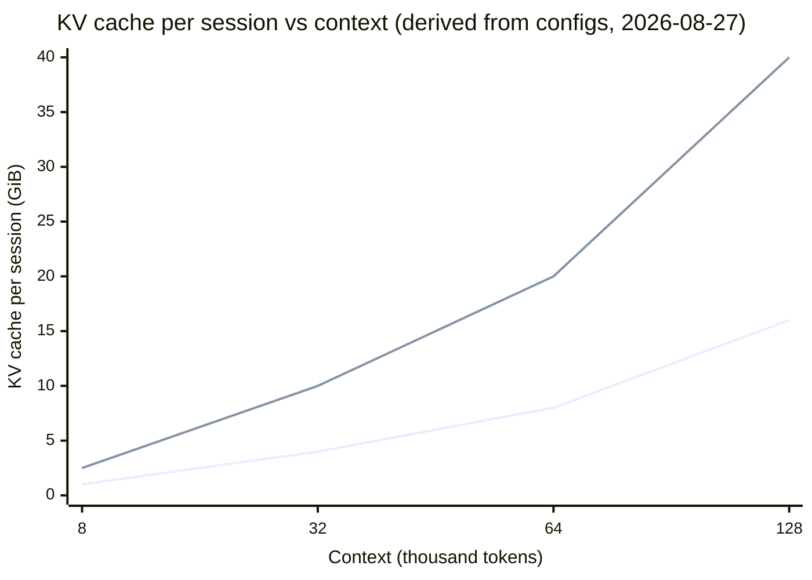

# 4. The memory that is not the model

> **Part I — The layer beneath the prompt** — the model is the part you download. This chapter is about the part that grows while you talk.

Here is a number that surprises everyone who runs their first self-hosted endpoint. Llama 3.1 8B in BF16 (bfloat16, the 2-byte number format) occupies about 16 GB of GPU memory — the model card arithmetic you expect, two bytes times eight billion parameters (Meta model card, 2024). Load it onto an 80 GB H100 (NVIDIA's flagship GPU — graphics processing unit; HBM means high-bandwidth memory, the memory stacked on the GPU package), point your monitoring at the process, and serve exactly one user whose conversation has grown to 128k tokens. The process now holds roughly **33 GB**. Nothing leaked. Nothing is duplicated. The extra ~17 GB is one user's conversation — and this chapter teaches you to compute it in your head.

That growing memory is the **KV cache**, and it is the most consequential thing in the engine room that the model card never mentions. The weights are a fixed, read-only recipe — 16 GB yesterday, today, forever, shared by every user on the box. The KV cache is per-conversation scratch state, born empty, growing with every token read or written, dying with the session. Two kinds of memory with opposite personalities: one is the model, one is the *work*. Almost every capacity decision an inference engineer makes — how many users fit, how long contexts can grow, which model family to deploy, why providers price long context as a premium product — divides one number by another, and this chapter gives you both.

Chapter 3 left you a promissory note: the floor arithmetic divided bandwidth by weight bytes, and when it acknowledged the KV cache at all, it deferred the term to this chapter. Here the note comes due. By the end you will compute any model's per-token KV cost from three numbers in its config file, turn that into a concurrency ceiling for any GPU, and read a provider's context-window claim as what it is: a memory product with a price tag, not a gift from the model.

## 4.1 Words before machinery

This chapter opens vocabulary, so here is the entrance ramp. Keep it nearby while reading.

| Term | Simple meaning | Everyday picture |
|---|---|---|
| KV cache | The per-conversation memory of every token seen so far | The coat check that grows by one bag per guest |
| Weights | The model's learned parameters — fixed, shared by all users | The printed recipe book |
| Attention | The model's lookup step: each new token queries earlier tokens | Asking everyone at the table what they know |
| Key (K) / Value (V) | The two vectors a token files for later lookups | The claim ticket / the bag itself |
| Layer | One stacked block of the model; each files its own K/V notes | One floor of the coat check |
| KV head | One of the parallel note-takers per layer | One rack on the floor |
| Head dimension | Width of each note a head files | Width per coat rack slot |
| GQA | Grouped-query attention — heads share note-takers | Assistants sharing eight clerks |
| MLA | Multi-head latent attention — file compressed summaries instead of full notes | A coat checked as a photograph |
| Sliding window | Layers that only remember the last W tokens | A whiteboard that gets erased |
| Context window | The maximum tokens a request may carry | The venue's seat count |
| Claimed vs effective context | What the provider advertises vs where quality still holds | "Sleeps eight" on a tent label |

Twelve rows. The first seven run the formula; the next three explain why models differ; the last two explain why the market looks the way it does.

## 4.2 The note-taker's desk: what the cache stores

> **ELI5:** Imagine a stenographer at an all-day meeting. Every time someone new speaks, the stenographer must decide what it means — and meaning depends on everyone who spoke before. She could re-read the whole transcript for every new sentence, but she doesn't: as each person finishes speaking, she writes a small note about them ("asked about budget, expects numbers") and keeps the notes on her desk. New sentence arrives; she glances at the notes, not the transcript. The KV cache is those notes. The desk, not the filing cabinet, is what runs out of room.

The mechanism, one rung up the ladder. A transformer is built from **layers** (stacked blocks — Llama 3.1 8B has 32 of them), and each layer's job is **attention**: when token number N+1 is being generated, it queries every earlier token — "how relevant are you to me?" — and blends their information by relevance. To be queryable, every token, in every layer, files two vectors when it passes through: a **key** (what to match on, like a claim ticket) and a **value** (the content to hand over, like the bag itself). Those keys and values never change once written — token 500's key is the same whether it is being read by token 501 or token 50,000.

That permanence is the whole trick. Without a cache, generating token N+1 would force the engine to re-run every previous token through the layer to reconstruct its key and value — the entire conversation reprocessed at every single step, so each generated token gets more expensive than the last by the whole weight of history. With the cache, the engine computes each token's K and V exactly once, appends them to the cache, and every later step just runs its query against the stored notes. Generation cost per step stays a small constant (one token's worth of new notes) plus the attention pass over the stored ones. The KV cache is not an optimization bolted onto transformers; decoding as you know it — streaming one token after another — is only cheap *because* of it.

Notice what kind of memory this is. It is not the model: it holds no learned knowledge, and an identical model restarted fresh has an empty cache. It is not your conversation text either: the raw tokens sit in ordinary RAM; the cache holds the *derived per-layer notes*, dozens of times larger than the text itself. It is working state — the model's short-term memory of this conversation, in the exact shape the model will want to read it back. And it lives in HBM, the scarcest, fastest memory in the building, because it is consulted at every layer of every decode step.

So the picture to carry: **weights are the shared recipe; the KV cache is each guest's coat.** The recipe fits the shelf. The coats never stop arriving.

## 4.3 One formula, five models: pricing the coat check

> **ELI5:** Every guest checks exactly one bag per floor of the hotel, and every hotel chain cuts its bags to the same size. Bag size doesn't depend on how famous the guest is or how long the hotel has existed — only on the building's design: floors, racks per floor, slot width, and how puffy the bags are. A big hotel can have *smaller* bags than a modest one. To price any hotel's coat check, you never interview the guests; you read the blueprints.

Here are the blueprints. Each layer of the model files, for every token, one key and one value per KV head, each `head_dim` numbers wide, stored at some number of bytes per number. Multiply:

**KV bytes per token = 2 × layers × KV heads × head dim × bytes per number**

The leading 2 is K and V — the claim ticket and the bag. The trailing term is precision: 2 bytes per number in FP16 or BF16 (the two 2-byte float formats), 1 in FP8 or INT8 (8-bit formats), so KV quantization to FP8 halves every figure in this section exactly, by arithmetic, not by benchmark (vLLM exposes it as `kv_cache_dtype="fp8"`; vLLM docs, fetched 2026-08-27).

Walk it once with real blueprints. Llama 3.1 8B: 32 layers, 8 KV heads, head dimension 128, BF16 (config.json read 2026-08-27):

**2 × 32 × 8 × 128 × 2 = 131,072 bytes = 128 KiB per token.**

Now the linear rule that turns per-token into per-conversation:

**KV for one session = bytes per token × context length**

At 32k tokens: 128 KiB × 32,768 = **4 GiB** (binary units; 1 GiB ≈ 1.07 GB). At 128k: **16 GiB** — one user's notes now equal the *entire model's weights*, on top of them. That is the opening number, and it is not a bug in a popular model; it is the standard cost of standard attention at long context.

**Per-model KV cost — from config files read 2026-08-27 (KiB/token at 2 bytes per number; GiB per session at full context)**

| Model | Layers × KV heads × head dim | KiB/token | 8k | 32k | 128k |
|---|---|---|---|---|---|
| Llama 3.1 8B | 32 × 8 × 128 | 128 | 1.0 GiB | 4.0 GiB | 16.0 GiB |
| Qwen3-8B | 36 × 8 × 128 | 144 | 1.1 GiB | 4.5 GiB | 18 GiB* |
| Llama 3.1 70B | 80 × 8 × 128 | 320 | 2.5 GiB | 10.0 GiB | 40.0 GiB |
| gpt-oss-120b | 36 × 8 × 64 | 72 | 0.56 GiB | 2.25 GiB | 9.0 GiB |
| DeepSeek-V3 (MLA) | 61 × (512+64 latent) | ≈68.6 | 0.54 GiB | 2.1 GiB | 8.6 GiB |

*Qwen3-8B's native maximum is 40,960 positions — the 128k cell is the formula's arithmetic, not a supported configuration. gpt-oss figures are upper bounds: its layers alternate between full attention and a 128-token sliding window, so the realized footprint at long context is roughly half the table's numbers. DeepSeek-V3's row will be explained in section 4.5 — its design breaks this formula in your favor. (All rows: per-model `config.json` files, fetched 2026-08-27.)

Read the table twice, because it says two unintuitive things.

First: **the 70B model caches only 2.5× the 8B model's bytes despite having ~9× the parameters.** Parameter count is nowhere in the formula. Cache size is set by layers × KV heads × head dimension — the *note-taking architecture*, not the amount of learned knowledge. Two models of the same size can differ 2× in cache cost; a bigger model can be *cheaper* to host per session than a smaller one. When you pick a model family, you are picking a KV budget line as surely as a quality tier.

Second: **growth is linear, and the slope is brutal.** Every token appended costs the same fixed bytes — no superlinear surprise like chapter 3's attention arithmetic — but a slope of 128–320 KiB per token times a hundred thousand tokens is simply a lot of memory. The linear slope is what makes capacity planning easy; the slope's steepness is what makes long context a product.

For historical contrast: OPT-13B, a 2022-era architecture with ordinary multi-head attention, cached 800 KB per token — six times today's Llama 8B figure, on a model only 60% larger — up to 1.6 GB for a single 2,048-token request (vLLM paper, arXiv:2309.06180, 2023). The next section explains what changed, and why the change was a memory decision, not an intelligence decision.

## 4.4 Context windows are memory products, not model gifts

> **ELI5:** A restaurant advertises "seats 200." The chef is one person — the same chef could cook in a 40-seat bistro. "Seats 200" is a claim about the *building*: floor space, fire code, tables. Menus print the number because it sells the venue, but the number was set by the landlord and the square footage, not by the recipes. A context window is a seating chart. The model would happily attend to more; the building runs out of chairs.

Now the chapter's central claim, in three arguments.

**Argument one: the window is an admission limit, enforced by arithmetic.** A provider's context window is not a statement about the model's attention span; it is a queue-policy constant: *max input tokens + max output tokens ≤ window*, checked at the door. The arithmetic shows through. OpenAI's GPT-5 family advertises a 400,000-token window with 128,000 reserved for output, so the maximum *input* is 272,000 — a documented-in-practice gap that surfaces as confusing 400k-versus-272k errors (OpenAI model docs and developer forum reports, fetched 2026-08-27). The window is not the model's memory of you; it is the size of the desk the engine will allocate to your conversation — which is precisely why it is split and enforced before a single forward pass runs.

**Argument two: windows times sessions equals the building.** Here is the capacity equation that runs every engine room, including one you might build in chapter 18:

**Concurrent sessions = (usable HBM − weights − workspace) ÷ (KV per token × context)**

Worked example, all inputs from this chapter's dated sources: one H100 at 80 GB serving Llama 3.1 8B in BF16. Weights ≈ 16 GB; reserve ~4 GiB for activations and workspace; ~60 GiB remains for coats. At 32k context each session checks 4 GiB → **15 concurrent sessions**. Enable FP8 KV (2 GiB each) → **30 sessions**. Now grant the feature request every long-context product wants — conversations to 128k — and each session checks 16 GiB → **3 sessions**. Same GPU, same model, same price per chip: the "small" feature request divided your capacity by five. Nobody shipped a slower model; the building just filled with coats.

The equation also flips. Serve gpt-oss-120b instead: weights ≈ 61 GB in MXFP4 (a 4-bit weight format; OpenAI model card, 2025) leave only ~15 GiB — now *weights*, not KV, bind, and at 32k with FP8 KV (≈1.1 GiB per session) roughly a dozen sessions fit (derived from the same constants; OpenAI model card 2025, config 2026-08-27). Which resource binds is a deployment property, and the formula tells you which before you sign an invoice.

**Mid-2026 snapshot: advertised context windows are priced as product tiers (official docs, fetched 2026-08-27)**

| Provider / model | Advertised window | The product tell |
|---|---|---|
| OpenAI GPT-5 family | 400,000 tokens | Max input 272,000; 128,000 reserved for output |
| Anthropic Claude (Opus/Sonnet tiers) | 1,000,000 tokens | Priced in tiers: e.g. Sonnet 4.5 ≤200K at $3/$15 per MTok (million tokens) in/out, separate >200K tier |
| Google Gemini 3.1 Pro | 1,048,576 input / 65,536 output | Input price doubles ($2→$4/MTok) and output rises 50% ($12→$18) above 200K tokens |
| Meta Llama 4 Scout (open weights) | 10,000,000 tokens claimed | Claim from model card/Bedrock docs — you supply the memory |
| Qwen cloud models | 1,000,000 tokens | Max input 997,952; output capped 65,536 |

**Argument three: the market agrees.** Look at the box and read it as an admission memo from the industry. Gemini's price *doubles* at the 200K boundary — same model, same tokens, same arithmetic — because those tokens cost the provider memory and prefill compute per session, and they pass the product boundary on to you as a tier. Anthropic scopes pricing the same way. The 10M-token claim on an open-weights model comes with no building at all: the window is an architectural ceiling, and the coat check is your problem. Providers behave exactly like businesses selling a capacity product, because that is what a context window is. A model gift would not have a price kink at 200K.

And the gift is smaller than advertised even in quality terms. **Claimed context** is the admission limit above. **Effective context** is the length at which the model still *does the task well* — and the gap is measured. RULER (NVIDIA's long-context benchmark suite, arXiv:2404.06654, 2024) defines effective length as the longest input where a 13-task average stays above a threshold, and found: GPT-4 (gpt-4-1106-preview) claimed 128K, effective 32K; Command-R 35B claimed 128K, effective 64K; Yi-34B claimed 200K, effective 16K; LWM claimed 1M, effective under 4K. Headline: despite near-perfect needle-in-a-haystack scores, only about half of seventeen models claiming ≥32K context held satisfactory performance at 32K. Simple retrieval looks great while aggregation and multi-hop tasks have already collapsed — and relevant facts buried mid-context are retrieved worse than facts at the ends (Liu et al., "Lost in the Middle," arXiv:2307.03172, 2023; position design is chapter 11's beat).

So budget your harness by *effective* context measured on your own tasks, inside the capacity the formula gives you — never by the number in the model's name.

## 4.5 Five ways to shrink the coat: the architects' levers

> **ELI5:** Old hotels built one private coat rack per assistant — sixty-four racks, mostly holding near-duplicate bags. Three fixes exist. Share racks: sixty-four assistants, eight racks, bags passed hand to hand. Share one rack: maximum savings, assistants start mishearing each other. Or check photographs of the coats instead of the coats: near-perfect recall, a sliver of the shelf. Or give most floors a whiteboard that only remembers the last thousand guests, and keep full racks on a few archive floors. Every modern model picked one of these — that is why the table in 4.3 varies.

The formula has four factors you could attack. Architecture history is the story of attacking `KV heads` and, more recently, the notes themselves.

**Multi-head attention (MHA)** is the original: every query head files its own K and V. For Llama-2-70B that meant 64 KV heads per layer — 2.6 MB per token, about 21 GB of cache for one 8k conversation (community formula guides and Llama 2 configs, 2026-08-27). Long context on that design was close to economically impossible.

**Multi-query attention (MQA)** is the degenerate extreme — one shared KV head for all query heads (Shazeer, "Fast Transformer Decoding," arXiv:1911.02150, 2019). Maximum compression; measurable quality loss, which is why it lost.

**Grouped-query attention (GQA)** won the middle: keep all 64 query heads but file notes for only 8 KV heads, each group of eight queries sharing one set of keys and values (Ainslie et al., arXiv:2305.13245, 2023). Quality stays within evaluation noise of MHA at 8× compression. This is the 8-KV-heads pattern you met in every Llama/Qwen row of the table — the reason a 2024 70B caches 320 KiB where its 2023 grandparent cached 2.6 MB. That change was a memory decision, not an intelligence decision. Nearly every frontier family (Llama, Mistral, Qwen, Gemma, Phi) landed on GQA (configs and technical reports summarized 2026-08-27).

**Multi-head latent attention (MLA)** attacks the notes instead of the head count. Instead of filing every head's full K and V, the model files one compressed *latent* vector per token per layer — 512 numbers plus a 64-number position-carrying key, 576 numbers total regardless of head count (DeepSeek-V3 Technical Report, arXiv:2412.19437, 2024). At read time, the shared notes are re-expanded. Where a 128-KV-head design would file 32,768 numbers per layer, MLA files 576 — a ~57× element reduction, roughly 60× in bytes end to end, which is why DeepSeek-V3's row in the 4.3 table (≈68.6 KiB/token at 61 layers) sits *below* Llama 3.1 8B's despite the model being vastly larger. For long-agent-context serving, that is the difference between viable and not: a 128K session costs 8.6 GiB instead of the ~30 GiB a GQA-8 redesign would charge, or ~512 GiB at full multi-head width (derived: 244 KiB and 4 MiB per token, respectively).

**Sliding-window attention** caps the notes rather than compressing them: most layers only keep the last W tokens' K/V — a whiteboard, erased as the window slides — while a few global layers keep the full history, so distant information still reaches the model by routing through those layers. Gemma 3 interleaves five windowed layers (W = 1024) with one global layer per block, adopted explicitly to tame KV-memory growth at 128K context (Gemma 3 Technical Report, arXiv:2503.19786, 2025); gpt-oss alternates half its layers with a 128-token window, which is why section 4.3 called its table row an upper bound.

The ladder, in one line each:

| Variant | Cache vs MHA | Quality | Who uses it |
|---|---|---|---|
| MHA | 1× (baseline) | Reference | Pre-2023 models |
| GQA | ~8× smaller | ≈ MHA within noise | Llama, Mistral, Qwen, Gemma, Phi |
| MQA | ~64× smaller | Small, measurable tax | Rare as a primary choice |
| MLA | ~60× smaller | ≈ MHA, costlier kernels | DeepSeek V2/V3/R1 |
| Sliding window | Caps growth at ~W per layer | Depends on global-layer mix | Gemma 3/4, gpt-oss family |

(Ainslie et al. 2023; DeepSeek-V3 report 2024; Gemma 3 report 2025; per-model configs, 2026-08-27. Ratios are architecture arithmetic, not benchmarks.) For you, the operator, this table is a buying guide that the parameter count will never give you: *the attention variant sets the slope of your memory bill.* Two models at equal quality and equal parameters can differ several-fold in what a long session costs you — or in how many sessions your GPU holds.

## 4.6 When the desk overflows: what your harness sees

> **ELI5:** Airlines sell more tickets than seats because years of data say some passengers won't show. Every so often, everyone shows. Then someone is bumped: pulled off the plane, rebooked, and sent through the whole airport again from the check-in counter. Engines overcommit memory the same way — they admit requests betting not all conversations grow to their maximum — and the bumped request restarts from the beginning.

What happens when the coats exceed the racks? Two regimes, one visible to you and one usually invisible.

**The visible tax: decode slows before anything breaks.** Chapter 3's single-stream ceiling divided bandwidth by weight bytes alone. Now refine it: each decode step streams the weights *plus* this session's entire KV cache. Derived from this chapter's constants (H100 at 3.35 TB/s, 0.7 efficiency ignored — floors, not forecasts): Llama 3.1 8B at short context has a 16 GB payload per step → the ~4.8 ms/token floor you computed in chapter 3, ≈208 tokens/s. At 32k context, add 4 GiB: ~20.3 GB per step → ~6.1 ms/token → ≈165 tokens/s. At 128k: ~33 GB → ~9.9 ms/token → ≈101 tokens/s. The stream that benchmarked at 200+ tokens/s slows by roughly a fifth at 32k and by half at 128k with *nothing wrong* — no neighbor, no load, no model change; the conversation itself got heavier to carry. On a provider API you see this as mystery TPOT (time per output token) growth over a long session; the engine sees your coat check growing. Across a batch, remember chapter 3's crossover: KV traffic scales with sessions, weight traffic does not — past B × KV ≈ weights, batching stops paying (Llama 70B at 32k hit that at B ≈ 7 — chapter 3's arithmetic, at ~70 GB of FP8 weights; BF16's 140 GB puts it near 13).

**The invisible cliff: preemption.** When an engine's KV blocks genuinely run out, it does not error; it *bumps*. vLLM's scheduler preempts running requests when KV space is insufficient, and its default resolution is RECOMPUTE: the victim's cache is dropped, its generated tokens are appended to the prompt, and the whole request re-prefills from scratch once space frees (vLLM docs, fetched 2026-08-27) — a preemption at token N costs roughly the original prefill of N tokens again, plus queue wait (derived; no published constant). To the client, a preemption is an unexplained multi-second stall mid-stream. The server-side tell is a counter (`vllm:preemption_requests` on the Prometheus metrics endpoint — Prometheus being the monitoring system nearly every engine reports to); no error the API returns admits what happened. SGLang calls the same maneuver "retract" (SGLang docs/issues, 2025). The 6 pm story from chapter 3's field note often ends here: TPOT drift was the pressure gauge; preemption was the pipe bursting.

The levers at this cliff, and where this book hands them to you: cap and trim context in the harness (the cheapest lever — it shrinks the coat itself, chapter 11's compaction tradeoffs); quantize the KV cache to FP8, which halves every row of the 4.3 table exactly, with measured quality caveats that are workload-dependent — in vLLM's April 2026 stress tests, FP8 KV raised 8B output throughput 14.9% at 8-way concurrency and cut per-token decode cost growth to 54% of BF16 beyond ~7k tokens, but was net-negative below ~7k context (vLLM blog, 2026-04-22; chapter 9 owns the full menu); page the cache and share prefixes across requests so identical prompt prefixes are stored once, not once per session (chapter 6); and design your agent's prompts so the stable parts *can* be shared and cached (chapters 14 and 17 — where the same memory arithmetic becomes money arithmetic). If you self-host, budget admitted concurrency × worst-case context against KV capacity *deliberately* — a derived rule of thumb, not a published constant — because if the product can overflow the desk, you have engineered the bump into steady state.

> **Field note.** The scariest ticket of my self-hosting years read "the model freezes for ten seconds, then continues." No errors, no restarts, no provider to call — we ran the engine ourselves. The streams stalled mid-decode at what our dashboards showed as low load, then recovered. The clue was a graph we hadn't learned to read: KV cache usage pegged near 100% with a preemption counter ticking up every few minutes. We had let an agent product grow sessions to 128k on a fleet sized for 32k; every long session was a passenger everyone else got bumped behind. No engine flag fixed it, because nothing was broken — we capped session context in the harness, trimmed idle sessions, and enabled FP8 KV on the longest-running tier. Stalls gone. The model was fine the whole time; the desk was full.

## 4.7 What this chapter buys you

Three durable formulas and one reframe. The formulas: **KV per token = 2 × layers × KV heads × head dim × bytes**; **sessions = (usable memory − weights − workspace) ÷ (KV per token × context)**; **decode payload per step = weights + KV(context)** — the refinement chapter 3 owed you. The reframe: a context window is not a property of the model's mind but a product sold against memory, with an admission limit, a capacity cost, a price tier, and — sometimes — an effective length much shorter than the claim. When someone says "this model supports a million tokens," you now hear: "this *building* has a million coat hooks, at $X per hook, quality beyond Y thousand not guaranteed."

| Lever | What it moves | Chapter |
|---|---|---|
| Cap context, compact history | The coat itself — N, the linear term | 11 |
| FP8 / INT8 KV cache | Bytes per number — halves every row | 9 |
| Paging, prefix sharing, radix trees | Waste and duplication in the coat check | 6 |
| Disaggregated prefill/decode | Whose desk long prefills land on | 7 |
| Attention variant (GQA/MLA/windows) | The slope — chosen at model selection | 4 (this chapter) |
| Prompt-cache-aware prefix design | Turning stable prefixes into shared racks | 14, 17 |

## Where the picture stops

**The formula is for GQA-class dense attention.** MLA breaks it (a latent, not per-head notes — use the 576-element rule), and sliding-window layers cap below it (check `layer_types`/window fields in the config before trusting a product). The formula is exactly right for the architecture it describes and wrong in specific, checkable ways for others.

**The capacity math is one GPU, resident weights, no waste.** Real engines shard across GPUs (chapter 10 divides KV too), fragment their caches (chapter 6's finding that only 20–38% of allocated KV memory held useful state — 62–80% waste), and hold workspace that varies with batch and kernel. Treat the session count as a ceiling and a sanity check, not a quota to configure.

**On a provider API, the building is invisible.** You cannot see their HBM, their concurrency, or their preemption counters; windows and price tiers are the observable surface of their capacity decisions. The arithmetic tells you what *must* be true at their scale, not what is true right now.

**Effective context is benchmark-relative.** RULER's "effective length" depends on its 13 tasks and threshold choice (arXiv:2404.06654, 2024); your retrieval and aggregation tasks can and will differ. The direction of the claim-vs-effective gap is robust; the exact number is yours to measure.

**FP8 KV's quality story is empirical, not arithmetic.** The memory halving is exact; the quality is workload-dependent, and one FlashAttention accumulation bug briefly dropped 128k needle-in-a-haystack accuracy from 91% to 13% before the fix restored 89% (vLLM blog, 2026-04-22). Savings are guaranteed; safety is measured.

**The coat-check picture hides what the notes are *for*.** The cache stores per-layer, per-head derived state, not text and not meaning; nothing in the analogy tells you that mid-context positions are attended worse than ends (chapter 11) or that two identical prompts can share blocks entirely (chapter 6). The desk metaphor prices the memory; it does not explain attention.

## Checkpoint

Teach it back before moving on:

1. Write the KV-per-token formula from memory and say what each factor is — including why the leading 2 is there and which factor FP8 KV changes.
2. A model card lists 40 layers, 8 KV heads, head dimension 128, BF16. Compute KiB per token, then the cache for one 64k session.
3. Why does Llama 3.1 70B cache only ~2.5× the bytes of the 8B model despite ~9× the parameters? Which architectural choice, not parameter count, set that ratio?
4. You have one 80 GB GPU, Llama 3.1 8B in BF16 (16 GB weights, ~4 GiB workspace). Product wants 64k sessions. How many concurrent sessions fit? What happens to that count if FP8 KV is enabled?
5. GPT-4 (gpt-4-1106-preview) claimed 128K context; RULER measured effective ~32K. Explain the difference between those two sentences, and why a needle-in-a-haystack demo cannot detect the gap.
6. Your agent runs long sessions and you can choose between two equal-quality models: one caches 320 KiB/token, one 70 KiB/token. Compute the 128k session cost of each, and name the two architectural designs most likely behind those numbers.

If you can answer all six — and question 2 with one multiplication — you can price any model's memory from its config card before you deploy it.

## Build it / Break it / Prove it / See it in the wild

### Build it

Build a **KV budget card** for every model family you run. Open its `config.json` (Hugging Face) and copy three fields — `num_hidden_layers`, `num_key_value_heads`, `head_dim` (or hidden size ÷ heads) — plus the dtype. Compute KiB per token, GiB at your p95 context, sessions per GPU from the capacity formula, and note the attention variant (GQA/MLA/sliding window) and window size. Pin the card next to chapter 3's roofline card: together they say what a model *costs to host*, which parameter counts never do.

### Break it

Overflow the desk on purpose. Self-hosted: let one test session march toward the window while watching the KV-usage gauge and preemption counter — stall the stream, then watch recompute revive it. On a provider: send inputs just past the admission arithmetic (GPT-5: 273k input) and read the rejection; then run a fixed workload at 8k versus 64k context and plot TPOT over session length — watch the stream slow as the coat check grows, exactly as section 4.6's floors predict.

### Prove it

Recompute two rows of the 4.3 table from raw configs, by hand, and check them. Then measure the droop: one self-hosted model, contexts at 2k, 32k, and 128k, measure steady-state tokens/s single-stream, and compare against `bandwidth × 0.7 ÷ (weights + KV)` — expect to land below prediction with the gap growing at long context, and be able to say which unmodeled cost explains it.

### See it in the wild

Open DeepSeek-V3's technical report at the MLA section (arXiv:2412.19437) and find the 512+64 latent numbers you multiplied here. Open the Gemma 3 report (arXiv:2503.19786) and find the sentence about KV memory at 128K that motivated its 5:1 windowing. Skim the vLLM PagedAttention paper's memory figures (arXiv:2309.06180) for the 20–38% utilization measurement (62–80% waste) chapter 6 will turn into a whole chapter. And open any provider's pricing page — Gemini's is the tidiest — and find the tier boundary where context price doubles: you are reading a memory product's price kink, and after this chapter you know exactly which formula set it.
