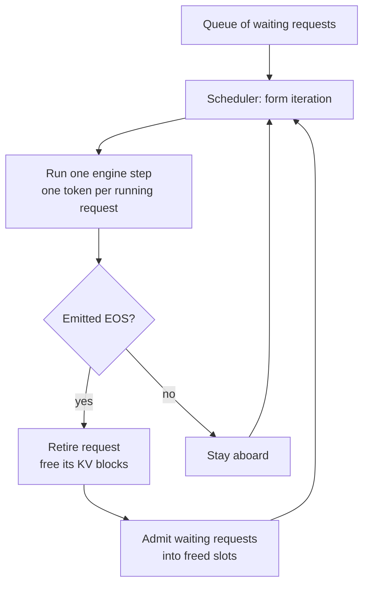
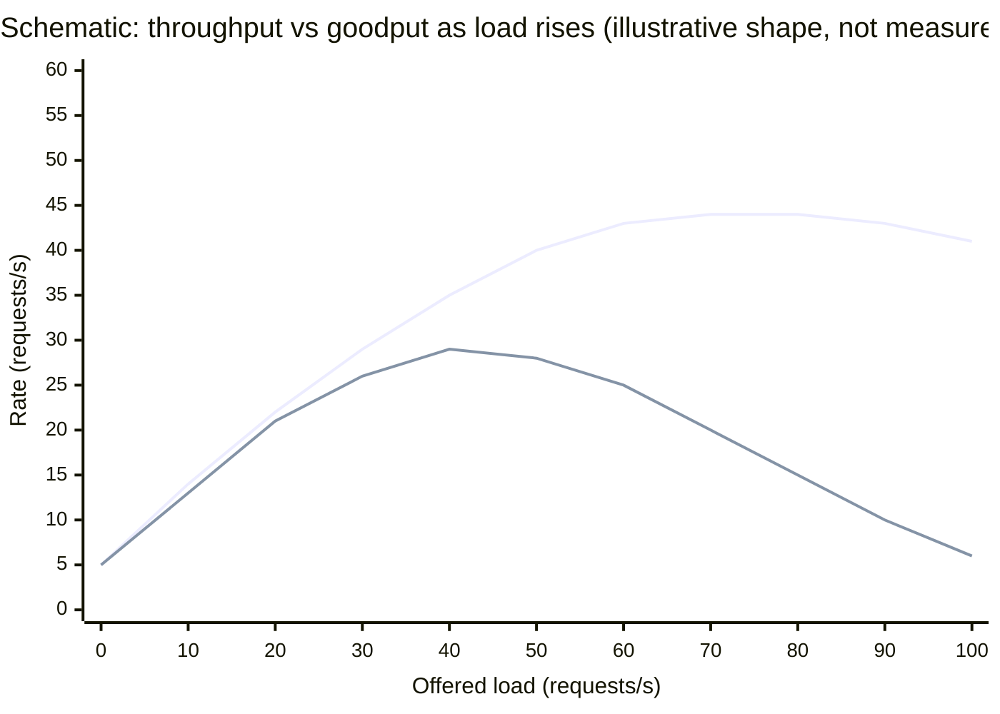

# 5. Batches: the engine's trick

> **Part II — Inside the engine** — chapter 3 gave you the arithmetic of the batch dial. This chapter opens the machine and shows you the hand that turns it — a scheduler that replans the batch every single token.

Here is the promissory note chapter 3 left you, come due. At 6 pm, TPOT (time per output token) on one product leg roughly doubled while TTFT (time to first token) stayed flat, and the fix was cutting concurrency. The diagnosis was "the decode step got heavier." But *why* does one request's decode step get heavier when nothing about that request changed? Nothing in your prompt grew. Nothing in the model changed. The answer is the least discussed fact in the inference stack: **your request is computed together with strangers, and the scheduler that mixes you together replans the mix on every single token.** Your token pace is not a property of your request. It is a property of the batch you happen to be riding in.

Chapter 3 showed why batching *pays*: one pass over the weights can serve many requests at once, and arithmetic intensity rises with batch size. That was physics. This chapter is machinery — how the engine actually forms, fills, drains, and re-forms batches, from the naive scheme that wastes most of the GPU (graphics processing unit) to the iteration-level scheduling trick behind every modern engine. And it is contract: what batching does *to you* — the latency you donate to other people's throughput, and the latency they donate to yours. By the end you will read a scheduler's two configuration knobs like a native speaker, predict which way TPOT and TTFT move when load rises, and know the one metric that separates an engine that *feels* fast from an engine that benchmarks fast — which are, measurably, not the same machine.

## 5.1 Words before machinery

This chapter opens the engine's vocabulary, so here is the entrance ramp. Keep it nearby while reading.

| Term | Simple meaning | Everyday picture |
|---|---|---|
| Batch | Requests computed together in one pass over the weights | Riders sharing one bus trip |
| Iteration | One engine step: one decode token for every running request | The bus completing one stop |
| Scheduler | The code that decides who is in the batch each iteration | The dispatcher at the depot |
| Slot | A request's seat in the current batch | A seat on the bus |
| Static batching | Form a batch, run it until everyone finishes | A charter bus that waits for the last passenger |
| Dynamic batching | Wait to form a batch until enough riders arrive | A shuttle that leaves when full or after a timeout |
| Continuous batching | Re-plan the batch every iteration; riders hop on and off | A city bus line with stops every block |
| Straggler | The request that keeps generating after everyone else finished | The last shopper holding the bus |
| EOS | End-of-sequence token — the model's "I'm done" signal | The shopper walking out the door |
| Goodput | Completions per second that actually met your latency bounds | Meals served *on time*, not just served |

## 5.2 One bus, one slowest rider: static batching

> **ELI5:** Imagine a charter bus that fills up, departs, and — this is the strange part — does not come back until the *last* passenger finishes their errands. One rider needs two minutes at the pharmacy; another wanders a mall for four hours. The bus, and every seat on it, is hostage to the slowest shopper. Tomorrow the mall-goer rides again; the pharmacy rider starts wondering why their two-minute trip took all afternoon.

The naive serving scheme works exactly like that charter. The engine collects N requests, **pads** them to the same length so their tensors stack, and runs the whole batch until *every* request has emitted its full output. Two kinds of waste follow, and both are structural, not accidental.

First, padding. Requests in a batch must be rectangular; a 12-token output sitting next to a 500-token output means the engine computes — or at least reserves — positions for 500 everywhere. Second, and worse, stragglers. A slot frees only when the *slowest* member of the batch finishes, so finished requests keep occupying seats, and short requests that finished long ago still wait for the batch to end before their answer is returned. GPU work for the batch is proportional to N × the longest member's length. If one request wants 900 output tokens and the other fifteen want 100 each, roughly 80% of the batch's arithmetic is padding or idling (illustrative arithmetic, but the shape is measured: the Orca paper's evaluation found large fractions of static-batch iterations executing on padded or already-finished slots — Yu et al., OSDI 2022).

Sit with that waste from the provider's chair and you see why it could not survive. The expensive resource — the weight streaming of chapter 3 — is being paid in full on every step, while the seats it could amortize across sit empty or padded. Static batching is the worst point on the throughput curve: the engine holds the batch *open* precisely when it is least useful. Something had to change, and the first change was smaller than you would guess.

## 5.3 Leaving on a schedule: dynamic batching

> **ELI5:** The shuttle operator tries a fix: the bus now leaves when it is full, or after five minutes, whichever comes first. Fewer half-empty departures — better. But once the doors close, it is still the same charter: nobody gets off until the last errand is run.

**Dynamic batching** improves *admission*, nothing else. Requests queue at the door; the server launches a batch when the queue reaches its size limit or a timeout elapses (it is the term of record in NVIDIA's Triton Inference Server, and most gateways expose something equivalent). This genuinely helps utilization at the door — departures are fuller — but inside the bus, nothing changed. The batch is still static once launched: padding waste remains, finished requests still hold seats, and short requests still wait for the longest. You have fixed the *departure policy* while keeping the *hostage policy*.

That gap — better admission, same lockstep — is worth naming because it recurs all over systems engineering as a shape: a queue in front of a stage whose internal granularity is too coarse. The fix, when it finally came, was not another departure policy. It was dissolving the batch itself.

## 5.4 The trick: replan every iteration

> **ELI5:** Replace the charter with a city bus line. The bus never "finishes a trip" in a way anyone waits for — it loops forever, stopping every block. At each stop, riders who are done step off, riders waiting at the curb step on, and the bus rolls again. Nobody's trip is hostage to anyone else's, because the *composition of the bus* changes at every stop.

The machinery version is called **continuous batching**, or **iteration-level scheduling**, and it came from the Orca system (OSDI 2022) — the paper reports up to **36.9× higher throughput than NVIDIA's FasterTransformer at the same latency level**, evaluated on GPT-3 175B (Yu et al., 2022). The trick is almost embarrassingly simple to state: *the batch is not a commitment.* One "iteration" of the engine computes one decode token for every running request. After each iteration, the scheduler:

1. **Retires** every request that just emitted EOS (end-of-sequence — the model's built-in "I'm done" token), and frees its KV cache (the per-conversation memory of chapter 4) immediately;
2. **Admits** waiting requests from the queue into the freed slots, which requires prefilling them — computing their prompt — before they join the decode loop;
3. **Runs** one engine iteration: one token for every request aboard;
4. Repeats. Forever.



No slot ever idles waiting for a straggler, because there are no stragglers — only riders, each leaving at their own stop. Compare the two schemes on the same workload:

```text
Static batch, 4 slots (t = engine iterations):

  slot A |████░░░░░░░░░░░░░░░|  A finishes at t=4... but the batch
  slot B |████████████████████████████████|  runs until t=32: A's answer
  slot C |██████░░░░░░░░░░░░░░░░░░░░░░░░░░|  is held ~28 idle steps;
  slot D |██████████████████░░░░░░░░░░░░░░|  C and D pad ~26 and ~14 wasted steps.

Continuous batching, same arrivals:

  slot 1 |AAAA CCCC GGGG IIII KKKK MMMM OOOO ...|  EOS frees the slot
  slot 2 |BBBBBB DDDD FF HHHH JJJ LLLL NNN ...|  at the NEXT iteration;
  slot 3 |CCCCCC EEEE GGGGG IIIII KKK ...|       short jobs flow through,
  slot 4 |DD EEEEEE HHHHH JJJJJ LLLL ...|        no hostage-taking.
```

One mechanical wrinkle had to be solved to make this work, and it is why Orca's paper is cited rather than just footnoted. Attention needs each sequence's *own* KV state — lengths differ, histories differ — so naively stacking ragged sequences into one tensor is awkward. Orca's answer was **selective batching**: operations that tolerate batching (the big linear layers, the weight streaming that chapter 3 showed is the expensive part) run batched across all riders, while attention runs per-sequence over each rider's own cache. You batch the part that pays (weights), and shape the part that differs (attention). Every modern engine — vLLM, TensorRT-LLM (which calls it **in-flight batching**, IFB), SGLang, and TGI (Text Generation Inference, Hugging Face's server) — ships a version of this loop (engine documentation, retrieved 2026-08-27).

### The two knobs

The scheduler's greed is bounded by two numbers, and if you ever operate an engine they are the two you will tune first. In vLLM's vocabulary: `max_num_seqs` caps how many sequences may run concurrently (V1 default: 128), and `max_num_batched_tokens` caps total tokens processed per iteration — decode steps plus any prompt chunks — so one iteration cannot grow without bound (vLLM docs, retrieved 2026-08-27; the V1 default is from the scheduler configuration source). They interact through a token *budget*, and the budget arithmetic is worth doing once:

Say the budget is 8,192 tokens per iteration and 64 sequences are running. Decode consumes 64 tokens — one per rider — leaving 8,128 tokens of budget, which the scheduler spends on *prefill chunks* for waiting requests: a 12,000-token prompt can be admitted across two iterations without stalling a single decode step (constants illustrative; the budget mechanism is per vLLM docs). That is **chunked prefill**, on by default in vLLM V1, which prioritizes all pending decodes first and gives prefill the leftovers (vLLM docs, retrieved 2026-08-27). Notice what this buys: prefill — compute-heavy, the phase that inflates iterations — is *rationed* so that riders already aboard keep their pace. Chapter 7 takes this rationing to its architectural conclusion (separating the phases onto different hardware entirely); here you only need the admission-level view.

The knobs also close the loop with chapter 4: when the KV cache runs out of room — too many riders, each with growing luggage — vLLM's documented advice is to *decrease* one of these two knobs, shrinking the running batch. Push the batch past memory and the scheduler starts preempting riders mid-trip, at which point chapter 4's overflow behavior (RECOMPUTE, the preemption counter, the multi-second stall your user sees) is what your harness experiences. The batch dial and the memory desk are the same machine seen from two sides.

Finally, the subtlest knob in the family. TensorRT-LLM ships a prototype flag, `batch_wait_max_tokens_ratio`: if set above zero, the scheduler deliberately *holds* queued requests until their accumulated tokens reach a fraction of the per-iteration budget — trading a little queue latency for better GPU utilization (TensorRT-LLM API reference, retrieved 2026-08-27). Read that as an admission of the chapter's central truth: batching and latency trade against each other so directly that engines ship a flag whose entire job is to buy one with the other.

## 5.5 The trade: your TPOT is a shared property

> **ELI5:** A carpool saves everyone money — the driver's fuel bill barely moves when a third rider joins. But every additional pickup adds a stop, and *everyone already in the car* waits at it. Ten riders and the fuel is nearly free, but no rider gets home fast.

Now the bill for all that throughput, stated mechanically. Decode emits exactly one token per rider per iteration, so:

**tokens per second per request ≈ 1 ÷ iteration time**

Your pace is not set by your prompt, your model, or your provider's marketing page. It is set by how long the *shared* iteration takes — and every rider added to the batch makes the iteration longer (more arithmetic, more KV cache reads per step). More riders also make it *cheaper* per token (each weight byte amortized over more seats — chapter 3's roofline), and that is precisely the trade: aggregate tokens per second up, per-request tokens per second gently down, until the engine saturates and both get ugly. The curve was measured on a real deployment:

> **Dated snapshot (NVIDIA TensorRT-LLM tuning case study, Llama-3.3-70B on 4× H100 — the flagship GPU of chapter 3; docs fetched 2026-08-27).** Sweeping `max_batch_size` 64 → 512 → 2048: throughput 1,944 → 2,467 → 2,044 tokens/s, with average inter-token latency essentially flat (14.65 / 14.66 / 14.45 ms). Batch 512 was the sweet spot — ~20% more throughput than 2048 and ~27% more than 64 (derived: 2,466.79 ÷ 2,044.26 ≈ 1.21; 2,466.79 ÷ 1,944.26 ≈ 1.27) at no latency cost. The untuned default config measured 1,564 tokens/s at 31.3 ms average inter-token latency; after tuning batch size and token budget, 2,474 tokens/s at 14.7 ms — a 58.2% throughput gain and a 53.1% latency reduction. Defaults are a starting point, not a verdict.

Three things live inside that box. First, the sweet spot is *interior* — batch 2048 underperformed batch 512 on throughput outright, because past saturation the extra riders cost more (scheduling, cache pressure) than they contribute. Second, "ITL" — inter-token latency, the clock chapter 2 defined as TPOT's twin, measured between streamed chunks — is what your client watches while all this happens: in this book's vocabulary the dashboard's ITL is your TPOT. Third: the untuned default had *twice* the per-token latency at *lower* throughput. The curve is real, it has a knee, and you find it by measurement, not by maxing knobs.

### When batching helps your latency

The tradeoff framing can tip into a myth — "batching is why you're slow" — so hold both sides (style rule: both sides, always). Batching *helps* you in three specific ways:

1. **It killed the straggler tax.** Continuous batching removes the charter-bus hostage-taking of static batches: short requests flow through at their own pace instead of waiting for the batch's longest member. At moderate load, p50 and p99 inter-token latency *drop* under continuous batching versus static — the straggler-lockstep effect is gone (Orca evaluation, OSDI 2022).
2. **It subsidizes your invoice.** High utilization is why a served token is cheap enough to meter by the million (chapter 16's cost arithmetic inherits this). The strangers in your batch are, financially, co-signing your bill.
3. **A warm engine is a fast engine.** An engine with steady load keeps batches full and iterations efficient; your TTFT on a warm, non-saturated engine is admission plus prefill, with no batch-formation wait. It is saturation, not batching, that steals your time — the next subsection is about that thief.

### Saturation: queueing is the real villain

Here is the mechanism behind every "the provider got slow at 6 pm" story, and it is older than GPUs. Your TTFT decomposes as **queue wait + prefill compute** — vLLM instruments exactly this split (`vllm:request_queue_time_seconds`, then prefill time, then first-token time measured from arrival so the wait is included; vLLM metrics design docs, retrieved 2026-08-27). The prefill term is your prompt's cost — linear in your tokens, and also linear in *batch size*, since a burst that inflates the prefill batch inflates every queued request's first-token time, not just its own (measured on Llama-2-7B on an NVIDIA A100, the previous-generation workhorse GPU; arXiv:2407.05347, 2024). The queue term is where the cliff lives.

Classical queueing theory (the M/G/1 model — "random arrivals, general service times, one server") gives the mean wait as E[W] = λ·E[S²] ÷ (2·(1−ρ)), where ρ (utilization) is offered load divided by capacity. Two structural consequences, both worth memorizing as an operator:

**First, the 1/(1−ρ) cliff.** Latency is nearly flat at 50–70% utilization, then hits a wall: 0.8 → 0.95 utilization multiplies mean queue delay about 4× (derived: 0.2 ÷ 0.05), and the p99 tail diverges faster than the mean. The same arithmetic, tabulated (classical queueing math, not a measurement — but it is why the wall feels sudden):

| Utilization ρ | Mean system time multiplier 1/(1−ρ), M/M/1 form |
|---|---|
| 50% | 2× service time |
| 80% | 5× |
| 90% | 10× |
| 95% | 20× |
| 99% | 100× |

Going from "comfortable" to "one more tenth of load" is the difference between 5× and 10×. Nothing degrades gracefully near ρ = 1; it falls off a cliff.

**Second, variability is a tax — E[S²], not E[S].** Mean wait depends on the *second moment* of service time, so one outlier in the queue hurts everyone behind it disproportionately: a single 4,000-token prompt prefilled ahead of you stretches your wait more than four 1,000-token prompts would (illustrative; the mechanism is the E[S²] term). The same 2024 study shows the flip side: clipping maximum output tokens on even a small fraction of requests significantly reduces mean queue delay, because it shrinks the variance (arXiv:2407.05347). Your harness's `max_tokens` discipline is a queueing-theory instrument, not just a cost cap.

And before you assume compute is the ceiling: on that same measured setup, what capped concurrency was *memory* — a maximum of 49 concurrent requests at 1,280-token sequences for Llama-2-7B-chat on one A100, beyond which requests waited or were preempted (arXiv:2407.05347, 2024). Chapter 4's capacity arithmetic, showing up as a scheduling constraint: the KV desk, not the arithmetic units, sets how many riders fit on the bus.

## 5.6 Goodput: the metric that matches experience

> **ELI5:** A restaurant brags it served 400 meals last night. You were there; 200 of them sat cold because the kitchen outran the servers. "Meals served" is true and useless. "Meals served hot, on time" is the only number a diner cares about — and it is a *smaller* number on purpose.

Chapter 2 promised this section with the DistServe authors' observation: two engines with identical aggregate tokens/s can feel nothing alike, because one buys throughput by spending your latency. The metric that captures the difference is **goodput** — completions per second that *adhere to your service-level objectives* (SLOs), where an SLO is a stated bound with a percentile attached (DistServe, OSDI 2024; the paper defines per-GPU goodput as the maximum request rate meeting an attainment goal such as 90%). The canonical pair of bounds is the two clocks of chapter 2: TTFT and TPOT. The definition is written with its bounds attached — Goodput(P90 TTFT < 200 ms and P90 TPOT < 50 ms) — because "goodput" without a percentile and bounds is meaningless (DistServe blog, Hao AI Lab, retrieved 2026-08-27).

The illustration from the same source: a system pushing 10 requests/s of raw throughput where only 3 requests/s stay within SLO has goodput of 3 requests/s. High throughput ≠ high goodput. The awkward truth underneath: "almost all popular LLM serving engines use throughput as the primary metric to compare performance" — the metric the industry optimizes is not the one anyone experiences (DistServe blog, retrieved 2026-08-27).

Goodput is why the saturation cliff matters morally, not just mathematically. Past the knee of the curve, added load does not merely add latency — it *destroys acceptable completions*, because every request you admit pushes ten others over their bounds. Anything that stalls the pipeline moves the knee left (long prefills barging into decode iterations — chapter 7's whole subject; arrival bursts; oversized batches chasing a throughput number). Anything that removes stalls moves it right: Sarathi-Serve's stall-free scheduling reported 2.6× higher serving capacity under tail-latency constraints than vLLM on one workload, up to 5.6× end-to-end on another (arXiv:2403.02310, 2024) — chapter 7 will unpack how. The shape, schematically:



Find the peak of the *lower* curve — not the upper one — and that is your real capacity. The engines know it: vLLM's benchmark CLI (command-line interface) accepts `--goodput` with SLO pairs in milliseconds over per-request `ttft`, `tpot`, and `e2el` metrics, citing DistServe (vLLM docs, retrieved 2026-08-27). When you size a deployment or compare providers, demand the goodput form — rate, percentile, bounds — because tokens/s is the number everyone optimizes and nobody experiences.

## 5.7 What you control from the harness

You rarely own the scheduler — on a hosted provider, its knobs are the provider's dials, not yours. Your dials are on the client side, and they are real ones:

**Client concurrency is your admission controller.** Every provider-plus-workload pair has a goodput knee, and your harness's parallelism setting decides which side of it you live on. Firing twenty parallel subagent calls at one deployment pushes the engine up the curve of section 5.5 even while aggregate throughput looks fine — your own traffic is the 6 pm crowd. The practice: sweep concurrency against a fixed workload, watch p99 TTFT and TPOT against explicit bounds, and set your in-flight cap at the measured plateau — the point past which throughput stops climbing but latency keeps degrading (Red Hat's vLLM tuning guidance, 2026-03-03, recommends exactly this). Then shed load *multiplicatively* when attainment drops, before the provider's queue sheds it for you with 429s (HTTP "too many requests" — chapter 15 owns the retry-and-backoff machinery).

**Time out against the degraded tail, not the healthy median.** Your stream watchdogs should key off TPOT, not only total time, because an engine near saturation reports healthy TTFT while TPOT climbs — iterations lengthen before queues explode. Concretely: set streaming timeouts near `expected_output_tokens × p99 TPOT + margin`, and treat rising inter-chunk gaps as your shed-load signal, not as noise (the pattern from chapter 3's field note, now with the mechanism that explains it). For first tokens, abort when no chunk arrives within your measured p99 TTFT times a safety factor, plus one full backoff-with-jitter budget — a timeout below p99 converts provider queueing into your own error rate, and immediate retries re-arrive as the exact burst that deepened the queue (OpenAI rate-limit guidance, retrieved 2026-08-27; chapter 15 formalizes the backoff).

**Clip your outputs.** The E[S²] result gives your `max_tokens` setting a second job: bounding your requests' service-time variance shrinks queue delay for everyone — including your other requests. An agent harness that lets one subagent ramble to 8,000 tokens is the mall-shopper of section 5.2, now with receipts.

> **Field note.** We once "improved" an evaluation pipeline by doubling client concurrency from 32 to 64 — the endpoint was self-hosted, the dashboards glowed: aggregate tokens/s up about 15%. The eval's wall-clock got *worse*. p95 time-per-token on the canary stream roughly tripled, a few requests hit their (too-tight) timeouts, and the retries fed the fire. We put concurrency back at 32, then spent the saved afternoon adding the goodput-style dashboard we should have had from day one: completion rate *within* TPOT and TTFT bounds, plotted against offered load. The throughput chart had been lying to us politely the whole time.

The chapter's levers, and where this book hands them off:

| Lever | What it moves | Chapter |
|---|---|---|
| `max_num_seqs` / `max_batch_size` (engine-side) | Running batch size — the dial itself | 5 (this chapter); 18 for self-hosting choices |
| `max_num_batched_tokens` / chunked prefill budget | Iteration weight — prefill's share vs decode's pace | 7 |
| Client concurrency cap | Which side of the goodput knee you live on | 5 (this chapter); 15 for limits-as-quota |
| TPOT/TTFT-keyed timeouts and load shedding | How gracefully you degrade near saturation | 12, 15 |
| `max_tokens` discipline | Service-time variance in the queue | 5, 13 |
| KV capacity per rider | How many riders fit before preemption | 4, 6 |

## Where the picture stops

The bus analogy earned its keep; now bill it honestly.

**Riders' luggage grows every stop.** In a real bus, a rider's footprint is fixed. In the engine, every decode step *adds* a KV entry per rider — the batch gets heavier the longer it runs, and past memory capacity the scheduler throws riders off entirely (chapter 4's preemption). Buses do not have a coat-check overflow crisis.

**Strangers are supposed to be invisible in a bus; they aren't here.** On a real bus you cannot measure the other passengers from your seat. In the engine, you can and should: your inter-chunk gaps *are* the batch's iteration time, and watching them turns "the provider feels slow today" into data.

**"More riders, slower ride" is only half the curve.** In the free region — low occupancy, bandwidth-bound (chapter 3's roofline) — extra riders are nearly *free*: they ride idle compute, and your TPOT barely moves. The carpool penalty only begins past the knee. The analogy bakes in the tax and hides the subsidy.

**The scheduler reorders; the bus doesn't.** Real schedulers rank, prioritize decodes over prefills, chunk long prompts, and sometimes deliberately hold requests to form better batches (`batch_wait_max_tokens_ratio`). A bus line with a dispatcher who negotiates individually with every passenger is not a bus line anymore — it is a scheduler, and the analogy has quietly stopped carrying weight.

**Worst of all: none of this is in the API contract.** No response header tells you your batch size, the queue depth ahead of you, or the utilization that set your pace. Every fact in this chapter is behind the provider's wall — which is exactly why the harness-side instruments (measured p99s, gap timing, canary streams) are not optional extras but your only window into the engine room.

## Checkpoint

Teach it back before moving on — Part II only gets deeper from here.

1. Why does a static batch's cost scale with its *longest* member, and which two distinct wastes does that create?
2. Walk one iteration of a continuous-batching scheduler: what is checked, who leaves, who enters, and what exactly does one request experience during that iteration?
3. Your TPOT doubled at constant concurrency and prompt. Give three engine-side causes the scheduler could be responsible for. Which metric would you check to distinguish them?
4. Why does mean queue wait depend on E[S²] rather than E[S]? What *harness-side* setting does that make a queueing instrument, and why?
5. An endpoint serves 40 requests/s raw and 12 within SLO bounds. What is its goodput (state the full form), and what happens to each number if you add 20% load past the knee?
6. Explain to a colleague why "aggregate tokens/s" was the wrong headline number in the field note — and what we plotted instead.

## Build it / Break it / Prove it / See it in the wild

### Build it

Take any streaming endpoint you can reach — hosted or local — and build a 20-line TPOT probe: send one fixed prompt at concurrency 1, timestamp every chunk, and record median and p95 inter-chunk gaps. That client-side gap timing *is* iteration time as seen from your seat, no server access required. Then repeat at concurrency 4, 16, and 64 (stay inside your quota; chapter 15 first if unsure) and plot gap percentiles against concurrency. You have just measured your own private section 5.5 curve.

### Break it

Break the engine's composure with a burst: from a cold, idle endpoint, fire a 30-way simultaneous burst of long-prompt requests (4k+ input tokens) while a canary stream (one steady request) runs and logs its gaps. Watch the canary's TTFT and early TPOT during the burst window — you are watching prefill contention and admission interact. Then watch recovery. If nothing moves at all, your provider is either far from saturation or shielding you well — both are findings; write down which.

### Prove it

From your Build-it data: pick your highest-concurrency run where the canary still met its bounds. Compute the *aggregate* tokens/s across all streams and compare it to single-stream tokens/s × N. The ratio is your measured batching dividend (chapter 3's roofline, cashed). Then find the knee: the lowest concurrency at which p95 TPOT crossed your bound. Your safe in-flight cap for this endpoint is that concurrency minus margin — prove it by holding that cap for ten minutes with zero bound violations, then deliberately exceed it for one minute and watch attainment fall. The curve is now yours, not a schematic.

### See it in the wild

Read the Orca paper's abstract and first figure (OSDI 2022) and recognize this chapter's charter bus dying in 2022. Skim the vLLM optimization docs' scheduler section (`max_num_seqs`, `max_num_batched_tokens`, the preemption advice) and the TensorRT-LLM in-flight batching page — two engines, one loop, two vocabularies. Read the DistServe blog post on goodput (Hao AI Lab) for the 10-vs-3 illustration in its native habitat. And if you self-host anything, run vLLM's benchmark CLI once with `--goodput ttft:2000,tpot:100` and once without, and notice which number you would have quoted to your boss.
