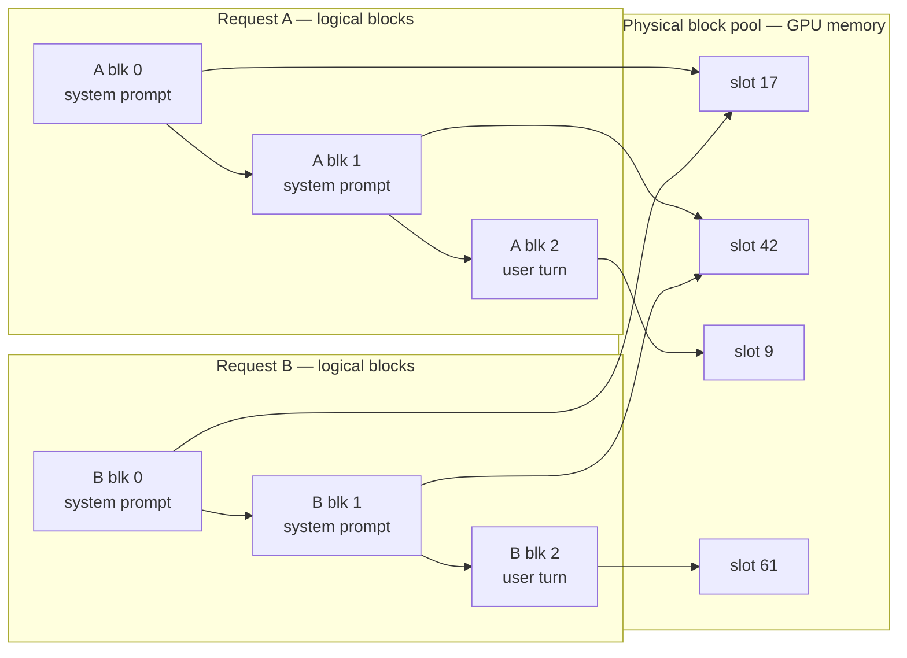

# 6. Paging the brain

> **Part II — Inside the engine** — chapter 4 measured the memory the model never mentions. This chapter is the plumbing that stops that memory from being wasted: pages, block tables, and a cache that makes the second copy of anything nearly free.

Chapter 4 ended with a confession. The capacity arithmetic — sessions per GPU (graphics processing unit), the 3-user floor at 128k context — assumed every byte of KV (key-value) cache memory held useful state. It doesn't. When the vLLM authors instrumented real serving workloads in 2023, they measured that only **20.4% to 38.2%** of allocated KV cache memory actually stored token states anyone would ever read. The rest — sixty to eighty percent of the scarcest memory in the building — was waste: reserved-but-empty tails, holes too broken up to reuse, and copy after copy of the same system prompt (vLLM paper, arXiv:2309.06180, 2023). That is the number chapter 4 promised to turn into a whole chapter, and here it is.

Waste sounds like an accounting problem. It is a capacity problem. Chapter 5's bus only carried as many riders as memory allowed — you saw a measured deployment cap at 49 concurrent requests because the KV desk, not the arithmetic units, set the ceiling (arXiv:2407.05347, 2024). An engine whose KV memory is three-quarters empty seats a quarter of the riders, and fewer riders means a smaller batch dial, lower arithmetic intensity, and worse goodput for everyone. Nobody bills you a "waste" line item; you pay for it as missing concurrency.

This chapter is about the fix, and it is one of the great thefts in systems engineering: the serving engine stole **virtual memory** from the operating system. Split each conversation's growing cache into fixed-size pages, keep a page table, let the pieces live anywhere — and fragmentation, the disease, becomes rounding error, the symptom. Then the same page table enables a second theft, this one from your own past: if two requests begin with the same tokens, their caches can literally share memory, and the second request's prefill — the up-front pass that reads the whole prompt — can be skipped. That is why the same prompt sent twice is not the same price twice — on your own GPUs it is nearly free, and across a hosted API (application programming interface) it is discounted or premium depending on where in the prompt the sameness lives. By the end you will read a block table like a systems engineer, predict exactly which prompt edits vaporize a cache, and assemble prompts so the frozen parts of your agent stay cheap forever.

## 6.1 Words before machinery

This chapter opens the engine's memory-management vocabulary, so here is the entrance ramp. Keep it nearby while reading.

| Term | Simple meaning | Everyday picture |
|---|---|---|
| Block (page) | The fixed-size chunk the KV cache is cut into — 16 tokens by default | One hotel room, any room will do |
| Block table | The per-request list mapping "my Nth chunk" to a physical slot | The front desk's ledger of room numbers |
| Logical vs physical | Where a chunk sits *in the conversation* vs where it sits *in memory* | Night 5 of your stay vs room 417 |
| Internal fragmentation | Space reserved inside a chunk but never filled | A room booked for 4, slept in by 1 |
| External fragmentation | Free memory broken into pieces too small to use | Empty rooms scattered so no 3-night run fits |
| Duplication | Identical prompt prefixes cached once per request | Every guest bringing their own copy of the hotel map |
| Copy-on-write | Shared chunks stay shared until one owner diverges | Roommates sharing a room until schedules split |
| Prefix | The leading run of tokens a request starts with | The first chapters of the document |
| Prefix caching | Reusing stored KV for a prefix seen before | The translator keeping her notes from last time |
| Radix tree | A tree that stores shared prefixes once | A family tree where shared ancestors appear once |
| Hash chain | Block identity built on the previous block's identity | Each page quoting the page before it |
| Cache hit / miss | A prefix found vs not found in the cache | The barista starting your usual vs asking |
| Eviction (LRU) | Freeing the least recently used blocks under pressure | The coat check donating unclaimed coats |
| Block size | Tokens per block — the dial that sizes all of this | Room capacity per floor |

Fourteen rows. The first eight run the paging machinery; the last six run the cache built on top of it.

## 6.2 The row of rooms nobody uses: three ways to waste memory

> **ELI5:** Imagine a hotel where policy says every guest's entire stay must be booked, at check-in, as one unbroken row of rooms — enough for their *longest possible* stay. A guest who might stay ten nights gets ten rooms in a row, even though most guests leave after two. When guests leave early, their leftover rooms sit reserved and empty. And when new guests arrive, the freed rooms are scattered singles — a room here, two rooms there — that can never satisfy the unbroken-row rule. The hotel is half empty and turning guests away at the same time. That was every LLM (large language model) serving system in 2023.

Why did anyone build it that way? Because the request makes it natural. A KV cache entry grows one token at a time, every decode step, for as long as the request runs — and the attention kernel wants to sweep a sequence's keys and values as fast, contiguous memory. The simplest implementation is exactly the hotel policy: when a request is admitted, allocate one contiguous buffer sized for its *maximum* length, and fill it token by token. Contiguous for the kernel, sized for the worst case, because growing a buffer in place is not something GPU memory lets you do.

Run the policy on real numbers — the paper's worked example, and the same one chapter 4 used for historical contrast. OPT-13B, a 2022-era architecture, caches 800 KB per token. A request allowed 2,048 tokens reserves 2,048 × 800 KB ≈ **1.6 GB** of HBM (high-bandwidth memory) at admission (vLLM paper, arXiv:2309.06180, 2023; LLaMA-13B, the same era's popular model, needed up to 1.7 GB per sequence by the launch blog's arithmetic — vLLM blog, 2023). The request actually generates, say, 512 tokens and finishes. Three-quarters of 1.6 GB was never touched. Multiply by every rider on chapter 5's bus.

That is the first waste, **internal fragmentation**: reserved-but-unfilled space, which the unpredictability of output length makes unavoidable — the engine genuinely does not know whether you will stop at 50 tokens or ramble to the cap. The second waste is **external fragmentation**: when requests finish, they free odd-sized runs, and an allocator facing max-length contiguous asks cannot reassemble those runs. Chapter 5's straggler problem left holes; here the holes become permanent. The third waste is dumber than both: **duplication**. One hundred agents from your fleet all send prompts beginning with the same 2,000-token system prompt and tool schemas. The KV entries for those tokens are byte-identical — and the naive engine computes and stores one private copy per request.

Stack the three and you get the measured 20.4–38.2% usefulness: on real workloads, most of the KV memory a 2023 engine held was paying rent for nobody. And because capacity is concurrency, that number is a throughput number in disguise.

## 6.3 Steal from the operating system: PagedAttention

> **ELI5:** The hotel fires the policy and keeps the building. Any guest's nights can now be in *any* rooms, anywhere in the hotel — night 1 in room 417, night 2 in room 202, night 3 in room 891. Nobody notices, because the front desk keeps a ledger: guest, night number, room number. Visitors who want to find a guest don't wander the halls; they read the ledger. Guests stop caring *where* their rooms are, the hotel stops caring *when* guests leave, and the only remaining waste is one partially-used room per guest.

The fix is virtual memory, the technique operating systems have used since the 1960s to give every program the illusion of a huge contiguous address space while physically scattering its pages anywhere in RAM. vLLM's PagedAttention applies it to the KV cache (vLLM paper, arXiv:2309.06180, 2023). The mechanism, precisely:

1. **Logical blocks.** Each request's KV stream is cut into fixed-size **blocks** — 16 tokens each by default (`DEFAULT_BLOCK_SIZE = 16` in vLLM's cache config; docs retrieved 2026-08-27). Logical block *i* of a request holds tokens 16·i through 16·i+15.
2. **Physical slots.** GPU memory set aside for KV is carved into block-shaped slots, unassigned to anyone.
3. **The block table.** Each request carries a table mapping logical block index → physical slot — the front desk's ledger, structurally identical to an OS (operating system) page table.
4. **Gather, don't assume.** The attention kernel walks a request's block table and gathers keys and values from wherever they physically live. Blocks never need to be adjacent.

A request grows by appending to its last block; a full block gets a new slot from the pool; the table grows by one row. A request finishes and its blocks return to the pool — instantly reusable by anyone, because every slot is the same size. There is no unbroken-row rule left to violate, so external fragmentation cannot exist; internal waste collapses to at most one partially-filled block per request. On the paper's constants: one block = 16 tokens × 800 KB ≈ **12.5 MB**, under 1% of that 1.6 GB reservation (derived from arXiv:2309.06180's per-token figure). Near-zero waste, measured on the same workloads that measured 20–38% useful.

What the sharing buys is best seen in one diagram. Two concurrent requests from the same agent fleet share a system prompt, then diverge:



Both block tables point at slots 17 and 42 for their shared prefix — those bytes exist once in memory. Physical slots carry reference counts; when two owners must diverge (beam search — a decoding strategy that keeps several candidate continuations alive in parallel — is the classic case), the engine copies the shared block to a fresh slot first and writes into the copy: **copy-on-write**. With it, beam search's candidate family shares its whole trunk, and peak KV memory fell 37.6–55.2% on Alpaca and 44.3–66.3% on ShareGPT workloads in the paper's measurements (arXiv:2309.06180, 2023).

Now the honest ledger, because every trick in this book pays for itself somewhere:

- **The kernel tax is real.** The paged attention kernel is 20–26% slower per call than FasterTransformer's fused kernel — the ledger lookup is work, every attention pass, forever (arXiv:2309.06180, 2023).
- **The capacity win dwarfs it.** Waste near zero means more concurrent requests fit in the same HBM — a bigger batch on chapter 5's dial, which chapter 3's roofline pays for with throughput. Net effect, measured: 2–4× higher throughput than FasterTransformer and Orca at equal latency, and in one overload experiment, up to 22× higher request rate before failure (the paper authors' own comparisons, 2023 — not a modern head-to-head). The kernel got *slower* and the engine got *faster*, because memory, not math, was the binding constraint.
- **Block size is a real dial.** Too small and every request drags a long block table through every attention call — more bookkeeping, more indirection. Too large and the last partially-filled block wastes more, and (next section) shared prefixes must match in coarser chunks. The paper's sweep found 16–128 tokens near-optimal on ShareGPT and 16–32 on Alpaca; vLLM ships 16, and requires multiples of 8 for mamba-style caches (arXiv:2309.06180; vLLM docs, 2026-08-27).

The architecture won so completely that it stopped being a feature and became the floor. vLLM's V1 rewrite (alpha January 2025) kept paged KV management at the core, rebuilt the scheduler around it, and turned prefix caching on by default as "zero-overhead" (vLLM V1 blog, 2025-01-27). Which brings us to the second theft — the one your bill actually feels.

## 6.4 The second reading is free: prefix caching

> **ELI5:** A translator is handed a 40-page contract and told to summarize it. She reads all 40 pages and writes careful notes. Next week someone hands her the *same* 40 pages plus one new paragraph. She does not re-read the contract. Her notes from last week are still on her desk, still true — the contract didn't change — so she reads only the new paragraph. If your office keeps handing her the same contract, the reading stops being the job.

The license for this is a fact chapter 4 quietly established: **the KV entries for a prefix depend only on that prefix and the weights** — not on what comes after, not on who asked, not on the weather. Token 500's key was written when token 500 passed through and never changes. Prefill is deterministic. So if request B's first N tokens are identical to a finished request A's first N tokens, the KV blocks for those N tokens are interchangeable down to the bit — and reusing them is not an approximation. vLLM's design docs state it flatly: prefix caching "won't change model outputs" — the same request re-served from cache produces exactly the same tokens it would have produced from a cold engine (vLLM docs, retrieved 2026-08-27). This is the rare optimization with no quality asterisk.

But paged KV alone doesn't know *which* blocks to share. The engine needs a way to answer, at admission time: "have I ever computed the KV for these exact tokens?" Two dominant answers exist.

**The hash chain (vLLM's Automatic Prefix Caching).** Every *full* block gets an identity hash computed over: the previous block's hash, this block's token IDs, the LoRA (low-rank adaptation — per-tenant bolt-on weights) ID if any, and hashes of any multimodal inputs. Since each hash contains its parent's hash, equality of block N's hash guarantees the entire prefix behind it is identical — a chain, like each page of a document quoting the page before it:

```
h0 = H( ∅ ,          tokens[ 0:16] )
h1 = H( h0,          tokens[16:32] )
h2 = H( h1,          tokens[32:48] )
...
```

(The default digest is SHA-256 — the standard 256-bit secure-hash function — since v0.11, with faster variants selectable; vLLM docs, 2026-08-27.) On admission, the engine hashes the new prompt block by block and stops at the first miss: matched blocks get their reference counts bumped — protected from eviction — and prefill re-starts *after* the hit. A `cache_salt` flag salts the first block's hash, so a multi-tenant deployment can keep tenants' identical-looking prompts from sharing (or colliding) — same machinery, opposite purpose.

**The radix tree (SGLang's RadixAttention).** SGLang organizes the cache itself as a tree whose edges are token runs and whose nodes hold the KV pages covering the path from the root — a structure that stores every shared prefix exactly once, like a family tree where common ancestors appear one time. New requests walk the tree to find the deepest node matching their prompt, and prefill resumes after it; finished requests are inserted back, splitting edges where they partially match. When memory runs short, eviction is LRU (least recently used) over *leaves* — the most specific, least-shared branches die first, so the hot shared trunk, almost always the system prompt, survives pressure (SGLang paper, arXiv:2312.07104, NeurIPS 2024). vLLM's V1 implements the same philosophy in its block pool: a doubly-linked free queue gives O(1) eviction, and freed blocks rejoin the queue in an order that keeps the highest-coverage blocks alive longest (vLLM docs, 2026-08-27).

One worked example from the vLLM design doc, in its small numbers (block size 4 for readability — the shipped default is 16). Request A is 14 tokens: blocks 0–2 full, plus 2 remainder tokens in a part-filled block 3. All three full blocks are cached. Request B shares A's first 10 tokens: blocks 0–1 (8 tokens) hash-match exactly — hit; block 2 covers tokens 8–11 but only 2 of its 4 tokens match, so its hash differs — miss. B skips prefill for **8 of the first 10 shared tokens** and computes the rest. Two lessons hide in that arithmetic. First, **only full blocks count** — partial matches are no matches. Second, because the hash of block *N* feeds the hash of block *N+1*, **a one-token difference at position *k* invalidates every block from *k* onward, and nothing before it**. The cache is brutally positional.

What a hit buys is prefill you didn't run. One operator report: after enabling prefix caching, tenants with stable system prompts saw TTFT (time to first token) fall from 480 ms to 110 ms; tenants whose prefixes varied per request saw no change at all (single-cluster anecdote, Nexus Labs via DEV community, 2026 — directional, not a benchmark). Same engine, same hardware, 4× first-token improvement — or zero, decided entirely by prompt structure.

One distinction before the money section, because the vocabulary collides and the collision is expensive.

> **ELI5:** One waiter greets you with "the usual?" only when you have literally ordered the same breakfast every visit — if he says it, he is right. Another waiter greets *anyone who vaguely resembles you* with "the usual?" — charming when it lands, and you get someone else's eggs when it doesn't. The first waiter is exact-match caching. The second is semantic caching.

Everything above is **exact-match** caching: same tokens, same weights, mathematically identical outputs. **Semantic caching** is a different invention: embed the incoming prompt, find a *similar* previous prompt, return its stored answer (GPTCache popularized the pattern). Nothing guarantees that answer is correct for your phrasing — a similarity threshold loose enough to hit often is loose enough to return confidently wrong answers. It can be a good product decision, but it is an application-layer risk decision, not an engine feature. When this book says *cache*, it means the exact-match kind; when a vendor's marketing says "semantic caching," read "cached answers to different questions."

## 6.5 Why the same prompt twice is not the same price twice

> **ELI5:** A print shop charges to scan a document and charges to print it. The second time you bring the same document, the shopkeeper pulls your scan from the drawer. You pay only for printing — and the shop, being competitive, passes some of the saving to you. The price of the job was never just "pages." It was always "pages *that need scanning* plus pages *that only need printing*." Same document, second visit, different price.

Send the same 10,000-token agent prompt twice. The first request prefills 10,000 tokens: compute spent, KV blocks written, cached. The second request's hash chain matches block after block, refcounts them, and prefills nothing but the tail. What changed between the two sends is not one number — it is *which work existed at all*. Three regimes:

**Self-hosted: free, but capacity-priced.** Your engine's prefix caching (default-on in vLLM V1 since January 2025) skips the prefill and the cost meter says nothing, because you pay for the box, not the tokens. But cached blocks are not free-as-in-air: every block parked in the radix tree is HBM not serving live requests, and under memory pressure the LRU evicts them. The real price of a cache hit is *capacity held hostage against the future* — the eviction policy is constantly trading your next request's hit rate for this request's concurrency.

**Hosted, automatic: discounted hits.** The provider runs this same machinery behind its API and simply prices it: caching is on by default, hits show up as cheaper tokens, and you change nothing. OpenAI's flavor is this one.

**Hosted, explicit: premium writes, cheap reads.** The same physics, different packaging — you mark the cache boundaries yourself, pay a premium to create entries, and get near-free reads:

> **Provider prompt-cache pricing (mid-2026 snapshot — verify before you budget; chapter 14 owns the full worksheet)**
>
> - **OpenAI:** caching automatic, best-effort, no code changes; cached input tokens billed at a **50% discount**. No hit guarantee — "best-effort" is doing load-bearing work in that sentence (OpenAI prompt-caching announcement, retrieved 2026-08-27).
> - **Anthropic:** caching explicit — you mark up to **4 `cache_control` breakpoints**. Writes cost **1.25×** base input price (5-minute TTL) or **2×** (1-hour); cache **reads cost 0.1×** — a 90% discount. Minimum cacheable prefix runs 512–4,096 tokens depending on model (1,024 for Sonnet-class; 4,096 for Opus 4.6/4.5 and Haiku 4.5). The 5-minute clock starts at *request start* — a 4-minute stream leaves about 1 minute to issue the next cache-hitting call (Claude platform docs, retrieved 2026-08-27).

Read those two bullets as one lesson: **providers price position, not just tokens.** Two prompts of identical length can differ 10× in cost depending on where their sameness sits. Which turns prompt assembly — where your harness decides what goes first — into a financial instrument:

- **Frozen first, hot last.** The order is: system prompt, tool schemas, stable few-shot context, *then* the varying payload — user turn, retrieved documents, timestamps. Everything volatile goes at the tail, where invalidation costs the least.
- **One drifting token burns the tail.** Because the hash chain feeds forward, a per-user ID injected *before* the tool schemas makes every request unique at block 0 and kills every hit after it — the silent, total cache-killer. Timestamps, request IDs, randomly shuffled tool lists: strip them from the prefix or move them to the end. The 480-to-110 ms anecdote above is this rule observed from the outside.
- **Alignment matters at block granularity.** Blocks are anchored at token zero of each request, so a 1,000-token shared system prompt at the front hits almost fully — 62 full blocks out of 62.5 — with no help from you. But only *full* blocks count: a shared run that begins mid-prompt after varying content loses the partial block at the seam, and sub-block fiddling at the edges buys nothing.
- **Deploys are cache-herd events.** Mechanically: change one token in the shared system-prompt template and every cached block in every tree dies at once — the whole fleet reverts to full prefill in the same window, and the queueing of chapter 5 amplifies it into a TTFT spike. No measurement needed to predict it, only the hash chain; roll template changes like you roll anything else that invalidates state en masse (chapter 17 adds the harness-side playbook).

> **Field note.** An internal agent platform enabled provider-side caching and saw — nothing. TTFT flat, bill flat. The dashboard said the feature was on. The culprit took an afternoon to find and was eleven tokens long: a well-meaning engineer had put `request_id` at the *top* of the system prompt "for traceability in logs." Eleven tokens, position zero, every request unique at block 0, every subsequent block re-hashed and missed. The fix moved the ID into the HTTP headers where it belonged, and p50 (median) TTFT on the hot path dropped by more than half the next day. We now lint prompts the way we lint code: anything nondeterministic above the fold is a build failure.

## 6.6 What you control from the harness

You don't page anything — that's the engine's job — but the cache built on paging is *yours* to hit or miss, and the controls are all prompt-side.

**Assemble prompts in freeze order.** Frozen system prompt, frozen tool schemas, stable shared context, per-request payload last. Treat the boundary between frozen and hot as an API you own; document it in the harness, not in tribal memory.

**Strip nondeterminism from the frozen zone.** Timestamps, request IDs, UUIDs (universally unique identifiers), shuffled tool order, "today is..." strings that update per call — all of them are block-0 poison. Generate volatile data at the tail, or keep it out of the prompt entirely and in your telemetry headers.

**Watch the hit metric, not just latency.** Self-hosted engines expose prefix-cache hit rates directly; hosted APIs report cached tokens in the usage fields of responses (OpenAI's response shows cached input tokens; Anthropic's shows cache reads and writes — names drift, chapter 12 covers parsing them). A hit rate that collapses after a deploy is the cache-herd event arriving, and it will show up in the metric before it shows up in your pager.

**Budget the tradeoff you are making.** Every choice in this chapter is the recurring spine — latency, cost, quality; pick two — wearing different clothes. Prefix caching trades nothing in quality (exact match) but spends capacity to buy speed. Bigger stable prefixes buy deeper hits but pay full prefill once per invalidation. Semantic caching could buy nearly everything but risks quality outright. There is no free column in the table; there is only choosing which cell you pay in.

The chapter's levers, and where this book hands them off:

| Lever | What it moves | Chapter |
|---|---|---|
| Prompt assembly order (frozen first, hot last) | Cache-hit depth — the fraction of prefill you skip | 6 (this chapter); 17 for the full harness discipline |
| Nondeterminism stripping in the frozen zone | Whether hits exist at all | 6, 17 |
| `cache_salt` / tenant isolation | Whether tenants share blocks | 6; 14 for multi-tenant economics |
| Block size (self-hosted) | Table overhead vs last-block waste vs hit granularity | 6; 18 for choosing defaults |
| Eviction budget (self-hosted) | Cache residency vs live concurrency | 6, 10 |
| Provider cache breakpoints, TTLs, discounts | The price of the same tokens | 14 |
| Compaction vs cache invalidation | Long sessions' cache survival | 11, 17 |

## Where the picture stops

The hotel and the ledger carried the chapter; bill them honestly.

**The ledger is not free to consult.** In a hotel, looking up a room number costs nothing. Here, every attention pass in every decode step walks the block table — the 20–26% kernel tax, paid forever. The analogy hides its own largest cost.

**Strangers share rooms, silently.** Hotels don't seat two guests in one room because their itineraries *happen* to match. The block pool does exactly that — reference counts and copy-on-write make sharing invisible until divergence. It is the feature, and no hotel guest would stand for it.

**Paging doesn't shrink the luggage.** Waste went to near zero; the *useful* bytes never changed — Llama 3.1 8B still caches 128 KiB per token (chapter 4's formula). If the bags are too big, that is quantization's chapter (9), not the front desk's.

**Eviction is by recency, not by value.** The LRU leaf dies first, which protects the hot trunk — but a valuable, momentarily idle long-tail session (an agent parked between turns) gets evicted just as cheerfully as junk, and pays full prefill when it returns. The hotel donates unclaimed coats; it cannot tell a mink from a windbreaker.

**The cache makes no promises the API can see.** Self-hosted, hits are deterministic because you own the tree. Across a hosted API, "automatic, best-effort" means no guarantee, and an explicit-write scheme means guarantees priced per hour. The librarian always recognizes byte-identical chapters; the *contract* around her varies by vendor — which is chapter 14's whole subject, not a footnote to it.

**And paraphrase defeats her entirely.** Exact-match caching recognizes the same tokens, never the same *meaning*. Ask the identical question in different words — or let a summarizer rewrite your context — and you pay full prefill both times. The paraphrase trap is why compaction (chapter 11's tradeoff) is a cache decision as much as a memory decision.

## Checkpoint

Teach it back before moving on — the next chapter divorces prefill from decode, and it divorces them on a paged foundation.

1. Name the three wastes of contiguous KV allocation, and explain why the naive allocator's design was *rational* given what the attention kernel wanted.
2. A request to OPT-13B-era memory (800 KB/token) with a 2,048-token cap ends after 512 tokens. Compute the reserved bytes, the wasted bytes under the old policy, and the worst-case waste under 16-token paging (derived from the chapter's constants).
3. The paged attention kernel is 20–26% slower per call, yet the engine serves 2–4× more throughput. Reconcile these two facts using chapter 3's roofline and chapter 5's batch dial.
4. Why does a hash chain mean a one-token edit at position *k* invalidates everything after *k* and nothing before it? Why do only *full* blocks count as hits — and in the 14-token/10-token example, exactly how many tokens of prefill were skipped?
5. Under memory pressure, which blocks die first in a radix tree, what survives, and who pays the price when a parked agent session wakes up?
6. Your provider bill shows cache reads at 0.1× and writes at 1.25× input price. Explain to a colleague why moving a request ID from the top of the system prompt to the end of the user turn can change cost by an order of magnitude without changing a single model weight.

## Build it / Break it / Prove it / See it in the wild

### Build it

Write a 20-line two-shot probe against any endpoint you can reach. Build a 2,000-token system prompt that is byte-stable across calls, and a trivial user question. Send the prompt twice, back to back, and record TTFT for both sends. The second send's TTFT — minus a small margin for noise — is your cache dividend. On OpenAI-compatible APIs, cross-check against the usage fields: the second response should report cached input tokens. On a self-hosted vLLM, watch the prefix-cache hit-rate metric instead. Same experiment, three vantage points.

### Break it

Rerun the probe with one change: prepend a fresh timestamp (or UUID) to the *top* of the system prompt, regenerated every call. Watch the second send's TTFT return to cold-start levels and the cached-token field go to zero. Now move the timestamp to the *end* of the user turn and run it a third time — the frozen zone is intact again, and hits return. You have just watched the positional hash chain from your own chair, and you will never put a request ID above the fold again.

### Prove it

From your Build-it data, compute the arithmetic: what fraction of each request's input tokens were served from cache, and — using the mid-2026 snapshot multipliers from section 6.5 (reads at 0.1× or 50%-off inputs, writes at 1.25× where explicit) — what fraction of the input bill the cached run represents versus the cold run. Then prove the determinism claim end-to-end: force one cold run (change a token deep in the prefix) and one warm run of the identical prompt, and diff the outputs. Exact-match caching guarantees identical tokens; verify your provider's guarantee holds on your workload.

### See it in the wild

Read the vLLM paper's block-table figure (arXiv:2309.06180, 2023) — the two-page mechanism this whole chapter walked, in the authors' own ink, including the 20–38% waste measurement and the copy-on-write beam-search numbers. Read the vLLM Automatic Prefix Caching design doc for the hash chain in its native habitat, and the V1 alpha announcement (2025-01-27) to watch paging become the assumed floor. Then read SGLang's RadixAttention blog post (LMSYS, 2024-01-17) for the tree-and-leaves eviction picture, and skim the Claude prompt-caching docs' TTL section just to feel the clock ticking — chapter 14 will take you back through that pricing with a worksheet.
