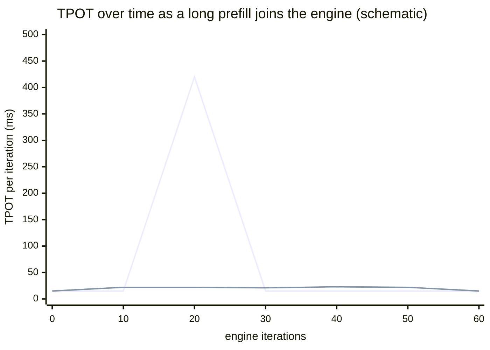
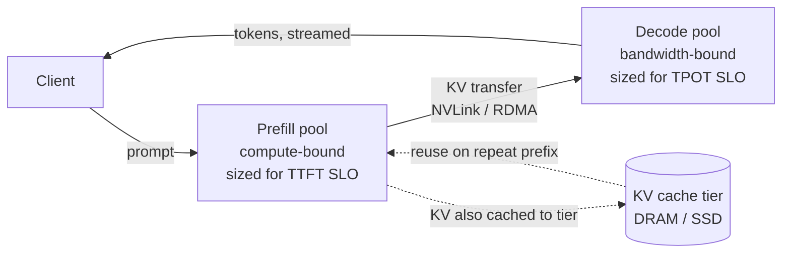

# 7. Prefill, decode, and the great divorce

> **Part II — Inside the engine** — chapter 5 gave you the batch and its scheduler; chapter 6 gave the memory a page table. This chapter is about the two antagonists who have been sharing that machinery all along — and the architecture that finally gives them separate addresses.

Chapter 5 left you a promissory note. Sarathi-Serve, you saw, reported 2.6× higher serving capacity under tail-latency constraints than vLLM on one workload, up to 5.6× end-to-end on another (arXiv:2403.02310, 2024) — and the chapter said only that stall-free scheduling was responsible. Here is the debt, and the story behind it.

Start with a symptom you have almost certainly seen. Your model is streaming nicely — tokens arriving like clockwork, 20, 30 per second — and then, for no reason visible in *your* logs, the stream hitches. A gap ten times longer than any gap around it. Your request did not change. Your prompt did not grow. Nothing in the model changed. What changed is that *someone else's request arrived* — a big one, carrying a 20,000-token prompt full of retrieved documents — and the engine made your tokens wait while it read that prompt. Your latency is not a property of your request. Sometimes it is a property of someone else's.

Every request you have ever sent is secretly two workloads stapled together. **Prefill** — the pass that reads your whole prompt in one go — wants big, parallel, arithmetic-heavy computation. **Decode** — the loop that emits your tokens one at a time — wants memory bandwidth and almost no arithmetic. They are opposite physical shapes, and for the first years of LLM (large language model) serving they were forced to share one queue, one batch, one set of chips. This chapter is about the accident of that cohabitation, the rationing fix (chunked prefill), and the architectural conclusion (disaggregation — "P/D separation," prefill and decode on different hardware). By the end you will know why a long prompt is a latency weapon pointed at every stream sharing the engine, why engines slice prefills into rations, when splitting the machine in two pays for itself — and what all of this means for the number your users actually feel: TTFT (time to first token) under load.

## 7.1 Words before machinery

This chapter opens the engine's deepest vocabulary, so here is the entrance ramp. Keep it nearby while reading.

| Term | Simple meaning | Everyday picture |
|---|---|---|
| Prefill | The up-front pass that reads the whole prompt and fills the KV (key-value) cache | The caterer prepping one giant order before service |
| Decode | The serial loop that emits one token per step | The plating line finishing dishes one at a time |
| Prefill bubble | The stall every running decode suffers while a long prefill occupies the batch | The counter freezes while the caterer monopolizes it |
| Interference | Prefill and decode degrading each other by sharing one queue | One counter shared by catering and walk-up orders |
| Chunk | A fixed-size slice of a long prompt's prefill | A tray of the catering order |
| Chunk budget | Tokens of prefill allowed per engine iteration | "Max trays per hour" |
| Piggybacking | Running prefill chunks alongside, never instead of, decodes | Slipping trays between regular tickets |
| Colocation | Prefill and decode on the same chips, one scheduler | Catering and walk-up share one kitchen |
| Colocation tax | The goodput you lose to interference | Meals served cold while the oven is booked |
| Disaggregation (P/D separation) | Prefill pool and decode pool on separate hardware | Two businesses: a commissary and a walk-up window |
| KV transfer | Shipping a finished prompt's cache from prefill pool to decode pool | The courier who boxes prep and delivers it |
| Early rejection | Admission control that refuses requests predicted to miss their SLO (service level objective) | The host who quotes the wait before seating you |

Goodput — completions per second that honor your SLO bounds, the metric chapter 5 defined — returns throughout; it needs no second entrance ramp.

## 7.2 Two phases, two bottlenecks

> **ELI5:** Picture a food truck with one counter and two kinds of work. Walk-up customers order one taco at a time; making each takes seconds, but the cook walks a slow lap around the kitchen for every single taco — the walking, not the cooking, sets the pace. Then a caterer arrives with an order for 400 tacos. That order is *great* business for the kitchen: one giant shopping trip, one mass-production run, the ovens packed. But it is served at the same counter. While the catering run happens, every walk-up customer stands there, taco-less. The truck is doing its most *efficient* work at the exact moment it feels slowest to everyone else.

That is the whole chapter in one kitchen. Now the mechanism, precisely.

**Decode is bandwidth-bound.** Chapter 3 derived it: at batch size 1, producing one token reads essentially the whole model's weights — for an 8-billion-parameter model in BF16 (bfloat16, two bytes per number), about 16 GB (gigabytes) streamed through the chip to produce one token's worth of math. Arithmetic intensity ≈ 1 arithmetic operation per byte (derived in chapter 3); the math units idle while the memory system runs. Decode iterations are *short but starving* — limited by how fast bytes move.

**Prefill is compute-bound.** Reading the prompt is one big parallel pass: all prompt tokens go through the model together, so every weight that gets fetched is *reused* across every prompt token in the same pass. The arithmetic is roughly 2 × parameters × prompt-length operations, against the same one-time weight read (derived; standard transformer accounting, attention's quadratic term aside — chapter 3 owns that term). A 512-token prompt therefore does about 512× the math of one decode token while reading the same weights once. Prefill is the catering order: GEMM (general matrix-matrix multiplication)-shaped, tensor-core-shaped, *compute-bound* — its problem is arithmetic throughput, not bytes. The Splitwise authors said it exactly: the two phases are "a compute-intensive prompt computation, and a memory-intensive token generation, each with distinct latency, throughput, memory, and power characteristics" (arXiv:2311.18677, 2023).

Opposite bottlenecks would be fine if the phases took turns politely. They don't, because of what you learned in chapter 5: **one batch iteration runs whatever the scheduler put in it, and takes as long as its longest member**. Here is the collision, as an iteration timeline. Say decode iterations take ~15 ms (milliseconds) each and a 20,000-token prompt arrives (constants illustrative; the mechanism is per Sarathi-Serve, OSDI 2024):

```text
iteration:   1        2        3        4        5        6
decode-only: [15ms]   [15ms]   [15ms]
20k prefill joined:            |——————— prefill iteration ——————|
                          (its forward pass alone: hundreds of ms)
every rider: token…   token…   token…   █ frozen █   token (late!)
```

That frozen stretch is the **prefill bubble**: a long prompt's prefill iteration stalls every co-batched decode, producing TPOT (time per output token) / ITL (inter-token latency) spikes *exactly when new requests arrive* (Sarathi-Serve, OSDI 2024, arXiv:2403.02310). The cruelty is structural, not a bug in any scheduler: the phases were simply never shaped to share an iteration.

Notice the moral asymmetry, because it frames every fix in this chapter. Decode-heavy iterations leave the arithmetic units mostly idle — wasted compute. Letting a prefill into the batch uses that idle compute beautifully — and freezes every rider mid-stream. Colocating the phases means choosing, on every iteration, between wasted silicon and wounded streams. The whole history of serving engines since about 2023 is a search for better answers to that dilemma.

## 7.3 Chunked prefill: rationing the intruder

> **ELI5:** The truck tries a new catering policy. Instead of blocking the counter for one three-hour mega-run, the caterer's 400 tacos are accepted in *trays*: every hour, a fixed number of trays get made — slotted in *between* the walk-up tickets, never instead of them. The walk-up line never stops moving; it just moves at its usual pace while the catering order quietly completes over the afternoon. The caterer waits longer for completion. Everyone else never notices.

That policy is **chunked prefill**, Sarathi-Serve's core move (OSDI 2024). Each long prefill is sliced into near-equal token **chunks** of a configured size, and the chunks are *piggybacked* onto decode batches: every engine iteration first runs all active decodes, then fills the leftover iteration capacity with a prefill chunk. Decodes never stall — no iteration is ever "the prefill's" — so TPOT stays smooth; the price is that the prefill finishes across several iterations instead of one, so the chunked request's TTFT rises a little. The **chunk budget** is the dial: smaller chunks → smoother TPOT, slower TTFT; larger chunks → the reverse. Two formulas carry the entire mechanism:

- **Iterations per prefill ≈ prompt_tokens ÷ chunk_size** — a 20,000-token prompt at a 2,048-token chunk budget spans about ten iterations (derived).
- **Iteration time ≈ time(chunk + all decodes in batch)** — the iteration is a little heavier than decode-only, never catastrophically heavier.

You already met the knob without its name: chapter 5's `max_num_batched_tokens`, the per-iteration token budget, is the chunk budget when chunked prefill is on. The same trade shows up in the engine docs: in vLLM's V1 engine, chunked prefill is on by default "whenever possible," the scheduler prioritizes all pending decodes and gives prefill the leftovers, and the tuning advice writes the dial's two directions — smaller budgets (around 2,048) improve inter-token latency, larger values (above 8,192 for small models on large GPUs) improve TTFT and throughput (vLLM docs, retrieved 2026-08-27).

What does rationing buy? On ShareGPT-style traces on A100 GPUs (graphics processing units), Sarathi-Serve reported:

> **Dated snapshot (Sarathi-Serve capacity vs prior systems — ShareGPT-style traces on A100s; arXiv:2403.02310, OSDI 2024).** Roughly 2–4× higher serving capacity under strict latency SLOs — up to about 6× under relaxed ones — versus prior systems including vLLM and Orca; chapter 5's series is the same story at finer grain: 2.6× capacity versus vLLM for Mistral-7B on one A100, up to 3.7× for Yi-34B on two, up to 5.6× end-to-end on Falcon-180B with pipeline parallelism. Those are the authors' own comparisons, so treat the magnitudes as their workload's, not yours.

All measured *under tail-latency constraints*, which is the point: the gains come precisely from protecting everyone's stream, not from raw throughput. Schematically, the two regimes look like this over one request's life (illustrative, not measured):



Read the spike: without chunking, the arrival of one long prompt is a visible cliff in every co-resident stream. With a chunk budget, that cliff becomes a gentle, barely-visible tax — paid mostly by the request that *brought* the prompt, as its own TTFT stretches across iterations.

Both sides, always: chunked prefill is not free. The chunked request's TTFT genuinely rises — spread over ~prompt ÷ chunk iterations, it finishes later than it would have alone on an idle engine. Chunking is a policy decision that *in-flight streams outrank newcomers* whenever both compete. Under light load nothing queues, chunks run back-to-back, and the tax is nearly zero; under heavy load the tax is exactly what saves the streams. Which brings us to the limit of the fix: DistServe's authors argue chunked prefill is throughput-friendly but *insufficient* when you must hold TTFT and TPOT SLOs simultaneously at high load (OSDI 2024, arXiv:2401.09670) — rationing the intruder still admits the intruder. At high arrival rates, prefill chunks are owed so many tokens per iteration that either TTFT starves or TPOT pays. Rationing postpones the collision. To dissolve it, you have to stop sharing the kitchen.

## 7.4 The great divorce: one request, two buildings

> **ELI5:** The truck finally splits into two businesses. A **commissary** — big ovens, bulk prep, built for catering runs. And a **walk-up window** — a plating line optimized for one-dish-at-a-time speed. Orders start at the commissary; when the prep is done, a courier boxes it and delivers it to the window; customers only ever face the window. Catering storms no longer freeze the window, because the window doesn't have an oven at all. The new cost is the courier: prep doesn't reach customers without a delivery run.

That is **disaggregated inference** — P/D separation. A **prefill pool** of GPUs runs prompt computation and produces the request's KV cache. The KV tensors are then shipped — over NVLink within a node, or RDMA (remote direct memory access) / InfiniBand across nodes — to a **decode pool**, and only then does the request's first decode step run. DistServe pioneered the argument and the co-optimization (OSDI 2024); Splitwise supplied the phase-economics framing (arXiv:2401.09670, 2024; arXiv:2311.18677, 2023). Mooncake went furthest, and its addition deserves its own picture:

> **ELI5:** The two businesses build a shared walk-in freezer in cheap warehouse space between them. Finished prep gets frozen and shelved instead of discarded; when the same customer orders the same dish again — or the same office orders the same standing lunch — the prep comes out of the freezer, no re-prep, no courier run. Neither kitchen gives up counter space to store it.

Mooncake (Kimi's platform at Moonshot AI) is KV-cache-centric in exactly that spirit: a disaggregated cache tier on underused CPU (central processing unit)/DRAM (dynamic random-access memory)/SSD (solid-state drive) holds finished KV caches so repeat prefixes skip prefill altogether, plus a scheduler that does prediction-based *early rejection* of requests it forecasts will miss their SLOs (arXiv:2407.00079, 2024).



Why go through the trouble? Because the two pools stop arguing. Each pool gets hardware, replica count, and a parallelism plan matched to its own bottleneck — compute-shaped for prefill, bandwidth-shaped for decode (the parallelism vocabulary is chapter 10's; here you only need "each phase gets its own plan"). A prefill storm — twenty long prompts landing at once — queues on the prefill pool and *cannot* stall a single in-flight decode, because decodes live on other chips entirely. Each SLO gets its own resource plan: size the prefill pool for the TTFT bound, the decode pool for the TPOT bound, and tune them independently. vLLM ships this as experimental disaggregated prefilling — prefill and decode as separate vLLM instances with KV transfer between them, different parallelism per phase — precisely so TTFT and ITL can be tuned independently (vLLM docs, retrieved 2026-08-27).

The measured case for the divorce, in one dated box:

> **Dated snapshot (disaggregation results, 2024 — DistServe: 13B model on one A100, 90% SLO attainment, arXiv:2401.09670; Mooncake: arXiv:2407.00079).** Colocated baseline: ≈ 1.6 requests/s/GPU of *goodput* — requests meeting both bounds. Split the phases and each island thrives alone: a prefill-only GPU delivers ≈ 5.6 requests/s, a decode-only GPU ≈ 10 requests/s. Reassemble as a 2:1 prefill-to-decode allocation — two prefill GPUs feeding one decode GPU — and the system serves ≈ 10 requests/s total ≈ 3.3 requests/s/GPU — **2.1× the colocated baseline** (derived from the paper's per-GPU figures) out of pure re-architecture, no new silicon. The paper's headline results run up to **7.4× more requests** served within constraints or a **12.6× tighter SLO** at fixed load, holding > 90% attainment; the lab summary reports up to **4.48× goodput** on chatbot workloads and up to **41×** on code completion (where prompts are long and outputs short — the most interference-prone shape there is). Mooncake reports up to a **525% throughput increase** in simulated long-context scenarios while meeting SLOs, and **75% more requests within SLOs** in Kimi's real production workloads (arXiv:2407.00079, 2024). Chatbot SLOs in that literature, for calibration: initial response under ~0.2 s, decoding merely matching silent-reading speed — ~250 words per minute.

Both sides, always — the divorce has real costs, and they are the reason most deployments are not fully disaggregated:

- **The courier is not free.** The KV transfer adds a fixed hop to every request's timeline — TTFT now includes "ship the cache." On short prompts, the transfer can rival the interference it removed (mechanism-true; no universal crossover number exists — it is model-, hardware-, and network-specific, so hedge any vendor claim of one).
- **You pay for the plumbing twice.** Two pools duplicate control planes, and the KV cache exists on (or transits) more machines. Mooncake's answer — park KV on cheap DRAM/SSD tiers — turns the engine into a distributed cache-logistics system, which is its own operational discipline.
- **Imbalance becomes a new failure mode.** A decode-heavy workload (short prompts, long generations) idles the prefill pool; a prefill-heavy one (RAG — retrieval-augmented generation — with long documents and terse answers) starves decode. Pool sizing becomes a capacity-planning problem the colocated engine never had.
- **Early rejection is a contract change.** A scheduler that predicts SLO misses and rejects up front trades tail latency for admission honesty — great for goodput, but it converts "slow success" into "fast failure," which your harness must be built to expect (chapter 15's retry discipline applies).

## 7.5 What P/D separation means for TTFT under load

> **ELI5:** An airport gives tour groups their own security lane. Before the split, one 80-person group with stacked instrument cases would freeze the business-traveler line for half an hour — the line was one resource shared by wildly different jobs. After the split, big groups queue among themselves, and the individual lane's wait stops being hostage to group size. The groups wait *longer on paper* (their lane is sized for groups) — but nobody's wait is a lottery over someone else's luggage.

The chapter map promised: what does "P/D separation" mean for TTFT *under load*? Recall chapter 5's decomposition — TTFT = queue wait + prefill compute — and that vLLM explicitly instruments the split (`vllm:request_queue_time_seconds` for the queued→scheduled gap, `vllm:request_prefill_time_seconds`, and TTFT measured from arrival so queue wait is included; vLLM metrics docs, retrieved 2026-08-27). Under load, the queue term dominates, and colocation inflates *both* terms in a feedback loop:

1. **Interference inflates service time.** A burst of long prompts inflates the prefill work per iteration, and first-token time rises linearly with prefill batch size (measured on LLaMA-2-7B on A100; arXiv:2407.05347, 2024) — every queued request's TTFT, not just the burst's own.
2. **Memory pressure converts to recompute.** Past the KV ceiling (49 concurrent requests at 1,280-token sequences on that same measured deployment — chapter 5's number), the scheduler preempts requests back to the waiting queue, *restarting their prefill from scratch* (vLLM's documented preemption behavior) — the engine redoes work it already did, raising offered load further: a mild feedback loop.
3. **Queueing multiplies it all.** Chapter 5's M/G/1 arithmetic — mean wait ∝ 1/(1−ρ), with ρ the utilization — means moving from 0.8 to 0.95 utilization — under a fifth more load — can multiply queue wait about 4×, and the p99 (99th percentile) diverges faster than the mean. Tail TTFT is a property of the *load*, not of your request.

Now run the same load against a separated system. The prefill queue lives on the prefill pool; long prompts queue *among themselves*, inflating each other's TTFT linearly but leaving the decode pool — and every in-flight stream — untouched. The 1/(1−ρ) wall still exists, but it exists *per pool*, and each pool is sized against its own SLO: prefill capacity against the TTFT bound, decode capacity against the TPOT bound. TTFT degrades *gracefully* under load instead of dragging every stream down with it. That graceful degradation — not the headline multipliers — is what the divorce buys your users: the DistServe results (7.4× more requests within constraints, or 12.6× tighter SLOs at fixed load) are quantifications of moving the goodput knee (chapter 5's term) to the right.

> **Field note.** We once ran a nightly "digest" agent — 40 documents, ~90k tokens of context, one terse summary — against the same deployment that carried a chat product's evening traffic. The chat streams were fine at 6:05 and hitching by 6:07, every night, and the on-call kept blaming the model. The tell was timestamps: gap spikes in the chat streams lined up with the digest job's arrivals to the second. Nothing about the chat requests was wrong; they were just co-located with a prefill storm. We moved the digest to a separate deployment (the poor operator's P/D separation) and the hitches vanished. The lesson I keep: before you debug a model, plot *when* latency went bad against *what else arrived*.

And here is the practical honesty for a harness builder: with a hosted API you cannot choose the architecture. You cannot ask OpenAI or Anthropic which pool your request ran on. What you *can* do is read the symptoms, because each failure mode has a fingerprint:

- **Interference:** token-stream gaps that spike in correlation with (your own or your tenants') burst arrivals, while TTFT stays plausible — chunked prefill missing, too coarse, or absent.
- **Queueing:** TTFT inflating under load while stream pace stays clean — you're behind a wall of other people's work; back off, because past the knee added load destroys goodput (chapter 5).
- **Admission control:** 429/529-class responses — the system *rejecting* rather than queueing (chapter 15 owns the response).

The client-side controls follow from chapter 5 and extend one step. Size first-chunk timeouts from continuously measured p99 TTFT plus a backoff budget, never a fixed constant. Keep concurrency below your measured goodput knee — the goodput knee, not the throughput plateau. And when you self-host: leave V1 chunked prefill on and size the chunk budget for your TPOT target; reach for disaggregated prefilling only when TTFT SLO misses at high load dominate your error budget (the vLLM docs' own framing, retrieved 2026-08-27). One more lever dwarfs them all for agent loops: if your prompts repeat — same system prompt, same tools, growing transcript — *don't pay for the prefill at all*. Prefix caching (chapter 6) skips it, and chapter 14 will show it is the biggest line item on your bill. Disaggregation makes prefill cheap to *tolerate*; caching makes it *absent*.

## 7.6 What you control from the harness

From your side of the API (application programming interface), the engine's architecture is weather. But the weather report changes what you build:

| Lever | What it does for the two phases | Where |
|---|---|---|
| Prompt-prefix caching | Makes repeated prefill *absent* — the biggest lever | 6, 14 |
| Concurrency cap below goodput knee | Keeps you off the 1/(1−ρ) wall on both pools | 5 |
| p99-based first-chunk timeout | Converts tail TTFT into data, not errors | 5, 15 |
| Chunk budget tuning (self-host) | The dial between TTFT and stream smoothness | this chapter |
| Speculative decoding | Speeds the *decode* pool's serial loop | 8 |
| Quantization | Shrinks weights and KV — decode bandwidth *and* transfer cost | 9 |
| Per-phase parallelism (self-host) | The resource plan each pool deserves | 10 |
| Long-context design | Prefill-heavy workloads are the interference worst case | 11 |

The pattern across the table: Part II keeps handing you engine-side physics, and your harness keeps converting them into client-side policy. Chapter 8 continues the descent with the decode phase's own speed trick — letting the model guess ahead and paying a checker instead of a writer.

## Where the picture stops

The divorce metaphor carried the chapter; now serve the papers on it.

**A commissary needs volume; not every kitchen does.** Disaggregation's gains come from load — the colocation tax is only payable when there *is* contention. An idle deployment with one request at a time pays the courier for nothing: KV transfer adds latency and complexity while the bubble it prevents never forms. Most workloads sit between, which is why chunked prefill (the cheap fix) is a default and disaggregation (the expensive fix) is not — a spectrum, not a decree.

**Two phases, one living request.** The chapter's clean split is per-*iteration*, not per-request biography. The instant the first token exists, your request *is* decode — but its KV cache keeps growing (chapter 4), can still be preempted and re-prefilled mid-life, and in a disaggregated system its cache may be evicted to a DRAM/SSD tier and read back. Prefill and decode are phases of a pipeline that never quite stops touching.

**The courier breaks the food picture.** In a kitchen, delivering prep costs a van and some fuel. In the engine, the KV delivery competes for the *same interconnects* the pools might rather use for their own coordination, and its cost scales with your KV bytes — chapter 4's formula quietly sets your shipping bill. No analogy survives "the delivery van is also the road."

**Early rejection inverts the contract you think you have.** A system that rejects predicted-SLO-misses is *more* honest, not less — but your harness experiences it as errors rising exactly when load peaks, which is also when retries are most dangerous. The polite restaurant that quotes you a 45-minute wait is still a restaurant that turned you away; your retry policy has to know that (chapter 15).

**Worst of all: from a hosted API, none of it is visible.** No header says "colocated," "chunked," or "disaggregated." Everything in this chapter is behind the provider's wall — which is why the symptom fingerprints (gap spikes vs TTFT inflation vs 429s) and the harness-side instruments that detect them are not optional extras. They are your only window into a machine room you rent but never see.

## Checkpoint

Teach it back before moving on — the rest of Part II assumes this chapter's split is reflexive.

1. A 20,000-token prompt arrives at an engine running 40 decoding streams. Walk through exactly *whose* latency it damages in a colocated engine, which metric spikes, and why the spike is tied to arrival, not to your request.
2. Why is prefill compute-bound while decode is bandwidth-bound? Give the arithmetic-intensity argument in both directions, and name the one formula that makes "batch of P prompt tokens" the same lever as chapter 3's batch dial.
3. Write the two formulas of chunked prefill. A 16,384-token prompt runs against a 2,048-token chunk budget: how many iterations does its prefill span, and who pays for the smoothing?
4. Why does chunked prefill fail at high load even in principle? Whose argument is this, and what does "insufficient for simultaneous TTFT and TPOT SLOs" mean concretely?
5. In the DistServe snapshot box, explain why the 2:1 pool allocation beats the colocated baseline 2.1× *without new hardware*. Which workload shape would push the gain toward the 41× end, and why?
6. Your hosted provider's streams hitch at 18:00 daily while TTFT stays flat. Interference, queueing, or admission? Name the instrument that distinguishes them, and the first harness-side change you'd make.

## Build it / Break it / Prove it / See it in the wild

### Build it

Add an ITL-gap logger to your streaming client (tinyengine's meter is the natural home): timestamp every chunk, compute inter-chunk gaps, and keep a histogram — median, p95, p99, and a counter of gaps above a fixed threshold such as 10× the median. That counter is your interference detector: a smoothly running engine produces a tight, unimodal gap distribution, while prefill bubbles show up as a sparse population of outliers far above the median (the threshold is a tool choice; no universal spike size is documented — pick one and count). It is twenty lines, and from that day on, "the provider feels slow at 6 pm" becomes a number with a timestamp you can correlate against your own cron jobs, fan-outs, and neighbors.

### Break it

If you self-host (vLLM makes this a one-flag lab): start a canary stream logging its gaps, then fire one 100k-token RAG prompt at the engine with chunked prefill disabled (or the chunk budget maxed). Watch the canary's gap plot — you should reproduce the prefill bubble live, including its arrival-timing signature. Re-run with a 2,048 chunk budget and watch the cliff become a plateau. You have just demonstrated this chapter's central mechanism on hardware you own; the before/after plots are the artifact.

### Prove it

Run vLLM's benchmark CLI (command-line interface) with `--goodput ttft:2000,tpot:100` at a fixed request rate under two chunk budgets — say 512 and 8,192 tokens. Predict first (that is the point of the chapter): smaller budget protects TPOT, larger protects TTFT and throughput. Then check goodput under a *paired* SLO at each setting, and find the budget that maximizes requests/s meeting both bounds — not the one that maximizes either alone. The budget you land on is your deployment's answer to "who pays when streams and newcomers compete," chosen by measurement instead of folklore.

### See it in the wild

Read the Sarathi-Serve abstract and first figure (OSDI 2024) and find the prefill bubble drawn as a measured staircase. Read the DistServe blog post (Hao AI Lab) for the goodput definition in its native habitat, then the paper's motivation section for the interference measurements behind the dated box here. Skim Mooncake's design section (arXiv:2407.00079) for what a KV-cache-centric engine looks like when the cache gets its own tier — you are reading the blueprint of a system serving a top-tier chat product. And browse the vLLM disaggregated-prefilling docs to see how close "experimental" is to one command away — the divorce, commoditized.
