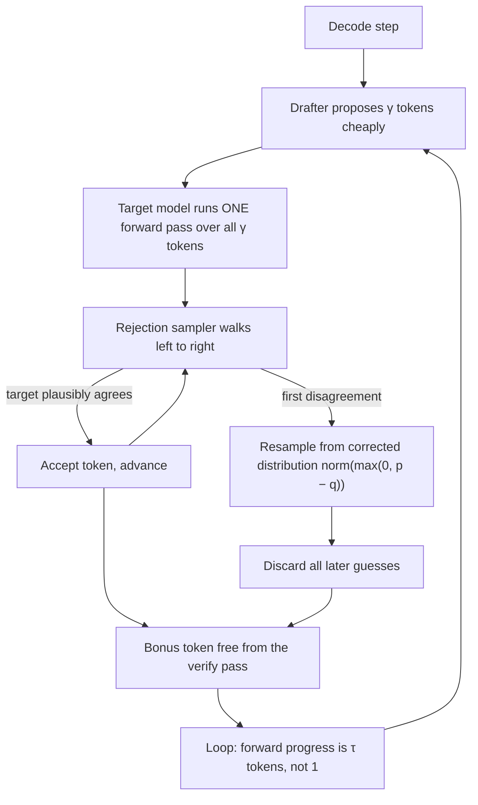
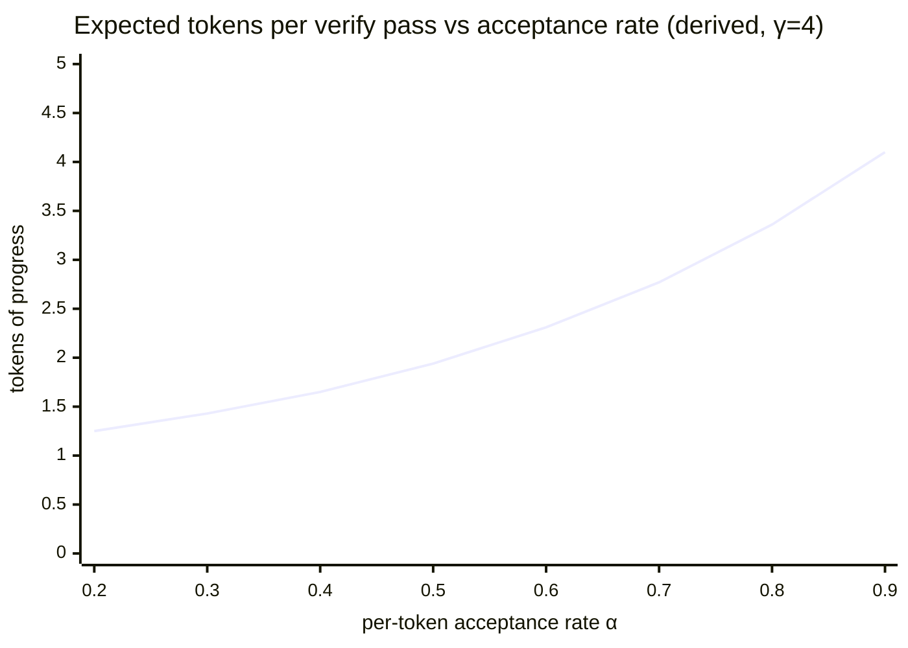

# 8. Guessing at the speed of light

> **Part II — Inside the engine** — chapter 5 amortized the weight pass across strangers; chapter 7 split the machine by phase. This chapter attacks the serial loop itself: the one place where the engine pays full price for every token, and the trick that lets it cheat without changing a single answer.

Chapter 2 left you a promissory note. Autoregressive generation, you saw, is serial by construction: producing K output tokens requires K runs of the model, because token 4 is an *input* to token 5 (Leviathan et al., arXiv:2211.17192, 2022). That serial tax is why generation speed has a hard floor no amount of compute hurries past — and the note said chapter 8 holds "the only mainstream escape." Here is the escape, and it is one of the strangest ideas in the engine room.

The strange idea: **let something cheap guess several tokens ahead, then let the expensive model check all the guesses in one pass.** If the guesses are good, you got 3–6 tokens for the price of one decode step. If they are bad, a correction rule fixes the first wrong one on the spot. And — this is the part that sounds like a loophole and is actually a theorem — the correction rule can be built so the output is *provably distributed identically* to what the big model would have produced alone. You are not settling for a cheaper approximation. You are guessing at the speed of light: arriving at exactly the same words, faster.

Start with a symptom you may have already met without knowing its name. A self-hosted endpoint streams a 70B model at 20 tokens per second (illustrative — chapter 3's ceiling arithmetic for 70B lands near 24), and a colleague flips one flag in the engine config — no new hardware, no new weights — and the same model, same prompts, same GPU (graphics processing unit), streams meaningfully faster; 2×–3× is the published range for exactly that flag flip (the table in 8.3). Nothing about the model changed. What changed is that the engine stopped *writing* every token and started *proofreading* them. This chapter is about when that trade is free money, when it is a slow leak, and how to tell which from your side of the API (application programming interface).

## 8.1 Words before machinery

This chapter opens a new corner of the engine's vocabulary, so here is the entrance ramp. Keep it nearby while reading.

| Term | Simple meaning | Everyday picture |
|---|---|---|
| Speculative decoding | Guess several tokens cheaply, have the real model check them in one pass | An assistant pencils in guesses the expert checks in bulk |
| Drafter | The cheap thing that guesses (small model, extra heads, or string matching) | The intern drafting the reply |
| Target model | The real model whose outputs you actually want | The senior partner who signs the letter |
| Draft length γ | How many tokens the drafter guesses per round | How many sentences the intern writes before review |
| Verify pass | One target forward pass that scores all guesses at once | The partner skimming the whole draft in one read |
| Acceptance rate α | The probability a guessed token survives verification | Share of sentences the partner keeps unchanged |
| Acceptance length τ | Mean tokens of forward progress per verify pass | Sentences kept per review round |
| Rejection sampling | The correction rule that makes guessing distribution-safe | Red-lining a sentence and dictating the replacement yourself |
| Draft tree | Verifying many candidate continuations in a single pass | Reviewing a branching outline instead of one linear draft |
| Prompt lookup (n-gram) | A drafter that copies phrases found in the prompt itself | Cloning sentences out of the client's own brief |
| Self-speculation | The model (or its own hidden layers) drafting for itself | The author jotting her own rough notes |

If you have read chapter 5, one row should already be itching: "verify pass" smells like batching. It is. Speculation is the engine's trick of **batching with your own future** — and by the end of 8.2 you will see exactly why that is not a metaphor.

## 8.2 The serial tax, and the checker's discount

> **ELI5:** A Sudoku grid takes most people an hour to *solve* — but a completed grid takes about a minute to *check*: scan the rows, scan the boxes, done. Checking is much cheaper than solving. Now imagine the puzzle-whiz charges by the minute, and an eager friend pencils in five guesses before the whiz looks. The whiz checks all five in one skim — which cost barely more than checking one — and keeps whatever is right. Same whiz, same hourly rate, many more cells per hour.

Why is checking so cheap here? Because of the physics you already own from chapter 3. A decode step at batch 1 is **bandwidth-bound**: the expensive part is streaming the model's weights off memory, and that cost is the same whether the pass computes logits for one position or for several. Recall the roofline: batch-1 decode runs at an arithmetic intensity near 1 floating-point operation per byte, while an H100's balance point sits near 295 (chapter 3's figures). Compute is therefore *hundreds of times under-provisioned* relative to bandwidth — which means a pass that reads the weights can carry several extra token positions of arithmetic almost for free, the same way a delivery van with one parcel and an empty hold can carry five. Chapter 2 showed you the flip side of this fact every time you sent a prompt: prefill reads *all* your prompt tokens in one parallel pass. Speculation simply lets decode borrow prefill's superpower for a moment.

Here is the loop, step by step:

1. **Draft.** A cheap drafter — we will meet the species in 8.3 — proposes γ tokens, one after another, conditioned on the text so far. Typical γ is a handful (EAGLE-style drafters often use more via trees; we will keep the linear picture for now).
2. **Verify.** The target model runs **one** forward pass over the γ drafted tokens (plus the current position). Because the drafted tokens are all known *before* the pass starts, the pass is shaped like a mini-prefill — parallel, weight-streaming-dominated, nearly free per extra position. It emits a logit row at every position: "what I would have sampled here."
3. **Accept or correct.** For each drafted token, left to right: if the target's distribution plausibly contains that token, keep it. At the first token the target would *not* have produced, discard it and every later guess, and sample a replacement from the corrected distribution `norm(max(0, p − q))`, where p is the target's distribution and q the drafter's. This correction is the theorem's engine: it provably makes the final output **distributed identically to sampling the target model alone** (Leviathan et al., ICML 2023; Chen et al., 2023 — the two simultaneous papers call it speculative decoding and speculative sampling). The checker does not merely veto; it rewrites the sentence itself, so the signed letter reads as if the partner wrote every word.
4. **Collect the bonus.** The verify pass computed logits at every position, including the one *after* the last accepted draft — so one extra token comes free even when every guess is rejected.

**The speedup arithmetic.** Leviathan et al.'s §2 gives the formula. Call α the per-token acceptance rate — the chance one drafted token survives verification. Then the expected forward progress per verify pass is

> E[progress] = (1 − α^(γ+1)) / (1 − α)

which is just the geometric sum 1 + α + α² + … + α^γ: the guaranteed first token, plus α's chance of a second, plus α² of a third, and so on. With α = 0.8 and γ = 4: (1 − 0.8⁵)/(1 − 0.8) ≈ **3.36 tokens per pass** — call it 3.36 tokens for the cost of roughly one decode step. But you only win if that multiplier beats the overhead ratio c = (draft cost + verify cost) / verify cost. If drafting and the wider verify add 20% (an illustrative constant — real values depend on the drafter), the net is 3.36/1.2 ≈ 2.8× (derived arithmetic throughout).

Look at the curve's shape, because it is the chapter in one picture. From α = 0.8 to α = 0.9, progress jumps from 3.36 to 4.10 tokens. From α = 0.2 to α = 0.3, it crawls from 1.25 to 1.43. Speculation is a **convex bet on the drafter**: excellent guessers compound, mediocre guessers barely clear the postage. Everything that follows — the drafter zoo in 8.3, the acceptance physics in 8.4, the failure modes in 8.5 — is about which side of that knee your workload lives on.

## 8.3 Who does the guessing

> **ELI5:** You need a first draft before the expert can proofread it. Three ways to get one: hire an intern and train them on the expert's old letters (a small draft model); teach the expert's own hands to write faster in her style, without changing her judgment (extra heads bolted onto the model); or just photocopy phrases from the client's original brief and staple them together (string matching). Each is cheaper than the expert in a different way, and each is right for a different kind of letter.

**The small draft model** is the original species. Train or pick a model a few percent of the target's size, run it ahead to draft, and let the target verify. Google reported 2×–3× wall-clock speedups on T5-XXL (11B) translation with a small drafter (Leviathan et al., 2023); DeepMind's simultaneous work landed in the same 2–3× range on Chinchilla 70B (Chen et al., 2023). The draft model must speak the same tokenizer's language — its guesses are token sequences — and it must be *calibrated enough* to guess what the big model would say, not what a different, cheaper model would say. That alignment is exactly what the newer species attack.

**Medusa** dispenses with the separate model: bolt several extra decoding heads onto the target itself, each trained to predict tokens 1, 2, 3… positions ahead. No intern — the expert's own hands, trained to sketch. Medusa-1 (frozen backbone, provably lossless) reported better than 2.2×; Medusa-2 (joint training) reported 2.3×–3.6× across a range of models (Cai et al., ICML 2024).

**EAGLE** is the lineage that currently owns the leaderboard. Its insight is to draft at the **feature level** — predicting the second-to-top hidden state of the target rather than output tokens — so the drafter sees the target's internal "intent," not just its words. The original reported 2.7×–3.5× latency speedup on LLaMA2-Chat 70B with roughly doubled throughput (Li et al., ICML 2024). EAGLE-2 added **context-dependent draft trees**: instead of one linear chain of guesses, the drafter expands a small tree of candidate continuations, pruned by its own confidence, and the verify pass checks the whole tree at once (tree attention) — raising how many tokens survive per pass (EMNLP 2024, 3.05×–4.26×, 20%–40% over EAGLE-1). EAGLE-3 changed the training recipe ("training-time test," fusing low-, mid-, and high-layer features) and reports 4.1×–6.5× at temperature 0 (NeurIPS 2025).

**Prompt lookup — n-gram speculation —** is the species built for agents, and it contains no model at all. The drafter simply searches the *prompt itself* for places where the last few generated tokens already appeared, and copies whatever followed. If your model is quoting a document, echoing a tool's JSON (JavaScript Object Notation) output back, editing code you pasted in, or filling a summary that reuses the source's phrasing, the correct next tokens are literally sitting in the input. The original implementation reported 2×–4× on input-grounded tasks — summarization, code editing, RAG-style (retrieval-augmented generation) copying — with no model changes and no training (apoorvumang/prompt-lookup-decoding, retrieved 2026-08-27). Chapter 6 told you the engine already keeps your prompt around; this is the cheapest possible reuse of it.

There are more species — self-speculation (early layers of the model drafting for the full model), multi-token-prediction heads shipped inside newer models, sparse-KV drafters we will meet again in 8.5 — and the engines have gathered them into menus: vLLM selects among EAGLE, MTP (multi-token prediction), draft-model, PARD, and MLP (multi-layer perceptron) drafters (model-based, best latency gains) plus n-gram and suffix decoding (modest gains, no extra peak-traffic workload) via `speculative_config` flags; SGLang recommends EAGLE-3 as its best speed/quality option; TensorRT-LLM supports draft-target pairs, Medusa-style heads, EAGLE, and lookahead-style drafters (vLLM, SGLang, TensorRT-LLM docs, retrieved 2026-08-27). Treat the unfamiliar flags as kin of the species above: someone cheap guesses, someone expensive checks.

> **Measured speedups — published figures, retrieved August 2026** (all authors'-own benchmarks; single-stream unless noted):
>
> | Method | Provenance | Reported speedup |
> |---|---|---|
> | Speculative sampling (draft model) | Leviathan et al., ICML 2023 | 2×–3× (T5-XXL 11B); 2–3× on Chinchilla 70B (Chen et al., 2023) |
> | Medusa-1 / Medusa-2 | ICML 2024 | >2.2× / 2.3×–3.6× |
> | EAGLE | ICML 2024 | 2.7×–3.5× on LLaMA2-Chat 70B, ~2× throughput |
> | EAGLE-2 | EMNLP 2024 | 3.05×–4.26× |
> | EAGLE-3 | NeurIPS 2025 | 4.1×–6.5× (means at temperature 0: Vicuna-13B 5.51×, Llama-3.1-8B 4.44×, Llama-3.3-70B 4.12×, DeepSeek-R1-distill-8B 4.16×) |
> | Prompt lookup (n-gram) | project README | 2×–4× on input-grounded tasks |

## 8.4 Acceptance: the exchange rate of the whole scheme

> **ELI5:** Speculation is a currency exchange between guessing and progress. The exchange rate is α — how often a guess survives. When the rate is good, guessing is nearly free money. When it is bad, you are buying progress with wasted drafts and paying a fee on every trade.

The number that decides everything is the **acceptance length τ** — mean tokens of forward progress per verify step (accepted guesses plus the guaranteed token) — because end-to-end speedup is roughly τ divided by (1 + draft overhead). EAGLE-3's measured τ at temperature 0 runs 5.84–6.62 tokens across Vicuna-13B, Llama-3.1-8B, Llama-3.3-70B, and a DeepSeek-R1 distill — which is why its speedups land at 4×–5.5× with sub-token amortized draft cost (NeurIPS 2025). Two to four accepted tokens per step was a good day for the draft-model era (EAGLE-1's measured τ ran ≈ 3.5–4.5); five to seven is the current EAGLE-family baseline.

What moves α? Four forces, in descending order of how precisely they are measured:

**Temperature, measured precisely.** The drafter proposes its best guess — near-greedy, the mode of its distribution. At temperature 0 the target *also* wants the mode, so when drafter and target agree on the argmax, acceptance is near-certain. At temperature 1 the target samples from a widened distribution: even when the drafter picks the most likely token, the target's draw diverges from it most of the time, and the acceptance test fails accordingly. EAGLE-3's own table quantifies it — temperature 0 → 1 drops mean speedup from 5.51× to 4.65× on Vicuna-13B (τ 6.62 → 5.67), from 4.44× to 3.45× on Llama-3.1-8B (τ 6.23 → 4.92), from 4.12× to 3.95× on 70B, from 4.16× to 3.52× on the R1 distill — roughly a **15–25% speedup loss on three of the four models — the 70B drops only ~4%** (derived from the paper's table). Creative, high-temperature generation is structurally the worst case for the convex bet of 8.2.

**Copying, measured approximately.** The n-gram drafter's α is entirely a function of how much the output repeats the input. Community benchmarks put its typical acceptance length near 1–2.5 tokens on general chat — marginal — and near the full draft length on high-copy tasks like extraction and quoting (approximate; mid-2026 snapshot — no primary number is published). Same drafter, same engine, tenfold difference in outcome, purely from workload shape.

**Domain match, measured directionally.** Learned drafters are trained to guess *this* model on *these* kinds of text. Push one onto cold or out-of-domain tasks and α falls toward coin-flip; the EAGLE line's own comparisons show acceptance rising with draft-training data (NeurIPS 2025). No clean number exists for the drop — treat "cold tasks pay" as directional, not quantified.

**Prefix temperature, measured not at all.** A cache-cold prefix (chapter 6) gives an n-gram drafter nothing to match and gives every drafter the least history to condition on. The mechanism is unambiguous; a measured figure is not. This is the first of several places this chapter will say: *the sign is known, the magnitude is yours to measure.*

## 8.5 When guessing hurts

The convex bet of 8.2 has a downside wing, and it is not a corner case — it is three of the most common agent workloads. Both sides, in order.

### Low acceptance: paying postage on every trade

Work the arithmetic from the losing side (all derived, γ = 4, illustrative 20% overhead):

| α | Tokens per pass (formula) | Net multiplier | Verdict |
|---|---|---|---|
| 0.2 | 1.25 | ≈ 1.04× | Dead — noise |
| 0.3 | 1.43 | ≈ 1.19× | Barely alive |
| 0.5 | 1.94 | ≈ 1.61× | Marginal |
| 0.7 | 2.77 | ≈ 2.31× | Worth it |
| 0.8 | 3.36 | ≈ 2.80× | Why engines ship it |
| 0.9 | 4.10 | ≈ 3.41× | The convex wing |

Below α ≈ 0.5 you are streaming almost one token per step *anyway*, while paying the drafter's cost and carrying a wider verify pass on every step. And remember the rejection rule: at the first miss, **every** later guess is discarded — a γ-token draft that dies on token 1 was pure waste. The engine pays for guesses the way you pay for lottery tickets: per ticket, not per win.

### Structured output: the form with boxes

> **ELI5:** Now the reply must fit an official form — one word per box, only the approved words. The intern's freehand guesses keep landing half-in, half-out of the boxes, so the partner tears up nearly every sentence unread. Guessing only helps when guessing is *shaped like* the answer.

Grammar-constrained decoding (chapter 13's machinery) masks every token the grammar forbids — logits the schema cannot accept are set to −∞ before sampling. A drafter that does not know the grammar proposes tokens that the mask then rejects wholesale; the drafts die at the door. Some engines simply disable or degrade speculation under guided decoding; TensorRT-LLM documents a combined workflow that overlaps the CPU grammar check with the GPU draft/verify loop, which tells you the combination is *possible* but is its own engineering (TensorRT-LLM docs, retrieved 2026-08-27; no published acceptance number for the combination — the sign is known, the magnitude is not). For your harness the operational rule is blunt: **do not budget speculative gains on JSON-schema endpoints.** Budget un-speculated numbers; treat whatever the engine salvages as upside.

### High batch: the checker's desk fills up

> **ELI5:** The partner skims drafts cheaply when the desk is otherwise empty. Put twenty live matters on the same desk and every extra page now competes for real attention — the skim is no longer free.

Here is where the "verify is nearly free" argument quietly assumes something. The argument was bandwidth-bound decode: compute hundreds of times under-provisioned, so extra positions ride along. But chapter 5's batch dial multiplies arithmetic intensity by batch size — at large batch the engine is **compute-bound**, and verify width multiplies FLOPs (floating-point operations) per request by up to γ+1. The checker's discount shrinks exactly when the desk fills. The vendors say it out loud: TensorRT-LLM frames speculation as "a technique for accelerating LLM inference at *low batch sizes*," and vLLM's own table grades EAGLE "high gain" at low QPS (queries per second) but only "medium to high" at high QPS (docs, retrieved 2026-08-27). TensorRT-LLM also fixes `max_draft_len` per deployment with no per-request disable — a contract quirk worth knowing before you enable it on a box that also serves traffic peaks.

Then comes the exception that proves the bandwidth story. MagicDec (arXiv:2408.11049, 2024) showed that for *long sequences* — roughly 4,000 tokens and up — decode is bandwidth-bound again, because the KV (key-value) cache reads join the weights as the thing the pass must stream. In that regime the checker's discount comes back, and speculation can pay **even at batch 256**: up to 2.51× for Llama-3.1-8B at batch sizes 32–256 on long-sequence tasks (8×H100, sparse-KV drafters). The crossover length S\* depends on the hardware's compute-to-bandwidth ratio and on GQA (H100 crosses earlier than A100/L40; grouped-query attention raises S\*) — and the same paper reports ~90% token acceptance for self-speculation with sparsified KV across 4,000–100,000-token contexts at batch 1 (a 70B model drafting for itself). The same effect shows up in the EAGLE-3 batch tables: in SGLang on an H100 it still returns 1.38× throughput at batch 64, while EAGLE-1 goes *negative* at batch 24; in vLLM, EAGLE-1's gain peaks near batch 24 and EAGLE-3's near 56 (NeurIPS 2025). So the honest rule is not "speculation dies at high batch" but: **speculation follows bandwidth.** Wherever decode is weight- or KV-streaming-bound — single stream, or long context even in big batches — the bet has room; wherever compute saturates first, it does not. Chapter 11 owns the long-context half of that sentence.

### The TTFT blind spot

One more hurt, easy to miss because it is an absence: **speculation does nothing for TTFT (time to first token).** It accelerates the decode loop only; the prompt still has to be prefilled first, in full, by the big model (chapter 7). A speculation-enabled engine can therefore produce the confusing dashboard where TPOT (time per output token) halves and TTFT does not move at all. If your latency budget is first-token-dominated — short outputs, long prompts — this chapter's lever is not your lever; chapters 6, 7, and 14 are.

## 8.6 What you control from the harness

> **Field note.** We ran a self-hosted extraction endpoint — read the document, quote the three binding clauses — on vLLM with n-gram speculation enabled, and watched inter-token latency fall nearly in half on quote-heavy traffic. Then the same endpoint moved to schema-constrained JSON output, and the gain evaporated: same model, same documents, acceptance collapsed because the drafts kept violating the schema's mask. The acceptance-rate metric in the engine's spec-decode logs is what caught it — not the latency dashboards, which just quietly absorbed the regression. One deployment, before/after, no controlled benchmark: treat it as a direction, and put the canary in before you need it.

From your side of the API, the posture splits cleanly by who runs the engine:

**If you self-host,** speculation is a per-workload toggle, not a fleet-wide default. Turn it on for the copy-heavy, low-temperature agent steps — extraction, quoting, code edits, anything where the output echoes the input — where n-gram costs nothing and α runs high. Leave it off for creative and high-temperature paths, for batch/eval jobs at high concurrency, and for grammar-constrained endpoints until you have measured the combination. Watch per-request acceptance rate as a **drift canary**: falling α means the engine is burning compute on rejected drafts, and usually means the workload has drifted from what the drafter was trained for. And before enabling it on shared hardware, check the engine's contract — TensorRT-LLM's fixed `max_draft_len` with no per-request disable is exactly the kind of detail that turns into a 3 a.m. page during a traffic peak.

**If you call a provider API,** assume speculation is already applied server-side and is invisible to you: no header says "speculated," no usage field reports acceptance, and vLLM's own docs warn that gains "do not usually yield inter-token latency reductions for all prompt datasets or sampling parameters" — observed engine speedups run below reference-implementation numbers (vLLM docs and issue #9565, retrieved 2026-08-27). The discipline this imposes is healthy anyway: **budget on un-speculated numbers and treat speculation as upside.** Whatever acceleration the provider's engine gives you is already inside the p95 TPOT you measured in chapter 5 — measure, don't assume.

| Lever | What it does | Where |
|---|---|---|
| n-gram speculation on echo-heavy steps | Cheapest decode accelerator — reuses the prompt you already paid for | this chapter, 6 |
| Acceptance-rate monitoring | Drift canary: falling α = wasted compute | this chapter |
| Un-speculated latency budgets | Speculation as upside, never as dependency | this chapter, 5 |
| Quantization | The other bandwidth lever — smaller weights, faster decode | 9 |
| Parallelism / expert routing | More chips per stream, or fewer active weights per token | 10 |
| Long-context speculation (MagicDec regime) | Speculation survives high batch when KV reads dominate | 11 |
| Structured output + speculation | The mask that starves the drafter | 13 |
| Cache-aware prompt assembly | Warm prefixes raise α before any drafter trains | 14 |

The pattern across Part II holds: the engine keeps offering you physics, and your job is to convert it into policy. Speculation is the most policy-shaped physics of all — the same flag that triples one endpoint's speed can tax another's, and only your workload decides which.

## Where the picture stops

The guessing metaphor carried the chapter; here is where it stops carrying.

**"Same answers, faster" is a distribution promise, not a string promise.** The theorem says speculated output is *distributed identically* to un-speculated sampling. At temperature 0, engines validate with greedy-equality tests — same string. At temperature above 0, two runs of the *same* un-speculated engine already differ; speculation adds no new randomness in principle, but implementation is software: the engines themselves report spec-decode gains varying by workload and landing below reference numbers (vLLM, retrieved 2026-08-27). "Lossless" is a mathematical property of the sampler, verified in practice by tests your harness should not blindly extend to every engine build.

**The checker's discount is a *batch-1* discount.** The Sudoku picture — checking five digits costs one skim — is true only while the pass is bandwidth-bound. Fill the desk (high batch) or shrink the boxes (grammar masks) and the same trick charges full price or worse. There is no universal "speculation makes it faster"; there is only "speculation makes *this workload on this hardware at this load* faster," and 8.5's three forces decide.

**The drafter is a paid bet, not a free assistant.** Every guess costs the draft step and the wider verify, win or lose. The intern in the analogy works for exposure; the drafter in the engine works for GPU time. At low α you are not "sometimes helped" — you are *systematically slower*, paying postage on a lottery whose odds you can and must measure.

**Guessing fixes the wrong clock.** Speculation accelerates the loop *after* the first token. If your product's felt latency is dominated by prefill — long prompts, short answers, or a cold cache on every request — the speedup multiplies the small number and leaves the big one alone. The lever exists, and it is pointed at the wrong wall.

**And from a hosted API, none of it is negotiable or visible.** You cannot turn the provider's speculation on or off, cannot see α, cannot separate speculated from un-speculated tokens in the bill. The discipline collapses to one sentence: measure the stream you actually get (chapter 2's meter), budget conservatively (this chapter), and let the provider's engine room keep whatever magic it has — you are renting the results, not the trick.

## Checkpoint

Teach it back — the rest of the book assumes you can price this bet on sight.

1. Write the expected-progress formula and explain each symbol. With α = 0.7 and γ = 4, how many tokens per verify pass do you expect, and what net speedup remains after a 25% draft-and-verify overhead?
2. Why is verification nearly free at batch 1? Give the roofline argument from chapter 3 in your own words — and name the two regimes where it stops being free.
3. Your workload quotes long passages from retrieved documents at temperature 0. Which drafter species do you reach for, and why would the same drafter be a mistake on a creative-writing endpoint?
4. Explain, mechanically, why temperature 1 hurts acceptance more than temperature 0. Which two measured numbers from this chapter quantify the drop?
5. State the folk wisdom about speculation and batch size — then explain MagicDec's exception and the quantity S\*. Why does grouped-query attention push S\* the wrong way?
6. You call a hosted API and your PM wants to "budget the 3× speculative speedup the provider must be using." Write the two-sentence reply.

## Build it / Break it / Prove it / See it in the wild

### Build it

Add a speculation-awareness hook to your client's latency meter (tinyengine's tracer from chapter 1 is the home): when you self-host, pull the engine's spec-decode acceptance metrics into the same dashboard as TPOT and TTFT, and plot α over time per endpoint. Twenty lines of glue — and from that day on, "the endpoint got slower" has a first suspect: the workload drifted, the drafter's guesses stopped landing, and the engine has been quietly paying for rejected drafts. That plot is the drift canary this chapter keeps insisting on.

### Break it

On a self-hosted engine with n-gram speculation enabled, send two workloads through the same model: (a) "repeat the key clauses of this contract verbatim" against a pasted contract, and (b) "write a poem about this contract." Measure tokens/s and, if exposed, acceptance length for both. Then turn on a JSON schema for the extraction case and re-measure. You should reproduce the whole chapter in one afternoon: α near the full draft length on (a), near 1–2 tokens on (b), and the schema flattening (a)'s gain — the three forces of 8.5, live on hardware you own.

### Prove it

Run your engine's benchmark CLI (command-line interface) — vLLM's, say — on a summarization set with speculation off, then with n-gram speculation on, at temperature 0. Predict first, from the formula and an α you estimate from one manual sample: what speedup should you see? Then re-run both at temperature 1. If your measured speedup tracks your predicted one, you have earned the right to use this lever in production budgets; if it does not, you have found the workload-specific truth this chapter keeps promising is the only truth there is.

### See it in the wild

Read Leviathan et al.'s §2 (arXiv:2211.17192) — three pages containing the whole acceptance formula and the lossless proof; the machinery of this chapter has been standing on them since 2022. Skim the EAGLE-3 paper's tables (arXiv:2503.01840) for the temperature and batch-size data quoted here, then the MagicDec abstract (arXiv:2408.11049) for the long-context exception. Browse vLLM's speculative decoding docs for the flag menu and the honest workloads-caveat, and the prompt-lookup-decoding README for a drafter you can read in full in ten minutes — the entire trick, a string search. That is the engine room in miniature: a theorem, a leaderboard, an exception, and a string search.
