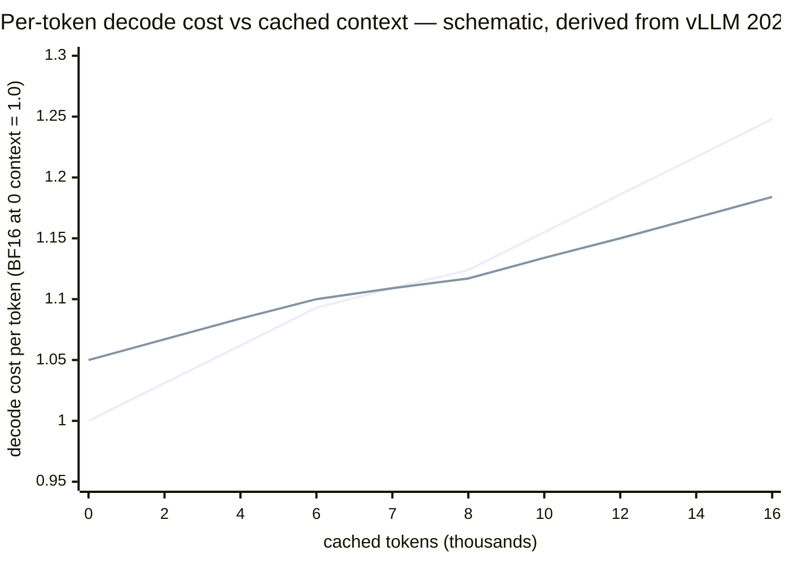
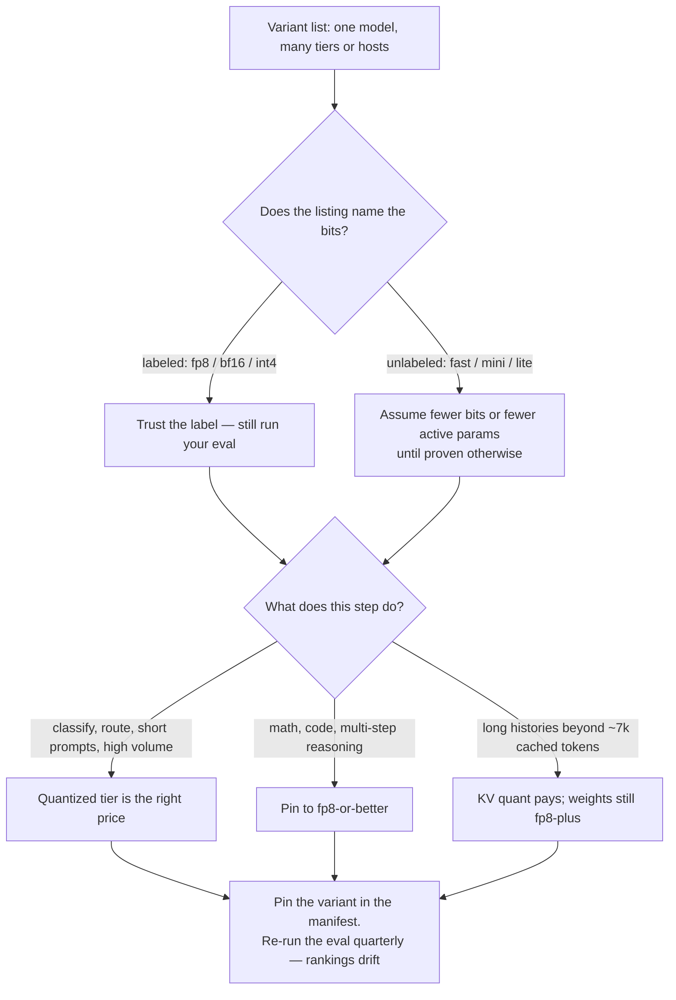

# 9. Smaller numbers, faster engines

> **Part II — Inside the engine** — chapters 5 through 8 rearranged *when* the engine reads its bytes: batching amortized the weight pass across strangers, paging spread the cache, the prefill/decode split gave each phase its own desk, and speculation cheated the serial loop. This chapter shrinks the bytes themselves.

Chapter 3 closed with a lever list containing exactly two single-stream options: move fewer bytes per token, or move the same bytes faster. Chapter 10 owns the second lever. This chapter owns the first — and it is the one you have been pulling all along without knowing it, because nearly every model you have ever called through an API (application programming interface) was probably served with rounded numbers. The provider's "fast" tier, the `(FP8)` (8-bit floating point) tag next to a host's name on a benchmark site, the open-weight model that ships 4-bit by design: all of it is quantization wearing different clothes. Chapter 4 left you a second promissory note — FP8 KV (key-value) caching halves every row of its table exactly, with measured quality caveats that are workload-dependent, and chapter 9 owns the full menu. Here it is.

The idea itself is almost embarrassingly simple. A model is a very large pile of numbers, each stored in 2 bytes. Store each number in 1 byte, or half a byte, and the pile shrinks by 2× or 4× — and since chapter 3 proved that single-stream decode is bound by how fast you can *stream* that pile through the chip, a smaller pile is a faster model. The entire chapter lives in the gap between that sentence and production: *which* numbers you round (weights, activations, or the KV cache — three separate dials), *how carefully* you round them (a blind pass destroys quality; a calibrated one nearly preserves it), and *who pays* the residual bill (math and code first, knowledge last). Latency, cost, quality — pick two has never had a louder sign hanging over it than this chapter.

## 9.1 Words before machinery

This chapter opens a new corner of the engine's vocabulary, so here is the entrance ramp. Keep it nearby while reading.

| Term | Simple meaning | Everyday picture |
|---|---|---|
| Quantization | Store each number with fewer bits than it was trained with | Rounding $3.8473 to $3.85 |
| Precision / bit-width | How many distinct values one number can take | Markings per inch on a ruler |
| FP16 / BF16 | The 2-byte formats models are trained and shipped in | The recipe written to four decimals |
| FP8 / INT8 | One byte per number — float or integer | Rounding to two decimals |
| INT4 | Half a byte: sixteen levels per number | Measuring to the nearest quarter-cup |
| Weights vs. activations | The model's stored parameters vs. the numbers flowing through during a pass | The pantry vs. what's in the mixing bowl |
| Weight-only quant (W4A16) | Shrink the pantry; keep mixing at full precision | Buying pre-portioned spices, still whisking carefully |
| W8A8 | Shrink pantry and bowl both to one byte | Portion cups and rounded measuring both |
| Calibration | Study a few hundred real inputs before deciding how to round | A tailor measures you before cutting the suit |
| Salient channels | The ~1% of numbers that carry disproportionate signal | The one singer in the choir who carries the melody |
| KV quantization | Shrink the attention cache, not the model | Keeping meeting notes in shorthand |
| Recovery | Quantized benchmark score as a fraction of the original | How much of the taste survived the substitution |
| Perplexity | How surprised a model is by held-out text; lower is better | Grading the apprentice's next-guess record |
| Variant / tier | Same model name, different serving recipe underneath | The same sandwich at two shops |

Two rows will do a lot of work later: "weights vs. activations" is the distinction the whole method zoo sorts by, and "recovery" is the number your routing decisions will eventually hang on.

## 9.2 Rounding the recipe

> **ELI5:** A bakery's master recipe says "0.8473 cups of sugar." A new cook writes "about ¾ cup." For pancakes, nobody can tell. For a macaron — where chemistry punishes small errors — the batch sometimes fails. Same recipe, same words, fewer decimal places: that is quantization. The whole engineering question is which dishes survive the rounding, and how to round so more of them survive.

Start with what a number *is* in a trained model. Every weight — all 8 billion of them in an 8B model — ships as FP16 or BF16 (brain float 16; the two 2-byte float formats; Meta model card, 2024). Two bytes give each number a few significant decimal digits and a wide dynamic range. Quantization maps each weight onto a coarser grid. The standard affine scheme keeps an integer `q` and a scale `s`: round the weight to the nearest grid point, store the small integer plus the shared scale, and reconstruct the weight at use time as `w ≈ s · q`. Formally, `q = round(w / s) + z` with a zero-point `z`, and for b-bit integers the scale is `s = (max(w) − min(w)) / (2^b − 1)` per channel — per row of a weight matrix, or per small group of weights (a common grouping is 128, written g128; vLLM and LLM Compressor docs, retrieved 2026-08-27).

Work it once, because the arithmetic *is* the intuition. A weight channel spanning [−0.08, +0.08], quantized to INT4 (b = 4, so 15 levels between min and max), gets a scale of 0.16 / 15 ≈ **0.0107** — each rounded weight can be off by at most s/2 ≈ **0.0053**, about 3% of the channel's full span. Halve the span (finer grouping) and you halve the error; raise b and the denominator 2^b − 1 explodes in your favor. That is the entire quality mechanism: error is proportional to how much range each scale has to cover, and the craft of the methods in 9.3 is arranging for the *important* weights to sit under fine-grained scales while the rest round cheaply.

Why does any of this make the model *faster*? Because of a fact you already own: chapter 3 showed that batch-1 decode runs at an arithmetic intensity near one FLOP (floating-point operation) per byte — pure bandwidth-bound — so the decode floor is `weights ÷ bandwidth`, and the floor divides exactly as the weight bytes divide (chapter 3's derivation, applied here):

- Llama-3-class 8B in BF16: ~16 GB ÷ 3.35 TB/s ≈ 4.8 ms/token → ceiling ≈ 208 tokens/s.
- The same weights in FP8 (~8 GB): ≈ 2.4 ms/token → ≈ 415 tokens/s.
- The same weights in INT4 (~4 GB): ≈ 1.2 ms/token → ≈ 830 tokens/s — before the 0.7 real-kernel haircut, after which something near 580 tokens/s is plausible (all three floors derived from chapter 3's constants; theoretical, not measured).

Four times fewer bytes, roughly four times higher floor, on the *same* chip. No other lever in this book buys that at zero hardware cost — and the fine print has three clauses. First, the floor only binds what binds it: KV bytes and activations do not shrink when weights do, so at long context the KV stream (chapter 4) starts to dominate and weight quant's speedup fades toward the cache's share of traffic. Second, prefill is compute-bound (chapter 3), so weight quant helps prefill only via memory pressure and kernel efficiency, not via the bandwidth floor. Third — the clause this chapter keeps paying out — every rounding decision sends a bill to quality, and 9.4 shows the bill has a delivery *order*.

One distinction sorts the whole method zoo. You can round the **weights** (stored, static, quantized once offline), the **activations** (computed fresh every pass, quantized on the fly), or the **KV cache** (per-session state; a separate dial entirely). The shorthand notation writes W for weights, A for activations: W4A16 is 4-bit weights with 16-bit activations — "weight-only"; W8A8 is both sides at one byte; KV quantization is a third axis you can stack on either. Three dials, three bills, and the marketing never tells you which one was turned.

## 9.3 The methods behind the names

> **ELI5:** Rounding every measurement blindly is one way to copy a recipe — and the way that ruins macarons. The good copies are *calibrated*: before rounding, the cook watches a few hundred real orders go by, notices that two ingredients (saffron, salt) wreck the dish if they're off, and leaves those measured to full precision while rounding the flour. Same number of decimal places saved overall; far fewer ruined batches.

Naive rounding — round every weight to the nearest grid point, called round-to-nearest, RTN — is what breaks first, and it breaks for a sneaky reason: activations flowing through the model contain *outlier channels* — a few coordinates whose magnitudes dwarf the rest (the observation that broke naive integer quantization; SmoothQuant paper, arXiv:2211.10438, 2023). Round those carelessly and the error swamps real signal. The named methods in every engine's flag menu are different repairs:

**SmoothQuant (2022→2023): migrate the difficulty.** Divide each activation channel by a per-channel smoothing factor before the matmul and multiply it back into the weights — mathematically identical output, but now the activations have no wild outliers and *both sides* quantize cleanly to 8 bits. This is the W8A8 lineage: up to 1.56× speedup and 2× memory reduction vs. FP16 on OPT-175B-class models, no retraining (arXiv:2211.10438, 2023). Its descendants are today's default FP8 serving on Hopper-class hardware (NVIDIA's H100-generation chips), where the 8-bit format is a float (e4m3/e5m2 — 4-or-5-bit exponent, 3-or-2-bit mantissa variants) instead of an integer, with a per-tensor scale folded into the kernel.

**GPTQ (2022→ICLR 2023): compensate as you round.** Quantize weights one column at a time, and after each rounding error, nudge the *not-yet-quantized* weights to cancel it, using second-order (approximate Hessian) information about how errors propagate. The paper's claim is 3–4 bits per weight "with negligible perplexity loss" on 175B-parameter models (the authors' qualitative claim) plus end-to-end speedups of ~3.25× on an A100 and ~4.5× on an A6000 in its extreme-quantization regime (arXiv:2210.17323, 2022).

**AWQ (2023→MLSys 2024): protect the vital 1%.** Observe on ~512 calibration samples that quality hinges on about 1% of channels — the salient ones from the table in 9.1 — and scale them so they survive 4-bit rounding, without per-weight mixed precision. Its inference engine claims >3× speedup over FP16 Hugging Face serving on desktop and mobile GPUs (graphics processing units), including Llama-2-70B on a Jetson Orin (arXiv:2306.00978; hanlab.mit.edu, retrieved 2026-08-27).

**MXFP4: rounding as the intended format.** A 4-bit *floating* format with a shared block exponent — the block shares one scale the way g128 groups share scales, but the values stay floats. gpt-oss ships it natively: the 120B model (117B total parameters) fits a single 80 GB H100 or MI300X, the 20B runs in ~16 GB, and — the part worth internalizing — the quantization was applied *during post-training*, so 4-bit is the intended deployment precision, not a degraded copy of a better model (OpenAI gpt-oss model card, arXiv:2508.10925, 2025).

> **Published speedup figures (dated snapshot, mid-2026).** SmoothQuant W8A8: up to 1.56× / 2× memory vs. FP16 (arXiv:2211.10438, 2023). GPTQ extreme regime: ~3.25× on A100, ~4.5× on A6000 (arXiv:2210.17323, 2022). AWQ engine: >3× vs. FP16 Hugging Face, desktop/mobile GPUs (hanlab.mit.edu, retrieved 2026-08-27). Baseten production FP8 (Mistral-7B, TensorRT-LLM, H100): 8.5% lower TTFT (time to first token), 33% faster output tokens/s, 31% higher throughput, 24% lower cost per million tokens (Baseten blog, retrieved 2026-08-27). SemiAnalysis InferenceX, same Qwen 3.5 397B weights on B200: FP8 is 18% cheaper per token and 18% faster per chip than BF16; 23% on B300 (retrieved 2026-08-27). Treat every line as one model on one stack — there is no universal multiplier; the *shape* of the trade is universal.

Notice what weight-only quant (W4A16) quietly buys: the numbers *flowing* through the model stay 16-bit, so nothing downstream has to tolerate activation rounding — the pantry is pre-portioned, the whisking is unchanged. That is why INT4-class weight quant is the workhorse of local and edge serving: decode is bandwidth-bound, the bandwidth is mostly weights, and the dequantization cost is fused into the matrix-multiply kernel and paid back many times over in bytes never moved. The GGUF (GPT-Generated Unified Format — llama.cpp's single-file model container) files chapter 18 will hand you — the `Q4_K_M` in a filename is exactly this: a 4-bit weight quant with block scales, the modern default of the llama.cpp ladder (llama.cpp quantize docs, retrieved 2026-08-27).

## 9.4 The quality bill, and its delivery order

> **ELI5:** Ask the rounded-recipe bakery for a pancake: fine. Ask for the macaron: sometimes fine, occasionally a flat, cracked disc. Ask it to scale the macaron recipe for a 400-guest wedding — a twelve-step calculation where one wrong carry ruins the ingredient order — and the failure rate climbs with every step that must be *exactly* right. Rounding punishes long chains of must-be-right steps hardest.

The speedups in 9.3 are the easy half of the chapter; this is the half your product feels. The most systematic evidence comes from a COLM 2025 (Conference on Language Modeling) study that quantized reasoning models — DeepSeek-R1 distills from 1.5B to 70B, plus QwQ-32B — across AIME (American Invitational Mathematics Examination), MATH-500, GPQA-Diamond, and LiveCodeBench (arXiv:2504.04823, 2025). Its shape has held up everywhere since:

**Eight bits is near-lossless — but the method matters as much as the bits.** The best W8A8 methods land within ±1 point of BF16 at every size studied: −0.41 (1.5B), +0.88 (7B), +0.05 (32B), +0.36 (70B) on the benchmark average — deltas inside run-to-run noise (arXiv:2504.04823, 2025). The same study's SmoothQuant run on the 1.5B model lost −4.43 average points (AIME 21.67 → 17.50): at 8 bits you are choosing an algorithm, not a bit-width. This is why providers ship FP8 tiers confidently — an independent 500,000+-evaluation study of the Llama-3.1 family calls W8A8-FP8 "effectively lossless" across academic benchmarks and real-world tasks (arXiv:2411.02355, Databricks, retrieved 2026-08-27) — and why "near-lossless" is still a measured property per (model, method), not a law of nature.

**Four bits is where measurable loss starts — and it lands on the longest chains.** Weight-only 4-bit (AWQ/GPTQ, W4A16) cost −0.82 to −3.27 average points in the same study. The averages hide the story: MATH-500 and LiveCodeBench dropped ≤2 points, one GSM8K (grade-school math) case — a W4A4 run, weights and activations both quantized — moved 0.00 — but AIME, the hardest reasoning set, fell off a cliff at 70B: AWQ 59.17 → 52.50 (−6.67), GPTQ 59.17 → 47.50 (−11.67) (arXiv:2504.04823, 2025). The mechanism is the macaron arithmetic: knowledge questions can absorb a rounded weight because the answer is retrieved approximately; a twelve-step derivation needs every step right, so per-step rounding error compounds instead of averaging out. Route math, code, and multi-step agent reasoning accordingly.

**Per-model variance is the complication that kills checklists.** The same recipes that cost 7B/32B Qwen distills −0.8 to −1.8 points cost the 1.5B and 70B Llama distills −1.4 to −3.3 (arXiv:2504.04823, 2025); a Llama-3 quantization survey independently reports "non-negligible degradation" at low bit-widths (arXiv:2404.14047, 2024). Small models have less redundancy to absorb error; some architectures are simply more fragile. The practical consequence is the harshest rule in this chapter: **the vendor's benchmark is not your benchmark.** Deltas are a property of (model, method, calibration, workload) — four axes you mostly cannot see from outside.

**Calibration distribution is a silent fourth axis.** Community cross-checks on Llama-2-era models agree 4-bit is close to lossless on easy tasks but calibration-sensitive: under out-of-distribution calibration data, AWQ gave up 0.5–0.6 perplexity points where GPTQ gave up 2.3–4.9 — approximately, from community aggregation (ChatOET summary of AWQ paper data, 2026; community source). A quantized artifact built on one domain's samples can be quietly worse on yours. The hedge for local GGUF quants is the same shape: "Q4_K_M loses a few points vs. Q8/FP16, more on math and code" is a community approximation, consistent with the academic W4A16 numbers above, not a primary-measured table (no primary benchmark surfaced; hedge stands).

So the delivery order, stable across every source in this section: **knowledge and retrieval absorb rounding first; structured short outputs next; long-chain reasoning (math, code, multi-step plans) pays full freight.** If your harness routes only by price, that is an unpriced risk flowing straight into your hardest steps — a sentence 9.6 turns into a decision procedure.

## 9.5 The KV dial: halving the cache, minding the break-even

> **ELI5:** Back to the meeting. You keep notes so later sentences can refer to what was agreed. Full notes cost a notebook per hour; shorthand costs half that. Shorthand is fine — until three hours later someone asks "wait, what *exactly* did legal say on page two?" and your abbreviation now colors everything written after it. The notes aren't the recipe; they're the *memory the recipe consults*. Round them, and errors don't sit still — they propagate forward into every following sentence.

Chapter 4 derived the KV formula — bytes per token = 2 × layers × KV heads × head dim × bytes-per-number — and left the last factor dangling: FP8 halves it, so every row of that chapter's per-model table halves *exactly, by arithmetic, not by benchmark*. Llama 3.1 8B drops from 128 KiB per token to 64; a 32k session from 4 GiB to 2; fifteen concurrent sessions become thirty on the same GPU (chapter 4's worked example; vLLM docs, retrieved 2026-08-27). The memory win is guaranteed. Everything else about this dial is measured.

The measurements, from vLLM's April 2026 validation on H100 at concurrency 8 (~20k tokens in, ~2k out): FP8 KV plus FP8 attention raised Llama-3.1-8B output throughput **14.9%** (450.3 → 517.5 tokens/s) and cut runtime 13%; gpt-oss-20b gained 4.8% (831.6 → 871.8). Per-token decode *cost as a function of context length* fell to **54%** of BF16's slope — each cached token now costs half the traffic to consult. And the punchline: the gain **breaks even only beyond ~7k cached tokens**; below that, FP8 KV is net-negative (down from a ~25k break-even in v0.10.2; vLLM blog, 2026-04-22). The mechanism is worth one slow read: dequantizing and running attention math in FP8 adds a *constant* cost to every decode step, but the bytes it saves grow with the *cached length* — so short contexts pay the toll without collecting the savings, exactly like a toll road you exit after 100 meters.

*(Schematic: slopes (54%) and the ~7k break-even are measured — vLLM blog, 2026-04-22; the constant-overhead term is an illustrative 5%, chosen so the two measured facts intersect where vLLM measured them. Your model's true curve is your own to plot.)*

The quality side of the KV dial has the same shape as 9.4 with one extra twist — errors *propagate*. Cached attention states feed every subsequent token, so a mistake in the cache is not one wrong answer, it is a slowly tilting table. In that same validation: reasoning benchmarks lost at most 1–2 points (Qwen3-30B-A3B-Thinking's lowest recovery: 97% on GPQA-Diamond), and long-context MRCR (a multi-round co-reference resolution benchmark) recovered 93–98% of BF16's score (area under the curve) out to 256k tokens (vLLM blog, 2026-04-22). And then the cautionary tale every harness engineer should know by heart: a FlashAttention-3 accumulation bug on Hopper dropped 128k-context needle-in-a-haystack accuracy from **91% (BF16) to 13% (FP8)** — the fix, a two-level accumulation, restored 89% (vLLM blog, 2026-04-22). Nothing about the bit-width was wrong; the *implementation* was. Relatedly, uncalibrated per-tensor scales (scale = 1.0) caused consistent downward shifts on Kimi-K2.5, which is why vLLM recommends calibrated scales via LLM Compressor rather than defaults (vLLM docs, retrieved 2026-08-27). The chapter's rule from 9.4 hardens here: the memory saving is arithmetic and guaranteed; the correctness is software and must be *measured on your long-context workloads*.

The menu itself has grown beyond one flag: vLLM's KV cache dtype options now include `fp8` (per-tensor scales), `fp8_per_token_head` / `int8_per_token_head` / `int4_per_token_head` (finer scales, finer errors), `nvfp4`, and `turboquant_*` variants (vLLM cache config and docs, retrieved 2026-08-27). The finer the scale granularity, the smaller the rounding error and the more bookkeeping per step — the same trade as g128 groups in 9.2, wearing cache clothes.

The harness rule falls straight out of the break-even: **short-context, high-churn tool agents (prompts in, structured answers out, histories under a few thousand tokens) should leave KV quant off — it is net-negative there.** Long-history agents — the ones whose chapter 17 sessions run for hours — should have it on, and should carry a long-context retrieval canary, because 13%-style failures live exactly in their regime and are invisible on short-prompt dashboards.

## 9.6 Reading a variant list as a quant menu

> **ELI5:** Two restaurants sell "the club sandwich" — same picture on the menu, different prices. One kitchen measures the original recipe; one rounds everything to the nearest tablespoon. Neither menu says which. The only ways to know are to ask the staff (rarely works), read the kitchen's public notebooks (works surprisingly often), or taste both against the original (always works).

Now assemble the provider-facing half. You rarely see the word "quantization" in a model catalog; you see *tiers*, and the tiers are the dial wearing names. Three examples you can check today:

**The same weights, different hosts, different speeds.** Identical weights span an ~8× output-speed spread across hosts, and precision is one of the moving parts: comparison sites tag variants like "DeepInfra (FP8)" precisely because two providers "serving Llama" may serve different bit-widths. The economics of that spread are already priced in the 9.3 box above — FP8 against BF16 on identical weights. Same model name, silently different machine.

> **Provider snapshot (retrieved 2026-08-27).** Llama 4 Scout output speed by host: 53.5 to 446.7 tokens/s — an 8.3× spread on identical weights (Artificial Analysis). Qwen3-32B on a single H100: FP8 "loses no measurable accuracy," while INT4 ran 2.7× faster than BF16 and dropped ~8 points on HumanEval code generation (AIMultiple).

**The fast/mini/lite ladder.** A provider's smaller, faster, cheaper tier of a model family is frequently a quantization choice (plus sparsity, chapter 10's half of the story) wearing a friendlier name. gpt-oss is the honest version of this: its MXFP4 4-bit weights are the *intended* precision, post-trained deliberately (arXiv:2508.10925, 2025). A closed provider's "fast" tier gives you no such footnote, and the quality bill from 9.4 — math and code first — arrives whether or not it is disclosed.

**Marketplace routing buys bits for you.** OpenRouter's provider routing exposes a `quantizations` filter — `int4`, `int8`, `fp4`/`mxfp4`/`nvfp4`, `fp6`, `fp8`/`mxfp8`, `fp16`, `bf16`, `fp32`, `unknown` — and its *default routing orders by price* (OpenRouter docs, retrieved 2026-08-27). Read that twice with 9.4 in mind: an int4 host that underbids the field wins your traffic by default, and the −6 to −11 point AIME-class losses of 4-bit quantization land on exactly the multi-step reasoning your agent loop depends on. The filter is not a connoisseur's option; it is a safety rail.

Whatever the listing says, three questions decode any variant: **what bits** (weights? activations? KV? — three dials, 9.2), **whose calibration** (on whose data distribution — 9.4's silent axis), and **whose eval** (their recovery numbers, on their benchmarks, or yours — the only ones that pay your bills). Then pin the answer: hard-code the variant in your routing manifest, because provider rankings drift with infrastructure changes (Artificial Analysis notes this explicitly, retrieved 2026-08-27) and a silent repricing of your quality is worse than a loud one.

> **Field note.** Our cost dashboard once showed a lovely 40% drop on an extraction workload — traceable to a routing change that had, without anyone deciding it, shifted traffic to the cheapest host of the model we pinned. The model name was identical; the outputs were not: a small share of invoices started failing arithmetic checks downstream, and it took a week to connect the dots back to the host's int4 serving tier. The eval canary we added that week — run 200 golden extraction tasks nightly against the *pinned variant*, not the router's flavor of the day — has caught the same drift twice since. One deployment, directional, but the pattern is structural: price-ordered routing plus undisclosed precision is a quality regression with a lag.

## 9.7 What you control from the harness

The posture splits by who runs the engine, as it has since chapter 5.

**If you self-host,** quantization is the cheapest capacity lever you own and the only one with an eval-shaped fuse. Before trusting any quantized artifact — including ones you made yourself — run a two-set eval: a knowledge/retrieval set (the forgiving end) and one hard-reasoning set like AIME-class math or aggressive code tests (the unforgiving end; the COLM 2025 spread is the template). Budget memory with chapter 4's formula at your chosen KV dtype; set KV quant per tier by the ~7k break-even, not fleet-wide; and keep the long-context retrieval canary from 9.5 running against whatever cache dtype you picked — that is the dashboard that would have caught a 91%-to-13% collapse.

**If you call providers,** you control exactly two things: which variant you pin, and what you measure. Pin the quantization in the manifest (OpenRouter's filter or the provider's named tier), treat unlabeled fast tiers as undisclosed bits, and re-run your eval quarterly — hosts re-quantize and re-price silently, and rankings drift (Artificial Analysis, retrieved 2026-08-27). Route by workload class per the 9.6 graph: cheap high-volume steps (classification, routing, summarization of short inputs) to quantized tiers; arithmetic, structured code generation, and multi-step reasoning pinned to fp8-or-better; long-history agents to tiers where you have verified the KV story.

| Lever | What it does | Where |
|---|---|---|
| Weight quant (FP8/INT4) | Shrinks the weight stream — raises the single-stream floor directly | this chapter, 3 |
| KV cache quant | Halves cache bytes exactly; pays only past ~7k cached tokens | this chapter, 4 |
| Variant pinning + quantization filter | Stops price-ordered routing from buying bits for you | this chapter, 16 |
| Two-set eval (easy + hard reasoning) | Prices the quality bill before your users do | this chapter |
| Speculative decoding | The other decode accelerator — stacks with quantization's bandwidth win | 8 |
| Parallelism / expert routing | The second single-stream lever — more bandwidth for the same bytes | 10 |
| Long-context cost curves | Where KV bytes overtake weights and the 9.2 floor fades | 11 |
| Local GGUF quants | The W4A16 ladder in its natural habitat | 18 |

The Part II pattern closes the same way it did in chapters 5 through 8: the engine offers physics, and your job is to convert it into policy. Quantization's physics is unusually generous — bytes divide exactly, floors drop proportionally — and its policy burden unusually heavy, because the one thing that does not divide exactly is quality, and no provider bills you for the difference.

## Where the picture stops

The rounding metaphor carried the chapter; here is where it stops carrying.

**Real quantization is not uniform rounding, and "4 bits" is not a number.** The recipe picture — drop decimals everywhere — describes RTN, the method everything in 9.3 exists to *escape*. Salient-channel protection, Hessian compensation, smoothing, block scales: the shipped artifact is a carefully edited rounding, and two models quantized "to 4 bits" by different methods can sit multiple quality points apart (SmoothQuant's −4.43 vs. the best method's −0.41 on the same 1.5B model at the same 8 bits is the cleanest proof; arXiv:2504.04823, 2025). The bit-width is the menu price, not the meal.

**The bytes are three dials, and they bill separately.** Weights, activations, KV — W4A16, W8A8, and cache dtype can be mixed and matched, and almost no listing tells you the combination. "Quantized" is therefore a category error as a description; the honest unit is (weights-bits, activation-bits, KV-bits, calibration, method) — which is why the three questions in 9.6 exist.

**The savings are arithmetic; the safety is empirical — always, at every bit-width.** Memory halves exactly; speedups are hardware-, batch-, and stack-bound (GPTQ's 4.5× lived on a desktop A6000 in an extreme regime; Baseten's 33% on one model with one engine); quality is a property of (model, method, calibration, workload) with no predictive formula. A chapter that could end "FP8: free" instead ends "FP8: free *after you measure*," and the 91% → 13% → 89% haystack story is the reminder that even "measured once" has a shelf life across engine versions.

**The floor math fades exactly where your longest workloads live.** The 4× bytes → 4× floor arithmetic holds while weights dominate the stream. Lengthen the context and KV traffic takes over (chapter 4's crossover), so the quantized-weight speedup you measured at 1k context will not be the one you see at 100k. Both numbers are real; they belong to different machines.

**And from a hosted API, the dial is invisible and unnamed.** No usage field reports the bits that served you, no header discloses the calibration set, and a repricing can change precision under an unchanged model name. You cannot manage what you cannot see; you can only pin what is labelable, measure what arrives, and keep the canary fed — the same truce you made with speculation in chapter 8, now signed over arithmetic.

## Checkpoint

Teach it back — the rest of the book assumes you can price this dial on sight.

1. Write the affine quantization formulas and work the scale for a channel spanning [−0.16, +0.16] at INT4. What is the worst-case per-weight error, and what two structural fixes shrink it without adding bits?
2. Why does 4-bit weight quant raise single-stream decode speed by nearly 4× at short context, and why does the gain fade at very long context? Use chapter 3's floor and chapter 4's crossover in your answer.
3. What do SmoothQuant, GPTQ, and AWQ each do that naive round-to-nearest does not? One sentence each.
4. The COLM 2025 study found 8-bit within ±1 point at every size — so why did the same study's SmoothQuant run lose 4.43 points? What does that imply about choosing "the 8-bit tier"?
5. Your agent has two steps: a classifier over 500-token tickets, and a math-heavy planner whose sessions run 30k tokens. For each, say whether you enable FP8 KV and which weight tier you pin, and why the break-even decides one of them.
6. A marketplace lists the model you use at three prices. Write the three questions you ask before routing production traffic to the cheapest one.

## Build it / Break it / Prove it / See it in the wild

### Build it

Build the capacity worksheet this chapter keeps deferring to arithmetic. For a model you can name: write down parameter count, and compute weight bytes at BF16, FP8, and INT4 (×2, ×1, ×0.5 bytes per parameter — plus a sliver for scales); divide by your GPU's datasheet bandwidth and the 0.7 haircut to get the single-stream floor at each precision (chapter 3's method). Then add chapter 4's KV math at FP16 and FP8 KV for your real session length, and compute how many concurrent sessions fit at each combination. One page, all derived, and every quantized-tier sales pitch you hear for the rest of your career gets priced against it in minutes.

### Break it

Reproduce 9.4's delivery order on hardware or a provider you can reach. Take one model you control; pin two variants — bf16/fp8 and an int4 tier (or two GGUF quants, Q8_0 vs. Q4_K_M, if you run locally) — and run two eval sets through each: twenty knowledge/retrieval questions and ten multi-step math or code problems. Average scores will move a little; the hardest set will move a lot. If they don't, you have learned your specific model is one of the redundant ones — also a finding worth having before someone else's router learns it for you.

### Prove it

On a marketplace with the quantizations filter (OpenRouter as of mid-2026), pin the same model to a bf16 host and an int4 host, and measure two things per host: median TPOT (time per output token) on a 1,000-token generation, and score on your hardest ten-problem set. Plot speed against score. You should see the chapter's spine drawn by your own hand: int4 buys the TPOT win and pays for it in reasoning — the same "latency, cost, quality — pick two" sign that has hung over every chapter in Part II.

### See it in the wild

Read the gpt-oss model card (arXiv:2508.10925) and notice a shipping product whose *intended* precision is 4-bit — quantization as design, not compromise. Then skim llama.cpp's quantize tool tables to see the whole local ladder in one page (Q4_0 through the K-quants, with perplexity deltas per format), the vLLM FP8 KV blog post (2026-04-22) for the break-even and haystack numbers this chapter leaned on hardest, and the OpenRouter provider-routing docs for the filter that keeps price-ordered routing from choosing your bits. Four documents, one hour — and every "fast tier" you see afterwards will read like what it is: a line on this chapter's menu, with the price printed and the quality in the fine print.
