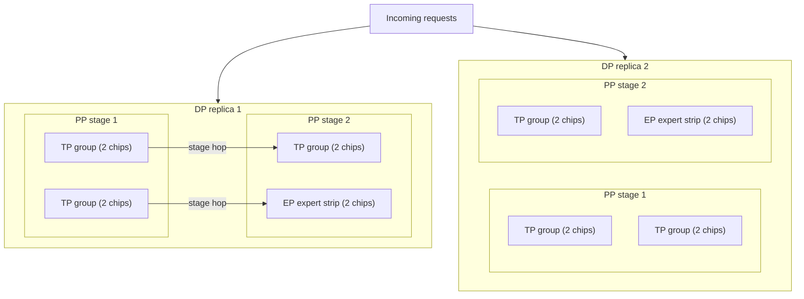

# 10. One model, many chips

> **Part II — Inside the engine** — chapters 5 through 9 worked one chip at a time: batching filled it, paging organized its memory, the prefill/decode split gave each phase a desk, speculation and quantization shrank the byte stream itself. This chapter finally spreads the model across many chips — and meets the trick that lets the biggest models read like small ones.

Chapter 3 closed its lever list with a promise: single-stream speed has exactly two escapes — move fewer bytes per token (chapter 9), or move the same bytes across more chips so the bandwidths add. Chapter 9 delivered the first lever. Here is the second. And it arrives with a second job chapter 4 already queued: real engines shard across GPUs (graphics processing units) — the KV (key-value) cache too — so the one-chip capacity math you have been doing is a ceiling, not a description.

But the honest reason this chapter exists is a pattern you have already met without being told its name. Chapter 9 watched gpt-oss-120b — 117 billion parameters — fit on a single 80 GB GPU and decode briskly. Chapter 4's tables sized DeepSeek-V3's cache as if it were any other giant. Nobody stopped to ask the obvious question: how does a 671-billion-parameter model answer faster per token than a 70-billion-parameter one? The answer is not parallelism. It is a sparse mixture-of-experts, the architecture that splits "how big the model is" from "how much model each token touches" — and once you see it, model listings, fast/mini/lite tiers, and the pricing of frontier models all rearrange into one picture. Sharding and sparsity are this chapter's two halves, and they compose: the biggest engines in production are sparse models spread across hundreds of chips.

## 10.1 Words before machinery

This chapter opens more vocabulary than any chapter since chapter 2, so here is the entrance ramp. Keep it beside you.

| Term | Simple meaning | Everyday picture |
|---|---|---|
| Sharding / parallelism | Spreading one model's work across many chips | One library split across many reading rooms |
| TP — tensor parallelism | Split each layer's weight matrices into slices, one slice per chip | A bookshelf too wide for one wall, split into strips |
| PP — pipeline parallelism | Split the layers into consecutive stages, one stage per chip group | A sandwich passed down an assembly line |
| Stage / microbatch | One PP chunk of layers / one small batch fed to keep all stages busy | Stations on the line; sandwiches kept arriving |
| Bubble | Idle stage time while a lone request crawls the pipeline | The line standing empty between two sandwiches |
| DP — data parallelism | Copy the whole sharded model; each copy serves a different slice of traffic | A second identical branch of the restaurant |
| CP — context parallelism | Split one long sequence across chips | A scroll cut into sections read by several people |
| MoE — mixture-of-experts | Many expert sub-networks; each token uses a few | Specialists on staff; each patient sees a handful |
| Expert / router | One expert feed-forward block / the tiny network picking which experts | A specialist / the referral desk |
| Total vs. active parameters | Capacity you must store vs. parameters each token actually runs | Payroll vs. who's in the building today |
| Shared expert | The always-on expert every token uses alongside its routed picks | The on-staff generalist everyone visits |
| All-to-all | Every chip exchanging slices with every other chip | Every clerk handing parcels to every counter |
| Capacity factor / token drop | Per-expert seating limit; overflow tokens skip the expert | Tables capped; walk-ins turned away |
| Grouped GEMM | One batched matrix multiply per expert over all its landed tokens | Prepping each table's orders in one pan |

Three rows carry the chapter: the TP/PP/DP/CP/EP (expert parallelism) quintet is the vocabulary providers and engines use for *everything*; "total vs. active parameters" is the pair of numbers that prices a modern model; and "all-to-all" is the communication tax that decides whether an MoE fleet is fast or gridlocked.

## 10.2 Why one chip stops being enough

> **ELI5:** A town library grows until no single room can hold the collection. You could store the overflow off-site, but then every request means a van trip. Or you split the shelves across several rooms and keep an index of which room holds what. Now the building's *capacity* is the sum of the rooms — but books only arrive faster in a reader's hands if several librarians fetch in parallel. Splitting storage and splitting speed are two different projects, and both cost coordination.

Start with capacity, because capacity bites first. Chapter 3's arithmetic is the receipt: a 70B dense model in BF16 (bfloat16, the 2-byte-per-number format) is roughly 140 GB of weights — against an H100's 80 GB of memory. The model does not fit. Not "fits awkwardly" — *cannot be resident*, cannot serve a single token. Before any speed discussion, the weights must be cut into pieces that each fit on a chip. That is why every deployment bigger than a laptop model is a sharded deployment; parallelism in production begins as a storage problem.

Then speed, the second lever from chapter 3. Single-stream decode is bandwidth-bound: the floor per token is the byte stream divided by the chip's bandwidth. Split the weight matrix across two chips and each streams half the bytes simultaneously — the two memory systems read in parallel, so the effective bandwidth adds. Work it with chapter 3's own method: 140 GB ÷ 3.35 TB/s ≈ 42 ms per token on one H100 (a ~24 tokens/s ceiling); split across TP = 2 chips, each holds ~70 GB, and the floor drops to 70 ÷ 3.35 ≈ 21 ms — roughly 48 tokens/s (derived arithmetic, same method and haircut caveats as chapter 3). Two chips bought a 2× floor. Four buys 4×, *if* the pieces can be recombined cheaply — and that "if" is the entire subject of 10.3.

The catch is that chips must talk, and talking is not free at token cadence. Every one of the five axes below moves some bytes between GPUs on every step, except one. Hold this taxonomy in mind while reading; it is the decision logic of the whole chapter:

- **TP** communicates *per layer, per token* — the finest, most expensive granularity;
- **PP** communicates *per stage boundary* — once per stage crossing, not per layer;
- **CP** communicates *per attention block* — and only for long sequences;
- **EP** communicates *all-to-all* — every token's hidden state flying to wherever its experts live, twice;
- **DP** communicates *never* (for inference) — each replica serves different requests, nothing to reconcile.

A deployment is written as the product: TP=t × PP=p × EP=e × CP=c × DP=d, across t·p·e·c·d GPUs, with memory capacity per shard equal to total bytes divided by (t·p·e) (Megatron Core parallelism guide, retrieved 2026-08-27). Notice the asymmetry in that formula: every axis but DP buys capacity *and* communication together. DP is the only clean one — more replicas, more aggregate throughput, zero per-token collectives — which is why sizing a fleet is mostly a game of using the sharded axes as little as the memory math allows, then scaling out with DP.

## 10.3 The five axes in plain words

> **ELI5:** One kitchen has outgrown its room, and there are exactly five ways to spread the work. Give every cook a vertical slice of every recipe book (TP). Line cooks up in a row, each doing one step and passing the plate (PP). Open identical branches in different neighborhoods (DP). For a giant banquet order, split the guest list across branches and let them phone each other about cross-references (CP). And hire a roster of specialists, sending each dish only to the two or four cooks who make it (EP). Every real kitchen uses several of these at once, and each one has a coordination bill.

**Tensor parallelism — split the weights.** Cut each layer's weight matrices into `t` slices, one per GPU; attention splits naturally by head (each GPU holds a subset of attention heads plus its slice of the projection weights). A token's partial results are computed on every chip and summed. The summation is the cost: two collective operations per layer per forward pass (an all-reduce in the plain formulation; an all-gather plus a reduce-scatter in the sequence-parallel variant), firing on every layer, every token, forever (Megatron Core docs, retrieved 2026-08-27). Two collectives per layer is fine inside one node, where GPUs share a fast NVLink-class interconnect (NVLink is NVIDIA's chip-to-chip link) — and punishing across nodes, where the collectives ride the network. Hence the deployment rule of thumb: TP is sized to stay within a single node. This is the axis that discharges chapter 2's promissory note — "tensor parallelism splits the weight stream across GPUs so the bandwidths add" — and the worked 2× floor in 10.2 is exactly that mechanism.

**Pipeline parallelism — split the depth.** Arrange the model's layers into `p` contiguous stages, one stage per GPU or node group; a request's hidden states flow stage to stage like a sandwich down a line. The trap is the one in the ELI5 table: a single request in flight leaves every other stage idle — the pipeline *bubble*. The whole GPU count only pays off when many microbatches are in flight simultaneously, which is why PP belongs to the throughput story, not the latency story (a lone token still hops every stage boundary in order). Interleaved "virtual" stages and bidirectional schedules shave the bubble by overlapping one stage's communication with another's compute; DeepSeek's DualPipe is a published bidirectional example (github.com/deepseek-ai/dualpipe, retrieved 2026-08-27).

**Data parallelism — copy the whole thing.** Replicate the entire sharded model `d` times, each replica taking a different slice of incoming traffic. For inference this is the cheap axis — no per-layer communication at all — so you scale it freely once each replica's memory and per-replica latency are acceptable. DP adds aggregate throughput and nothing else: it cannot speed up any single request, ever. When a provider "adds capacity," this is usually the axis being added.

**Context parallelism — split the sequence.** Instead of splitting the batch, the weights, or the depth, shard the *sequence*: each GPU holds a slice of the tokens. Non-attention layers need no change (no token mixes with another there); attention is the problem, because a query on rank 3 must attend to keys and values living on every other rank. The fix is cross-rank KV exchange — all-gather/reduce-scatter pairs wrapped around the attention block in Megatron's CP, or a ring of KV blocks circulating between GPUs in Ring Attention, which stays exact (no approximation) while overlapping communication with compute (Ring Attention, arXiv:2310.01889, 2023; Megatron-LM CP docs, retrieved 2026-08-27). CP earns its keep only when KV-cache size, not weight size, is the binding constraint — Megatron positions it for sequences of 8K+ tokens, and the scaling numbers are impressive: a 1M-token prefill of Llama 3 405B across 128 H100s in 77 seconds at 93% parallelization efficiency, and 128K tokens in 3.8 seconds (arXiv:2411.01783, MLSys 2025). That is chapter 4's promise — "real engines divide KV too" — made mechanical. Chapter 11 owns what long context *costs* you at the contract layer; here you only need the axis's name and its communication shape.

**Expert parallelism — split the specialists.** The MoE axis; the next two sections are its mechanics. For the map: EP spreads a model's many expert feed-forward blocks across GPUs and shuffles each token's hidden state to wherever its chosen experts live — an all-to-all dispatch before the experts, an all-to-all combine after (Megatron Core docs; DeepEP, retrieved 2026-08-27).

Put the five together — one product among many, simplified to its skeleton — and a request's path looks like this:

Each chip holds slices or stages or experts; the request crosses stage hops (PP), collectives fire inside each TP group on every layer, tokens jump to expert strips (EP), and the DP replica beside it serves different traffic entirely. The drawing is anatomy, not a recommendation — real products add CP for long context, more stages, bigger expert strips — but every real deployment is a *product* of exactly such choices, and the product is what providers' capacity announcements are made of.

How do operators actually pick the product? For dense models, the axes trade off as above. For MoE models there is published sizing guidance worth a dated box:

> **Sizing a sparse model (NVIDIA Megatron guidance, retrieved 2026-08-27).** For large MoE models: TP can often stay at 1–2 "because only the active shard matters"; expert parallelism is *the* primary scaling dimension; PP=8–16 across nodes is typical; and expert tensor parallelism is rarely worth its communication. In other words: the MoE axes (EP, PP, DP) do the scaling, and the axis with the nastiest per-layer communication (TP) is kept small.

## 10.4 Mixture-of-experts: buy capacity, pay per read

> **ELI5:** A hospital keeps 256 specialists on staff — the full payroll must be paid whether or not anyone is sick — plus one generalist everyone sees. Each patient walks in, the referral desk reads the chart, and sends them to exactly 8 specialists and the generalist. The building is enormous (that is the memory bill), but any single visit is short: you only ever *see* nine people. The hospital can be ten times the size of a small clinic and still move each patient through faster — because visit time depends on how many people you meet, not how many are on staff.

That is the whole architecture. In a dense transformer, every token passes through every feed-forward block — capacity and per-token compute are the same number. A mixture-of-experts model breaks that identity. Each MoE layer holds a set of expert feed-forward networks plus a tiny router. The router — a linear projection plus a nonlinearity — scores every token against every routed expert, takes the top-k scores, normalizes them into gating weights, and dispatches the token's hidden state to only those k experts; the layer's output is the gating-weighted sum of expert outputs plus, in DeepSeek-style designs, an always-on shared expert riding the residual stream (arXiv:2412.19437, 2024; arXiv:2401.04088, 2024). Sparsity is the mechanism; everything else in this section is bookkeeping and consequences.

The bookkeeping, in a dated snapshot:

> **Three sparse models, mid-2026 spec-sheet view.** Mixtral 8x7B (2024): 46.7B total parameters, ~12.9B active per token, 8 experts per layer with top-2 routing (arXiv:2401.04088, 2024). DeepSeek-V3 (2024): 671B total, 37B active; every MoE layer except the first three carries 256 routed experts plus 1 shared, with 8 routed experts activated per token (arXiv:2412.19437, 2024). gpt-oss-120b (2025): 117B total, 5.1B active; 128 experts, top-4 (arXiv:2508.10925, 2025) — and its sibling gpt-oss-20b: 21B total, 3.6B active, 32 experts, top-4, fitting 16 GB of memory. Model cards occasionally publish different framings of the same machine — Hugging Face describes Mixtral as ~45B total with ~14B "compute" — so when comparing listings, pin down which convention you are reading.

Now the consequence — the chapter's headline arithmetic, and the discharge of chapter 9's "sparsity, chapter 10's half of the story." Decode time at low batch is set by the bytes streamed per token: roughly active parameters × bytes per parameter. Compare, both at BF16: a 70B dense model streams ~140 GB per token; DeepSeek-V3 streams ~74 GB per token — *half* the traffic, from a model with ~10× the total capacity (derived from the parameter counts above, chapter 3's floor logic). Per token, DeepSeek-V3 touches about 37/671 ≈ 5.5% of its parameters; gpt-oss-120b touches 5.1/117 ≈ 4.4% (derived). Fewer active bytes per token means a smaller bandwidth floor, means faster tokens — which is why a 671B-parameter model can, in the decode regime, outrun a 70B dense one. Mistral made the same claim at Mixtral's launch — matches or beats Llama 2 70B on most benchmarks with ~6× faster inference (Mistral announcement, fetched 2026-08-27) — treat the multiplier as the vendor's own comparison, but the mechanism behind it is exactly this arithmetic.

Where the picture stops, briefly: the visit is cheap, but the *building* is huge. Every expert must sit resident in memory whether or not today's traffic touches it — that is the price of sparsity. DeepSeek-V3's 671B parameters demand over a terabyte of weight storage at BF16 — 671 × 2 bytes ≈ 1,342 GB, derived — before the first token is served; a 70B dense model needs 140 GB total. MoE trades per-token bandwidth for aggregate capacity — and since chapter 9 you know the standard compression answer: gpt-oss-120b ships post-trained with MXFP4 (microscaling 4-bit floating point; chapter 9's format) MoE weights precisely so the whole 117B-parameter model fits on a single 80 GB GPU (model card, 2025). Quantization shrinks the building; sparsity shortens the visit; they compose multiplicatively.

And this is the missing half of the fast/mini/lite ladder from chapter 9. A provider's smaller-faster-cheaper tier of a model family is often *two* knobs wearing one name: a precision knob (chapter 9) and a sparsity knob (this chapter). "20b" next to "120b" in the gpt-oss family is not only fewer parameters — it is fewer *experts* (32 vs. 128) with the same top-4 routing, an entirely different working-set profile. When a listing shows you a small active-parameter count at a suspiciously good quality level, you are usually looking at sparsity doing its quiet work.

## 10.5 Serving MoE: the router is a scheduler you don't control

> **ELI5:** A parcel network routes every package to exactly 2 of its 8 warehouses, chosen by a dispatcher who has learned the "affinity" of each package type. Fine — until a flash sale means 80% of parcels want warehouse 3. Its dock jams, trucks queue, and *every* delivery slows down, because the network's clock waits for the slowest warehouse to finish each exchange. Nothing about any single parcel changed; the fleet's balance did.

**The forward pass, mechanically.** Under expert parallelism, experts are sharded across GPUs and nodes. Each MoE layer's forward becomes four steps: (1) compute router decisions locally; (2) all-to-all *dispatch* — send each token's hidden state to the GPUs owning its chosen experts; (3) run a grouped GEMM (general matrix multiply) per expert — one batched multiply over *all* the tokens that landed on that expert, far cheaper than looping; (4) all-to-all *combine* — return each expert's output, multiply by its gating weight, and sum (arXiv:2412.19437, 2024; vLLM expert-parallelism docs, retrieved 2026-08-27). The two all-to-all exchanges dominate the communication bill, which is why DeepSeek open-sourced DeepEP — a library of dispatch/combine kernels with FP8 (8-bit float) transport and deliberately low streaming-multiprocessor occupation, so the exchanges leave room for math (github.com/deepseek-ai/DeepEP, retrieved 2026-08-27).

**The failure mode is imbalance.** The router is a learned function, not a load balancer. If routing collapses onto a few hot experts, their GPUs become stragglers and the all-to-all sync waits on them — the parcel-jam from the ELI5, now in silicon. Every mitigation in the literature is an attack on this one failure. Training-side: auxiliary balance losses (the GShard/Switch lineage, arXiv:2006.16668, 2020; arXiv:2101.03961, 2021), or DeepSeek-V3's aux-loss-free scheme — a per-expert bias added *only to routing scores, never to gating values*, nudged by update speed γ = 0.001 for the first 14.3T training tokens then frozen at 0.0 for the last 500B, plus a tiny sequence-wise balance loss (α = 0.0001) so single sequences don't collapse onto one expert (arXiv:2412.19437, 2024). Serving-side: redundant copies of hot experts, and bigger batches so per-expert token counts average out — chapter 5's batching dial, now doing double duty as a routing smoother.

**The capacity factor, and the silent drop.** Engines also cap each expert's queue:

> **ELI5:** Each warehouse has a seating limit — tables per shift. When a warehouse is full, the overflow parcels are marked "returned to sender's route" and simply skip that warehouse's processing today. No alarm fires. The parcel still completes its journey; it just arrives *less processed*.

The formula is `expert capacity = (tokens per batch ÷ number of experts) × top-k × capacity factor` (GShard/Switch lineage; Switch's experiments ran capacity factors around 1.0–1.25 and treated drops as an acceptable trade-off — arXiv:2101.03961, 2021). A token routed to a full expert is *dropped*: it skips that expert's computation and continues through the residual connection only. The tax is real and it is silent — output quality degrades with no error, no retry signal, no log line you will ever see from an API (application programming interface). From inside the harness, a capacity-driven drop is indistinguishable from a model that simply got worse that hour.

**What production actually looks like.** DeepSeek's published deployment splits prefill and decode with different parallelism plans — chapter 7's "each phase gets its own hardware, replica count, and parallelism plan" made concrete: prefill runs 4-node, 32-GPU expert parallelism *with redundant experts* (~40 experts per GPU, 32 of them redundant) to absorb load imbalance, while decode runs 40 nodes / 160 GPUs. And because decode's per-expert batches are small, most GPU cores would idle waiting — so DeepSeek confines decode computation to 20 streaming multiprocessors per GPU and overlaps communication with math using warp-specialized kernels, 10 for communication and 10 for compute (arXiv:2412.19437 §3.4, 2024). Even the routing is communication-shaped: node-limited routing sends each token to at most 4 nodes, and the paper's own arithmetic works out that if ~3.2 experts are reachable per node, the same communication budget could serve up to ~13 active experts — they chose 8 routed plus 1 shared inside that budget (arXiv:2412.19437 §3.2.2, 2024; the 13-expert figure is the authors' derived ceiling, not a shipped config).

Read that paragraph again with the taxonomy from 10.2 in hand: an MoE fleet is paying TP-style per-token communication (all-to-all), PP-style stage organization (prefill/decode islands), and DP-style replication — all at once, all to keep a sparse model's active shards fed. When the Megatron box in 10.3 said EP is "the primary scaling dimension" for MoE, this is the machinery being scaled.

> **Field note.** A peak-hour mystery from a MoE-backed endpoint we routed to: TPOT (time per output token) medians flat all day, p99 doubling at 14:00 and 21:00, with token counts and prompt lengths unchanged. Queueing math (chapter 5) said admission was fine; the bimodal latency said some requests were waiting on something. The provider's status page stayed green throughout. The leading suspect, by mechanism: hot-expert stragglers under skewed traffic — the parcel jam — plus whatever capacity-factor drops came with it. We moved that workload's hard-deadline jobs to a dense model at peak and kept the MoE for the rest; p99 recovered. One deployment, directional; but the lesson is structural — on a sparse fleet, *your* p99 is a function of *everyone else's* routing.

## 10.6 What you control from the harness

**Stop pricing models by total parameters.** "671B" in a listing is a storage statement, not a latency statement; the per-token cost tracks *active* parameters — and a 5.1B-active model reads like a small model while scoring like a big one. Model selection in the harness should compare measured TTFT (time to first token), TPOT, and price per million tokens, never parameter counts. When you read a model card, extract the two-line spec that actually predicts behavior: *total parameters* (what the operator must house) and *active parameters* (what your token pays). If a listing gives only one number, treat the omission as information.

**Read fast/mini/lite as two knobs, not one.** Chapter 9 taught the precision half; this chapter adds the sparsity half. A family's small tier may be quantized, sparse, or both — and the two trade differently: quantization's bill lands on quality (math and code first), sparsity's bill lands on fleet variance and capacity drops. Your mitigation differs accordingly: eval canaries for the first (chapter 9's Build it), p99-and-retry posture for the second.

**Expect MoE fleets to be throughput-fragile at peak.** The engine's clock waits on its slowest expert exchange; routing imbalance concentrates load in ways your requests cannot see or influence. Practical consequences: schedule hard-deadline work away from peak (the field note's fix), keep multiplicative retry budgets small (chapter 15 owns the machinery), and prefer providers showing you per-request latency distributions rather than fleet averages when you have the choice.

**If you self-host: size memory on total, speed on active.** The two-line spec is also your capacity worksheet. Budget VRAM (GPU memory) for total parameters at your chosen precision — gpt-oss-120b's 117B in MXFP4 needs one 80 GB GPU, gpt-oss-20b's 21B fits 16 GB (model card, 2025) — and budget tokens/s on active parameters via chapter 3's floor arithmetic, then verify. Prefer engines with explicit expert-parallelism modes (vLLM and SGLang ship DeepSeek-style EP; DeepEP-based dispatch underlies several deployments) when batching many concurrent agent sessions: per-session decode speed comes from sparsity, per-node cost-effectiveness from keeping every expert fed across the fleet — which is chapter 5's batching economics wearing expert-shaped goggles.

The lever table, updated:

| Lever you might reach for | Chapter that owns it |
|---|---|
| Longer contexts without quadratic bills (CP's cost story; RULER-style claimed-vs-effective probes from chapter 4) | 11 |
| Grammar-masked decoding (which starves speculation, not experts) | 13 |
| Cache-hit economics for your now-sparsely-served prefixes | 14 |
| Retry/backoff discipline for the p99s this chapter explained | 15 |
| Routing across dense and sparse models per task | 16 |
| Local MoE on a single big GPU (gpt-oss at home) | 18 |

## Where the picture stops

The multi-room library and the specialist hospital carried the chapter; here is where they stop carrying.

**"Many chips" is mostly a capacity story, not a one-stream speed story.** Of the five axes, only TP shortens a single request's weight-stream floor (with CP helping the KV side at long context, and MoE's sparsity shrinking the stream itself). PP adds stage hops a lone request must still pay; DP does nothing whatsoever for any single request. A 64-GPU deployment and a 2-GPU deployment can serve *you* at the same speed — the fleet's size buys throughput and SLO (service-level objective) headroom, not your tokens.

**The specialists are not human specialists.** The hospital ELI5 implies a code expert, a law expert, a poetry expert. Real routers learn opaque affinities over token features; which experts fire is neither interpretable nor stable across versions, and building harness logic on imagined expert semantics ("route legal text to the legal expert") is building on fog. Sparsity is an economics fact, not an ontology.

**The 74-vs-140 GB comparison is a low-batch statement.** It prices the decode regime, where per-token reads dominate. Batch hard enough — chapter 5's dial — and the engine becomes compute-bound, where what sparsity saves is FLOPs (floating-point operations) per token rather than bytes per token, while the all-to-all tax is still paid in full. MoE's advantage never inverts, but its size shrinks exactly when you are batching most aggressively; published per-batch curves, not this chapter's floor math, are the arbiter there.

**The drop is invisible by design.** Capacity-factor token dropping is not an error condition; it is a documented trade-off from the Switch Transformer era, and from a hosted API it produces no signal at all — just slightly worse outputs during the hours your retries were also climbing. You cannot canary it directly; you can only keep an eval canary (chapter 9) fed and treat mystery quality dips during peaks as candidate drops.

**And from a hosted API, the entire topology is undisclosed.** Whether your MoE provider runs TP=1 or 2, how many redundant experts, what capacity factor, which phase runs on which fleet — none of it is in the model card, and all of it can change under an unchanged model name. The contract gives you latency, throughput, and price; the machine beneath is this chapter running in someone else's engine room. Measure what arrives; believe nothing about how.

## Checkpoint

Teach it back — the rest of the book assumes you can read a fleet and a model card on sight.

1. Why does TP=4 across two nodes behave worse than TP=4 within one node, and what does that imply about the order in which you spend the five axes?
2. Work the floor: DeepSeek-V3 at BF16 streams ~74 GB of active weights per token; a 70B dense model streams ~140 GB. Compute both single-stream ceilings on one H100 (3.35 TB/s) and state, in one sentence each, why the 671B model wins and what it pays for the win.
3. Why does pipeline parallelism want many microbatches in flight? Name the idle-time term it is fighting, and one published schedule family that shaves it.
4. A batch carries 4,096 tokens through a 64-expert layer with top-8 routing and capacity factor 1.25. Compute the per-expert capacity and the average demanded slots; what happens to the difference between demand and capacity when routing skews?
5. Your MoE-backed endpoint shows flat median TPOT but a doubling p99 at peak, with unchanged token counts. Give two engine-side mechanisms from this chapter that fit, and one harness-side mitigation for each.
6. Write the two-line spec (total, active parameters) for each model in 10.4's snapshot box from memory, and explain which line sizes VRAM and which prices tokens/s — and why a listing that shows only one of the two is hiding exactly half the machine.

## Build it / Break it / Prove it / See it in the wild

### Build it

Build the sharding worksheet. Pick a model with published total and active parameters (DeepSeek-V3 and both gpt-oss sizes are ideal). Compute weight bytes at BF16 and at one quantized format (chapter 9's byte-per-parameter math), then try products TP × PP × EP that fit your hypothetical nodes (80 GB per GPU, leave a third for KV and workspace — chapter 4's formula). For each product, check: per-shard bytes, which axes communicate per token, and the single-stream floor using *active* parameters. One page, and every "X GPUs serve model Y" announcement you ever read gets fact-checked in minutes.

### Break it

Feel sparsity locally. Run gpt-oss-20b (fits 16 GB; model card, 2025) on any single big GPU or a workstation, and next to it a dense model of similar *active* size. Measure single-stream tokens/s and quality on ten hard tasks. You should observe the chapter's spine at kitchen scale: the sparse 21B-total model behaves like its 3.6B-active engine for speed while punching above its active weight for quality. Then push concurrency up (chapter 5's client as admission controller) and watch what happens to per-request latency as batches grow — your own small demonstration of where the low-batch floor math starts to fade.

### Prove it

On a marketplace with per-host latency data (OpenRouter as of mid-2026), collect measured median TPOT for a sparse model (any DeepSeek or gpt-oss host) and two dense models of similar *total* size, then plot TPOT against total parameters and again against active parameters. The second plot should order; the first should not. That scatter — your own hand-drawn proof that active parameters price decode — is the chapter's entire economic argument in one image.

### See it in the wild

Four artifacts, one hour. The DeepSeek-V3 report's §3.2.2 and §3.4 (arXiv:2412.19437) for node-limited routing and the 20-SM decode engine — the most detailed public account of production MoE serving. The DeepEP repository for what expert dispatch looks like as code. NVIDIA's Megatron parallelism guide for the five-axis vocabulary in vendor form. And the gpt-oss model card (arXiv:2508.10925) for a shipping product where sparsity (top-4 of 128 experts) and quantization (MXFP4) compose on one GPU — chapters 9 and 10, finally holding hands. After that, every "671B" or "1T-scale" headline you read will split automatically into its two numbers: the building, and the visit.
