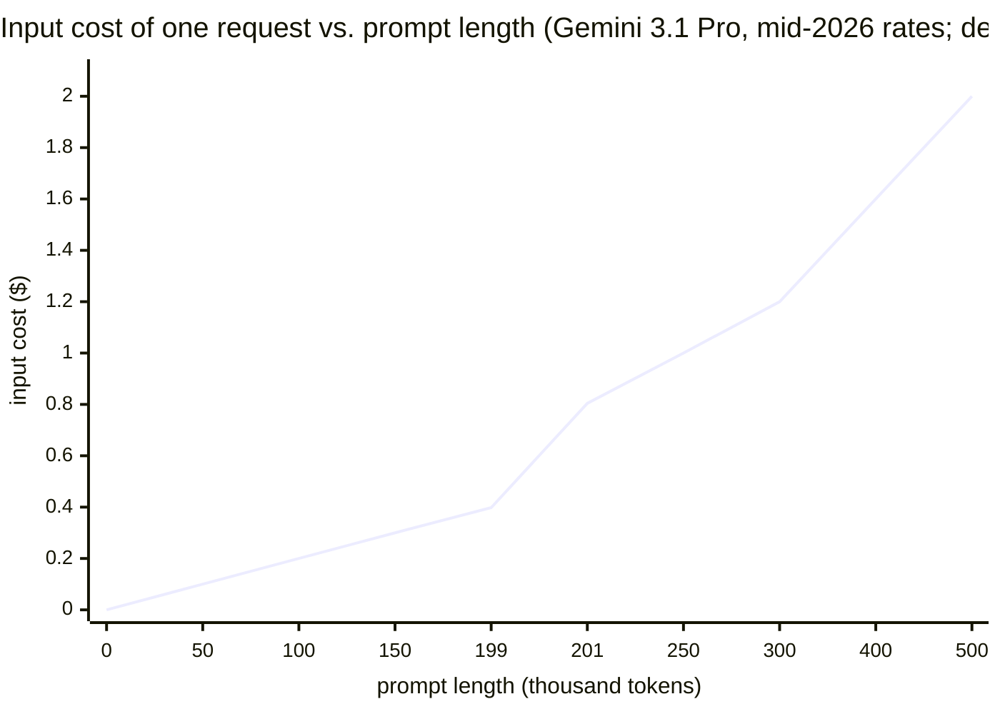
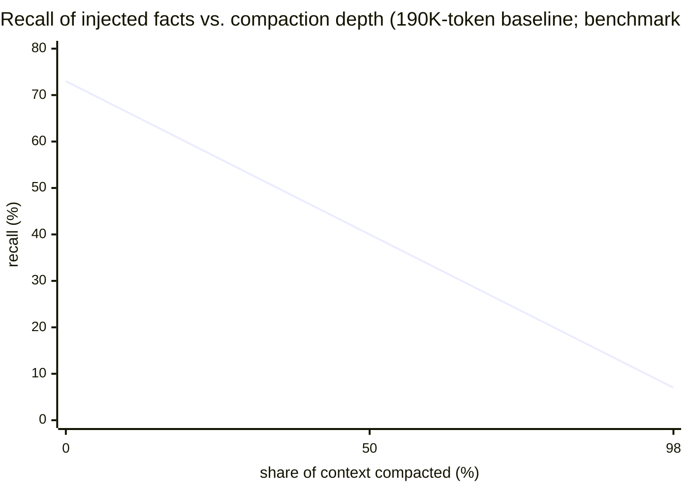
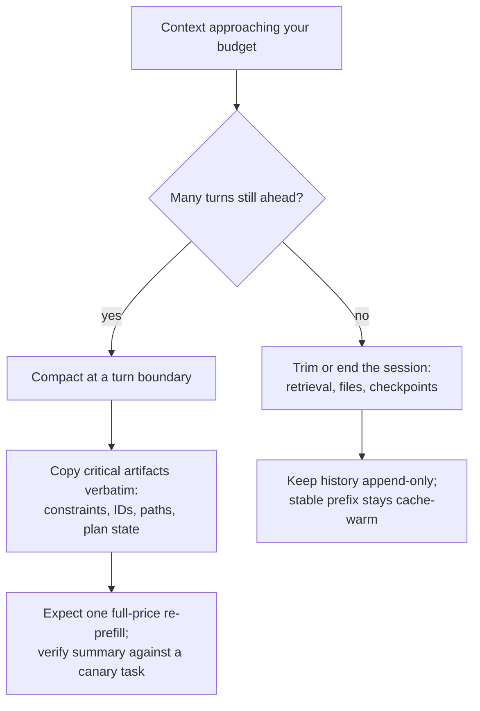

# 11. Long context is a memory product

> **Part II — Inside the engine** — chapters 5 through 10 made one chip and then a fleet of them serve tokens well: batching, paging, phase separation, speculation, quantization, sharding. This chapter turns to the biggest thing a customer ever sends down the pipe — a context of hundreds of thousands, millions of tokens — and asks what it really costs, what the engine does to survive it, and why the window on the model card is a product you buy, not a gift you were given.

The number on the billboard is 10,000,000. A model card advertises a ten-million-token context window; another API accepts 1,048,576 input tokens; a third says "400K." Chapter 3 planted this chapter's thesis and chapter 10 promised it: a context window is sold like a feature and priced like a product. What the brochure never prints is the receipt — quadratic work to enter, a growing tax on every token after, a price step at a boundary the physics never drew, an *effective* window smaller than the claimed one, and, when you finally try to shrink your context, a tradeoff no provider documents at all.

This chapter is that receipt, front and back. Three questions organize it. What does long context cost the engine, mechanically? What does it cost *you*, on the invoice? And what do you actually get — how much of the window can you use, and what happens when you compact what you no longer need?

## 11.1 Words before machinery

The chapter opens a smaller door than chapter 10 did, but the terms are load-bearing. Keep the ramp beside you.

| Term | Simple meaning | Everyday picture |
|---|---|---|
| Claimed context | The longest input the model and serving stack will admit | The seats the stadium says exist |
| Effective context | The longest input at which the model still does the task well | The rows from which you can actually see the stage |
| ISL — input sequence length | Token count of what you send in | Pages in the case file |
| KVSL — KV-cache sequence length | Token count of everything the model has seen so far this request | The file plus every note taken since |
| Tiered pricing | Input price jumps when the prompt crosses a length boundary | The meter jumps when you cross the county line |
| Context parallelism (CP) | Sharding one long sequence across many chips | A case file split among clerks |
| Ring Attention | KV (key-value) blocks circulate chip to chip so every query sees all of them | Binders passed around a circle of clerks |
| Pass-KV / pass-Q | Which tensor circulates: cached keys/values, or the new queries | Send the file to the reader, or the reader to the file |
| Lost in the middle | Facts mid-context are retrieved worse than facts at the ends | You recall a speech's opening and close, not its middle |
| Compaction | Replacing old turns with a model-written summary | Forty transcript pages become one page of minutes |
| Cache invalidation | Any change to history breaks the provider's cached prefix match | Retype one line of the ledger and re-verify the rest |
| Core memory | A small always-in-context block kept verbatim, never summarized | Your wristband of room numbers at a conference |
| Append-only layout | History grows by additions, never rewrites | A logbook: new lines only |

Three rows carry the chapter. "Claimed vs. effective" is the gap between what is sold and what is usable; "tiered pricing" is the market's own confession that cost is not flat in context length; and "compaction vs. cache invalidation" is the trap this chapter exists to defuse — the one place where saving memory costs you both quality *and* money in the same turn.

## 11.2 The cost curve: quadratic to enter, linear to hold

> **ELI5:** A paralegal joins a case holding a one-million-page file. Before the lawyer can say one word, every page must be cross-referenced with every other page — a million handshakes per page. That is prefill. Then, once work begins, every new sentence the lawyer dictates has to be checked against the *entire* file before it can stand. That is decode. The first bill is enormous and paid once; the second is small per sentence but never stops growing.

Chapter 3 derived the shape; here is the machinery behind it, with the two lengths named. Prefill — ingesting your prompt — is quadratic in the ISL: every token attends to every other token, so the attention-score matrix has N² entries per layer, while the dense matrix-multiply part of the model is only linear in N (roughly 2·W FLOPs — floating-point operations — per token for a model with W parameters; MLSys 2025, arXiv:2411.01783). NVIDIA's serving blog gives the pair its standard names: **prefill latency scales quadratically with input sequence length; decode latency scales linearly with KV-cache sequence length** (NVIDIA Technical Blog, retrieved 2026-08-27). ISL is what you send. KVSL is what the model is holding — your prompt plus everything generated since — and every decode step's attention pass walks that whole cache.

Hold the two curves apart, because they bill differently:

- **Entering is quadratic.** A 1M-token prompt is not 8× a 128K prompt. The dense part is 8×; the attention part is 64× (1M/128K = 8, squared). Chapter 3's decomposition — total attention work ≈ c·(N² + N·M + M²/2), with N the prompt and M the generated tokens — has the quadratic prompt term paid once, at TTFT (time to first token).
- **Staying is linear but heavy.** Each new token reads the whole KV cache for its request. Qwen3 8B adds ~144 KiB of KV cache per token in BF16 (bfloat16), so a 128K-token prompt parks roughly 18 GB of cache before one output token exists (Raschka, retrieved 2026-08-27; derived by multiplication) — and chapter 4's single-stream droop (208 → 165 → 101 tokens/s from short context → 32K → 128K) is this curve wearing your throughput.
- **Holding evicts the neighbors.** KV capacity is finite (chapter 4's admission arithmetic). One 18-GB resident cache eats the slots of many ordinary requests; batching capacity shrinks as the longest resident context grows (mechanism derived from the KV-bytes formula — chapter 5's 49-request example runs in reverse). Your million tokens are everyone else's queue.

The long-context decode regime has one silver lining, and chapter 8 left it here: wherever decode streams a huge KV cache, it is bandwidth-bound again, so speculative decoding gets its discount back — MagicDec reported up to 2.51× for Llama-3.1-8B at batch sizes 32–256 on long-sequence tasks, and ~90% token acceptance for self-speculation on a 70B drafter at batch 1 across 4,000–100,000-token contexts (arXiv:2408.11049, 2024). "Speculation follows bandwidth" was the rule; long context is the bandwidth regime that never ends.

None of that engine pain is hidden from you, though. It shows up on the invoice, because providers price it:

> **Dated snapshot — long-context windows and tiers, mid-2026.** OpenAI GPT-5 family: 400,000-token window, but 128K reserved for output, so max input is 272,000 (documented-in-practice gap; forum reports, retrieved 2026-08-27). Anthropic: 1M-token windows on Claude Opus/Sonnet 5-tier models at standard pricing — 4.6+ generations carry no long-context surcharge; older sheets tier by context (e.g. Sonnet 4.5: ≤200K standard vs. separate >200K rates; Anthropic pricing PDF, retrieved 2026-08-27). Google: Gemini 3.1 Pro accepts 1,048,576 input tokens (65,536 output), priced $2/$12 per MTok (million tokens; in/out) for prompts ≤200K and $4/$18 above — input doubles at the boundary (Gemini API docs, retrieved 2026-08-27). Open models: Meta Llama 4 Scout claims 10M tokens; Qwen API tiers claim 1M with ~998K max input. Exact figures move quarterly; the *structure* — a hard admission limit, plus a price step at a length boundary — is the durable fact.

Tiering is per-prompt, not per-marginal-token: cross the line and the whole request reprices. On Gemini 3.1 Pro, a 300K-input request costs 300,000/1M × $4 = $1.20 for input; trimmed to 199K it costs 199,000/1M × $2 ≈ $0.40 — three times cheaper *for a request with 100K more usable room left in the window* (arithmetic derived from the dated rates above). And per section 11.4, the tokens beyond the boundary are also the worst-attended ones. You pay double for the fog.

The cliff at 200K is not physics. It is a pricing decision sitting on top of physics — the quadratic curve underneath justifies a surcharge; the boundary's exact placement is business. Both facts matter to you: the curve says trim; the cliff says trim *before the line*.

## 11.3 Context parallelism: how the engine survives you

> **ELI5:** Eight clerks share the million-page file, one chapter each. To cross-reference, each clerk's chapter is photocopied and the copies travel around the circle of desks until every clerk has seen every page — nothing skipped, nothing summarized, just paper moving. The cross-referencing still happens, all of it; it just happens in eight places at once. Paper-passing is the price of never skipping a page.

Chapter 10 named the axis; this is the contract-layer view of it. **Context parallelism shards the sequence itself**: each GPU (graphics processing unit) holds a slice of the tokens, non-attention layers need no change (no token touches another there), and attention is solved by making the KV blocks travel. Two families do the moving (arXiv:2411.01783, MLSys 2025; arXiv:2405.07719, 2024):

- **Ring Attention.** Each chip holds its query block; KV blocks circulate chip to chip via send/receive, overlapped with compute, until — after d−1 hops, with d chips in the ring — every query has seen every key and value. Exact attention, no approximation (Ring Attention, arXiv:2310.01889, 2023). It struggles when a model has few attention heads to amortize the transfer.
- **DeepSpeed-Ulysses.** Instead of moving the sequence, all-to-all *scatter by attention head*: every chip ends up computing full attention for a handful of heads over the whole sequence. Efficient when heads are plentiful. **USP** (Unified Sequence Parallelism) picks between the two patterns per layer and topology — it shipped as the `long-context-attention` library used by DeepSpeed and Hugging Face.

The million-token inference paper adds a wrinkle worth knowing when you read engine docs: which tensor circulates. **Pass-KV** sends cached keys and values to the queries (favors long prefill); **pass-Q** sends the small set of new queries to wherever KV lives (favors small-batch decode). Both variants are lossless ring forms (arXiv:2411.01783).

What does this buy? The published headline: a 1M-token prefill of Llama 3 405B across 128 H100s on 16 nodes finishes in **77 seconds at 93% parallelization efficiency and 63% FLOPS utilization**; the same machinery does 128K tokens in 3.8 seconds (MLSys 2025). Megatron positions CP for sequences of 8K+ tokens, with dynamic variants that resize the CP degree per microbatch when sequence lengths vary (NVIDIA Megatron docs and blog, retrieved 2026-08-27).

Now the part the model card does not say: **parallelism divides the wall-clock, not the work.** The quadratic term is still quadratic — 128 chips each do a slice of a bill whose total is unchanged, at 63% utilization, for 77 seconds. A roomful of the most expensive silicon on earth, for over a minute, before your agent hears its first token. CP makes long context *servable*; it never makes it *cheap*. Providers know this — it is exactly why the invoice of 11.2 has a surcharge tier. The only real escape from paying quadratic prefill twice is to not recompute it: keep the prefix resident and reuse its KV. That is Mooncake's whole trick — a global KV pool on the cluster's DRAM (dynamic random-access memory) and SSD (solid-state drive), feeding prefill nodes cached prefixes — and it is how Kimi served 75% more requests within SLOs (service-level objectives) under real load (FAST '25; recall chapter 7). On a smaller budget, vLLM's prefix cache (chapter 6) is the same idea without the warehouse: the stable head of your context is prefilled once, not once per turn.

The architectural end of the story is a cautionary tale. Llama 4 Scout's 10M-token claim rests on real machinery — mid-training on long sequences plus iRoPE, interleaved position encodings with attention temperature scaled by sequence length (Meta blog, April 2025). Admission is not recall: independent Fiction.LiveBench-style testing measured roughly **15.6% accuracy at 128K tokens** on Scout, with recall collapsing past ~1M (community/blog-grade evidence, 2026 — hedged as directional). Claimed is what the door accepts. Effective is what the mind holds. That gap is the next section's whole subject.

## 11.4 The window you can use: claimed, effective, positional

> **ELI5:** A concert hall advertises 100,000 seats, and every one of them exists — the fire marshal signed off. But the stage only projects so far. Rows exist; hearing doesn't. "Seating capacity" and "hearing range" are two different numbers, and the ticket site prints only the first.

Chapter 4 introduced RULER's finding with its table of shames (GPT-4 claimed 128K/effective 32K; Yi-34B claimed 200K/effective 16K; LWM claimed 1M/effective <4K; only about half of seventeen ≥32K-claiming models held up at 32K — arXiv:2404.06654, 2024). Here we take the next step, because RULER's headline hides the *mechanism* of the collapse, and the mechanism is what you design against.

**Simple retrieval dies last.** Vanilla needle-in-a-haystack — "find the one buried fact" — scores near-perfectly at lengths where RULER's aggregation and multi-hop tasks have already collapsed. Attention entropy grows with sequence length: with more candidates competing, the model's focus smears, and tasks that require *combining* several pieces fail before tasks that require *finding* one. If your probe is a needle test, your context budget will be sized by a test that flatters it.

**Position is a design variable.** "Lost in the Middle" (arXiv:2307.03172, 2023) measured it: retrieval quality is highest when the relevant information sits at the beginning or the end of the context, and degrades significantly mid-context — an artifact of primacy and recency in pretrained attention. Chapter 4 owed you this beat; here is the design rule it cashes into. Instructions, critical IDs, the plan state: top of the prompt, or dead last — never the middle. The giant blob of retrieved documents? That is exactly what the middle is *for*. Order your context hot–cold–hot: stable system head, cold retrieval bulk, live instructions and latest facts at the tail.

**Effective context is yours to measure.** RULER defines effective length as the longest input where a 13-task average still clears a threshold — but the threshold is a choice, and your tasks are not their 13. The operator's version: build a ten-prompt battery of *your own* retrieval and aggregation work, inject it at 32K, 128K, 200K, 500K, and read the curve. Two budgets fall out — the quality budget (where your score drops) and the price budget (the tier cliff of 11.2, e.g. ≤200K on Gemini-tier models at mid-2026 rates) — and your working context cap is the *smaller* of the two, with overflow routed to external memory: files, a retrieval store, anything but the prompt (harness design in chapter 17).

This is what "context is a memory product" means at the quality layer. You would not fill a warehouse because the landlord quoted its square footage; you fill it to the shelving height your forklift can actually reach.

## 11.5 The compaction tradeoff no provider documents

> **ELI5:** The meeting ran forty pages of transcript. To carry less, you replace it with one page of minutes. The minutes cost almost nothing to carry — but they are not a smaller transcript; they are a *different document*. The action item in page 17's footnote, the room number someone mumbled at the start — gone, unless someone thought to copy them onto the margin. And there is a final insult: the archivist had the old folder memorized for cheap lookups. Swap folders and every future lookup re-reads the new one from scratch, full price.

Sooner or later every long-running agent meets the wall: the transcript grows until it approaches the window, and something must give. The industry's default answer is **compaction** — replace older turns with a model-generated summary — and it is now a platform feature, not just a client trick. Claude Code's auto-compact fires when input tokens approach the effective window (trigger computed as `effectiveContextWindow − autocompactBufferTokens` in its source; a third-party deep-dive reports a ~13K-token buffer — unofficial reverse-engineering, treat as indicative), and its summarization call is engineered nicely: it reuses the existing system prompt, tools, and history with a summarization instruction appended — one request, no tools, reading the warm cache rather than re-processing it (Claude Code docs, retrieved 2026-08-27). Anthropic's Compaction API productizes the pattern: at a configured token threshold it generates a summary, returns a `compaction` block, and automatically drops all content before the compaction point on subsequent requests (Claude Platform docs, retrieved 2026-08-27). LangGraph's session-memory menu lists the same move alongside trim-and-delete: summarize past messages, replace them, thread a running summary forward via its `SummarizationNode` (LangGraph/LangMem docs, retrieved 2026-08-27).

Here is the part nobody puts in the changelog, in three layers.

**Layer one: the money.** Compaction rewrites history. Provider prompt caches match an *exact token prefix* (chapter 6); any mutation — including replacing history with a summary — is a hard semantic break that invalidates all prior cached prefixes and forces a full re-prefill at full input price (Anthropic/OpenAI caching docs, retrieved 2026-08-27). No provider publishes guidance pricing that re-prefill; the tradeoff is documented only in third-party analyses. Work it yourself with chapter 6's multipliers (write 1.25×, read 0.1× on 5-minute caches, mid-2026): a session holding 150K cached tokens re-reads it each turn at ~15K-token-equivalents. Compact to a 30K context — summary plus recent turns — and the next turn re-prefills 30K at full price (2× that turn), but every turn after reads 30K cached (~3K-equivalents, 5× cheaper than before). The money breaks even fast when the context is huge and the session runs on; what it wastes is the summarization call itself plus the premium if the session was about to end anyway (derived arithmetic from the dated multipliers above). Money, though, is the *small* layer.

**Layer two: the information.** The summary is a different document. The lost-in-compaction benchmark (Zenodo, 2026) measured it: baseline recall of injected facts at 190K tokens was **73%**; after 50% compaction, **40%**; after 98% compaction, **7%**. Worse, the things agents live on die first: across tested compactors, **only 17% of injected side constraints survive compaction on average**, and most compactors leave the model *less* compliant than no compaction at all — an extractor module that preserves constraints explicitly (a small model, reported as Qwen3.5-9B) recovers over 90% retention without touching the compactor (arXiv:2608.11242, 2026). Parameters, paths, IDs, formatting rules: exactly the verbatim artifacts a summary is worst at.

**Layer three: the trap composes with caching.** This is chapter 6's paraphrase trap at session scale — and it cuts both ways. If you compact rarely, you keep the cache amortization and pay window pressure; if you compact often, every rewrite is a cache break, and the "text sparsity vs. prompt-cache continuity" tension becomes the dominant term. TokenPilot (arXiv:2606.17016, June 2026) names it exactly — pruning methods cause "prefix mismatches and cache invalidation" — and its cache-aware dual-granularity layout cuts continuous-task-stream inference cost by up to 87% while preserving task performance. The design space between "never rewrite" and "summarize destructively" is real, and it is yours to walk.

So walk it deliberately:

Two disciplines make compaction survivable. **Compact at turn boundaries with a horizon test**, not automatically at the buffer threshold — the platform defaults fire on memory pressure, not on your economics. And **externalize what must survive verbatim**: MemGPT's operating-system trick (arXiv:2310.08560, 2023) keeps a small *core memory* in context — the model itself issues paging operations like `core_memory_replace` and `archival_memory_insert` to manage it, with archival storage in a searchable store outside the window; its successor Letta recommends keeping core memory under 80% of the window. A structured state file serves the same role in a simpler harness: the summary may lie about the room number; the state file cannot, because you wrote it.

## 11.6 What you control from the harness

> **ELI5:** You are packing a moving truck. Heavy furniture that never changes goes in first and gets strapped down — you will not repack it at every stop (stable, cacheable prefix). New boxes are stacked at the rear, in reach (append-only growth). When the truck fills, you do not rearrange everything at a red light; you unload into storage at a planned stop (compaction at a turn boundary), and the valuables ride in the cab with you (core memory, verbatim).

The controls, in the order they pay:

1. **Budget from the smaller window.** Your context cap is min(effective context measured on *your* tasks, price tier boundary, KV admission arithmetic if self-hosting). Never from the claimed window.
2. **Trim before you pay twice.** Trimming under a tier boundary (the 199K move of 11.2) is the only lever that cuts cost and *raises* per-token attention quality at the same time.
3. **Design position deliberately.** Hot–cold–hot layout: stable head, cold bulk in the middle, live instructions and critical facts at the tail.
4. **Grow append-only.** Stable prefix byte-identical every turn (chapter 6); history extends, never rewrites; tools never reordered mid-session.
5. **Compact on economics, not reflex.** Turn boundary + horizon test + verbatim core block + a post-compaction canary task, per 11.5.
6. **Externalize the bulk.** The real escape from the quadratic bill is not paying it: retrieval stores, files, checkpoints — context is the working set, not the archive (chapter 17 builds the full pattern).
7. **Meter the cache fields.** Watch cached-vs-fresh input tokens per turn (chapter 12's usage parsing); a compaction you did not schedule shows up as a cliff in fresh-input tokens.
8. **If you own the engine:** vLLM serves >128K via RoPE (rotary position embedding)-scaling and YaRN (a RoPE-scaling method) for context extension (`--hf-overrides` with rope parameters) and bucketed scheduling for long contexts; day-0 recipes exist for million-token models (vLLM docs and blog, retrieved 2026-08-27). Compose with chapter 4's KV quantization, chapter 6's prefix cache, and chapter 10's CP — and remember 11.3: sharding divides the wait, not the work.

| Lever | Where this chapter | Where the book |
|---|---|---|
| Trim under the tier / budget | 11.2, 11.6 | pricing worksheet in ch14 |
| Stable prefix, append-only | 11.6 | ch6 semantics, ch14 economics |
| Position design (hot–cold–hot) | 11.4 | — |
| Compaction policy + core memory | 11.5 | session rehydration in ch17 |
| External memory / retrieval | 11.6 | full harness pattern in ch17 |
| Speculation at long KVSL | 11.2 (recall) | ch8 |
| CP, KV quant, prefix cache (self-host) | 11.3, 11.6 | ch4, ch6, ch10 |

> **Field note.** Our log-triage agent used to ship the night's raw logs in the prompt — 600K to 800K tokens "because the window said 1M." Symptoms, in order: minutes of TTFT (the quadratic term, on someone's cluster), a 2× input tier we had not budgeted, and answers that quoted the first and last hours of the night faithfully while missing a mid-file stack trace — primacy and recency doing exactly what the literature says. The fix was unglamorous: retrieval over the log store, a fixed summary header, the last hour verbatim, cap at ~180K, one deliberate compaction at the shift boundary with the alert-rules block kept verbatim in a state file. Same model, one-quarter the tokens, and the mid-file stack trace started getting caught — because it was no longer in the middle of anything.

## Where the picture stops

The paralegal, the clerks, the concert hall, and the meeting minutes carried the chapter. Here is where each stops carrying.

**The handshake picture hides whose bill the work lands on.** "A million handshakes before the lawyer speaks" prices *work*, but you do not buy FLOPs — you buy seconds and tokens. Context parallelism spreads the handshakes across 128 chips and the *invoice* still exists: 77 seconds, a roomful of GPUs, a surcharge tier. Parallelism is why the service exists, never why it gets cheap.

**The concert hall implies hearing decays smoothly with distance.** Real decay is positional and task-shaped: the ends attend better than the middle, aggregation collapses before retrieval, and "effective length" depends on a threshold *you* choose on tasks *you* run. There is no single number — yours is measured, not quoted.

**The minutes are not a compressed transcript.** A summary preserves gist and counts; it transforms or destroys exact tokens — IDs, paths, constraints — and it does so silently: 73% → 40% → 7% is a curve you only see if you probe. The model will answer confidently from a summary that lost the room number. Compaction's failure mode is fluent.

**The cache remembers tokens, not meaning.** Chapter 6's waiter recalls faces, not guests: every improvement — paraphrase, reformat, compaction — that makes context *semantically* smaller breaks the *token-exact* cache that made it cheap. The two savings systems (smaller context, cached context) are in direct tension, and only you can price the trade, because no provider ships a worksheet for it.

**The tier cliff is a business line, not a physical one.** Mid-2026, two of the three major providers price a long-context tier — Google at 200K, OpenAI at ≥272K — while Anthropic's current generation ships 1M at standard price, and Gemini's tier reprices the whole prompt; the placement can move, the per-prompt repricing can become marginal-token pricing, the rates will change. The durable facts underneath — quadratic entry, linear holding, positional attention — will not. Design for the physics; re-read the price sheet quarterly.

## Checkpoint

Teach it back — Part III assumes you can read a context window like a bill of materials.

1. Write the two cost terms of a request with prompt N and generation M, name which length each scales with (ISL, KVSL), and state which one a surcharge tier is pricing.
2. Work the cliff: on mid-2026 Gemini 3.1 Pro rates, price a 250K-input request and a 199K-input request (input tokens only). How many times cheaper is the smaller one, and what do the extra 51K tokens buy the big one?
3. A colleague proposes solving long-context cost by "just sharding across more GPUs with CP." Name the number from this chapter that proves the work doesn't shrink, and explain in one sentence what CP does and does not divide.
4. Your retrieval-augmented agent buries the user's current instruction between two 50K-token document dumps. Cite the finding this violates, and give the hot–cold–hot fix.
5. A session holds 150K cached tokens (0.1× reads) and you compact to 30K (one full-price re-prefill). Compute the per-turn cost before, the cost of the compaction turn, and the steady state after. Then name the cost layer this arithmetic *understates*.
6. Why does compaction invalidate a prompt cache even when the summary is "of" the same conversation? What survives compaction better than a summary, with the 17% and >90% numbers to back you?

## Build it / Break it / Prove it / See it in the wild

### Build it

Build the context budget worksheet. For your primary model: write down claimed window, max input vs. max output split, the price-tier boundary and both rates (dated), and your own effective-context measurement from a ten-prompt battery at three lengths. Take the minimum of the three ceilings as your working cap, and add the compaction line: at what turn boundary will you compact, what goes in the verbatim core block, what is the expected re-prefill cost. One page, revisited quarterly; it is the most valuable page in your agent's config.

### Break it

Break your own window. Take any model you use with a claimed ≥128K window. Inject ten synthetic facts (fictional IDs, paths, parameters) into a long context: two near the head, six in the middle, two at the tail. Ask for all ten. Most models you test will find the ends and lose middles — your own lost-in-the-middle plot, and a permanent cure for trusting the claimed number. Then compact that session 50% and re-ask for the ten facts: watch the middle facts and any "constraint" facts die first, exactly on the 73→40 curve's slope.

### Prove it

Prove the cliff and the curve. Send the same task at 199K and 201K input on a tiered provider and diff the invoice — the per-prompt repricing, visible as a doubling that no marginal-token model explains. Separately, on any endpoint you control, measure TTFT at 8K, 32K, 128K, 256K input and plot it: watch the quadratic term take over from the linear one somewhere past 100K. Two plots, one afternoon, and every pricing table you read afterward decodes itself.

### See it in the wild

Four artifacts. The RULER repository (github.com/NVIDIA/RULER) for claimed-vs-effective methodology you can run on your own models. The million-token inference paper (arXiv:2411.01783) for what serving 1M tokens takes in GPUs, seconds, and efficiency — the receipt behind the billboard. The lost-in-compaction benchmark (Zenodo, digital object identifier 10.5281/zenodo.20273814) plus "Lost in Compaction" (arXiv:2608.11242) for the quality curve no provider prints. And Anthropic's Compaction API docs alongside Letta's memory model — the platform feature and the open pattern it grew from, side by side. After that, every "1M context" announcement you read splits into its three numbers: what the door admits, what the mind holds, and what the invoice says.
