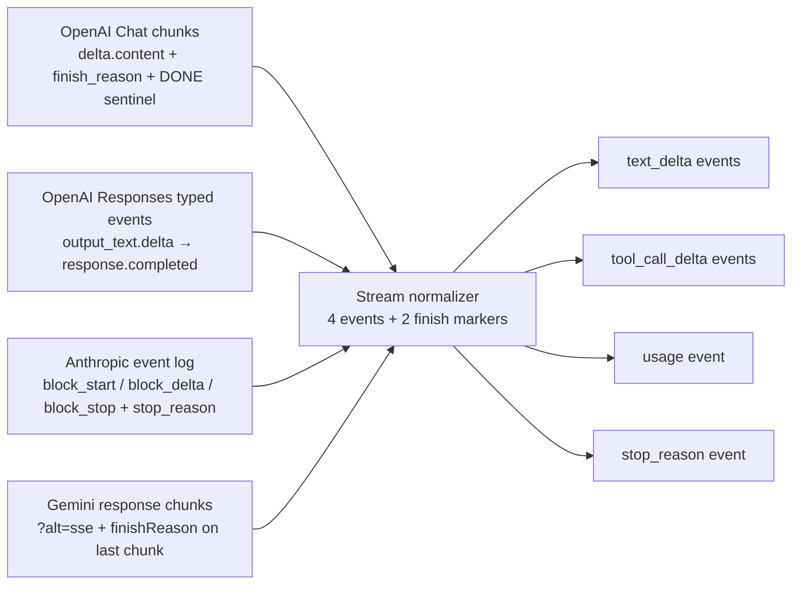
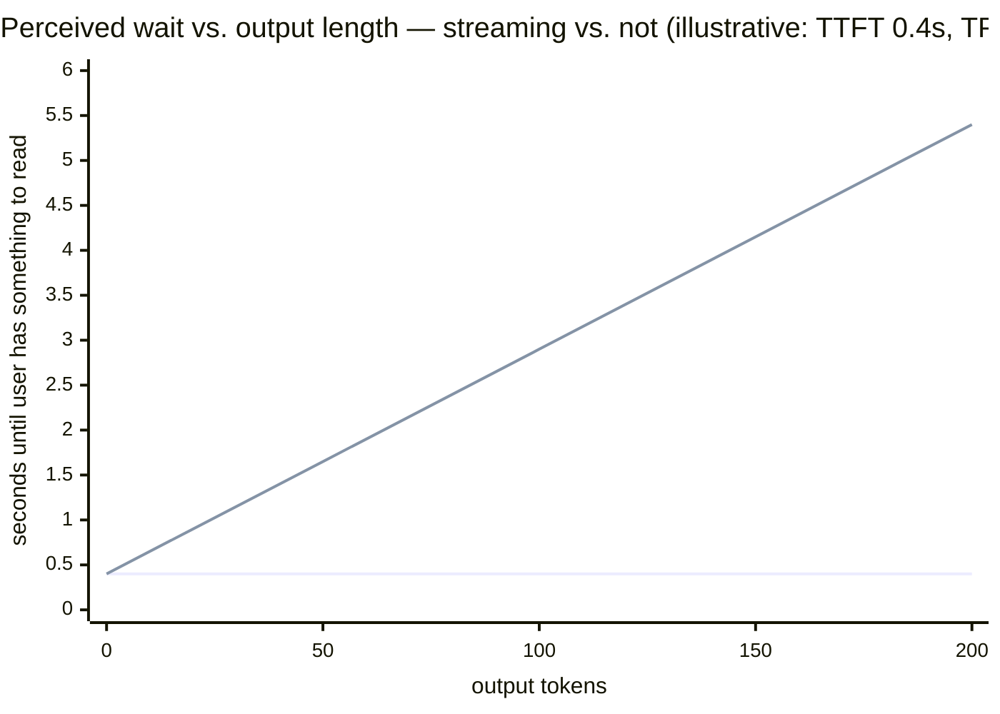

# 12. The streaming contract

> **Part III — The API contract** — Parts I and II went inside the engine; this part is about the paper it signs with your harness.

Every chapter before this one described machinery you cannot see: schedulers, KV (key-value) caches, rooflines, expert routers. From here to chapter 16 the subject is the only layer of the engine you actually touch — the HTTP (hypertext transfer protocol) API (application programming interface) — and it opens with the part of the contract that is least optional and most misunderstood: streaming.

Here is the misunderstanding. Teams treat streaming as a user-interface nicety — "we'll turn it on when the chat window is ready." In practice streaming is the *default mode of operation* for agents, and not streaming is the exceptional case that requires justification. Three reasons, all from earlier chapters. First, agent turns are short and TTFT (time to first token)-dominated (chapter 2's two regimes): the 20-token tool-call turn spends nearly all its wall clock waiting for the first token, and only a stream can show you that first token the moment it exists. Second, the non-streaming request is a timeout trap: OpenAI's and Anthropic's SDK (software development kit) defaults are ten minutes long largely because a request that returns nothing until it returns *everything* gives you no progress signal to hang a deadline on. Third, cancellation barely works without streaming — the server that has nothing to write cannot easily notice that you stopped reading.

This chapter is about what actually travels on the wire: Server-Sent Events and their grammar, the four incompatible dialects the major providers speak on top of that one standard, the fragmented way tool calls arrive, what happens when a stream dies mid-token, and the one normalization layer your harness needs so none of the dialect differences ever reach your agent loop. It ends with the product lesson: the only engine metric your users can feel is TTFT, and the stream is where you measure it.

## 12.1 Words before machinery

| Term | Simple meaning | Everyday picture |
|---|---|---|
| Streaming | The server sends output as it is produced, on a connection held open | Sushi conveyor belt vs. a boxed order you wait for |
| Server-sent events (SSE) | A standard way for a server to push text events over one HTTP response | A fax machine that keeps printing pages |
| Event | One labeled block of the stream, separated by a blank line | One postcard in a sequence |
| Delta | An incremental fragment — a few characters or tokens, not the whole text | One slice of a loaf |
| Chunk | One provider-encoded event carrying one or more deltas | A bag the postcard ships in |
| Sentinel | A literal end-of-stream marker, like `data: [DONE]` | "END OF MESSAGE" stamped on the last telegram line |
| Finish reason / stop reason | The provider's exit code for why generation ended | The check-in desk saying why your flight ended: arrived, cancelled, turned back |
| Keep-alive (`ping`) | A tiny event sent during silence so intermediaries don't kill the connection | A bartender refilling your water so you're not asked to leave |
| WebSocket | A two-way persistent connection, unlike SSE's one-way stream | A phone call vs. a pager |
| Normalizer | One harness component that translates every provider's stream into one internal shape | A mailroom that relabels all envelopes into house format |
| Usage | The provider's own token accounting, delivered on the stream | The receipt that arrives with delivery |
| Tool-call accumulator | The buffer that reassembles fragmented tool arguments into one JSON (JavaScript object notation) object | Collecting all parcels of one order before opening any |

Two terms from chapter 2 ride along all chapter: **TTFT** (time to first token) and **TPOT** (time per output token). If you skipped that chapter: TTFT is send-to-first-delta; TPOT is the average gap between deltas after that.

## 12.2 Four grammars on one wire

> **ELI5:** Imagine three postal companies that all agreed to deliver by motorcycle courier — same road, same engine noise — but each designed its own envelope format. One numbers every envelope and stamps "LAST ONE" on the final envelope. One doesn't number anything but colors each envelope by what's inside. One delivers the whole letter as a single parcel, then texted you separately that it had arrived. The road is the standard. The envelopes are not.

The road is **SSE**: a plain HTTP response with `Content-Type: text/event-stream` that never ends until the server closes it. The spec (WHATWG, the web-standards body) defines the envelope: blocks of field lines — `data:`, `event:`, `id:`, `retry:` — each block ended by a blank line. A provider stream is a sequence of `data: {json}` blocks, one JSON object per block. That is the entire transport.

The first thing that breaks harnesses is the transport's own edge case: the spec allows events that carry only meta-fields — an `id:` or `retry:` line with **no `data:` at all**. A naive parser reads each event and calls a JSON decoder on it; a meta-only event hands the decoder an empty string and it throws. This is not hypothetical: the OpenAI Python SDK's streaming layer crashed with `JSONDecodeError` on empty data payloads before it was hardened (openai-python issue #2722, retrieved 2026-08-27). Your parser must skip what has no payload. The envelope sometimes contains nothing, by design.

The second thing that breaks harnesses is that the three major providers put completely different *grammars* inside those envelopes.

**OpenAI Chat Completions** streams uniform JSON chunks: each carries `choices[].delta`, where `delta.content` holds a text fragment and `delta.role` appears only on the first chunk (omitted or null after that). Termination is a two-step: a final chunk with a `finish_reason` (`stop`, `length`, `tool_calls`, `content_filter`, `function_call`), then the literal sentinel line `data: [DONE]` (OpenAI API reference and streaming guide, retrieved 2026-08-27). OpenAI's newer **Responses API** abandons chunks entirely for typed events — `response.output_item.added`, `response.output_text.delta`, `response.completed` — a different grammar *within the same company*, which is the strongest evidence you'll get that chunk-shaped streaming is one design choice, not a law of nature.

**Anthropic Messages** streams a strictly ordered event log, not fragments of one object: `message_start` (the message shell with initial usage) → per content block `content_block_start` → one or more `content_block_delta` → `content_block_stop` → finally `message_delta` carrying the terminal `stop_reason` (`end_turn`, `max_tokens`, `stop_sequence`, `tool_use`, `pause_turn`, `refusal`, `model_context_window_exceeded`) plus final usage → `message_stop` (Anthropic streaming docs, retrieved 2026-08-27). Delta subtypes include `text_delta`, `input_json_delta` for tool arguments, and thinking/signature deltas for reasoning models. `ping` and `error` events can appear anywhere. Note what Anthropic does not use: a sentinel. The stop reason *is* the end.

**Google Gemini** needs a query parameter to stream at all: `streamGenerateContent?alt=sse` yields SSE-framed chunks of `GenerateContentResponse`; call the same method without `alt=sse` and you get a JSON array back — the stream switch lives in the URL (Google AI API reference, retrieved 2026-08-27). Termination rides on the last chunk's `finishReason` (`STOP`, `MAX_TOKENS`, `SAFETY`, `RECITATION`, and friends) — no sentinel, no separate terminal event.

The diagram is the whole chapter in one picture: four grammars, one normalizer, four streaming events plus two finish-time markers. Section 12.5 builds the normalizer; first you need to know the two places the grammars diverge hardest.

**How streams end.** Sentinel vs finish reason vs stop reason vs finishReason — and the values underneath diverge enough to break schemas. LiteLLM, the open-source proxy, maintains an explicit `map_finish_reason()` layer because providers emit values OpenAI never defined: ZhipuAI's GLM can emit `finish_reason: "network_error"` *mid-stream*, which once raised a Pydantic validation error inside LiteLLM's own stream assembler before unknown values were mapped to a fallback (LiteLLM PR #22673, retrieved 2026-08-27). Read that failure mode carefully: an unmapped enum value in a final event crashed an agent-loop library. Your finish-reason table needs an unknown-value fallback the way your rate-limit code needs a default branch — not because providers are sloppy, but because you cannot enumerate values you haven't seen yet.

**Off the SSE road entirely.** Realtime and speech APIs use stateful **WebSockets** — full duplex, event-driven, bidirectional. OpenAI's Realtime API runs over WebSocket or WebRTC (web real-time communication); Google's Live API is WebSocket-only, accepts raw 16-bit PCM (pulse-code modulation) audio at 16 kHz, returns 24 kHz, and resets the socket roughly every ten minutes, which forces harnesses to implement session resumption as a *feature of the transport* (both provider docs, retrieved 2026-08-27). SSE is one-way and simple; WebSocket is two-way and stateful. Everything in this chapter is about the SSE world your agent loops live in; the realtime world inherits its lessons (event grammars, fragment assembly, resumption) with the addition that *you* now send events too.

> **Dated snapshot — the four SSE grammars, mid-2026.** OpenAI Chat Completions: `data:` chunks, `choices[].delta`, terminate on `finish_reason` + `data: [DONE]`; Responses API: typed events (`response.output_text.delta`, `response.function_call_arguments.delta`, `response.completed`), termination is `response.completed`. Anthropic: ordered event log (`message_start` → `content_block_*` → `message_delta` → `message_stop`), `ping`/`error` anywhere, `stop_reason` in `message_delta`; `pause_turn` means re-send the partial turn to continue. Gemini: `streamGenerateContent?alt=sse` (the parameter is mandatory for SSE framing), `finishReason` on the last chunk. All four verified against provider docs 2026-08-27; all four drift — subscribe to changelogs.

## 12.3 Tool calls arrive in pieces

> **ELI5:** You ordered a bookshelf. It ships in six parcels, each labeled with your order number and "part 3 of 6." You can carry them inside as they arrive, but you cannot assemble anything — you don't even know what part 4 looks like — until the last parcel lands. Opening each parcel and trying to stand it up as furniture would be absurd. Yet that is exactly what a naive agent loop does with streamed tool arguments.

Here is the mechanism. A tool call's arguments are generated token by token like any other text (chapter 8 showed the engine cannot help this — decode is serial). So the API must ship arguments as *fragments of a string*, and your harness must reassemble them. The providers disagree on the packaging:

- **OpenAI Chat Completions** puts tool calls in `choices[].delta.tool_calls[]`. Each entry carries an `index` naming the call slot; the first delta for a call carries `id` and `function.name` once; every later delta carries only `{index, function.arguments: "<fragment>"}`. The stream ends with `finish_reason: "tool_calls"` (OpenAI docs, retrieved 2026-08-27).
- **OpenAI Responses API** makes the same thing typed: `response.output_item.added` opens the call (with `id`, `name`, empty arguments), `response.function_call_arguments.delta` events carry string fragments keyed by `item_id`, `done` events close it.
- **Anthropic** wraps the call in a content block: `content_block_start` announces `type: "tool_use"` with a `toolu_...` id and name; `content_block_delta` events of subtype `input_json_delta` carry `partial_json` — raw string fragments of the serialized input. Anthropic's docs are explicit that only after `content_block_stop` may you parse the accumulated string as JSON, and that current models emit roughly one complete key/value pair per delta, so gaps between deltas are normal, not a stall (retrieved 2026-08-27).
- **Gemini** sidesteps string assembly on the classic surface: `functionCall.args` arrives as a real JSON *object* inside a chunk — nothing to concatenate. The newer streaming surface (`step.start` / `step.delta`) does ship `partial_arguments` the client must aggregate, and the model can signal `MALFORMED_FUNCTION_CALL` when its own call came out invalid (Gemini docs, retrieved 2026-08-27).

Worked example, straight from the wire. Three Chat Completions chunks deliver `function.arguments` values `{"ci`, then `ty": "Por`, then `tland"}`. Concatenated in stream order they yield `{"city": "Portland"}` — one complete JSON object, parseable exactly once, at the end. The lesson generalizes: **never parse per-chunk**. Fragment boundaries can split keys, values, escape sequences, even the bytes of one multi-byte character; the only safe object boundary is the finish event. Your code holds an array of buffers indexed by call slot, appends each fragment, and calls the JSON parser once — at `finish_reason: "tool_calls"`, `content_block_stop`, or the `done` event.

Three edge cases the accumulator must handle by design, not by luck:

1. **Empty arguments.** A no-parameter call may stream the empty string, so the concatenated result is `""`. Parsing that throws; the correct behavior is to coerce `""` to `{}` and execute the call (provider docs, retrieved 2026-08-27). Anthropic can also emit `partial_json: ""` deltas mid-stream — expected, skip them.
2. **Parallel calls.** All three providers can emit several calls per turn — OpenAI Chat by `index`, Responses by `item_id`, Anthropic by block index plus distinct `toolu_` ids. Fragments of different calls do not interleave *within* one index, but indices arrive back-to-back and can mix with text deltas.
3. **Malformed JSON at the finish line.** This is the one agents teams resist: malformed streamed arguments are an *expected* failure mode, not an anomaly. vLLM's OpenAI-compatible server reconstructs tool calls from raw model text via per-model parsers, and its own docs warn that the parsed arguments "may occasionally be malformed or violate the function's parameter schema" (vLLM docs, retrieved 2026-08-27). Hosted providers give you no such warning, but the mechanism is identical underneath — the arguments are tokens the model wrote, and the model can write broken JSON.

The last point dictates your error architecture. A parse failure at the finish line must route to a *retry-with-error tool result* — feed the parse error back to the model as the tool's return value, let it re-emit the call — not an exception that kills the agent loop mid-turn. The accumulator is small, boring, and the single most crash-prone component in an agent harness, because it sits exactly where the model's probabilistic output meets your strict parser.

## 12.4 The dying stream: timeouts, pings, and cancellation

> **ELI5:** You walk out of a restaurant mid-order. The front desk sees you leave — but the kitchen is around a corner, and nobody tells the cook until a runner comes back. The kitchen keeps grilling your steak. Whether you pay depends on the house policy, and the policy isn't posted anywhere.

Cancellation is two conversations on one connection. Your client stops reading, or aborts outright. The server has to *notice*. With SSE, the server is constantly writing events, so a failed write — or the framework's disconnect callback — tells it quickly. But "quickly" has a resolution: vLLM cancels queued requests before execution, while a *running* request is aborted only after the current engine step — the current forward pass — completes. Cancellation is step-granular, not token-granular (vLLM docs and forum, retrieved 2026-08-27). And detection is not guaranteed even at that granularity: with certain middleware configurations, disconnects went unnoticed until the engine tried to produce output, because detection depends on the engine actively polling the request's disconnect flag (vLLM issue #10087, retrieved 2026-08-27).

Without streaming, the story is worse and this is the timeout trap from the chapter opening. A non-streaming server has nothing to write until the end, so disconnect detection is weak and the backend may generate the full `max_tokens` regardless. Anthropic's docs say it outright: the SDKs *require* streaming for large `max_tokens` values "to avoid HTTP timeouts" (retrieved 2026-08-27). The progress signal is not decoration; it is how both sides know the request is still alive.

**Billing follows generation, not delivery.** If the server keeps generating after your abort, the tokens it produced are the tokens you used. Neither OpenAI nor Anthropic publishes an explicit billed-before-abort clause (mid-2026 snapshot), and community threads report being charged for backend-completed generations after a client-side cancel — community reports, unverified, treat as approximate. The safe mental model: aborting the client stops the bleeding *only if the server honors the disconnect*, and the only spend you fully control is `max_tokens` plus your own deadline. Cap both.

Now the defaults, which deserve their own box because they are the quiet budget hazard in every agent loop:

> **Dated snapshot — SDK timeout and retry defaults, mid-2026.** OpenAI SDKs: 10-minute request timeout by default, and they automatically retry a `408 Request Timeout` twice — so one logical request can hang up to ~30 minutes (3 × 10 min, derived) before your code sees an error (flex-processing guide, retrieved 2026-08-27). Anthropic Python SDK: 10-minute overall timeout, 5-second connect timeout, 2 retries with 0.5 s delay growing to an 8 s cap (SDK source `_constants.py`, retrieved 2026-08-27). Google Gemini SDKs: transient errors (429/5xx/timeout) retried up to 4 times, ~1 s initial backoff growing to 60 s max (troubleshooting guide, updated 2026-07-27). Generous defaults are fine for a human poking at a notebook; in an agent loop they are a deadline violation waiting to be scheduled.

The right harness timeout is not one number. Chapter 5 prescribed the shape; streaming makes it enforceable, because now you have events to watch. Two budgets, two clocks: a **tight first-chunk budget** (p99 TTFT plus one backoff's worth of margin — exceeding it means queue or prefill trouble, and retrying is cheaper than waiting), and a **long decode budget** derived from throughput: tokens remaining ÷ observed p50 tokens/s × a safety factor. A single flat "10 minutes" inherits the SDK's generosity and lets one wedged request eat your whole deadline budget.

One more subtlety separates the two clocks: **keep-alives make silence normal.** Reasoning models can go tens of seconds between visible text deltas while they think, and providers bridge that silence with SSE `ping` events so idle proxies don't kill the connection (Anthropic documents its pings explicitly, retrieved 2026-08-27). Pings keep *bytes* flowing while *content* doesn't — which means a byte-idle timeout on your side will never fire during a long thinking stretch, and an aggressive *content*-idle timeout will false-trigger on exactly the requests you care about. Your timeout must be event-aware: count only content deltas against the stall clock, treat pings as proof of life, and let the wall-clock deadline be the thing that finally kills a silent stream.

> **Field note.** A team I worked with ran nightly research agents against a reasoning model. Once or twice a week a job would hang ~30 minutes and then die at the SDK's ten-minute line — three times over, with retries. The client's "stalled stream" detector was byte-idle-based and never fired: pings arrived every few seconds, so the socket looked busy while the model had emitted no text since the first reasoning delta. The fix was two sentences of code — reset the stall timer only on content deltas, and let a 120-second content gap (longer than any healthy thinking stretch we measured) abort — and the wedge disappeared. The stream was talking the whole time. We were listening to the wrong channel.

What survives a kill? More than you'd think, if you plan for it. Anthropic documents capture-and-resume recovery for streams interrupted by network issues: save the partial response, then continue in a new request — for Claude 4.5 and earlier by re-sending the partial as an assistant message, for Claude 4.6 and later via a user-message continuation (streaming docs, retrieved 2026-08-27). A harness that checkpoints accumulated deltas can resume a turn instead of re-paying its prefill — which is also why the accumulator from 12.3 should write to durable storage as it goes, not at the finish line.

## 12.5 The mailroom: one normalizer, one event type

> **ELI5:** An office gets mail from three couriers — four envelope formats between them, since one courier runs two lines. Instead of training every employee to read all four, the mailroom opens everything, discards the envelopes, and puts one standardized slip on each desk: letter, package, invoice, or "note from the boss." Nobody downstream knows or cares which courier delivered it.

The normalizer is a thin component with an unglamorous job: swallow every provider grammar, emit one internal event grammar. The streaming shape needs four members — `text_delta`, `tool_call_delta(callId, fragment)`, `usage(counts)`, `stop_reason(mapped)` — plus two finish-time markers the accumulator emits (the assembled `tool_call`, and `incomplete_call` when arguments do not parse), and the timestamps the next section will need. Everything provider-shaped dies at this boundary.

Two pieces of state do the real work. The **tool-call accumulator** from 12.3, keyed by a provider-agnostic call id (Chat `index`, Responses `item_id`, Anthropic block index + `toolu_` id, Gemini `step.start` id — map them all to your own id at intake). And the **stop-reason state machine**: `tool_calls`/`tool_use` → flush assembled arguments to the executor; `length`/`max_tokens` → flag truncation so the loop knows the answer was cut, not finished; `pause_turn` → re-send the partial turn as-is to continue; safety values → surface distinctly, because retrying a safety stop is a different decision than retrying a timeout. And the fallback row for unknown values, owed to GLM's `network_error`: map to an explicit internal `unknown` and log it, never throw (the LiteLLM lesson from 12.2).

You do not have to build this layer from nothing. LiteLLM converts every provider stream into OpenAI-shaped chunks and maps finish reasons along the way; the Vercel AI SDK defines its own intermediate stream protocol with typed parts that provider adapters target (both documented, retrieved 2026-08-27). DeepSeek even exposes *both* an OpenAI-format and an Anthropic-format endpoint for the same model — the OpenAI shapes have become de facto interchange formats (DeepSeek docs, retrieved 2026-08-27). Using a middleware is reasonable; what is not reasonable is your agent loop parsing four grammars itself, because every provider difference then leaks into every feature you build on top.

**The usage event is the billing interface, and it is where chapter 6 and chapter 11's promissory notes come due.** Both chapters said "watch cached-vs-fresh input tokens per turn; chapter 12 covers parsing." Here is the parsing. The usage object arrives on the stream's final events, and every provider names the same facts differently:

- **OpenAI Chat Completions**: `prompt_tokens`, `completion_tokens`, `total_tokens`, with `prompt_tokens_details.cached_tokens` (and a newer `cache_write_tokens` field) and `completion_tokens_details.reasoning_tokens` (SDK types, retrieved 2026-08-27).
- **OpenAI Responses API**: renames them `input_tokens` / `output_tokens`, same detail objects. Same company, two vocabularies.
- **Anthropic**: `input_tokens`, `output_tokens`, `cache_read_input_tokens`, `cache_creation_input_tokens` (with a 5-minute/1-hour breakdown), and the identity your dashboards can lean on: total input = cache reads + cache writes + fresh input (rate-limits docs, retrieved 2026-08-27).
- **Gemini**: `usageMetadata.promptTokenCount` (which *includes* tokens served from cache), `candidatesTokenCount`, `cachedContentTokenCount`, `thoughtsTokenCount` (API reference, retrieved 2026-08-27).

The normalizer's job is to reduce these to one internal ledger — fresh input, cached input, cache writes, output, with reasoning tracked as its billed sub-count — because the cache-hit-rate collapse that chapter 6 told you to watch for shows up in *these fields*, per turn, and the compaction cliff from chapter 11 shows up as a spike in fresh input here. Two warnings travel with the fields. First, providers bill from their own server-side counts; your client-side token estimates are budgeting aids, never reconciliation (chapter 1's serialize hop said the same). Second, the fields drift silently — OpenAI added cache-write fields beside cached-token fields; Anthropic's Claude 4.7+ tokenizer produces ~30% more tokens for the same text, changing every usage number without any API change (pricing docs, retrieved 2026-08-27). Assert usage invariants in your tests (`total = prompt + completion`, cache reads ≤ input) so drift announces itself in CI (continuous integration) rather than in your invoice.

## 12.6 TTFT is your product metric

> **ELI5:** You press the elevator button. What you care about — the only thing you care about — is how long until the light blinks on. That blink says "heard you; something is coming." How long the ride takes after that is a separate, more forgivable wait.

Everything in this chapter funnels toward one product fact: **TTFT is the metric your users experience as "the model is fast."** Chapter 2 defined it and showed why agent turns are TTFT-dominated; chapters 5 and 7 showed what inflates it (batching interference, queueing, everyone else's prefill). The stream is where it becomes measurable: TTFT is simply the timestamp of your first content delta minus your send timestamp — a client-side measurement you can take on *every* request, hosted or not, because hosted providers expose no TTFT distributions to customers (queue depth, KV occupancy, and latency histograms are engine internals; checked Anthropic and OpenAI docs, 2026-08-27). Timestamp every delta; you already have the instruments.

What TTFT buys, in product terms, is the anchor swap. Without streaming, perceived wait climbs with output length — the user waits TTFT + N × TPOT for anything. With streaming, perceived wait is TTFT and the rest arrives at reading pace.

Streaming doesn't shorten the request — end-to-end time is identical (the same identity from chapter 2) — it moves the user's starting line. That chart is arithmetic on illustrative constants, not a benchmark; the shape is the point.

Three serving facts from earlier chapters now land as TTFT levers. **Prompt caching shrinks TTFT, not decode** — a cache hit skips prefill for the cached prefix, and Anthropic states caching "has no effect on output token generation" (docs, retrieved 2026-08-27); neither OpenAI nor Anthropic publishes a milliseconds-per-hit figure (checked 2026-08-27), and the saving scales with cached-prefix length. **Long prompts dominate TTFT** because prefill is roughly linear in prompt length — your agent's 50K-token history is a TTFT problem before it is a cost problem (chapter 11). **Provider choice is a latency knob** — same weights served six-fold apart in output speed on different stacks (see the snapshot below), which is a serving-stack property that extends to first-token responsiveness; benchmark the endpoint, not the model (chapter 1).

> **Dated snapshot — same weights, different stacks (2026-08-27).** gpt-oss-120b streams at ~3,000 tokens/s on Cerebras vs ~500 tokens/s on Groq — a 6× spread on identical weights (Cerebras docs, Groq catalog, retrieved 2026-08-27). Rankings drift with infrastructure; benchmark the endpoint, not the model.

And the trap, one last time, because it is a *product* trap: for reasoning models, time to first token can mean time to first *reasoning* token. GLM-5.3 spent ≈1.6 s on input, ≈30.1 s emitting reasoning, then ≈7.5 s on the answer (mid-2026 Artificial-Analysis snapshot, quoted in full in chapter 2). A dashboard that measures first-delta-any-kind will report excellent TTFT on requests where the user stared at a spinner for half a minute. Decide which token starts your clock — first reasoning delta or first visible answer delta — and make the choice explicit in the metric's name, because "TTFT" alone will quietly mean different things to different readers of the same dashboard. Then alert on the *percentile* over threshold, the goodput discipline from chapter 5: not "average TTFT is fine," but "what share of turns crossed the line that users feel."

## Where the picture stops

The mailroom analogy says streams are just envelopes in house dress — passive, interchangeable, order-irrelevant once relabeled. Three things break that picture. First, a stream is a **state machine, not a pile**: the fragments are meaningless alone, order is load-bearing (you concatenate in arrival order and cannot reorder), and the finish event is the only permission to parse. Mail can be sorted in any order; deltas cannot. Second, "streaming" suggests smoothness, but **tokens arrive in bursts**: the engine generates one token per iteration step across the whole batch (chapter 5), networks buffer, and providers interleave pings — so per-token smoothness is nobody's guarantee. A stream that pauses 2 seconds mid-answer is normal; your stall detector decides what *abnormal* means. Third, the normalizer's tidy event grammar is an SSE story: **WebSockets carry state the model doesn't fit** — bidirectional sessions, ten-minute resets, resumption tokens — and bolting realtime APIs onto the same event type will fake simplicity that isn't there. The normalizer normalizes grammars; it does not normalize away a connection that can also demand things *from* you mid-stream.

## Checkpoint

1. Why can a naive SSE parser crash on an event the spec explicitly allows?
2. Your accumulator receives fragments `{"ci` / `ty": "Por` / `tland"}` across three chunks. When exactly are you allowed to call the JSON parser, and what do you do if it throws anyway?
3. A no-argument tool call finishes with `arguments: ""`. What must the harness do, and why would throwing here be a design error rather than a bug?
4. Why does a byte-idle stall detector never fire on a reasoning model that has stopped producing text — and what resets the clock instead?
5. One logical request hangs ~30 minutes despite a "10-minute timeout." Reconstruct the arithmetic from the SDK defaults.
6. Your TTFT dashboard shows 1.2 s median on a reasoning model, and users complain it's slow. Name the measurement error before naming the provider.

*(Answers: 1 — meta-only events (`id:`/`retry:`) carry no `data:` payload; decoding empty strings throws, so skip payload-less events. 2 — only at the finish event (`finish_reason: "tool_calls"` / `content_block_stop` / the `done` event); on a parse throw, feed the error back as a retry-with-error tool result, since engines legitimately emit malformed streamed JSON. 3 — coerce `""` to `{}` and execute; the empty string is a documented representation of "no arguments," not corruption. 4 — providers send keep-alive `ping` events during thinking, so bytes keep flowing; only content deltas should reset the stall clock. 5 — 10-minute default × 3 attempts (1 + 2 automatic retries of the 408), per the mid-2026 SDK defaults; the derived ~30 minutes. 6 — you measured time to first token including the first *reasoning* token; the GLM-5.3-style split (1.6 s input / 30.1 s reasoning / 7.5 s answer) means visible-token TTFT is what users feel.)*

## Build it / Break it / Prove it / See it in the wild

### Build it

Build tinyengine's `StreamNormalizer`. Intake: raw SSE lines from any of the four grammars. Output: four streaming events — `text_delta`, `tool_call_delta(callId, fragment)`, `usage(freshIn, cachedIn, cacheWriteIn, out, reasoning)`, `stop_reason(mapped)` — plus the two finish-time markers the accumulator emits (the assembled `tool_call`, and `incomplete_call` when arguments do not parse), each stamped with a receive timestamp, with `ttftSeconds` on the first content delta. Inside: the meta-event skip, a `ToolCallAccumulator` keyed by provider-agnostic call id (Chat `index` → id, Responses `item_id`, Anthropic block index + `toolu_` id, Gemini `step.start` id), a finish-reason mapping table with an explicit `unknown` fallback, first-stop-wins dedup (a repeated finish chunk never re-fires the stop event), and the `""` → `{}` coercion. Roughly 150 lines in any language; it is the most-reused component in the whole book's companion.

### Break it

Break it with recorded streams, replayed and mutilated. Truncate mid-tool-call: no crash, an `incomplete_call` marker instead. Feed a chunk stream where the final `finish_reason` is `"network_error"` (the GLM value): mapped to `unknown`, logged, loop alive. Inject a meta-only SSE event and a `partial_json: ""` delta: both skipped. Deliver an arguments fragment split mid-escape-sequence (`\"Portla` / `nd\"`): reassembly still yields one parseable object, because parsing happens exactly once at the finish. Kill the connection before any finish event: the wall-clock deadline, not the parser, is what fires.

### Prove it

Golden-case tests: the three-chunk Portland assembly; a five-call parallel burst keyed by three different id schemes; the usage-identity assertion (`total = prompt + completion`, cache reads ≤ input) run against captured real responses from each provider you use, so field drift breaks CI and not your invoice. Replay tests: record one real stream per provider (they're just text files of `data:` lines), assert the normalizer's four-event output is byte-identical across library versions. Metric test: feed a synthetic stream with known send/first-delta timestamps and assert the emitted `ttftSeconds`.

### See it in the wild

SSE is the web's quiet standard — browser `EventSource`, every notifications feed, and all three major LLM (large language model) providers riding one transport old enough to predate every one of them. LiteLLM's finish-reason mapping table is a readable catalog of how far providers diverge under one OpenAI-shaped surface. Vercel's AI SDK docs show an entire intermediate stream protocol designed exactly like this chapter's normalizer. Anthropic's console usage page charts cache rate from the same usage fields your `usage` event parses. And if you self-host vLLM, its `/metrics` endpoint publishes `time_to_first_token_seconds` histograms server-side — the same instrument this chapter taught you to build client-side, visible from inside the engine room.
