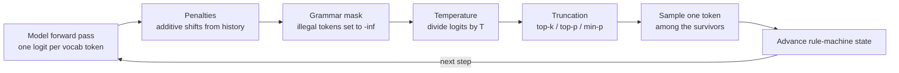

# 13. Structured output is not a prompt trick

> **Part III — The API contract** — chapter 12 normalized the stream; this chapter is about the promise, printed on the contract, that what arrives has a shape.

Every agent you will ever ship has the same moment in it: the model's answer must become a machine's input. A tool-call argument. A routing decision. An extracted field. The moment that happens, someone writes *"Respond only with valid JSON"* into the prompt and hopes. The hope is not free: practitioner reports put prompt-only JSON failure at roughly 1 in 10 requests (single-source estimate, Tanmay Bohra blog, retrieved 2026-08-27) — markdown fences around the payload, a chatty preamble before the first brace, truncation at the token limit, `"age": "thirty"` where the schema said integer. Each failure costs a retry, the retry costs a full generation, and chapter 5 already showed you what retries do to a queue.

The fix is not a better plea. There is machinery — inside the engine, not the prompt — that makes structural validity a guarantee by construction rather than a statistical hope: constrained decoding, which reaches into the engine's word-choosing machinery at every step and crosses out every token the schema cannot accept. That machinery has a history (Outlines made it popular; XGrammar and llguidance made it fast), a provider-facing surface with four genuinely different meanings, and a bill: compute at every token, schema tokens on every request, and — the part nobody advertises — a measurable quality tax when the grammar collides with the way the model wanted to think.

This chapter shows you the mask itself and the arithmetic underneath the guarantee; walks the provider menu — OpenAI strict mode, Anthropic strict tool use, Gemini's silently-forgiving subset, DeepSeek's JSON-only mode — as one name hiding four promises; counts the three taxes; and lands the design rule that falls out of the evidence: constrain the edges of your agent, free the middle.

## 13.1 Words before machinery

| Term | Simple meaning | Everyday picture |
|---|---|---|
| Structured output | Output whose *shape* is guaranteed to match a declared schema | A shipping crate guaranteed to fit the loading dock |
| Schema (JSON Schema) | A machine-readable description of allowed shapes — fields, types, nesting | The engineering drawing a part must match |
| Grammar | Any formal rule set the output must satisfy — schema, regex, EBNF | The rulebook of a board game |
| Constrained / guided decoding | Engine-side enforcement of a grammar during generation | A referee who crosses out illegal moves as you play |
| Logit mask | Setting forbidden tokens' scores to −∞ before the draw | Covering keyboard keys that may not be pressed next |
| Finite-state machine (FSM) | The rule computer for simple grammars; remembers only its current state | A toll booth that only needs to know your lane |
| Pushdown automaton | An FSM plus a stack; needed once brackets nest | The spring-loaded plate stack in a cafeteria |
| Compilation | Turning your schema into mask tables once, before serving | Building the guest list before the party, not at the door |
| Token trie | A prefix tree over the vocabulary that maps grammar rules to legal token ids | The index at the back of the book |
| JSON mode | Provider mode guaranteeing parseable JSON — any shape | Guaranteed a box, not the contents |
| Strict mode | Provider mode enforcing *your* schema at generation time | Certified mail, contents notarized |
| Guarantee tier | How strong a given provider's structured-output promise actually is | Signature-required vs. economy delivery |
| Chain of thought (CoT) | The model's visible reasoning tokens before an answer | Showing your work before the final line |

Two older friends ride along: **JSON** (JavaScript object notation — the nested braces-and-quotes format machines like to parse) and **tokens** (chapter 2's chunks of text, the model's actual output alphabet). One more piece of vocabulary arrives with the machinery itself: a **logit** is the raw score a model gives a vocabulary token at one decoding step — the number the sampler converts into a probability before drawing.

## 13.2 The mask: how a wish becomes arithmetic

> **ELI5:** You're filling a form on a computer, keystroke by keystroke, under a strict proctor. Before each keystroke, the proctor covers the keys that cannot legally come next. Where the form says "age," the letter keys are covered — only digits are exposed. You still choose *which* digit; you can still get the age wrong. But you physically cannot type "thirty." The proctor is the grammar. The covered keys are the logit mask.

Recall the decode loop from chapter 2, because constrained decoding is nothing but one extra hand inserted into it. At every step the model runs a forward pass and emits a raw score for every vocabulary token — for a modern model, on the order of 128,000 numbers. Normally the sampler converts those scores to probabilities and draws one token. Grammar-guided decoding inserts a step in between:

1. The grammar — your JSON schema, regex, or EBNF (extended Backus–Naur form, the classic notation for language rules) — has been compiled into a small rule machine, and the engine tracks its current state after every token emitted so far.
2. For that state, the engine holds the set of token ids that could legally continue the output.
3. Every other logit is set to −∞ before sampling. Temperature, top-p, top-k, min-p — the dials that control how adventurous each word choice is — are the usual sampler knobs; they still apply, but only to the survivors (vLLM applies penalties first, then the grammar mask, then temperature, then truncation; vLLM source, retrieved 2026-08-27).
4. The drawn token advances the rule machine, and the loop repeats.

Because every sampled token was in the legal set, the finished output satisfies the grammar *always* — not with 99.9% confidence, but by construction. No retries, no post-hoc validation of the shape, no "please try again, your JSON had a trailing comma." When vLLM benchmarked the same schema workload on two grammar backends, both scored a **100% correct rate** (vLLM PR #10785, retrieved 2026-08-27) — the guarantee is the easy part. The interesting part of that benchmark is the other column, and we'll get there.

**From schema to mask.** Step 1 hides the genuinely clever engineering. Your schema is a rule over *characters*; the model emits *tokens* — and a single token can be several characters (`{"`, `name`, `":` can each be one token). So the engine first compiles the grammar over characters. Then it intersects that rule set with the tokenizer's entire vocabulary, using a token trie — a prefix tree over the vocabulary. The result is, for each rule-machine state, the exact set of legal token ids (Outlines paper, arXiv:2307.09702; Microsoft's toktrie, retrieved 2026-08-27). Simple grammars (regular expressions) compile to a finite-state machine, which remembers only its current state. JSON nests, so its grammar is context-free — the kind whose rules can nest brackets to any depth, which is exactly why the machine needs a stack — and the machine becomes a pushdown automaton: one push per open bracket, one pop per close.

**The tax that almost killed the idea.** The naive cost is brutal: at every decode step, walk the grammar against (a slice of) a 128,000-token vocabulary, per request. Outlines (dottxt-ai) popularized exactly this FSM approach — model-agnostic, integrated into vLLM, Ollama, llama.cpp, and TGI (text generation inference) (arXiv:2307.09702, retrieved 2026-08-27) — and at serving scale its weakness showed up where every request pays once, up front: **compilation**. vLLM's own benchmark of a JSON-schema workload: with the Outlines backend, **0.22 requests/s, 113 output tokens/s, and a mean time-to-first-token (TTFT) of ≈38.5 seconds** — over half a minute building a per-request FSM over the vocabulary before the first token could move (vLLM pull request #10785, retrieved 2026-08-27). Your guaranteed-valid JSON arrived; your users left.

**The speed lineage.** XGrammar (MLC, November 2024) attacked both costs. Its adaptive token mask precomputes, per grammar rule, which vocabulary tokens are *context-independent* — always or never allowed — so per-step work touches only the small context-dependent remainder; a persistent execution stack means no state is recomputed; and the grammar bookkeeping runs on the CPU (central processing unit) overlapped with the GPU (graphics processing unit) forward pass. The paper claims up to **100× reduction in per-token grammar-processing latency** and up to **80× end-to-end serving speedup** on structured workloads (Llama-3.1, H100 — the authors' own benchmarks, arXiv:2411.15100, retrieved 2026-08-27). An independent lineage — guidance's Rust engine llguidance, built on toktrie — pushes per-token masking to **about 50 microseconds for a 128k vocabulary**, with negligible startup cost, and now powers guidance, llama.cpp, SGLang, vLLM, mistral.rs, onnxruntime-genai, and, improbably, Chromium (guidance-ai/llguidance repo, retrieved 2026-08-27).

The consequence, measured: vLLM merged XGrammar as its default backend in December 2024 (PR #10785), and the same workload moved from 0.22 to **0.94 requests/s** and from 113 to **480 output tokens/s**, with mean TTFT falling from ≈38.5 s to ≈4.55 s (derived: ≈4.3× throughput, ≈4.2× decode speed, ≈8.5× faster first token). Nothing about the model changed. Both backends were 100% correct. The grammar machinery simply got cheaper. A follow-up vLLM engineering post reported up to **5× improvement in time-per-output-token under load** after the switch, and moved mask computation to the scheduler so one batch can mix free-form and guided requests without either paying for the other (vLLM blog, 2025-01-14, retrieved 2026-08-27).

> **Dated snapshot — grammar backends in serving engines, mid-2026.** vLLM: XGrammar is the default for JSON/grammar-guided decoding (since December 2024); supported backends are `xgrammar` and `guidance` (llguidance); the old `guided_*` request fields were removed in v0.12.0 in favor of `StructuredOutputsParams` (json / regex / choice / grammar, mutually exclusive). TensorRT-LLM: XGrammar backend for JSON schema, regex, and EBNF, with an Outlines-based fallback, plus a documented workflow combining guided decoding with speculative decoding. SGLang and llama.cpp: guidance-backed. (vLLM docs and PR #10785; TensorRT-LLM guided-decoding docs; all retrieved 2026-08-27.)

That last line of the box discharges a promissory note from chapter 8, which borrowed this machinery to explain a speculation failure: a drafter that doesn't know the grammar proposes tokens the mask rejects wholesale, so some engines disable or degrade speculation under guided decoding; TensorRT-LLM's overlapped workflow proves the combination is possible without publishing an acceptance number for it. Chapter 8's rule stands: budget un-speculated numbers on JSON-schema endpoints; treat salvaged speculation as upside.

## 13.3 The provider menu: one name, four promises

> **ELI5:** You ship the same teacup through four couriers. One notarizes the contents list and guarantees the list matches the box. One guarantees only that whatever arrives is *in a box*. One reads most of your address but quietly ignores any line it doesn't understand. One guarantees the box, but lets any shape of thing rattle around inside. All four call themselves "structured delivery."

Chapter 1's rule — the model is a file, the *provider* is a different product every time — has no sharper example than this. "Structured outputs" appears on four major provider menus and means four different legal promises. The gradient runs from *syntax guaranteed* to *schema guaranteed at generation time*, and the differences live exactly where a harness gets hurt.

Work one example down the gradient: you need `{"name": <string>, "age": <integer>}` out of the model, every time.

**OpenAI — the notarized crate.** `response_format: {type: "json_schema", strict: true}` (Chat Completions; `text.format` in the Responses API — API meaning application programming interface, the provider's contract surface) turns your schema into a grammar and constrains decoding with it — the same machinery as 13.2, run on their side. The launch announcement reported 100% schema adherence in their tests versus <40% for prompting alone (their own 2024 evaluation, not an independent benchmark — OpenAI announcement, retrieved 2026-08-27). Strict mode's rules are strict indeed: every field must appear in `required` (optional fields are emulated with a union of the type and `null` — `"type": ["integer", "null"]` — *and stay in* `required`); every object needs `additionalProperties: false` (no fields beyond the ones you declared); the root must be an object; and unsupported keywords (`allOf`, `not`, `if`/`then`/`else`, and friends) cause an API error rather than being quietly dropped (OpenAI API docs, retrieved 2026-08-27). Errors, not silence — hold that thought for Gemini. The same `strict: true` exists inside tool definitions, so tool-call *arguments* are schema-guaranteed too. One documented behavior your harness should lean on: **output key order follows schema key order** — the docs say outputs arrive "in the same order as the ordering of keys in the schema." (A community corollary — that `required` must list the first property first — is operational folklore, not in the docs.) A separate, weaker mode — `json_object` — guarantees only parseable JSON, and the docs require the word "json" to appear in the prompt. That is JSON mode, and it is a different tier.

> **Dated snapshot — OpenAI strict-mode schema limits, mid-2026.** Up to 5,000 object properties; up to 10 levels of nesting; ≤120,000 total characters of names/enums/consts; ≤1,000 enum values (single-string enums over 250 values are capped at 15,000 enum characters). Fine-tuned models additionally reject `minLength`/`maxLength`/`pattern`/`format`, numeric bounds, `patternProperties`, and array item-count limits. (OpenAI API docs, retrieved 2026-08-27.)

**Anthropic — the notarized tool envelope.** There is no `json_mode` flag. Guarantees come from two surfaces: strict tool use — `strict: true` on a tool "guarantees schema validation on tool names and inputs" — and JSON outputs via `output_config.format` (grown out of the `structured-outputs-2025-11-13` beta; the beta header is still accepted). The idiomatic extraction pattern is a forced tool call: define a tool whose *input schema* is your target schema, set `tool_choice: {"type": "tool", "name": "extract_person"}`, and the model must emit a tool-use block whose input validates. `tool_choice` has four values — `auto`, `any` (some tool), `tool` (that tool), `none` — plus `disable_parallel_tool_use: true`; `any` lets the model route among extractors while `tool` is the deterministic single-extractor equivalent of OpenAI's strict `response_format` (Anthropic docs and cookbook, retrieved 2026-08-27). Chapter 12 taught you how that tool-use block arrives in fragments; the schema guarantee is about the *reassembled* arguments.

**Gemini — the courier that skips lines.** `responseMimeType: "application/json"` plus `responseSchema` (an OpenAPI 3.0 subset: string, number, integer, boolean, object, array, null). Enforcement happens at generation time — but anything outside the subset is **"ignores unsupported properties"**, per the docs (Google AI docs, retrieved 2026-08-27). Put `minLength` on a field and Gemini will not error and will not enforce; the constraint evaporates. This is the mirror image of OpenAI's loud failure — a *silent* failure — and it changes your obligations: on Gemini, *your* validator is the only detector of unenforced constraints. Ordering is also documented (output follows schema key order), with a wrinkle: Gemini 2.0-era models required an explicit `propertyOrdering` list, while 2.5-series models no longer do. There is also a neat enum-only mode — an enum schema with `responseMimeType: "text/plain"` — documented in Firebase's guide, classification with the JSON wrapping removed.

**DeepSeek — guaranteed a box.** Chat Completions offers `response_format: {type: "json_object"}`: "guarantees the message the model generates is valid JSON" — parseable, any shape. The docs are unusually candid about the failure modes this leaves open: you must include the word "json" in the prompt, you should include a format example (because the *shape* is whatever the example nudges toward — `full_name` this call, `name` the next), and you must set a sensible `max_tokens`, because without one the model "may generate an unending stream of whitespace" until the token limit (DeepSeek API docs, retrieved 2026-08-27). A grammar-of-JSON guarantee with no schema is a strange beast: whitespace forever is, technically, on the path to valid JSON. A third-party guide describes a Responses-style API accepting `text.format` schemas on DeepSeek models — plausible, but not confirmed in DeepSeek's own docs as of 2026-08-27; hedge accordingly.

| Provider | Surface | Enforced | Quietly not | Your mandatory local check |
|---|---|---|---|---|
| OpenAI strict | `json_schema` / `strict: true` tools | Full schema, at generation | Nothing — unsupported keywords *error* | Semantics, values, truncation |
| OpenAI / DeepSeek JSON mode | `json_object` | Parseable JSON only | Shape, field names, types | Full schema validation + retry |
| Anthropic | strict tools; `output_config.format` | Tool name + input schema | Semantics | Semantics, truncation |
| Gemini | `responseSchema` (subset) | The subset, at generation | Everything outside subset | Every keyword the subset lacks |

And the row under the table, the one none of them advertise: **no provider guarantees content past a truncation cutoff.** The grammar guarantees the shape of what was generated; `max_tokens` can stop generation mid-object, and the unclosed brace is not a schema violation — it is a stopped generation (chapter 2's budget arithmetic applies). Set `max_tokens` above your worst-case valid output, always.

## 13.4 The bill: three taxes on every schema

> **ELI5:** Following a rulebook costs you three ways. You carry the rulebook in your luggage on every trip — it weighs the same whether you open it or not. The border guard charges a small toll at every word you speak while following it. And the stenographer bills you by the punctuation mark, for all the commas and brackets you never wanted to say out loud.

**Tax one: the compile toll.** The 38.5-second first token of section 13.2 is the extreme case of a cost every guided request pays at admission: turning *your* schema into mask tables. Modern backends shrink it to "negligible" (llguidance's own claim) — but only for grammars they have seen, while the cache is warm. A harness that sends a slightly different schema on every call — a timestamp in a field name, a dynamically generated enum — recompiles every time and re-pays the toll. The signature metric is distinctive: **flat correctness, spiking time-to-first-token**. Nothing is wrong with the outputs; the queue is eating the compile.

**Tax two: the per-token toll.** Building the legal set each step costs work that, in classical engines, scales linearly with vocabulary size — recent work identifies exactly this as the main throughput limiter for large-vocabulary models (parser-stack classification paper, arXiv:2608.03065, retrieved 2026-08-27) — and token-space-compression work puts it bluntly: current context-free-grammar engines have "intractably high overhead for more complex CFGs — precisely the situation where CFG engines are most useful" (CFG is the bracket-nesting grammar kind from 13.2; arXiv:2605.29986, retrieved 2026-08-27). The 2024–2025 generation of backends buried this for common schemas (the ~50 μs claim, the up-to-5× TPOT-under-load improvement — engine authors' numbers), but the tax returns at the edges: huge vocabularies, deep grammars, engines that didn't get the memo.

**Tax three: the luggage and the punctuation.** This one shows up on your invoice, not your latency dashboard. The schema itself rides in the prompt: one measured tool schema added **≈389 tokens to every request**, and every `Field(description=...)` you write is serialized into the prompt whether or not the model consults it (Dr Pranay Jha, AI Engineering Series, retrieved 2026-08-27; Instructor-course documentation, verified April 2026, retrieved 2026-08-27). On the output side, you pay generation prices for braces, quotes, and key names — pure structure, zero information; JSON's structural tokens measurably inflate payloads versus prose (a tokenizer study documents the effect; exact multipliers unverified — hedged). Run the arithmetic on a loop: a 40-step agent task carrying one 389-token schema pays ≈15,560 input tokens *before any content moves* (derived, illustrative loop length).

Both sides, though, because there is a genuine upside hiding in tax three: the schema is the *most cacheable content you own*. Chapter 6 taught you prefix caching rewards byte-identical prefixes; chapter 12 showed the usage ledger that proves it. Your schema is identical on every call by nature — it is the one prompt component that never drifts — so frozen-schema discipline converts tax three from fresh-input pricing on every request into cached-read pricing after the first. Chapter 14 prices the multipliers; chapter 17 assembles the prefix. The rule for this chapter: **identical schema bytes, every call, frozen at the top of the prompt** — for the engine's grammar cache and the provider's prefix cache alike.

> **Field note.** We once "hardened" a document-extraction service by growing its schema from 6 fields to 31, each with a two-sentence `description` for the model's benefit. Output quality did not move — the descriptions were decoration the model ignored — but input tokens per request grew by roughly the schema's size, and on a self-hosted vLLM endpoint the first-token latency of *cold* requests climbed until the engine's grammar cache warmed. We moved the prose into dev docs, kept bare field names and enums in the hot schema, and re-froze the prefix. The bill went down; extraction quality never noticed. Descriptions are documentation for *humans*; schemas are contracts for *machines* — and you pay token freight for every word of the second kind.

## 13.5 When the grammar fights the model

> **ELI5:** A judge forced to announce "guilty" or "not guilty" *before* hearing any evidence will give worse verdicts than one who may take notes first. Forbidding the notes doesn't make the verdict wrong — it makes it unreasoned. A schema that demands the verdict field first is that judge.

The mask guarantees *shape*. It says nothing about whether the model's best path to an answer survives the constraint — and sometimes it doesn't. The mechanism is section 13.2's diagram run in reverse: masking forbidden tokens to −∞ changes the distribution the sampler sees; the model's preferred continuation — often the beginning of a reasoning chain — may be masked out entirely, and the engine calmly forces the next *legal* token even if the model gave it low probability. Grammar-aligned decoding research names this precisely: constrained decoding as commonly implemented steers generation toward **a different distribution than the model's**, and the proposed fix — reweighting to restore the intended distribution — is computationally expensive and needs many resamples per prompt (NeurIPS 2024, retrieved 2026-08-27). In practice, you live with the distortion or you loosen the grammar.

The measured damage, in order of how much it should scare you:

- **The schema can suppress the thinking.** "Let Me Speak Freely?" (arXiv:2408.02442, retrieved 2026-08-27) measured LLaMA 3 8B on a Last Letter reasoning task: a **38.15-percentage-point performance gap under JSON format with a 0.148% parse-error rate** — the degradation is **behavioral, not a parsing artifact**. The smoking gun: 100% of GPT-3.5 Turbo's JSON-mode responses put the `answer` field before `reason` — remember 13.3, key order is emission order — meaning the schema made the model commit to conclusions before it was allowed to reason. Across reasoning benchmarks the ordering was consistent: JSON-mode (constrained) < format-restricted instructions < natural-language-then-format < free text. Even via OpenAI's structured-output API, natural language beat JSON-schema on 2 of 3 reasoning datasets for GPT-4o-mini. And merely *removing* the specific schema — asking only for generic JSON — improved scores on GSM8K across Claude 3 Haiku, GPT-3.5 Turbo, and LLaMA 3 8B.
- **Some problems are provably out of reach.** CRANE (arXiv:2502.09061, retrieved 2026-08-27) measured strict grammar-constrained generation at **29% versus 38%** for reasoning-augmented constrained decoding on GSM-Symbolic (Qwen2.5-Math-7B-Instruct) — a raw constraint tax of roughly 5–9 points across their setups. The theoretical floor is starker: constant-depth LLMs under restrictive grammars are limited to circuits too shallow for some reasoning problems (the complexity class TC⁰), making certain correct outputs *unreachable in principle*, not merely unlikely. The both-sides twist: unconstrained chain-of-thought matched CRANE's accuracy only at pass@3 (allowed three attempts) with **~4× more generated tokens** — constraint tax and sampling budget trade against each other, and which is cheaper depends on your cost and latency budget.
- **The tax is model- and headroom-dependent, not universal.** "The Hidden Cost of Structure" (RANLP 2025, 11 models, retrieved 2026-08-27) found *base* models often **benefit** from structural constraints while instruction-tuned models are the ones that lose — the tax is a property of the model, not the format. "Capacity, Not Format" (arXiv:2606.09410, 4 models, 5 benchmarks, retrieved 2026-08-27) pushed further: with information-matched prose controls, format cost tracked the model's **spare capacity** — models with headroom absorbed JSON schemas at zero parse failures and little loss; near-capacity models degraded. Read together, the question stops being "is JSON bad?" and becomes "does *this* model, on *this* task, have room left after the grammar?"
- **The extreme case: a legal loop.** When the grammar keeps steering the model back into a state whose only legal continuations are tokens the model heavily disfavors, generation can cycle — a documented vision-model case shows a repetition trap the model never escapes regardless of sampler settings (coles.codes, retrieved 2026-08-27). Valid JSON, structurally perfect, empty of content. This is the pathological form of the distribution mismatch, and no temperature setting saves you.
- **And the twin failure on your side of the API.** The same paper's appendix graded identical GPT-3.5 Turbo GSM8K outputs with a strict regex and an LLM-based parser: **43.7% versus 75.5%** — a 31.8-point gap created purely by validation strictness. The constraint — this time *yours*, in the grader — destroyed a third of the usable signal. A too-tight validator is a grammar you didn't know you were enforcing.

Balance, as always: the tax is concentrated, not general. On classification and extraction tasks, JSON mode was often competitive with or better than free text in the same measurements — for a routing decision or a field extraction, forcing the shape seems to cost little and buys format consistency plus a guaranteed parse. The evidence-backed split: **reasoning-heavy steps are taxed; extraction and classification steps mostly aren't.** That split is the design rule.

## 13.6 The harness rules: constrain the edges, free the middle

> **ELI5:** Garden irrigation done well standardizes the *fittings* — every tap and sprinkler snaps to the same threads, any brand, any pipe. Between the fittings, the water takes whatever path the garden needs. Standardize the joints; leave the middle free.

An agent loop has edges and a middle. The edges are the places where model output becomes machine input — tool-call arguments, routing decisions, field extraction, structured state updates. The middle is everything the model does to decide what those edges should say. The grammar belongs at the edges; the middle wants to breathe. Eight rules fall out of everything above:

1. **Encode guarantee tiers in config, not vibes.** "This provider has structured outputs" is not a boolean. OpenAI strict and Anthropic strict-tool are full schema enforcement; Gemini is subset enforcement with silent holes; JSON modes are syntax-only. Your harness config should carry a per-provider, per-endpoint tier, and every tier below full enforcement gets a local validator plus a retry-with-error-feedback path — mandatory on Gemini (your validator is the only thing that will ever notice the ignored keyword) and on any JSON-mode-only endpoint (shape drift is a documented property, not an anomaly).
2. **Constrain the edges; free the middle.** Extraction and classification steps: strict schema, always — the tax there is small or absent and the parse is guaranteed. Reasoning steps: free text, or reason-then-constrain — a schema whose *free-form reasoning field comes first* and whose committed answer field comes last. Key order is emission order (OpenAI and Gemini both document it); order your fields so the model may think before it must commit. `reason` before `answer`, never the reverse.
3. **Validate tolerantly.** A strict grader cost 31.8 points of real signal in the wrong hands. Parse with a real JSON parser, accept whitespace and key-order variation where the tier permits it, and never validate with a regex that is stricter than your actual downstream needs.
4. **Keep hot-path schemas minimal.** Every `Field(description=...)` is per-request input freight — ≈389 tokens for one measured tool schema. Bare field names and enums in the hot path; prose explanations in developer documentation; the model does not need to be told what `zip_code` means.
5. **Freeze schema bytes.** Identical schema text, top of the prompt, every call: the engine's grammar cache stays warm (no compile toll), the provider's prefix cache stays hit (tax three drops to cached-read pricing), and chapter 17 has less nondeterminism to strip. A schema that changes per request pays every tax twice.
6. **Set `max_tokens` above the worst-case valid output.** The grammar guarantees shape only up to where generation stops; a mid-object cutoff is not a schema violation, it is a stopped generation — and on JSON-mode endpoints the documented alternative is worse: an unending whitespace stream billing you all the way to the limit.
7. **Watch two canaries.** On guided endpoints, watch time-to-first-token at flat correctness — that signature is the compile toll or an engine cache gone cold. On constrained steps, watch a small quality canary against free-text generation on the same inputs — a widening gap means the grammar is fighting the model, and the model is losing.
8. **Do not budget speculative gains on schema endpoints.** Chapter 8's rule, restated as a config default: assume speculation contributes nothing on guided requests; whatever the engine salvages is upside, not plan.

| Lever | Where this book owns it |
|---|---|
| Sampler knobs the mask composes with (temperature, top-p, min-p) | Not owned elsewhere — glossed in §13.2 |
| Speculative decoding vs. the grammar mask | Chapter 8 |
| Tool-call fragments and parse-exactly-once at the finish | Chapter 12 |
| What cached schema bytes cost after the first request | Chapter 14 |
| Retry/backoff machinery for the validator's failure path | Chapter 15 |
| Routing by guarantee tier as a provider-selection criterion | Chapter 16 |
| Frozen-prefix assembly, session-wide | Chapter 17 |

The chapter's one-sentence summary, worth pinning above your desk: **a schema is a contract the engine enforces token by token — so spend it where structure is the product, never where thinking is.**

## Where the picture stops

The proctor-with-covered-keys picture gets you the mask, and then breaks four ways. First, the proctor seems to carry one fixed list of covered keys; a real grammar's list is *recomputed every token* from the entire output so far, and its price depends on who compiled it — the same schema is a 50-microsecond formality on one engine and a 38-second admission stall on another. The keyboard picture makes the cost invisible. Second, the proctor guarantees you cannot *write* an illegal form — which quietly implies you cannot write a *wrong* one. Not so: 100% schema adherence coexists happily with well-typed nonsense, and — flipped around — a validator stricter than the grammar can fail valid answers. Spelling was never truth. Third, the delivery menu suggests the four couriers differ in quality; they differ in *legal terms* — silently ignoring a keyword is not worse than erroring on it, it is a different contract your harness must read, and "structured outputs" as a phrase tells you none of it. Fourth, none of the pictures include a clock: every guarantee here ends at the last token you paid for, and a truncated generation is grammatically innocent and structurally broken at the same time.

## Checkpoint

1. Why does grammar-constrained output need no retries — what makes validity "by construction" rather than statistical?
2. Same engine, same schema workload, same 100% correctness: 0.22 → 0.94 requests/s and mean first-token 38.5 s → ≈4.5 s when the grammar backend changed. What got faster — the model, the scheduler, or the grammar machinery? How do you know?
3. In OpenAI strict mode, how do you make an `age` field optional?
4. Your extraction schema lists `verdict` before `explanation`, and quality drops. Use two documented facts from this chapter to explain the mechanism.
5. You send Gemini a schema using `minLength` and a `pattern`. What happens, and what is the only component in your stack that will ever notice?
6. A guided endpoint starts emitting valid output but repeats the same legal token forever, regardless of temperature. Name the failure mode and one fix that preserves the schema guarantee.

*(Answers: 1 — illegal logits are set to −∞ before sampling, so a violating token can never be drawn; the output satisfies the grammar at every step, not with high probability. 2 — the grammar machinery: compilation cost and per-step masking; nothing about the model or batching changed, and correctness was already 100% on both sides. 3 — `"type": ["integer", "null"]`, and the field stays in `required` — strict mode requires every field, so optional is emulated with a null union. 4 — key order is emission order (documented), so the verdict is generated before the explanation; and the measured effect is the schema suppressing chain-of-thought (the 38.15-point Last Letter gap at a 0.148% parse-error rate). Reorder: reasoning field first, answer last. 5 — Gemini silently ignores unsupported subset properties (documented); your local validator is the only detector — which is why the guarantee-tier config mandates one. 6 — the repetition trap: distribution mismatch under a tight grammar, where every legal continuation is one the model disfavors. Loosen the grammar — reason-then-constrain, a free reasoning field before the constrained answer — rather than fighting the sampler.)*

## Build it / Break it / Prove it / See it in the wild

### Build it

Build a `SchemaGuard` for your harness — the one Part III instrument this book's companion leaves to you, because your schemas are yours; what ships of this chapter is the guarantee-tier ladder itself, which chapter 16's router carries as routing data. Intake: a task step tagged `extraction`, `classification`, or `reasoning`, plus the provider from chapter 16's routing table. Contents: a per-provider guarantee-tier table (strict / strict-tool / subset / json-only) with the validator-and-retry path wired for every tier below full enforcement — the retry feeds the validation error back as an assistant-visible correction, one attempt, then a structured failure event, never a silent loop; a schema serializer emitting *canonical bytes* (stable key order, reasoning fields before answer fields, no descriptions — those live in dev docs); and a `max_tokens` setter deriving the ceiling from the worst-case tokenized valid instance of the schema, not from habit. Roughly 120 lines; it completes the Part III contract trio — stream normalizer (chapter 12), schema guard (this chapter), and next, the cache ledger.

### Break it

Break it with adversarial schemas. Flip a working extraction schema to answer-first and watch a held-out accuracy set sag — flip it back and prove order is the variable. Send Gemini a schema studded with subset-unsupported keywords (`minLength`, `pattern`) and verify your validator — not the provider — catches the unenforced fields. Set `max_tokens` exactly at the observed valid-output length and force the mid-object truncation path: a `length` stop with a structured incomplete marker, not a parse crash. On a JSON-mode endpoint, drop the ceiling entirely and meet the documented whitespace stream. Reorder one field name by one character between calls and prove both taxes respond — the engine's grammar cache misses, and the provider's prefix cache breaks (chapter 6's hash chain remembers).

### Prove it

Golden-set tests: N extraction samples per provider, asserting 100% structural validity on strict tiers and ≥ target validity *after local validation* on weak tiers — with the delta reported, because that delta is your tier's honesty. The ordering experiment as a regression test: same inputs, two key orders, assert reasoning-first wins or ties. TTFT regression on any self-hosted guided endpoint: cold- versus warm-cache first-token latency, alerting on the compile-toll signature. And once, run your strictest validator and a tolerant parser over the same captured outputs and measure the gap — if it approaches 31.8 points, your validator, not your model, is the story.

### See it in the wild

Outlines' paper is the readable origin of FSM-guided generation; XGrammar's is the engineering turnaround story, and vLLM's PR #10785 benchmark table — 0.22 versus 0.94 requests/s at identical correctness — is the whole compile-tax argument in four numbers. The llguidance repository documents the ~50-microsecond masking lineage and its improbable residency inside Chromium. On the provider side, OpenAI's structured-outputs guide is the strictest contract in the wild, and Gemini's "ignores unsupported properties" line — one sentence in their docs — is the most expensive sentence in this chapter if you skip it. "Let Me Speak Freely?" is the paper to hand anyone who believes structure is free; the answer-before-reason finding does more for schema design hygiene than any style guide. And every JSON-parsing retry loop you have ever written was a constraint solver running in the wrong place — you had a grammar, and you were enforcing it with wishes.
