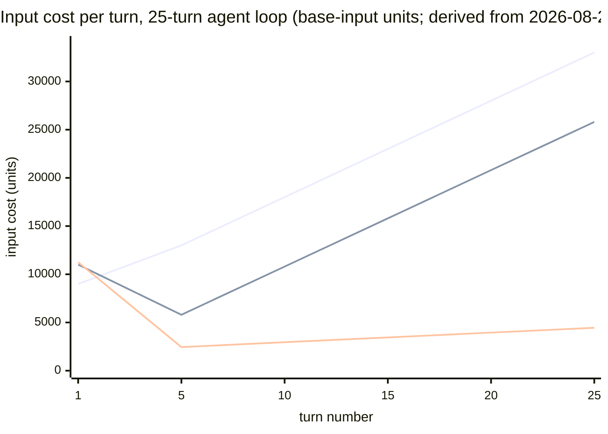
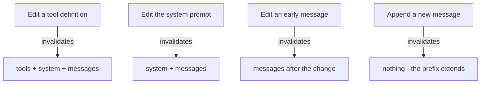

# 14. The cache that pays your bill

> **Part III — The API contract** — chapter 13 guaranteed the shape of what comes out; this chapter prices the shape of what goes in. The same tokens, ordered differently, can cost ten times less.

Chapter 7 ended with the biggest lever an agent harness owns: if your prompts repeat — same system prompt, same tools, growing transcript — don't pay for the prefill at all. Chapter 6 showed you the machine that makes that possible: the engine stores the KV (key-value) state of a prompt's opening tokens — the model's memory of having already read them, chapter 4's per-request notes — and the next request whose opening bytes match exactly skips the compute. This chapter is about the money. Every provider sells that stored state back to you at a price, four different contracts for the same physics, and the arithmetic turns out to be the single largest controllable line item on an agent's bill — larger, in loop-shaped workloads, than which model you picked.

The stakes are easy to underestimate because the discount arrives quietly. A cache read is billed at a tenth or less of fresh input price on every major provider's current rows (mid-2026 snapshot). The failure is just as quiet. One timestamp injected into your system prompt, one tool list reordered by a serializer, one model switch mid-session — and the tokens you were reading at 0.1× revert to full price, with a surcharge on top, for every request after the change. Chapter 1 promised this chapter would explain how a timestamp quietly costs you a full-price recompute; here is the whole mechanism, the four contracts, the arithmetic, and the prefix-design discipline that keeps the discount alive.

## 14.1 Words before machinery

| Term | Simple meaning | Everyday picture |
|---|---|---|
| Prompt prefix | Everything from the request's first token up to some boundary | A form letter's letterhead |
| Cache write | The first request that computes and stores a prefix's state | Paying the engraver to cut a printing plate |
| Cache read (hit) | A later request that reuses stored state instead of recomputing | Printing from the plate |
| Cache miss / invalidation | The first differing byte ends reuse for everything after it | One changed word re-inks the rest of the page |
| Breakpoint | An explicit marker saying "cache up to here" | The fold line on a letter |
| TTL (time to live) | How long a stored prefix survives, and when that clock resets | Milk's sell-by date, pushed back each time you open the carton |
| Write premium / read discount | The extra price to create an entry; the reduced price to reuse it | Club enrollment fee vs. member pricing |
| Implicit caching | The provider caches automatically; you change nothing | Tipping included in the bill |
| Explicit caching | You mark the boundaries and pay listed prices | An itemized, signed receipt |
| Minimum cacheable length | Prefixes shorter than this never enter the cache | The deli's ten-slice minimum |
| Hit rate | The share of input tokens served from cache | The share of a form letter already on the printing plate |
| Keep-alive | A cheap request whose only job is to refresh the TTL | Swiping your hotel keycard so it stays active |
| Cache salt | A value mixed into the identity the provider fingerprints your prefix into, to keep tenants apart | A safe-deposit box that needs your key *and* the bank's |

Three old friends ride along: **tokens** (chapter 2's units of text and of billing), the **KV cache** (chapter 4's per-request memory), and **prefix caching** as an engine mechanism (chapter 6's hash chain and block tables). This chapter stays above the engine: from here on, the cache is something you *buy*, not something you build.

## 14.2 One mechanism, four contracts

> **ELI5:** Four warehouse clubs rent out the same kind of shelf. One charges you a fee to place each pallet, then lets you take from it nearly free for the next hour. One places pallets for free whenever it notices you ship the same goods — but may quietly lose them on a busy day. One offers a shelf you rent by the hour, pallet included, for as long as you keep paying. And one just keeps everything you ever shipped on disk and charges you almost nothing to reuse it. Same shelves, same forklifts — four different membership agreements.

Underneath every provider's marketing is the mechanism from chapter 6, wearing a price tag. The provider hashes the token prefix of your request from position zero — takes a fingerprint of the opening bytes, one number that matches only exactly those tokens. If an identical prefix's KV state is *resident* (a stored copy still live — within its time-to-live, or explicitly pinned, held by your request rather than left to the clock), the engine skips prefill for that span and bills it at the cached rate. None of the four does semantic matching; the match is byte-exact or it is nothing (chapter 6's warning about "semantic caching" and its quality risk stands).

The contracts differ on four axes: whether you opt in, how long entries live, what a write costs, and whether a hit is guaranteed. All prices below are multipliers of the model's base input price, from the providers' own docs (retrieved 2026-08-27).

**Anthropic: explicit, priced, and predictable.** You opt in with `cache_control` markers — up to **4 breakpoints** per request, where an automatic breakpoint consumes one of the four and a fifth returns a 400 error. A write costs **1.25×** base input (5-minute TTL) or **2×** (1-hour); a read costs **0.1×**. Each breakpoint can look back up to **20 blocks** — blocks here are Anthropic's *content* blocks (a message or tool result), not chapter 6's 16-token pages — to find a matching cached prefix. Minimum cacheable prefix is per-model — 512 tokens on the newest Opus-class models, 1,024 on Sonnet-class, up to 4,096 on Haiku 4.5 and older Opus rows (Opus/Sonnet/Haiku are Anthropic's large/mid/small model tiers); shorter prefixes are processed uncached with no error. The 5-minute clock starts at *request start* — a 4-minute streamed response leaves about 1 minute to start the follow-up — and every hit refreshes the clock for free. The 1-hour entries must precede 5-minute ones in your request.

**OpenAI: automatic by default, best-effort by admission.** No opt-in, no markers (explicit breakpoints exist only on the newest generation). The minimum is **1,024 visible tokens** on GPT-5.6-and-later, **2,048** on older models, with hidden system tokens — tokens the provider injects on your behalf, tool schemas and the like — not counted. The newest models mirror Anthropic's economics — reads at **0.1×**, writes at **1.25×**, reported as `cache_write_tokens` — while older models charge model-dependent read discounts ("up to 90% off"; GPT-4o launched at a flat 50% in October 2024) with **no write charge**. Entries last **at least 30 minutes** after last use, and reuse refreshes the lifetime at no extra fee. The honest part of the docs: caching is best-effort. Traffic above roughly **15 requests per minute** per organization can overflow-route to machines that don't hold your cached state — a silent miss. A `prompt_cache_key` parameter groups routing so related traffic lands on the same machines.

**Gemini: two caches in one API (application programming interface).** *Implicit* caching is automatic on Gemini 2.5-and-later, gated by minimum prefix length — 2,048 tokens on 2.5 Pro/Flash, 4,096 on the 3.x family — with hits billed at **10% of input price** and, notably, "no cost-saving guarantee." *Explicit* context caching is a different object entirely: you create a cache with a TTL (default 1 hour, updatable), and you pay **storage by the token-hour** — $4.50 per million tokens per hour for Pro-class models in the mid-2026 snapshot — plus the discounted read rate per request. A docs guideline that a cache pays for itself after roughly three additional requests could not be confirmed on the 2026-08-27 page; treat it as folklore until you measure it on your own traffic.

**DeepSeek: caching as ambient infrastructure.** Context caching on disk is on by default; overlapping prefixes hit a persisted array and hits are billed at roughly a tenth of the uncached (miss) price — exactly 0.1× on deepseek-chat ($0.014 vs. $0.14 per million, retrieved 2026-08-27), with the newest generation's rows listing hits at roughly 2–3% of miss price. No write premium, no markers, no TTL you can see.

> **Provider prompt-cache semantics and pricing (mid-2026 snapshot — prices verified 2026-08-27; re-verify before budgeting)**
>
> | | Anthropic | OpenAI (5.6+) | OpenAI (older) | Gemini (implicit / explicit) | DeepSeek |
> |---|---|---|---|---|---|
> | Opt-in | Explicit breakpoints | Automatic | Automatic | Automatic / explicit object | Automatic |
> | Write price | 1.25× (5-min), 2× (1-hour) | 1.25× | none | none / storage $4.50 per 1M tokens/hour (Pro-class) | none |
> | Read price | 0.1× | 0.1× | "up to 90% off" (50% at GPT-4o launch, Oct 2024) | 10% of input / discounted reads | ~0.1× (deepseek-chat exactly 0.1×; newest rows ≈2–3% of miss) |
> | Minimum prefix | 512–4,096 by model | 1,024 visible tokens | 2,048 | 2,048 (2.5) / 4,096 (3.x) | not published |
> | Lifetime | 5 min or 1 hour, refreshed by hits; clock from request start | ≥30 min, refreshed by reuse | varies | threshold-gated / your TTL (default 1 hour) | undocumented (disk-resident) |
> | Hit guarantee | while entry is alive | no — best-effort, can miss above ~15 req/min per org | no | "no cost-saving guarantee" / yes while you pay storage | no |
>
> Sources: provider caching and pricing docs, retrieved 2026-08-27 (Appendix E).

Read the table as one lesson before any individual cell: **providers price position, not just tokens** — chapter 6's line, now with the full price list. Two requests of identical length can differ 10× in input cost depending on where their sameness sits. The rest of this chapter is about engineering your prompts so the sameness sits where the cache can bill for it.

## 14.3 The arithmetic of the hit

> **ELI5:** A coffee shop sells a punch card: enrollment costs 25% more than a normal coffee, and every card visit is 90% off. When does the card pay for itself? After one visit. The only losing move is enrolling and never coming back — you paid the enrollment fee for nothing. Everything in provider cache pricing is that punch card, with four enrollment plans.

Start with dollars, then generalize. A Sonnet-class model at $3 per million input tokens (mid-2026 pricing snapshot; the multipliers are what matter), a 100,000-token stable system-plus-tools prefix, ten turns in a session (worked example derived from the 2026-08-27 multipliers): turn 1 writes — 100,000 × $3 × 1.25 = **$0.375**. Turns 2–10 read — 9 × 100,000 × $3 × 0.1 = **$0.270**. Total for the prefix: **$0.645**. Without caching, the same ten turns pay 10 × 100,000 × $3 = **$3.00**. About a **79% saving**, and notice where it comes from: not from cheaper tokens, but from *the same tokens being mostly reads*.

Now abstract the dollars away. Price everything in **base-input units** — one unit is what one token costs at full input price. A write costs `w` units per token (1.25 for a 5-minute write, 2.0 for the 1-hour), a read costs `r` (0.1 on the newest generation of the US majors — DeepSeek's newest rows go cheaper still, 2–3% of miss price; older model rows vary — Gemini's explicit-cache reads and OpenAI's pre-5.6 rows differ, so read your model's row). The two-line formula this whole section runs on:

- **Per-token saving of a read:** `1 − r` (0.9 units — the discount).
- **Break-even reuses for a written prefix:** `N ≥ (w − 1) / (1 − r)`.

At 1.25/0.1: N ≥ 0.25/0.9 ≈ **0.28** — one reuse already pays the premium, which is why Anthropic's docs state it verbatim: caching pays off "after one cache read" at the 5-minute price, "after two cache reads" at the 1-hour price (N ≥ 1/0.9 ≈ 1.11). The only losing case is enrolling and never returning: a prefix written and never re-read costs a flat **25% surcharge**. That is the whole risk profile of caching — a bounded, one-time 0.25×-per-token fee against an unbounded stream of 0.9×-per-token savings — and it is why the rest of this chapter is about *keeping hits alive*, not about whether to enable them.

**The agent loop, worked.** Now the shape that matters. A 25-turn agent session: a stable prefix (system + tool schemas) of 8,000 tokens, each turn appends about 1,000 tokens of history and output, and the harness resends full history every turn (plain chat-completions style). Turn `k` therefore resends 8,000 + 1,000·k tokens; summed over 25 turns that is 525,000 token-visits (arithmetic derived from the 2026-08-27 multipliers; the multipliers are the sourced facts).

- **No caching:** 525,000 units.
- **Prefix-only caching** — only the frozen 8,000-token head ever hits: turn 1 writes (10,000 units), turns 2–25 read it (800 units each), and the growing 325,000-token history pays full price. Total ≈ **354,200 units — about 32.5% cheaper**.
- **Incremental caching** — the provider also caches the growing transcript, because each turn's history is byte-identical to the last turn's prompt plus a suffix: every turn's 1,000-token history block is written once and read ever after. Total ≈ **90,450 units — about 83% cheaper** (prefix: 10,000 written + 19,200 read; history: 25 blocks × 1,250 written once + 30,000 read — the blocks are re-read 0, 1, …, 24 times as turns arrive, 300 block-reads × 1,000 tokens × 0.1 = 30,000 — and even a provider charging no write premium at all floors at ≈ 82,200 units, ~84%).



*(Three lines: no caching (top), prefix-only caching (middle, parallel to it — the history still pays full price), incremental caching (bottom, nearly flat). The middle line is what you get by accident; the bottom line is what layout discipline buys.)*

The gap between 32% and 83% is the most commonly misread number in cache economics. Marketing quotes the ~90% that fanout-shaped traffic can genuinely reach (the fanout example below); you will first measure something near a third of that, because the growing transcript only caches if *every earlier byte stays identical* — and three habits quietly break it: re-serializing history with shuffled tool-call ordering, compacting old turns (chapter 11's cliff, paid here as a cache miss), or letting the TTL lapse between turns.

> **ELI5:** Now imagine the punch card expires five minutes after each purchase — but every card visit renews it. Order, drink, order again inside five minutes, and the card lives forever. Wander off for six minutes and the shop burns the card; your next visit pays a new enrollment fee. That is cache TTL: the clock resets on hits, and expiry doesn't just return you to full price — it re-charges the enrollment fee.

**The expiry penalty.** When the 5-minute TTL dies before your next turn — a user thinking, a long tool call, a human approving an action — the next request pays a fresh write: 10,000 units instead of 800 for that 8,000-token prefix, a **12.5× penalty on that turn** (derived). The 1-hour write at 2× costs 16,000 units once and beats repeated 1.25× re-writes once the prefix would otherwise expire more than about twice an hour (crossover 2.0/1.25 = 1.6 rewrites ignoring the 0.1× reads you still pay, ≈1.74 counting them — either way, two gaps per hour; derived). Derive the ≈1.74: each expiry costs the 5-minute plan a 1.25× re-write, while the 1-hour entry absorbs every gap in its window and serves reads at 0.1× — 2.0 + 0.1·N < 1.25·N once N > 2.0 ÷ 1.15 ≈ 1.74 (chapter 17 runs the same inequality at session scale). This is insurance with one line of arithmetic: count the expiries you expect per idle hour and compare that cost against the 0.75× extra premium — that is the whole decision.

**The fanout.** Ten thousand requests sharing one 5,000-token prefix (a rubric, a document, a toolset): uncached, 50 million units; cached with keep-alive, one write plus 9,999 reads ≈ **5.01 million units, ~90% cheaper** (derived). On DeepSeek the same shape pays no write premium at all. The caveat is OpenAI's own: above ~15 requests per minute per org, routing can overflow to machines without your state — the fanout that should hit 90% can sag mid-burst. The fix lives in the contract (`prompt_cache_key` to group routing) and in pacing (chapter 15's client-side scheduling).

Finally, the formula that meters all of it — chapter 12's usage fields feeding one ledger:

```
cost = (fresh_input_tokens × P_in
      + cached_tokens × P_cached
      + cache_write_tokens × P_write
      + output_tokens × P_out) / 1,000,000
```

Four terms, no estimates. On Anthropic's exclusive buckets every value is a provider-reported field; on the inclusive counters — OpenAI and Gemini, whose reported prompt totals *include* cached tokens (chapter 12's warning) — fresh input is total prompt minus the cached and cache-write tokens, chapter 12's normalizer output rather than a raw field. The cache-hit rate — cached tokens ÷ (cached + fresh input) — is the number to put on a dashboard next to latency, and chapter 6 already told you why it collapses after deploys. The remainder of this chapter is about never giving it a reason to.

## 14.4 Designing prefixes that hit

> **ELI5:** A form letter has a printed letterhead and a typed body. Print shops charge engraving for the letterhead once and near-nothing to reuse the plate — but only if the plate never changes. So you freeze the letterhead (logo, address, legal footer) and put everything that varies — the recipient, the date, today's offer — in the typed part. Change one pixel of the logo and the shop cuts a new plate, at full engraving price, for every letter you send after that.

**The render order is the invalidation order.** Providers assemble your request in a fixed order — Anthropic documents it as `tools`, then `system`, then `messages` — and a change at any layer invalidates that layer and everything after it. Edit a tool description and the *entire* cache dies. Edit the system prompt and the system-plus-messages cache dies. Append a message and nothing dies — the tail extends. One look at the cascade tells you where each kind of edit is allowed to live:



**The named cache-breakers.** The docs name them; treat the list as law (retrieved 2026-08-27). A timestamp or current date injected into the static system prompt. Nondeterministic tool ordering — a shuffled tool list, or a Swift/Go serializer (the code that packs your request into bytes) randomizing dictionary key order when the harness re-serializes history. Toggling web-search, citations, or `tool_choice` between turns. Adding or removing images. Changing thinking parameters. Switching models mid-session — caches are per-model, so your chapter 16 router's A/B split tests are cache killers by construction. None of these announces itself; each one just turns your hit rate into full-price input plus write premiums, silently, until someone reads the usage fields.

**Deliver state through the tail, not the head.** The fix for per-turn state is the `<system-reminder>` pattern: keep the system prompt byte-frozen and deliver dates, file state, and session facts as appended message content near the end. Claude Code's architecture is the reference design, in four layers — static system prompt plus tools (cached globally), project context file, session context, growing conversation — with per-turn state riding the tail. The same discipline serves every provider: frozen first, hot last, and nothing nondeterministic above the last shared boundary.

**Spend breakpoints deliberately.** On Anthropic you have four. The allocation pattern for a long conversation: breakpoint 1 on the last tools/system block; breakpoint 2 on the last stable context message (few-shot examples, reference documents); breakpoints 3 and 4 *leapfrog* — each time the conversation tail grows more than 20 blocks past the older checkpoint, move the free one onto the newest message, because a breakpoint's lookback reaches at most 20 blocks. A checkpoint left more than 20 blocks behind can no longer see any cache entry near the tail, so its write premium buys nothing; leapfrogging keeps one checkpoint always inside the window the provider will actually match. When you must mutate content — a re-fetched document — the checkpoint-on-change rule: insert the mutated block *after* the furthest stable breakpoint, so you lose the tail's cache and never the head's.

**Tool-heavy agents: stub, don't churn.** Adding and removing tools mid-session invalidates everything at layer zero. The documented pattern is deferred loading — ship tool stubs (minimal placeholder definitions — a name and a one-line description) plus a tool-search mechanism, so the tool *list* stays byte-stable while the model pulls full schemas on demand. The cost is a quality question (can it find the tool?); the benefit is that your largest, most cacheable layer never re-engraves.

**Multi-tenant harnesses: salt is a money decision.** Chapter 6's engine-side hash chain mixed a `cache_salt` into the key precisely so that byte-identical prefixes belonging to different sessions don't share blocks — isolation as a mechanism. Hosted, the same decision becomes yours: if all your tenants share one byte-identical system prompt, they share one cached copy — maximum hit rate, minimum re-writes — but co-residency is visible and a privacy review may veto it. Per-tenant prefixes, and every tenant pays its own write premium and occupies its own blocks. Decide it consciously, per product, because it silently moves a line item between "shared infrastructure" and "cost of goods sold" (chapter 17 returns to this at the session level).

**Keep the clock alive.** TTLs are the only enemy of an otherwise perfect agent loop. Three tools: keep inter-turn gaps inside the window with a keep-alive tick — a minimal cache-reading request whose cost is one 0.1× read, cheaper than any re-write; use the 1-hour write (2×) for turns that follow long tool executions or human approvals; and remember the clock starts at *request start*, so a 4-minute streamed response has already burned most of a 5-minute TTL. Both sides, as always: keep-alives are requests too — they consume your rate-limit budget (chapter 15) and cost real reads, so keep them alive only for sessions likely to resume.

> **Field note.** An internal evaluation platform ran a 60-way parallel fanout, every request sharing a 6,000-token rubric prefix, on OpenAI. Off-peak, the run hit cleanly. During bursts, the cached-token share in the usage fields sagged and the bill spiked — the org was riding well past the documented ~15 requests-per-minute overflow line, and every overflowed request re-prefilled from scratch. No code was broken; the contract was. Pinning `prompt_cache_key` on the shared-prefix family and pacing the fanout into waves (chapter 15's scheduler, borrowed early) recovered the hit rate without shrinking the fanout. The lesson that stuck with the team: *best-effort is a promise about traffic, not a promise about you* — read the routing paragraphs of your provider's caching docs before you architect a fanout, not after.

## 14.5 What you control from the harness

> **ELI5:** The cache comes with a fuel gauge. Cached tokens read from the bill, fresh tokens pumped in, write premiums as one-time surges. You would not drive a truck without a fuel gauge; most teams run agents without ever wiring this one up.

The instruments are already in your hands: chapter 12's normalizer parses the usage fields — `cache_read_input_tokens`, `cache_creation_input_tokens` (Anthropic), `cached_tokens` and `cache_write_tokens` (OpenAI), `cachedContentTokenCount` (Gemini) — and the identity chapter 12 pinned down holds here too: total input = cache reads + cache writes + fresh input. From those three numbers, per session and per deploy, the harness owns four controls: **layout** (frozen first, hot last, state through the tail), **breakpoints** (four, allocated and leapfrogged), **lifecycle** (TTL choice, keep-alive, idle-aware writes), and **measurement** (hit rate as a first-class production metric). Claude Code treats cache-hit-rate drops as SEVs (severity-flagged incidents) — its team's own words: "a few percentage points of cache miss rate can dramatically affect cost and latency" (no published percentages; the culture is the fact). A deploy that changes one template token is a cache-herd event — chapter 6's mechanism, now priced: the whole fleet re-writes at 1.25× in the same window, and the hit-rate gauge shows it before the invoice does.

The chapter's levers, and where this book hands them off:

| Lever | What it moves | Chapter |
|---|---|---|
| Prompt layout (frozen first, hot last) | Hit depth — the share of prefill you skip | 6, 14; full discipline in 17 |
| Nondeterminism stripping | Whether hits exist at all | 6, 14 |
| Breakpoint allocation + leapfrogging | What caches, at which price | 14 |
| TTL choice (5-minute vs. 1-hour) | Expiry risk vs. write premium | 14 |
| Keep-alive / paced fanouts | Residency across idle gaps and bursts | 14; scheduling in 15 |
| `prompt_cache_key` / routing hints | Which machines hold your state | 14; routing in 16 |
| Multi-tenant salting | Shared hit rate vs. tenant isolation | 14; sessions in 17 |
| Compaction vs. invalidation | Long sessions' cache survival | 11, 17 |
| Usage-field metering | The bill you can actually see | 12; attribution in 16 |

Both sides, one last time. Caching trades nothing in quality — it is exact — but it trades *flexibility*: frozen tool lists, frozen schemas (chapter 13's rule), frozen prefixes, and a new tax on every change you ship. Latency improves too — OpenAI reports caching can cut time-to-first-token by up to 80% on long repetitive prefixes (vendor-reported, retrieved 2026-08-27) — which makes the same layout discipline a speed lever, not just a cost lever. The recurring spine, wearing its accountant's suit: latency, cost, quality — pick two — and here the cheapest pick on the menu is *not changing your prompt*.

## Where the picture stops

The warehouse, the punch card, and the letterhead carried the chapter; bill them honestly.

**Member pricing is not free.** The punch card's 90% off still charges 10% — a cache read is a discount, not a gift — and the smallest discount on the board (DeepSeek's ~2–3% rows) is still a price. At fanout scale, reads are your biggest line item *after* caching works. The pictures quietly suggest "free," and nothing in this chapter is.

**The warehouse can lose your pallet.** Best-effort routing means a hit is an expectation, not a contract: overflow past ~15 requests per minute, eviction, a routing shuffle — any of it converts your 0.1× read into a 1.0× input mid-session with no error, no log line, no refund. Only the usage fields tell you.

**The clock is stranger than milk.** The sell-by analogy says the clock starts when you buy. The real clock starts at *request start* — generation time burns it — and it resets on every hit. A four-minute stream leaving one minute of TTL is not a metaphor any milk carton supports.

**Byte-exact is not meaning-exact.** The letterhead must match byte-for-byte; a semantically identical prompt that reordered a tool list or re-serialized a JSON (JavaScript object notation) field misses entirely. The cache is blind to similarity — and the cure that isn't blind, semantic caching, risks quality outright (chapter 6's verdict stands).

**The loyalty card is per-store.** Caches are per-model. Your router's clever model-hopping (chapter 16), your A/B tests, your fallbacks during an outage — every hop lands at a different shelf, paying fresh writes at each. The cache and the money meter want opposite things, and chapter 16 will make you arbitrate.

## Checkpoint

1. Write price 2×, read price 0.1×. How many reuses before the write premium pays for itself, and what does the provider's own documentation call that threshold?
2. Your 25-turn loop measures only ~32% savings, though the blog posts promised ~90% for fanout-shaped traffic. Name the three habits that keep you on the middle line of the chart.
3. A teammate moves `Current time: 14:03` from the system prompt into the last user message. What happens to the hit rate, to the write premium, and to what the model conditions on?
4. Your OpenAI org runs a 40-request-per-minute fanout over one shared prefix and sees cached share sag during bursts. What mechanism, what parameter groups the routing, and what harness-side fix finishes the job?
5. A tool call waits 7 minutes for human approval; the model's cache TTL is 5 minutes. Price the next turn relative to a clean read, and name the two lifecycle fixes with their costs.
6. After a deploy, `cache_read_input_tokens` collapses fleet-wide while fresh input spikes. Name the mechanism, and say which instrument showed it first — and why it beat the invoice.

*(Answers: 1 — N ≥ (2 − 1)/(1 − 0.1) ≈ 1.11 reuses — two cache reads, three requests total; Anthropic's docs state it as "after two cache reads" at the 1-hour price. 2 — Re-serializing history (shuffled tool-call order, randomized key order), compacting old turns (chapter 11's cliff), and TTL expiry between turns; each converts transcript reads into full-price input. 3 — Hit rate returns (the head is frozen again), write premiums stop recurring; the model still sees the time — just delivered through the tail, as a system-reminder-style message instead of head state. 4 — Overflow routing above ~15 requests/minute to machines without your state; `prompt_cache_key` groups the family; pacing the fanout into waves (chapter 15's scheduler) keeps traffic under the line. 5 — A fresh write at 1.25× = 12.5× a 0.1× read for that prefix, derived; fixes: a keep-alive tick inside the window (costs one read), or the 1-hour write at 2× (costs 0.75× extra once — worth it once the prefix would expire more than ~1.7 times per hour). 6 — A cache-herd event: one changed template token invalidated every block fleet-wide, forcing 1.25× re-writes in one window; the hit-rate gauge built from the usage fields showed it in minutes; the invoice arrives a month later.)*

## Build it / Break it / Prove it / See it in the wild

### Build it

Build tinyengine's `CacheLedger`. Intake: the `usage` events chapter 12's normalizer already emits, plus per-session identity. It keeps, per session: cached/fresh/write token counts, hit rate, a write-amortization counter (reads since each write), a TTL countdown anchored to *request start* plus measured stream duration, and a running four-term cost in real currency from a dated price table it loads from config — never from code. On top of the ledger: a keep-alive scheduler that fires a minimal cache-reading request when a session is idle and likely to resume, gated by a rate-budget check (chapter 15's interface, stubbed for now), and a deploy hook that hashes your frozen-prefix template bytes so a change is visible as a cache event, not a surprise. Roughly 130 lines; it is the money meter chapter 16 will read.

### Break it

Break it with the named cache-breakers, one at a time. Inject a timestamp into the system prompt and watch the ledger flip every turn to write-plus-fresh. Reorder the tool list between two requests with a JSON serializer that randomizes key order and prove the miss is silent. Send a fifth breakpoint and meet the 400 error. Let a test session idle past the TTL and verify the next turn prices at the 12.5× re-write, not the read. Create a Gemini explicit cache, never read it, and bill an hour of storage for zero requests. Fan out 60 shared-prefix requests unpinned and unpaced, and watch the cached share sag against the ~15-requests-per-minute line.

### Prove it

Golden-case ledger tests: captured real responses per provider, asserting the identity (total input = reads + writes + fresh) and per-session hit-rate math. The expiry experiment as a regression test: two identical turns, one inside the TTL window, one outside, asserting the cost ratio matches the multipliers. The deploy canary in staging: change one template token, roll it, and assert the fresh-input spike arrives and decays. And once, reconcile the ledger's four-term total against one real invoice line and report the gap — provider billing wins ties (chapter 1's rule), but a gap that grows is field drift announcing itself.

### See it in the wild

Anthropic's prompt-caching docs are the canonical economics — the multiplier table, the break-even stated in prose, the 20-block lookback, and the clock-from-request-start paragraph that changes how you schedule turns. OpenAI's prompt-caching guide is the honesty document: read the routing paragraph about best-effort misses above ~15 requests per minute before you architect any fanout. "Lessons from building Claude Code" is the field report on cache-first harness architecture — the four-layer prompt, the system-reminder pattern, and hit-rate drops treated as SEVs. Gemini's context-caching pages show the fourth model of cache ownership — a durable object you rent by the hour. And DeepSeek's context-caching news post — a few plain paragraphs — is what caching looks like when a provider decides it is infrastructure: on by default, disk-backed, priced at a tenth, and never mentioned again.
