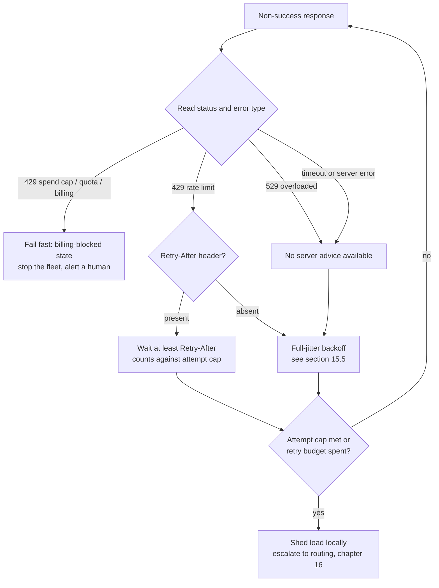
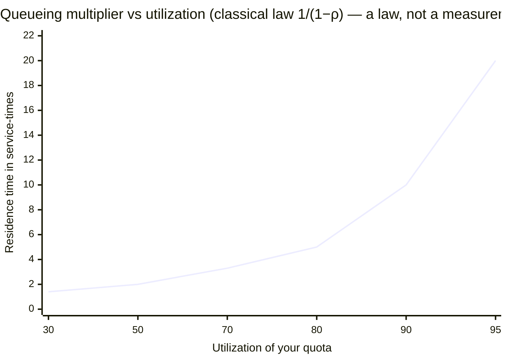

# 15. Rate limits are physics

> **Part III — The API contract** — chapter 14 priced what you send; this chapter caps how fast you may send it. The same workload, scheduled differently, is either a quiet pipeline or a fleet-wide retry storm.

Chapter 7 ended on a promise: when the serving system would rather reject than queue — the 429-class response (`too many requests`, section 15.4) — this chapter owns what your harness does about it. Every provider you will ever call throttles you. The throttle is not a bug, not a punishment, and mostly not even a business decision — it is a measurement of someone else's engine room, exported to you as a number. Chapters 3 through 11 gave you the machinery that produces that number: a graphics processor (GPU) emits tokens at a bounded rate, memory caps how many sessions fit, queues explode non-linearly near saturation. A provider's tokens-per-minute cap is that arithmetic, dressed in a pricing table and enforced at the front door.

The chapter's claim, and its title, is that rate limits are *physics*: the same capacity laws you met in chapter 5's queueing curves decide what the limit must be, and the same admission logic you met in chapter 7 decides when it fires. Two consequences follow — this chapter's two halves. First, providers *count* differently — four providers, four meters — so a harness that tracks "tokens" with one shared counter mispredicts throttling on three of them. Second, providers *reject* differently — and the wrong response to the wrong rejection, multiplied across a fleet of agents, can double the very overload you are suffering. The endgame is not better retries. It is a scheduler that paces your traffic so the limit is never met at all.

## 15.1 Words before machinery

| Term | Simple meaning | Everyday picture |
|---|---|---|
| Rate limit / quota | A ceiling on how much you may send, per time window | The speed limit on a shared road |
| RPM | Requests per minute | Cars through the toll booth per minute |
| TPM | Tokens per minute | Gallons through the pipe per minute |
| RPD | Requests per day | Rides left on a day pass |
| ITPM / OTPM | Input / output tokens per minute, metered separately | Two water meters, one for cold, one for hot |
| Token bucket | A tank that refills continuously; each request drains it | The water tower draining and refilling |
| Burndown rate | A multiplier a provider applies to one kind of token when counting quota | Prime-time minutes count double on your phone plan |
| Cache write / read | First send of a prompt prefix (counted as fresh input) vs re-send of one the provider already holds (often uncounted at the meter) | The first photocopy of a document vs the second |
| 429 | The HTTP "too many requests" rejection | The doorman: "not you right now" |
| 529 | Anthropic's "we are overloaded" rejection | The kitchen is on fire; nobody's order is coming |
| Retry-After | A response header telling you the minimum seconds to wait | The restaurant's "your table in 20 minutes" buzzer |
| Backoff | Waiting longer after each failed attempt | Knocking on a door, then waiting before knocking again |
| Jitter | Randomizing your wait so a fleet doesn't move in lockstep | Each car picking its own moment to hit the gas |
| Retry budget | A cap on retries as a share of all requests | A bouncer limiting re-entries, not just entries |
| Adaptive throttling | Rejecting some calls locally, based on recent successes | The venue reading last night's crowd before opening the doors |

Three old friends ride along: **queueing near saturation** (chapter 5's curves), **admission control** (chapter 7's early rejection), and the **usage fields** (chapter 12's normalizer) that tell you after the fact what was actually counted. This chapter stays on your side of the wire: the limit is something you *read and schedule around*, not something you build.

## 15.2 The limit is a capacity statement

> **ELI5:** Think of an apartment building's water supply. The street main is a pipe with a fixed diameter — no tenant can change it. Each apartment has a meter, and the utility sells plans in *gallons per minute*, because the pipe can only carry so much. If everyone showers at 7 a.m., pressure drops for all — so the utility fits each apartment with a flow restrictor. The restrictor isn't moralizing about your showers; it is protecting the shared pipe. A rate limit is that restrictor, sold in tiers.

Why does the limit exist at all? Run the arithmetic backward. Chapter 3 showed a single GPU's decode rate is bounded by memory bandwidth; chapter 5 showed throughput plateaus and then latency explodes as utilization nears 100% (a fraction of one — chapter 5's ρ); chapter 7 showed a serving cluster protects its latency targets by *rejecting* work it cannot finish well. A provider's fleet has a hard ceiling on tokens per second it can emit while honoring everyone's latency — physics, not policy. Your quota is that ceiling divided among customers, with a price attached. When you hit a TPM cap, you are not annoying a bureaucrat; you are claiming more of a pipe than your share of the pipe can carry.

Two facts make the picture sharper. First, enforcement is almost never per credential — and an API (application programming interface) key is just a credential. OpenAI meters limits at the organization and project level: five extra keys do not buy five quotas, and some model families even share one TPM pool between them (a documented example shares one 3.5-million-token pool across a family). Google meters per cloud project. The key is a name tag, not a bucket. Second, the number is capacity *adjusted by business*: tiers that scale with spend, spend caps layered on top, and — chapter 14's lesson — cache reads that some providers stop counting at the meter entirely. Physics sets the floor of the number; commerce decorates it.

> **The mid-2026 quota sheet** *(dated snapshot; all figures from provider docs retrieved 2026-08-27 — these numbers change; the meters' shapes are the durable part)*
>
> **OpenAI** — limits in RPM, TPM, requests per day (RPD), images per minute (IPM), and audio minutes per minute; throttled by whichever you hit first. Usage tiers auto-scale with cumulative spend: Tier 1 at $5 paid, 2 at $50, 3 at $100, 4 at $250, 5 at $1,000 (monthly cap $200,000 at Tier 5). Example model-page ladder: Tier 1 ≈ 500 RPM / 500,000 TPM; Tier 2 ≈ 5,000 RPM / 1–2 million TPM; Tier 3 ≈ 5,000 RPM / ≥2 million TPM; Tier 4 ≈ 10,000 RPM. Ceilings differ per model within the same tier. Enforced per organization/project, not per key.
>
> **Anthropic** — three meters per model class: RPM, input tokens per minute (ITPM), output tokens per minute (OTPM). Snapshot: Claude Opus 5 / Sonnet 5 / Sonnet 4.x / Haiku 4.5 = 1,000 RPM / 2,000,000 ITPM / 400,000 OTPM, pooled across minor versions within a family. Spend caps: Start $500/month, Build $1,000, Scale $200,000, Custom uncapped. Tiers upgrade automatically from usage history.
>
> **Google Gemini** — RPM + input TPM + RPD per project, daily quotas resetting at midnight Pacific, plus spend-based limits on top. Free tier after the December 2025 cuts (50–80% reductions per docs and third-party trackers): 2.5 Pro ≈ 5 RPM / 100 RPD; 2.5 Flash ≈ 10 RPM / 250 RPD; Flash-Lite ≈ 15 RPM / 1,000 RPD; ~250,000 shared input TPM. Paid Tier 1 ≈ 150–300 RPM *(third-party trackers, approximate)*.
>
> **AWS (Amazon Web Services) Bedrock** — per-model token quotas: `input + cache-write tokens + (output tokens × burndown rate)`. Burndown multipliers: 15× (Claude 4.8), 10× (Claude Sonnet 5 / Opus 5), 5× (Claude 4.7 and below), 10× (GPT-5.6 Sol/Terra/Luna), 1:1 for most others (burndown arithmetic worked in section 15.3). Cache-read tokens are not counted at all.

Read that box once, then forget the numbers and remember the shapes: *what each meter counts* is what your scheduler must encode, and no two providers share one shape.

## 15.3 Four providers, four meters

> **ELI5:** Four gyms in town all advertise "30 sessions a month." The first counts how many times you walk in. The second counts minutes on the treadmill. The third books you for the hour you *reserved*, whether or not you stay. The fourth counts prime-time minutes double. Same sign on the door, four different ledgers behind it. You would not build one spreadsheet for all four — but that is exactly what most harnesses do with "tokens per minute."

The TPM column on a pricing page looks universal. It is not. What differs is the *reservation and metering model* — which tokens count, when they count, and whether the provider charges your quota for tokens you never generated.

**OpenAI reserves against your ceiling.** Each request is charged against TPM as the larger of your `max_tokens` setting and a character-count estimate of the request itself (the provider estimates your prompt's token count from its character count). Set `max_tokens: 32,000` for a chat that will use 400 tokens, and your TPM is debited as if you had generated 32,000 — OpenAI's own guidance is to set `max_tokens` as close as possible to your expected response size (the same discipline chapter 13 prescribed for a different reason). Two more rules bite: unsuccessful requests still count toward per-minute limits — a rejected request spends quota anyway — and cached input tokens are not carved out of the TPM meter the way Anthropic's are.

*OpenAI in one line: reserve first — the bigger of `max_tokens` or the request estimate — and no forgiveness for failed requests or cached input.*

**Anthropic splits the meters and forgives cache reads.** Input and output have separate pools: ITPM counts fresh input plus cache *writes*; OTPM counts actual output tokens only — not `max_tokens` (the mirror image of OpenAI's reserve). And cache *reads*, for most models, do not count toward ITPM at all: at an 80% cache-hit rate, the provider's own worked arithmetic puts a 2,000,000 ITPM limit at roughly 10,000,000 effective input tokens per minute — only a fifth of input is fresh at that hit rate, so the effective ceiling is 2,000,000 ÷ 0.2. Chapter 14 called cache hits a price lever; here is the second discount — on Anthropic (and Bedrock below), caching is also a *quota* lever. One more quirk matters: enforcement is a token bucket with continuous refill, not a fixed window. The docs' own example: a 60 RPM limit "might be enforced as 1 request per second," so a burst of three requests inside one second can 429 even under the per-minute ceiling.

*Anthropic in one line: two split meters, cache reads bypass the input meter, and a refilling bucket that can burst-trap you mid-minute.*

**Gemini counts what you carry in.** Meters are RPM, input TPM, and RPD, per project, with daily quotas resetting at midnight Pacific time — so a long-running job's budget can vanish at a time-zone boundary you never chose. Spend-based limits stack on top: even under your token quotas, unusual spending can throttle you. Among the documented quota families there is no output-token meter; output is priced, not rationed.

*Gemini in one line: count what you carry in — no output meter, and the day's budget resets at Pacific midnight.*

**Bedrock multiplies output and books your reservation.** Quota consumption is `input tokens + cache-write tokens + (output tokens × model-specific burndown rate)`, with cache reads excluded entirely. And like OpenAI, it reserves up front: the service initially deducts `input + cache-write tokens + max_tokens` at request start and replenishes the difference when the request finishes — so an over-large `max_tokens` can throttle you before a single token is generated. The provider's documented worked example: a request with 3,000 input tokens, 4,000 cache-read tokens, 1,000 cache-write tokens, 1,000 output tokens, and `max_tokens` 32,000 on a 5×-burndown model first deducts 36,000 tokens from quota (3,000 + 1,000 + 32,000) and is later adjusted down to a final 9,000 (3,000 + 1,000 + 1,000 × 5; the 4,000 cache reads never counted). Note what that example also proves: *quota and billing diverge*. You are billed for real usage; you are throttled by reserved and multiplied usage.

*Bedrock in one line: output tokens count multiplied, the reservation books up front, and cache reads go uncounted.*

Four meters, one conclusion: **build the router's budget ledger per provider, not from one shared token counter.** Your scheduler needs to know that raising `max_tokens` spends OpenAI quota now and Bedrock quota up front, that an Anthropic-heavy workload should be routed to maximize cache reads (they bypass the meter; chapter 14's dated sheet prices reads at 0.1× fresh input), and that on Bedrock every output token of a 5×-burndown model draws five tokens of quota, so the pool drains far faster than its nominal number suggests. Chapter 16's router will consume exactly this ledger; chapter 18's `RateScheduler` builds it.

One more dimension completes the quota map: some offerings also cap *concurrent in-flight requests* outright, on top of per-minute meters *(check your plan's fine print — not all providers publish this dimension)*. When they do, it is the same physics again: chapter 4's memory arithmetic caps sessions per GPU, so the provider caps streams per customer.

## 15.4 Read the rejection before you react

> **ELI5:** A restaurant turns you away. It matters *why*. "You've already visited three times this hour" is about you — wait and come back. "Your tab hit the limit" is about your wallet — no amount of waiting at the door fixes it tonight. "The kitchen is on fire" is about them — everyone waits, you included. The doorman's three sentences all end the same way ("no table now"), but the correct response is different for each.

A rejection you can retry and a rejection you cannot look identical from a distance: both are errors, and both land in the same error handler (`except`, in most languages). Treating them identically is the most expensive habit in this chapter.

Anthropic draws the map cleanly with two HTTP (Hypertext Transfer Protocol) status codes. **429** (`rate_limit_error`) means *you* are going too fast — or have hit a monthly spend cap or workspace limit. **529** (`overloaded_error`) means *they* are saturated; it is server-side and not your fault. Both are transient in the rate-limit case, but they differ in the details that drive a scheduler: ordinary rate-limit 429s carry a `Retry-After` header (the minimum seconds to wait); 529s never do; and the spend-cap flavor of 429 carries *no* `Retry-After` either — its error message instead tells you when access resumes, in the style of "regain access on 2026-09-01 at 00:00 UTC." Retrying into that is pure waste: the request fails identically, every time, until the clock runs out.

OpenAI's 429 is deliberately ambiguous in meaning: the same status can be a temporary rate limit, an exhausted prepaid balance, or a spend/usage limit — the docs instruct you to read the error's `code` and `type` fields, where billing-class failures surface as `insufficient_quota`, before you retry anything. Since July 2026, enforced monthly spend limits make this concrete: crossing the cap fails live requests with a 429 that no amount of retrying will fix. When rate limiting *is* the cause, OpenAI's responses include a `Retry-After` header when present, plus `x-ratelimit-*` headers showing requests and tokens remaining and reset times — a dashboard your scheduler should read, not discard.

So the classifier your harness needs, before any retry logic runs:



The bottom of that graph — shed and escalate — is the part default settings never reach, because the default is *keep retrying*:

> **SDK (software development kit) retry defaults** *(dated snapshot, retrieved 2026-08-27)*
>
> - **openai-python:** `max_retries = 2` by default (3 attempts total), exponential backoff with jitter, honors `Retry-After` when present.
> - **anthropic-sdk-python:** 2 retries, initial delay 0.5 s, max 8 s, exponential; `Retry-After` honored on 429s.
> - **google-genai:** 4 retries on transient errors (timeouts, 429, server errors), delays ≈ 1, 2, 4, 8 s, jittered, 60 s cap.
>
> All three are tuned for *stragglers* — one odd slow response on an idle Tuesday — not sustained overload, and none classifies billing 429s for you. A fleet that hands a 10,000-item fanout to a default retry loop is running with no scheduler at all.

One number belongs here because it bounds everything in the next section: with a 3-attempt cap (the standard guidance), one logical request becomes at most 3 wire requests (actual HTTP calls that leave your machine) — the commonly cited 3× worst-case load amplification. Without a cap, there is no bound at all.

> **Field note.** A weekend data-migration job — thousands of small classification calls — went quiet on a Saturday night and was still "running" Sunday morning, every request failing with the same 429. The spend cap had tripped; the error carried no `Retry-After`, only a resume date, and the harness's retry loop treated it like any transient: backoff, retry, backoff, retry, on into the night. Nothing was broken except the classifier that didn't exist. The fix was ten lines: read the error `type`, park the fleet in a `billing_blocked` state, page a human. The postmortem's one-line summary stuck with the team: *the retries were all faithful, and all futile.*

## 15.5 Backoff that works: jitter, caps, and budgets

> **ELI5:** A red light turns green. If every stopped driver floors the accelerator the same instant the light changes, the intersection jams — even though everyone did the polite thing and waited. The cure is not longer lights; it is each driver pulling off the line a beat after a *randomly* different moment. Jitter is that randomness, applied to retries.

Suppose you classified correctly and the error is retriable. The naive retry sleeps 1 s, then 2, then 4 — deterministic exponential backoff, which is exactly the green-light problem: your one thousand agents all failed at the same moment (the same overload spike), so they all wake at the same moments too, in synchronized waves. The fix with the strongest pedigree is **Full Jitter**, from the AWS architecture blog's 2015 simulation study (updated 2023): sleep a *uniformly random* time between zero and the exponential cap —

```
sleep = random_between(0, min(cap, base × 2^attempt))
```

In their simulation of 1,000 clients contending for 100 tokens, full jitter beat equal jitter, decorrelated jitter, and no jitter for completion time under contention. Two rules complete the minimum viable retry: `Retry-After`, when present, is a *floor* — never wake before it, skip the formula entirely — and the attempt cap (2–4 total attempts, per the Google Site Reliability Engineering (SRE) book's guidance of roughly 3) is not optional.

Retries, though, are a loan against the provider's capacity, and the SRE book's overload chapter prices the loan. Their worked scenario: 10,000 queries per second (QPS — the same idea as RPM) of client traffic against a backend overloaded by just 100 QPS. Every retry round adds ~100 QPS *on top of* an already-saturated service — retries feeding the failure that caused them — up to a 2× load amplification at a 50% failure rate. The same chapter documents real cascading failures born this way. Chapter 7 promised the retry discipline for engines that reject early; here it is: **when errors rise is precisely when retries are most dangerous.**

Two caps turn a mob into a system:

- **A per-client retry budget** — retries are capped at ~10% of request volume (SRE guidance). When the ratio is exceeded, new retries are rejected *locally*, never reaching the wire. Chapter 10 asked for exactly this ("keep multiplicative retry budgets small") for throughput-fragile fleets.
- **Adaptive throttling** — track `requests` sent and `accepts` received over (at least) the last two minutes, and reject a share of *new* calls locally, before the network, with probability `max(0, (requests − K·accepts) / (requests + 1))` — the `+ 1` only guards against dividing by zero on the first request. Google found `K = 1.1` — allow traffic 10% above the recent success rate — works well in practice. Worked example from the same guidance: 1,000 requests sent, 600 accepted → `(1000 − 1.1 × 600) / 1001 = 340/1001 ≈ 34%` of new calls fail instantly, client-side, cutting offered load toward what the provider is actually accepting — with zero wasted round trips. As accepts recover, the rejection probability decays on its own: additive increase, multiplicative decrease (AIMD), the congestion-control shape from networking, reborn at the model client. Apache Beam ships a production implementation with a floor on minimum request rate so probabilistic throttling never cuts traffic to exactly zero; AWS SDKs offer the same idea as "adaptive" retry mode, a token bucket whose rate halves on throttling events and doubles on successes.

Gateways implement these caps so you do not have to — with one hazard worth knowing. LiteLLM's router retries 429s by default, puts rate-limited deployments into cooldown, and routes traffic elsewhere; its `enforce_model_rate_limit` flag turns documented RPM/TPM into hard local limits — excess requests are rejected *before* reaching the provider, with usage tracked in Redis across replicas. But when *every* deployment of a model is in cooldown, the router raises `RouterRateLimitError` — and per LiteLLM issue #27823 (snapshot 2026-08-27) it does so without a `Retry-After` header, so your caller cannot programmatically learn the wait. Treat that class of error as a scheduling signal (back off the whole model, chapter 16's job), not another retry. The general lesson survives gateway choice: whatever layer owns retries needs the classifier, the jitter, the cap, and the budget — or the fleet beneath it amplifies every overload it meets.

## 15.6 Schedule so you never meet the limit

> **ELI5:** You don't beat an airport by sprinting to a closed gate. You leave so you arrive as boarding starts — not three hours early, not one minute late. The skilled traveler never experiences the security line at all, because they are never in it when everyone else is. Everything in this section is that idea, expressed in tokens.

Backoff is what you do *after* the rejection. The better regime is never meeting the limit — every rejection costs quota (section 15.3), costs a round trip, and lands your traffic back on a queue that is already saturated. The math predicting this is chapter 5's: average response time ≈ service time / (1 − utilization). At 50% utilization residence is already ~2× service time, and every halving of idle time doubles it; at 90% it is ~10×, at 99% ~100×. Practice keeps load off the knee at roughly 70–80% of capacity.



Now aim that law at your quota: if your provider meter reads 900,000 TPM and your calls average ~500 tokens, your ceiling is ~30 requests per second (900,000 ÷ 60 ÷ 500, derived). Riding that ceiling at 100% means living at utilization 1.0 — the vertical asymptote, the point where the curve goes straight up. A harness that paces at 70–80% (~21–24 requests per second, derived) finishes large fanouts *sooner* than one that fires at 100% and spends the difference in 429s, backoff sleeps, and retry amplification. This is the same both-sides trade chapter 5 drew for a single engine, now at fleet scale: throughput you can keep versus throughput you can show.

Three mechanisms turn pacing into code:

**The concurrency cap.** Little's Law — concurrency = throughput × latency — sizes your semaphore directly. Want 24 requests per second at 4 seconds average latency (illustrative constants)? Hold ≈ 96 in flight; enqueue the rest in your own queue, where you can see and reorder them. (Chapter 5 had you sweep concurrency against a *self-hosted* engine's goodput knee; here you sweep against a *provider's* documented ceiling. Same instrument, different wall.)

**The client token bucket.** Keep a local counter refilling at your chosen rate with a small burst allowance; each request spends its token-reservation estimate, modeled the way each provider meters (OpenAI reserves `max(max_tokens, estimate)`, Bedrock books `input + cache-write + max_tokens` up front, Anthropic splits its two meters). Requests that would drive the counter negative wait in *your* queue. Most of your 429s now never leave the process. This is LiteLLM's `enforce_model_rate_limit` pattern pulled into your own harness, and it is the interface chapter 14's keep-alive scheduler was waiting for: a keep-alive tick is a request too, and it should have to *acquire* from the same bucket as real work.

**Adaptive trim.** The 10%-over-recent-accepts throttler from section 15.5 rides on top, shrinking your offered rate toward what the provider is actually accepting, without waiting for your error rate to tell you.

The showcase application is the fanout. Chapter 14 left a 60-way fanout sagging past a caching overflow line until it was paced into waves; here is the general recipe for the 10,000-request version. Derive the steady rate from the quota (~30 requests per second in the worked example above). Enforce it with the semaphore plus the bucket, with full jitter on the *spacing* so thousands of requests do not fire in synchronized volleys. Let the adaptive throttler trim if accepts fall. Add the tail law: a fanout step finishes at the *maximum* of its children's latencies, not the average. If each child exceeds some latency L with probability p, the step exceeds L with probability 1 − (1 − p)^N — at p = 1% and N = 100, that is ~63%; at N = 10,000, it is ≥ 99.99999% (derived). A 100-wide fanout of perfectly *median* calls behaves, at the step level, like a 99th-percentile call; add one slow child — or one 429-and-backoff child — and it defines the step. So budget the step, not the call: give children deadlines derived from a live per-model estimate, and design the reduce side to accept the first K of your N results — any 70 of a 100-wide step, say — rather than requiring all of them. OpenAI's own latency guidance ranks "make fewer requests" alongside "parallelize" for exactly this reason — and its arithmetic is quota-relevant too: halving output tokens roughly halves latency, while halving prompt tokens often buys only 1–5%.

One habit completes the discipline: treat quota like the perishable number it is. The meters' shapes are stable; the ceilings move with tiers, promotions, and provider-side changes (Gemini's free tier was cut 50–80% in December 2025). Load ceilings from config, dated, and re-read `x-ratelimit-*` headers as ground truth when the provider offers them.

## 15.7 What you control from the harness

None of the physics above is yours to change — every lever in this chapter is on your side of the wire:

| Lever | What it changes | Where else |
|---|---|---|
| Per-provider quota ledger | Prediction accuracy: reserve models, burndown, cache-read exemptions | Chapter 16's router feeds on it |
| Realistic `max_tokens` | OpenAI and Bedrock reserve against it up front | Chapter 13's ceiling rule |
| Cache-read maximization | Bypasses Anthropic ITPM and Bedrock quota entirely | Chapter 14's prefix discipline |
| Concurrency semaphore | Keeps you off the queueing knee (Little's Law sized) | Chapter 5's admission control |
| Client token bucket | Converts provider limits into a local queue | Chapter 18's `RateScheduler` |
| Full-jitter backoff + `Retry-After` floor | Kills synchronized retry waves | This chapter's Break it |
| Attempt cap 2–4 + ~10% retry budget | Bounds worst-case wire requests at the cap (3× at three attempts) | Chapter 10's fleet rule |
| Adaptive throttler (K = 1.1) | Trims offered load to recent accepts | Beam/AWS SDK precedent |
| 429 classifier with billing fail-fast | Stops zombie fleets on spend caps | Chapter 16's fallback routing |
| Wave pacing for fanouts | Stays under overflow lines; flattens tails | Chapter 14's field note |
| K-of-N reduce policies | Steps finish without the slowest child | Chapter 2's tail lesson |

## Where the picture stops

The water-pipe picture earns its keep — capacity is shared, meters protect the main, restrictors are sized by tier — and then leaks, in four places:

**The pipe has a marketing department.** Pure physics would set one quota per unit of hardware. Real quotas are capacity *plus* commerce: tiers that scale with spend, promotional free tiers that get cut overnight (Gemini, December 2025), spend caps that override tokens, and "acceleration limits" that 429 sharp usage *increases* even under your ceiling. When your limit moves, the physics didn't — the pricing did.

**Your bucket models the meter, not the fleet.** A client token bucket keeps *your* traffic smooth, but the provider's queue — other tenants, prefill interference from chapter 7, the expert imbalance of chapter 10 — is invisible to you. A perfectly paced client still sees 529s when the kitchen catches fire; pacing removes the rejections *you* cause, no others.

**The rejection codes are not portable.** An OpenAI 429 might be a billing wall; an Anthropic 429 with no `Retry-After` is one; an Anthropic 529 is everyone's problem; a gateway's `RouterRateLimitError` is neither bird. Classify by error *type* and documented semantics, never by status code alone — the one rule that survives every provider reshuffle.

**"Tokens" is not the only currency.** Bedrock's burndown counts output tokens at 5–15× face value; Gemini adds a spend dimension on top of token quotas; Anthropic meters input and output separately, and forgives only cache reads. The unit of "quota" is provider-defined accounting, not a token. Your ledger must speak each dialect — which is exactly why one shared token counter fails on three of four providers.

What survives every one of those breaks is the arithmetic: reservation models, the queueing knee, the jitter formula, the amplification bound, the budget ratio. Numbers in boxes perish; formulas compound.

## Checkpoint

1. Your Anthropic traffic is under 60 RPM for the whole minute, yet you just took a burst of 429s. What enforcement model explains it? *(A token bucket with continuous refill — 60 RPM "might be enforced as 1 request per second," so bursts inside one second overdraw it even under the per-minute ceiling.)*
2. A Bedrock request: 2,000 input tokens, 500 cache-write tokens, 800 output tokens, `max_tokens` 16,000, on a 10×-burndown model. What is deducted at request start, and what is the final consumption? *(Start: 2,000 + 500 + 16,000 = 18,500 — input + cache-write + the reservation. Final: 2,000 + 500 + 800 × 10 = 10,500. Billing follows the real 800, not the 10× figure — quota and billing diverge.)*
3. Which 429 must you never retry, and how do you recognize it on each of the two providers that document it? *(Billing-class 429s: on Anthropic, a spend-cap 429 with no `Retry-After` and a "regain access on …" message; on OpenAI, `insufficient_quota` in the error `code`/`type`. Fail fast and surface a billing-blocked state.)*
4. Full jitter, base 0.5 s, cap 8 s, third attempt: what do you sleep? *(random between 0 and min(8, 0.5 × 2³) = random(0, 4) seconds — the exponential cap sets the *range*, randomness picks the moment.)*
5. Your throttler window shows 1,200 requests sent, 900 accepted. With K = 1.1, what fraction of new calls do you reject locally? *(max(0, (1,200 − 1.1 × 900) / 1,201) = 210/1,201 ≈ 17.5% — offered load trims toward the accept rate without a single wasted wire call.)*
6. Why pace a 10,000-item fanout at ~70–80% of quota instead of firing everything and letting retries absorb the 429s? *(Three stacked reasons: the queueing knee — at the ceiling, residence time explodes, so the paced version finishes sooner; amplification — synchronized retries add up to ~2× load on a saturated service; and the tail — the step already waits on its slowest child, and every 429-and-backoff child is the slowest one.)*

## Build it / Break it / Prove it / See it in the wild

### Build it

tinyengine's `RateScheduler` — the interface chapter 14's keep-alive gate was stubbed for. Four parts: a *per-provider quota ledger* encoding each meter from section 15.3 (OpenAI reserves `max(max_tokens, estimate)`; Anthropic declares split ITPM/OTPM meters and exempts cache reads; Bedrock books `input + cache-write + max_tokens` then reconciles with burndown — re-crediting under-runs and debiting over-runs, because output × burndown can outrun the `max_tokens` reservation and a ledger that only credits lets overrunners pass the quota with the meter green), a *client token bucket* plus Little's-Law-sized semaphore holding excess work in a visible local queue, a *retry module* — classifier first (billing 429s fail fast), `Retry-After` as floor, full jitter above it, 3-attempt cap, and a fleet-wide 10% retry budget that rejects surplus retries locally — and a *wave pacer* that spreads fanouts across time with jittered spacing and a K-of-N completion contract. Roughly 120 lines; chapter 16's router will read its cooldown state, and chapter 18 assembles it.

### Break it

Three injections, each aimed at one component. (1) *Synchronized retries:* fire 200 calls that all fail once, half with zero jitter, half with full jitter — count wire requests and total completion time; watch the deterministic half re-collide in waves. (2) *The zombie fleet:* return a spend-cap-shaped 429 (no `Retry-After`, "regain access" message) from a mock endpoint; prove your classifier parks the fleet in minutes instead of burning attempt budgets all night. (3) *The burst trap:* configure your bucket for 60 requests per minute, then launch exactly 60 in second one — and watch the provider-side token bucket 429 the burst while your fixed-window arithmetic swore you were compliant. A passing scheduler survives all three.

### Prove it

Measure your provider's accounting, don't trust this chapter's snapshot. Send a fixed small workload and log the `x-ratelimit-*` response headers (OpenAI) after each call — remaining requests and tokens, reset times. Then change one variable at a time: raise `max_tokens` 10× with identical prompts and watch the throttle point arrive proportionally earlier (the reservation, made visible); on Anthropic, repeat a cached-prefix call and confirm from chapter 12's usage fields that reads bypass the ITPM meter while your own bucket still spends nothing. Reconcile your ledger's predicted deductions against the provider's reported counters over a 10-minute run — the residual is your ledger's error model.

### See it in the wild

The four meters, straight from the source: OpenAI's rate-limits guide and its cookbook chapter on handling 429s; Anthropic's rate-limits and errors pages (spend-cap behavior, the 429/529 split); Google's Gemini rate-limits page; AWS's Bedrock token-burndown page with the worked quota example. The retry canon: the AWS Architecture Blog's "Exponential Backoff and Jitter" (the full-jitter simulation), and the SRE book's "Handling Overload" (adaptive throttling, K = 1.1, retry budgets) and "Addressing Cascading Failures" (the 10,000-QPS amplification scenario). In the wild: Apache Beam's `AdaptiveThrottler` (production adaptive throttling with a minimum-rate floor), AWS SDKs' adaptive retry mode, LiteLLM's router cooldowns and `enforce_model_rate_limit` (plus issue #27823 for the missing-`Retry-After` hazard), and Dean and Barroso's "The Tail at Scale" (Communications of the ACM, 2013) for the fanout-tail law your wave pacer lives under.
