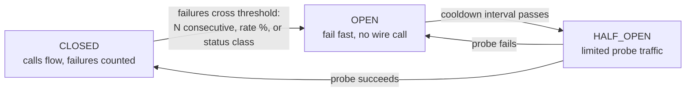
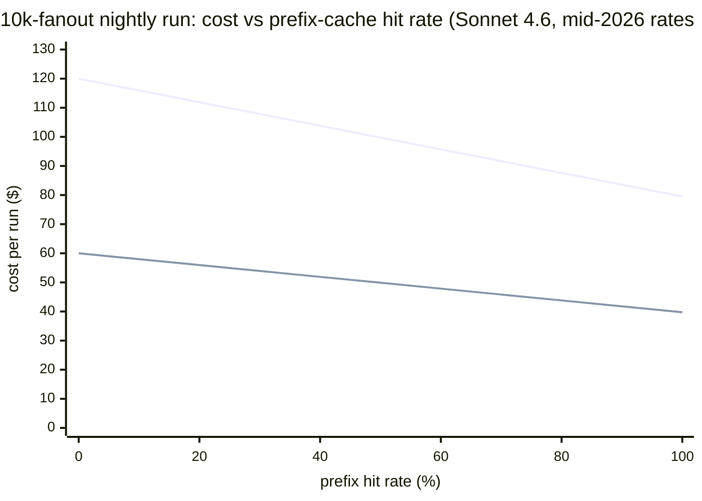

# 16. Routing, fallbacks, and the money meter

> **Part III — The API contract** — chapter 12 normalized the stream, 13 pinned the schema, 14 priced the cache, 15 scheduled the traffic. This chapter composes all four into the last contract-layer decision: *which model, which provider, which lane* — for every single call — and the meter that tells you what that decision costs.

Chapter 14 ended on a threat: your router's model-hopping is a cache killer, and "chapter 16 will make you arbitrate." Chapter 15 ended on a handoff: "chapter 16's router will consume exactly this ledger" — and the `RouterRateLimitError` with no `Retry-After` is "chapter 16's job." This is that chapter. Everything below assumes the machinery you already own — the normalizer's usage fields, the ledger's TTL arithmetic, the scheduler's cooldown state — and builds the last component on top: a routing layer that picks a target for every call, survives the target's worst day, and bills the decision honestly.

The routing layer is where inference engineering turns into money. A model choice is a price. A fallback chain is an insurance policy priced in latency and cache writes. A batch decision is a standing 50% coupon with a 24-hour redemption window. None of it is visible in your code's model string — `"gpt-4o"` is one line of configuration and half a dozen different invoices — and all of it is visible to a meter that reads the right fields. The chapter's two halves match its title: first the *routing* — gateways, per-task model choice, batch lanes, circuit breakers — then the *money meter*, ending in one worked artifact: the 10,000-request cost worksheet.

## 16.1 Words before machinery

| Term | Simple meaning | Everyday picture |
|---|---|---|
| Gateway | A proxy that sits between your code and every provider, owning model names, keys, and retries | The hotel switchboard: you ask for "a line to Rome," it picks which one |
| Alias | A stable name your code calls, mapped to one or more real deployments | "Front desk" instead of whoever is on shift |
| Deployment | One concrete servable copy of a model at one provider | One particular phone line, with its own health |
| Fallback chain | An ordered list: if the first model group exhausts its retries, try the next | If Rome doesn't answer, try Milan, then Florence |
| Cooldown | A timed bench for a misbehaving deployment | The line that shocked you sits unused for 30 seconds |
| Circuit breaker | A per-target failure memory: fail fast instead of timing out into a corpse | The fuse that blows before the house fire |
| Complexity router | A classifier that sends easy prompts to cheap models, hard ones to strong models | The triage nurse: flu → GP, chest pain → surgeon |
| Batch API | Submit N requests as one job; half price, served within 24 hours | The overnight train: cheaper fare, arrives tomorrow |
| Usage object | The token accounting a provider attaches to each response | The itemized receipt, per line |
| Price map | A table of per-model token prices your meter multiplies against | The price list pinned by the register |
| Cost attribution | Labeling every request with task, agent, and feature so the bill explains itself | Submeters: one per apartment, not one for the building |
| Fanout | One step that fires N model calls in parallel and reduces the results | The mailroom sending 10,000 letters in one truck |

Four earlier chapters ride as dependencies: the **usage fields** (chapter 12), the **cache multipliers and TTL arithmetic** (chapter 14), the **quota ledger and wave pacer** (chapter 15), and the **guarantee tiers** (chapter 13). Nothing below is buildable without them — that is the point of a Part III that ends here.

## 16.2 The gateway: one name, many engines

> **ELI5:** Old hotels had a switchboard: you picked up the phone and asked the front desk for "a line to Rome." You never knew — or cared — which physical wire carried you. If the Rome line crackled, the operator moved you to another without your conversation noticing. A gateway is that operator for models: your code asks for `primary-llm`; the operator decides which actual wire — which deployment, which provider — carries the call, and quietly reroutes around dead ones.

The first decision is structural: **no model name in application code, ever.** Chapter 1 showed why — "the model" is not a controlled variable across providers; the same weights on two vendors' stacks differ in latency, quality headroom, and price, and shift under you. So the string your agent code holds is an *alias*, and the alias resolves inside a gateway to a list of *deployments* — concrete servable copies, each with its own provider, credentials, and health.

What the gateway does between alias and deployment is a short list of moves, and LiteLLM's proxy — the open-source reference for all of them — documents each (retrieved 2026-08-27):

- **Weighted routing.** Deployments of the same model carry `weight` fields; traffic splits by weight. Strategies range from `simple-shuffle` (recommended; weighted random) to `least-busy`, `latency-based-routing`, and `usage-based-routing` (by cost or by tokens-per-minute consumption).
- **Health-check-driven routing.** Instead of waiting for *your* requests to discover a dead deployment, a periodic `health_check_interval` probes the pool and removes failing entries proactively; 429s and 408s can be marked transient and ignored (`ignore_transient_errors`).
- **Fallback chains.** When a model group exhausts its retries, the call fails over to a different group entirely — the docs' worked example routes `gpt-4` traffic to a `claude` group. If every deployment of a group is in cooldown, the explicit fallback receives traffic *skipping the cooldown check* — by design, the last resort ignores the health ledger it would normally respect.

One provider-facing gateway shows the economics move. OpenRouter's reliability model (retrieved 2026-08-27) has two layers: *provider failover* — on by default (`allow_fallbacks: true`) across providers serving the same model — and opt-in *model fallbacks* via a prioritized `models` array. Its provider-selection rule is the interesting part: deprioritize any provider with an outage in the last 30 seconds, then weight candidates by the **inverse square of price**. Three providers at $1/$2/$3 per million tokens make the $1 provider nine times more likely to be tried before the $3 one — cheapness treated as a *prior for reliability*, a business assumption you should notice you are inheriting. The design earned its keep in a real incident: a roughly 50-minute gateway database outage in August 2025 that the two-layer failover rode around (no uptime percentage is published — evidence of the design's *purpose*, not its *performance*). Cloudflare's AI Gateway makes the same pattern inspectable: its fallback flows tag every response with a `cf-aig-step` header recording which step served you (`cf-aig-step:0` = primary, `:1` = first fallback) — when your meter wants to know how often you live on the spare tire, the answer is a header read.

Now the arbitration chapter 14 promised. Caches are per-model, per-provider; every fallback hop lands at a different shelf and pays fresh write premiums (1.25× or 2×) to rebuild what it just had. Routing wants freedom to hop; caching wants *stability*. The resolution is temporal, not technological: **route at session start, not per call.** A fanout may spread tasks across models by difficulty (next section); a session pins its model so its prefix stays warm; a fallback may break the pin during an incident, and your meter records that as a cache event — a fresh write, visible in the usage fields — rather than as free resilience. LiteLLM's own health-check knob acknowledges the tension from the other side: marking 429s *transient and ignorable* keeps a rate-limited-but-healthy deployment in the pool, because benching it would strand its cache.

One more input the gateway did not have in 2013: **headroom telemetry.** Chapter 12 established that no hosted provider publishes time-to-first-token (TTFT) percentiles — your latency-based routing can only run on numbers you measure client-side. The same client-side layer that timestamps first tokens can scrape `x-ratelimit-remaining-*` headers off every response (chapter 15), and a remaining-tokens gauge per endpoint is the earliest signal of a 429 wall — which turns "route to whoever is healthy" into "route to whoever still has headroom," minutes before the error rate says so.

## 16.3 Routing per task: the cheap room and the specialist

> **ELI5:** A hospital's triage nurse sends the flu to the general practitioner and chest pain to the surgeon. She is not being stingy — she is matching cost to need, because surgeons are expensive and scarce, and most patients are not surgical. Route every patient to the surgeon "to be safe" and you get two failures at once: surgical care is diluted, and the bill is enormous.

Two routing axes matter, and they are orthogonal. The first is **who serves the call** — the complexity axis. RouteLLM (LMSYS, arXiv 2406.18665) is the reference study: a classifier trained on Chatbot Arena preference data scores each prompt's difficulty and sends easy prompts to a cheap model, hard ones to a strong one. The paper's numbers (retrieved 2026-08-27): the router retained ~95% of GPT-4-level quality while cutting cost versus GPT-4-only routing by **more than 85% on MT Bench, 45% on MMLU, and 35% on GSM8K**; comparisons against commercial routers found those **more than 40% more expensive** at similar quality. Read the three savings figures as one lesson, not a menu: the savings *collapse as the workload hardens* — 85% on chat, 45% on multiple-choice knowledge, 35% on grade-school math — because harder work forces more traffic to the strong model. Complexity routing pays where your traffic mix is dominated by easy prompts; the router's own benchmark says so.

The second axis is **what shape of guarantee the task needs** — chapter 13's tiers, promoted into routing criteria. An extraction that feeds a parser wants full schema enforcement (OpenAI strict, Anthropic strict-tool). A classification into a closed enum can live on subset enforcement (Gemini) *if* your local validator exists — the validator is the only thing that will notice the silently ignored keyword. A drafting step with a tolerant reader takes the cheapest acceptable model and no grammar at all. Encode it as a table your router reads:

| Task type | Routing criterion | Typical lane |
|---|---|---|
| Extraction / structured emit | Full schema enforcement | Strict-capable model, frozen schema bytes |
| Classification, closed label set | Enforcement tier + local validator | Subset-tier acceptable *with* validator |
| Drafting, summarization | Cheapest acceptable quality | Small / fast variant |
| Hard reasoning, agent planning | Quality ceiling | Strong model, complexity router's "hard" lane |
| Nightly evals, backfills | Nobody is waiting | Batch lane (next section) |

Both axes share one discipline from chapter 1: **pin the variant you benchmarked, and re-benchmark quarterly.** Provider performance shifts under you — silent quantization swaps, serving-stack changes, load — and a routing table tuned on last quarter's measurements silently becomes a different table. A routing decision is a *claim about measured reality* with a shelf life.

The both-sides ledger for per-task routing: on the gain side, cost falls by the share of traffic you successfully demote, and often *quality rises* — small models beat big ones on easy structured tasks because the strong model's freedom is a liability inside a tight schema. On the cost side: the router is now a component in your critical path, and a misroute is not an error but a *silent quality failure* your breaker will never see (chapter 15's classifier says nothing about model *choices*). Every additional model in the table is another price row, another cache shelf, another breaker — the tax chapter 14 warned about, paid in full. Start with two lanes (cheap and strong); add a third only when the meter proves it pays for itself.

## 16.4 Batch: the overnight lane at half price

> **ELI5:** The daytime train is fast, crowded, full price; you ride it when someone is waiting at the station for you. The overnight train is half fare — because the railway would rather fill empty seats than run them dark — but it arrives tomorrow. If you needed to be there this morning, the discount is irrelevant; if you needed to be there *eventually*, refusing it is charity to the railway.

All three major providers run an overnight train — a batch application programming interface (API) — and the shape is strikingly uniform (retrieved 2026-08-27): submit N requests as one asynchronous job, receive results **within 24 hours**, pay **exactly 50% of the interactive price**. The engine-room reason is chapter 5's economics turned inside out: a served token is cheap when the graphics processing units (GPUs) are full, so the provider would rather backfill off-peak capacity at half price than let it idle — the same strangers who co-sign your interactive invoice subsidize your batch one. OpenAI also documents a **separate, substantially higher rate-limit pool** for batches (the others' sheets are quieter; check yours), so the nightly jobs can stop competing with your interactive agents for quota — chapter 15's ledger gets a second column.

> **The mid-2026 batch sheet** *(dated snapshot; all figures from provider docs retrieved 2026-08-27 — the 50%/24h shape is the durable part; the ceilings are not)*
>
> - **OpenAI** — 50% discount, separate higher rate limits, `completion_window: "24h"` (currently the only supported value). Input is a file of JSON Lines (JSONL) — one JSON (JavaScript Object Notation) record per row: up to **50,000 requests, 200 MB**.
> - **Anthropic** — 50% off all token usage (input, output, and special tokens; tools, vision, caching all supported inside batches at the same 50% rate). Up to **100,000 requests or 256 MB**; maximum 24-hour window but *most batches finish in under 1 hour*; results retained 29 days; errored, canceled, and expired requests are not billed; batches expire unbilled at 24 hours.
> - **Google** — 50% vs. the equivalent interactive model; 24-hour service-level objective (SLO), "much quicker in the majority of cases." Google's own comparison table adds the middle lane: **Flex** — 50% discount, 1–15 minute target, explicitly best-effort and *sheddable* — versus Standard (full price, seconds) and Caching (up to 90% off input).

Worked arithmetic on dated list prices (retrieved 2026-08-27): a 1-million-token eval suite, 800K input and 200K output, on GPT-4o at $2.50/$10.00 per million tokens — $0.8 × $2.50 + $0.2 × $10.00 = **$4.00** interactive, **$2.00** batch. The same suite on Claude Sonnet 4.6 at $3/$15 — **$5.40** interactive, **$2.70** batch. A nightly regression matrix of 50 such runs saves **$100–$135 per night** for identical answers, and at roughly 2 KB per request the whole matrix fits inside one OpenAI batch file (50,000-request ceiling). The answers are identical; only the arrival time changed.

The decision rule is one sentence, and it is the best sentence in the batch documentation: **if the harness would retry rather than time out, it can batch.** Evals and regression suites, dataset backfills, embedding regeneration, bulk classification, non-interactive summarization — anything whose consumer is a morning dashboard rather than a waiting user. Interactive streaming stays mandatory where a tool result gates the next call, or a human is watching the stream. Flex mode splits the difference — a 50% discount for work that can tolerate minutes and shedding — a genuine third lane for ten-minute-old workloads.

Two meter warnings before you batch everything. First, **usage lands late**: a batch job reports its token accounting only at completion — up to 24 hours later — so a same-day meter structurally undercounts batch spend; your meter needs a pending-jobs column, or the daily reconciliation (next section) chases a phantom drift every morning. Second, **cache stacking is documented on exactly one provider**: Anthropic states its cache multipliers stack with the batch discount (a 5-minute write inside a batch bills at 1.25× the batch base, a read at 0.1×), and no provider documents whether prefix caches *hit* inside a 24-hour batch window at all — your chapter 14 TTL arithmetic (5-minute default, refreshed on read) says intra-job hits are plausible but not promised. Treat intra-batch cache behavior as a measured input, never a designed one.

## 16.5 Circuit breakers: the fuse box

> **ELI5:** A fuse protects a house from a wire fault. Current flows normally until faults cross a threshold — then the fuse *blows*, and every later call to that socket fails instantly, at the fuse, without the current ever making the dangerous trip. After a while you replace the fuse with a few lights on: if the fault is gone, the circuit closes; if the new fuse blows too, the socket stays dead. You do not keep plugging a faulty appliance back in "to check" — the fuse does the checking, with a trickle, not your whole house.

Chapter 15 built the classifier (which rejection is this?) and the backoff (how long do we wait?). The circuit breaker is the third member of that family and answers a different question: *when do we stop asking?* Its shape is canonical — Martin Fowler's bliki, the Azure Architecture Center, and Resilience4j all describe the same finite-state machine, with count-based or time-based sliding windows for the failure count (retrieved 2026-08-27):

CLOSED: calls flow, the breaker counts failures against a window. OPEN: the threshold has been crossed, and calls to this target *fail at the router* — no timeout budget burned, no wire call made. HALF_OPEN: after a cooldown, a trickle of probes tests the target; success closes the breaker, failure re-opens it. The breaker's job is to sit *under* retries and *beside* fallbacks: retries absorb transient blips; the breaker stops the fleet from retrying into a corpse; the fallback chain absorbs the traffic the breaker just refused. Without one, a sustained provider incident plus chapter 15's own retry math is a thundering herd — every client hammering a dead provider with exponential backoff, then surging simultaneously at recovery. Portkey's defaults show the intended layering plainly: retry up to `attempts: 5` on statuses 429/500/502/503/504 — *and* a breaker that opens when failures keep accumulating anyway (retrieved 2026-08-27). Retries and breakers are not alternatives; they are two floors of the same building.

The LLM-specific texture is in the trip conditions, because *not all failures mean the same thing*:

- **429 means "back off briefly."** LiteLLM cools a deployment down immediately on a 429, with a 5-second default window (retrieved 2026-08-27).
- **Sustained failure means "bench it."** LiteLLM also trips a cooldown when more than 50% of calls in the current minute fail; the classic `allowed_fails` knob benches a deployment that fails more than N times in a minute for `cooldown_time` seconds (docs example: `allowed_fails: 3`, `cooldown_time: 30`; presented as example values, not defaults).
- **401/404/408 mean "stop asking; retry cannot help."** An authentication failure or a wrong model name is a *configuration* failure; LiteLLM trips non-retryable-error cooldowns for exactly these, and its `AllowedFailsPolicy` lets you set separate fail budgets per error class — a short bench for rate limits, a long or permanent one for auth and config, per deployment, overriding router defaults.

Granularity is the quiet design decision. A breaker per *provider* is too coarse — one model's content-policy failures would bench a whole vendor. LiteLLM benches per *deployment* (one entry in the model list, identified by a hashed `model_id`), so healthy peers keep serving while one is benched; a single-instance deployment is never put in cooldown at all, because benching it would dead-end the model. Portkey evaluates per *strategy path* with count-or-rate trips (`failure_threshold` on count, `failure_threshold_percentage` on rate, the rate waiting until `minimum_requests` exists), a documented 30-second minimum cooldown, `failure_status_codes` defaulting to above-500 — and an escape hatch worth memorizing: if *every* target in a path is open, Portkey **bypasses the breaker** rather than dead-ending, because a slim chance of service beats a guaranteed self-inflicted outage. Note the spread while you are here: Portkey's 30-second minimum is 6× LiteLLM's 5-second 429 default — breaker numbers are per-gateway tuning, not physics, and your harness should not assume one.

Two honest limits close the section. First, real half-open probing is rare in LLM gateways — LiteLLM's cooldown is a bench-and-wait, and only Portkey's roadmap names the probe explicitly; a sloppy implementation re-opens to full traffic and re-collides. Second — the limit that matters more — **status-code breakers cannot see a brownout.** A provider returning healthy 200s at eight times your normal TTFT is, to a `failure_status_codes` breaker, perfectly fine; your agents simply crawl.

> **Field note: the breaker that never tripped.** One evening our primary provider browned out — no errors, no 429s, just requests that used to answer in a second taking eight. The breaker sat CLOSED all night, correctly by its own rules: nothing *failed*. What caught it was the money meter's cost-per-completed-task line on the morning dashboard — same tokens in as always, barely a third of the usual tasks out — which is when we learned to alert on that ratio, not on error rates. The fuse box guards against fire; it has nothing to say about the lights dimming.

## 16.6 The money meter: four buckets and a price table

> **ELI5:** One electricity meter for the whole building tells you the total and nothing else. Add a submeter per apartment and the bill becomes an *explanation*: unit 4 runs the dryer at night, unit 2 is away. Token metering is the same upgrade — from "we spent $9,000 on LLMs" to "the summarizer spent $2,100, mostly on cache writes after the Tuesday deploy."

Chapter 2 promised this arithmetic: cost ≈ input_tokens × input_price + N × output_price — affine, one term you control, one you rent. The money meter is that identity with real invoices bolted on, and real invoices discount. The correct general form is:

**cost = Σ (bucket_tokens × bucket_rate × modifier)** — summed over buckets, with the modifier set (batch, residency) recorded next to the meter event so the arithmetic stays auditable.

And the first hard problem is that providers *bucket differently*. Chapter 12 normalized the usage fields for streaming; here is what they mean for money. OpenAI reports `prompt_tokens` **inclusive** of cached tokens (`prompt_tokens_details.cached_tokens` is a sub-detail, not a separate bucket), and charges cached reads at 0.1× on current models ("up to 90% off"; GPT-5.6-and-later, retrieved 2026-08-27). Gemini likewise: `promptTokenCount` is the total, `cachedContentTokenCount` a subset. Anthropic and AWS Bedrock report **exclusive, additive** buckets — Anthropic's `cache_read_input_tokens` + `cache_creation_input_tokens` + uncached `input_tokens` sum exactly to total input, at 0.1× / 1.25× (or 2× for the 1-hour tier) / 1× base; Bedrock mirrors with `cacheReadInputTokens` / `cacheWriteInputTokens` under cache details. A meter that assumes one convention and meets the other silently over- or under-counts — the same-meter-different-dial trap as chapter 15's quotas, one layer up.

The safe normalization: **four exclusive buckets at the edge** — uncached input, cache-read input, cache-write input, output — computed in your client the moment the usage object arrives, never trusting a bare `total_tokens` for billing. One output-bucket subtlety from the reasoning models: `completion_tokens_details.reasoning_tokens` (OpenAI) and `thoughtsTokenCount` (Gemini) bill at output rates but appear nowhere in the message text — a thinking model's invoice can double for reasons the visible stream never shows, and a meter that ignores the field will be "wrong" in a direction that always costs you.

Then multiplication, with someone else's price table. LiteLLM returns `response_cost` on every call and maintains a community price map (`model_prices_and_context_window.json`) with per-model input/output rates — its worked example, gpt-3.5-turbo at 1.5e-06 input / 2e-06 output US dollars per token — with `register_model` to override and a local-map pin for reproducibility (retrieved 2026-08-27). Langfuse computes cost at ingestion for generation observations: ingested `cost_details` beat inferred costs, inference multiplies *exclusive* buckets by model-definition prices, and OpenAI-style inclusive counts are normalized to exclusive "only if the payload contains only OpenAI-schema fields" — a normalization rule with a cliff edge your ingestion must respect; the same docs warn reasoning models cannot get inferred cost without ingested token counts, because reasoning tokens are invisible to it. OpenMeter shows the attribution shape: idempotent usage *events* keyed by a `subject`, aggregated by *meters*, mapped to billable *customers* — deduplication and attribution built into the metering schema rather than bolted on after (retrieved 2026-08-27).

**Attribution is an emission-time decision.** Attach trace ID, task label, agent name, feature key to the usage event *when it is emitted* — retrofitting attribution means re-deriving it from logs that may no longer carry the usage object at all. The label set is your bill's explanatory power: `task=summarize`, `agent=fanout-worker`, `feature=nightly-evals` turns a total into a diagnosis.

Finally, the drift taxonomy — because meters drift from invoices for *structural* reasons, not just bugs, and one rule from the metering literature deserves verbatim standing: reconcile meter totals against provider invoices **daily**, and treat unexplained drift as a *schema change*, not noise. The four usual suspects: batch jobs reporting usage up to 24 hours late (section 16.4 — your pending-jobs column); a retry wrapper or client that strips the usage object, forcing full-rate estimates; providers billing by *their* tokenizer while your pre-flight estimate used a heuristic; and stale price maps after a provider update — the reason LiteLLM pins local copies and Langfuse runs a daily price audit. Drift with a known cause is accounting; drift without one is a fossil record of something that changed upstream.

## 16.7 The 10,000-request worksheet

Every chapter since 12 has been rehearsing this artifact. The scenario: a nightly map step — eval matrix or bulk classification — of **10,000 requests**, each 2,000 input tokens (a 1,500-token frozen shared prefix plus 500 unique) and 400 output tokens. Chapter 15's tail law already priced its *latency*: at a 1% per-call slow-draw rate, a 10,000-wide fanout meets a slow child in 1 − 0.99^10000 ≈ 99.99999% of runs — so interactive mode means wave pacing, child timeouts, and K-of-N completion, forever. This worksheet prices the *money*, per lane, on Claude Sonnet 4.6 dated list prices ($3/$15 interactive; $1.50/$7.50 batch; cache write 1.25× / read 0.1× of base, stacking with batch documented; retrieved 2026-08-27). All arithmetic below is derived from those dated rates:

| Line | Interactive | Batch (no cache) | Batch + prefix hits |
|---|---|---|---|
| Fresh input: 500 tok × 10,000 | 500×$3/M×10k = $15.00 | 500×$1.50/M×10k = $7.50 | $7.50 |
| Shared prefix: 1,500 tok × 10,000 | 1500×$3/M×10k = $45.00 | 1500×$1.50/M×10k = $22.50 | one write ≈$0.003, then 9,999 reads: 1500×$0.15/M ≈ $2.25 |
| Output: 400 tok × 10,000 | 400×$15/M×10k = $60.00 | 400×$7.50/M×10k = $30.00 | $30.00 |
| **Total (derived)** | **$120.00** | **$60.00** | **≈ $39.75** |
| Latency (from ch. 15) | wave-paced; waits on the 1-in-10,000 tail draw | ≤ 24 h; most jobs < 1 h | same |
| Rate-limit pool | shared with agents | separate batch pool | separate batch pool |

Three lessons fall out of the arithmetic, in ascending order of generality:

**The lane beats the cache.** Interactive *with a perfect hit rate* (≈ $79.50 — the same worksheet with reads at 0.3× and writes at 3.75× base, derived) still costs more than batch *with no cache at all* ($60.00). Mode choice is a bigger multiplier than prefix engineering; do it first, then optimize prefixes inside the lane. And the hit rate inside a batch window is *not yours to design* — no provider documents intra-batch cache behavior (section 16.4), so h is measured, not assumed. The full cost curve, derived:

**Add the failure lines.** A worksheet without failure costs is a budget, not a forecast. At batch rates each re-sent failed request costs ~$0.006 (derived); a 5% failure rate adds ~$3.00, a full re-run adds $60.00 — which is why errored and canceled requests being *unbilled* (Anthropic, retrieved 2026-08-27) belongs in the worksheet: the provider's failure accounting is generous, your re-run accounting is not. The 24-hour expiry line matters too: a batch that dies at hour 25 is not billed — but it is also *not run*, and the morning dashboard is empty. Cost per *completed* task is the honest denominator.

**The worksheet generalizes.** Strip the numbers and the skeleton is reusable: one row per cost bucket (fresh input, prefix, output), one column per lane (interactive / batch / flex), a hit-rate parameter, a failure line, a latency line, a rate-limit-pool line, and a dated price table in config — never in code, the same rule as chapter 14's CacheLedger. Fill it once per workload; refill it quarterly. When someone asks whether the eval suite "has to run interactively," the worksheet answers — not a preference.

## 16.8 What you control from the harness

| Lever | What it buys | Where |
|---|---|---|
| Alias-per-call, never a hardcoded model name | Swap providers without touching agent code | This chapter |
| Route at session start, pin within session | Fallback freedom without cache suicide | 16.2 + ch. 14 |
| Complexity routing on easy-dominated traffic | 35–85% cost cut at ~95% quality (paper figures) | 16.3 |
| Guarantee tier as routing criterion | Schema failures prevented, not retried | 16.3 + ch. 13 |
| Batch lane for everything nobody watches | Standing 50% + separate quota pool | 16.4 |
| Flex lane for minutes-tolerant work | 50% without the 24-hour commitment | 16.4 |
| Error-class-aware breakers (short 429 bench, long 401 bench) | No retry fleets into dead or misconfigured targets | 16.5 + ch. 15 |
| Four-bucket normalization at the edge | A meter that survives schema drift | 16.6 |
| Attribution labels at emission time | A bill that explains itself | 16.6 |
| Daily invoice reconciliation, drift-as-schema-change | Structural drift caught in a day, not a quarter | 16.6 |
| The worksheet per workload, quarterly | Lane and cache decisions made from arithmetic | 16.7 |

## Where the picture stops

The switchboard, the triage nurse, the night train, the fuse box, the submeter — each earns its keep, and each breaks somewhere specific:

**The switchboard can only reroute what it can see.** A gateway reads status codes and latencies; it cannot see per-provider cache warmth, which of *your* sessions a hop will strand, or a serving-stack quality regression that returns healthy 200s with worse answers (chapter 1). The alias hides as much as it routes — which is why the meter, not the gateway, gets the last word.

**The triage nurse misdiagnoses silently.** A complexity router's error is not an exception; it is a cheap answer to a hard question, delivered with full confidence, billed at the cheap rate. Nothing in chapters 15 or 16 trips on it. Your only defense is outcome sampling — periodically route a slice of "easy" traffic to the strong model and compare.

**The night train's timetable is a promise, not a measurement.** "Most batches finish in under an hour" is a provider's central tendency; your batch lands in the same queue as everyone else's, and only the 24-hour ceiling has contractual shape. If the morning dashboard *must* be full, you have an interactive workload wearing a batch costume.

**The fuse box only knows binary health.** Providers brown out more often than they die — slow-but-200 is invisible to a status-code breaker, and even rate-based breakers see errors, not degradation. The instrument for brownouts is cost- and latency-per-completed-task, watched client-side; buy the fuse, but do not confuse it with the building inspector.

**The submeter measures spend, not value.** Attribution tells you the summarizer cost $2,100; it cannot tell you that one expensive planning call prevented fifty cheap failed ones. Teams that optimize purely by meter lines will starve exactly the calls that make everything else cheap — the worksheet's last, unwritten row is always judgment.

## Checkpoint

1. Your gateway's model group has one deployment, and it starts failing. What does LiteLLM do, and why? *(Never puts it in cooldown — benching the only instance would dead-end the model. Retries still run, then the explicit fallback chain takes over — which is why single-deployment groups need a fallback more urgently than redundant ones.)*
2. Three providers serve the same model at $2/$4/$8 per million tokens. Under OpenRouter's inverse-square rule, roughly how do the first-two selection odds compare for the $2 vs. $8 provider? *(Weight ratio (1/2²)/(1/8²) = 16:1 — the cheapest stable provider is ~16× more likely to be tried first. Cheapness-as-reliability-prior is the assumption you inherit.)*
3. Nightly suite: 5,000 requests × 3,000 input / 500 output on a $2/$8 per-million model. Interactive vs. batch? *(Interactive: 5,000 × (3,000×$2/M + 500×$8/M) = 5,000 × $0.010 = $50.00. Batch: half → $25.00, in a separate quota pool, within 24 h — and if nobody waits for it, the 50% is free.)*
4. A batch job's usage shows 2M tokens but your same-day meter shows zero for it. Bug? *(No — structural drift, suspect one: batch usage reports at job completion, up to 24 h after submission. Meter needs a pending-jobs column; reconcile daily.)*
5. An Anthropic batch request inside a job writes a 5-minute cache (batch base $1.50/M input). What does the write cost, and can you count on the next request in the job hitting it? *(Write = 1.25 × $1.50/M = $1.875/M — stacking is documented. The hit is *not* documented: no provider publishes intra-batch cache behavior, so the hit rate is a measured input, never a designed one.)*
6. Your provider returns 200s but TTFT has crept from 1 s to 9 s over an hour, and your breaker hasn't tripped. Why not, and what catches it? *(Breakers trip on error counts, rates, or status classes — a brownout is none of those. Catch it with client-side goodput-style telemetry and cost-per-completed-task: same tokens in, far fewer tasks out.)*

## Build it / Break it / Prove it / See it in the wild

**Build it.** tinyengine's `Router` — the component chapter 15's `RateScheduler` was built to feed. Four parts: a *routing table* (alias → deployments with weights, guarantee tier, task tags from chapter 13's SchemaGuard, lane interactive/batch/flex, and a session-pinning rule that resolves at session start and survives until a fallback breaks it — recording the break as a cache event on chapter 14's CacheLedger); a *breaker per deployment* with error-class-aware trips (429: 5-second bench anchored to LiteLLM's default; 401/404: permanent bench pending human action; >50%-of-minute: `cooldown_time` bench) and an all-open bypass that logs loudly rather than dead-ending; a *fallback executor* that walks the chain only on classified errors — malformed 400s and garbage 200s go to the validator path, not the chain, because they do not trigger fallback by design; and a *meter tap* that emits four-bucket usage events with attribution labels and the price-table version on every completion. Roughly 150 lines; chapter 18 assembles it between the RateScheduler and the normalizer.

**Break it.** Three injections, one per component. (1) *The dead primary:* mock the first deployment to fail every call; verify traffic moves to the second deployment, the breaker benches the first, and — after the cooldown — a probe (not full traffic) tests recovery. (2) *The garbage 200:* mock a 200 with a schema-violating body; verify the router does *not* fall back (it was not a classified error) and the validator-retry path from chapter 13 catches it instead — the failure that fallbacks cannot see. (3) *The all-open trap:* fail every deployment; verify the bypass serves *something* (or fails with your own typed error carrying a `Retry-After` — the fix for the RouterRateLimitError hazard, chapter 15) and that the incident is visible as routing-log state, not a silent stall.

**Prove it.** Reconcile the meter against ground truth twice. First, replay a fixture set of usage objects — one OpenAI-inclusive, one Anthropic-exclusive, one reasoning-heavy — through your four-bucket normalizer and assert exact costs against a hand-computed worksheet; any mismatch is a normalization bug, and the inclusive fixture will find it. Second, run one real 3-request batch job end-to-end and check that usage lands *only* at completion, that errored requests are unbilled, and that the pending-jobs column absorbs the delay in daily reconciliation. Then turn the worksheet loose on your own workload: measure the actual intra-batch hit rate h for a week before you let anyone forecast with it.

**See it in the wild.** LiteLLM's proxy docs — reliability, load balancing, health-check-driven routing — are the open configuration surface for nearly every pattern in this chapter; Portkey's circuit-breaker page documents the count-or-rate trips and the all-open bypass; OpenRouter's reliability blog and model-fallbacks docs describe the two-layer failover, price-weighted selection, and the classified-error rule the Break-it injection exploits; Cloudflare's AI Gateway Dynamic Routing documents the `cf-aig-step` header. RouteLLM (arXiv 2406.18665, LMSYS blog 2024-07-01) is the complexity-routing reference with the honest three-benchmark savings spread; Martin Fowler's CircuitBreaker bliki and the Resilience4j docs carry the canonical state machine; Dean and Barroso's "The Tail at Scale" (Communications of the ACM, 2013) owns the fanout tail law the worksheet's latency row inherits. For the meter: Langfuse's model-usage-and-cost docs (the inclusive-to-exclusive normalization cliff, stated plainly) and OpenMeter's events/subjects/meters model — and every provider's invoice, the one dashboard this chapter insists you read daily.
