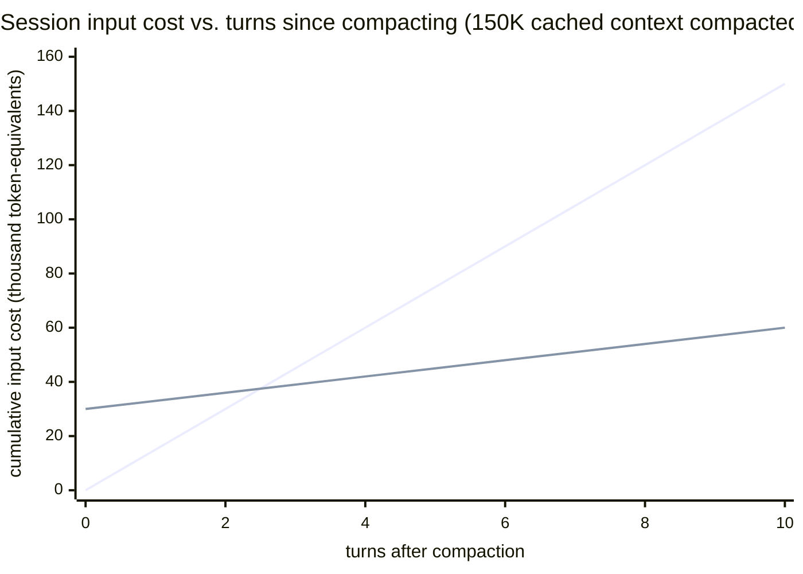
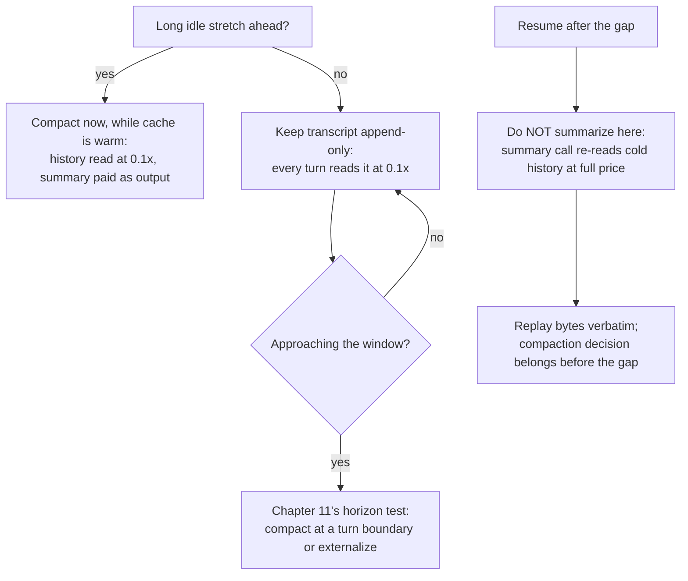
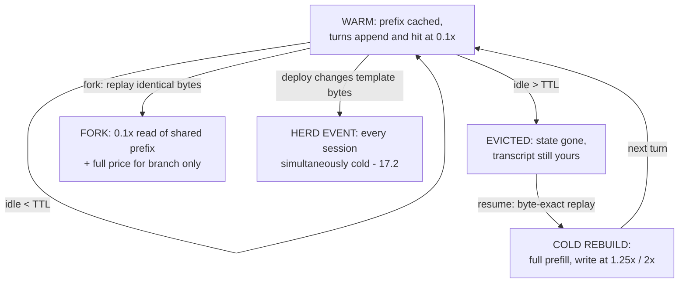
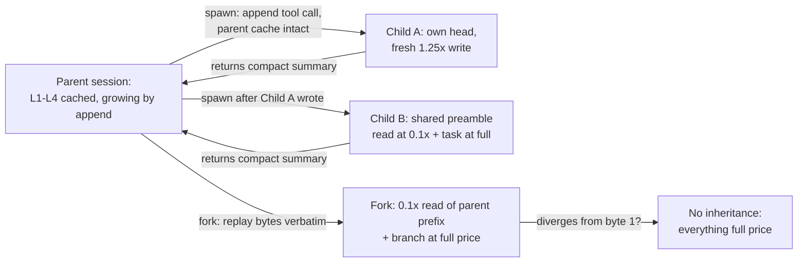

# 17. Cache-aware harness design

> **Part IV — Harness meets engine** — chapter 16 gave you a fleet and a meter; this chapter parks the fleet in a garage with a memory. Every request your harness sends is a cache key before it is a conversation, and the session — not the request — is where caches are won or lost.

Chapter 14 engineered a *request* to hit the cache: stable-first ordering, marked breakpoints, priced hits. But an agent does not live one request at a time. It lives a session — hours of turns, idle stretches, compaction events, subagents spawned mid-flight, the Monday-morning resume after a weekend. Chapter 14 priced each moment as if isolated; this chapter treats them as one asset with a life cycle.

The thesis carries the chapter: **a session is a byte-exact asset.** Not a conversation, not a memory — a growing sequence of bytes whose first N tokens are worth a tenth of list price on every request that reuses them, and a 25-percent *premium* to rebuild the moment anything before them changes. Managing it is treasurer's work: know what's frozen, when rewrites are justified, what a gap costs, and what a child inherits.

Four questions organize the chapter: what stays identical turn after turn (17.2), when rewriting history is the right trade (17.3), what a gap costs and how to come back cheap (17.4), and what a subagent inherits — in cache terms, not sentiment terms (17.5). The session ledger (17.6) then prices every lifecycle event for the meter chapter 16 built.

## 17.1 Words before machinery

| Term | Simple meaning | Everyday picture |
|---|---|---|
| Stable prefix | The bytes at the head of every request that never change | A form letter's letterhead |
| Layered prompt | The fixed render order: tools, then system, then context, then transcript, then volatile tail | A house built foundation-up; you never swap the basement |
| Append-only transcript | History that only ever grows at the end | A courtroom stenographer's notebook |
| TTL (time to live) | How long a cached prefix survives after last use | Milk's sell-by date, pushed back each time you open it |
| Keep-alive | A cheap request whose only job is to refresh the TTL | Swiping your hotel keycard so it stays active |
| Cold resume | Re-entering a session whose cached state has expired | Returning to find your season ticket expired overnight |
| Cache rehydration | Rebuilding cached state after a gap — usually by replaying the transcript verbatim | Refilling the darkroom's trays before printing again |
| Byte-exact replay | Resuming with the *identical* bytes you left with, never re-formatted | Rerunning the same film through the same projector |
| Compaction | Replacing old turns with a summary (chapter 11's tradeoff) | Forty pages of minutes, one page of actions |
| Core memory / state file | Small always-in-context block holding what must survive verbatim | The IDs laminated to your conference badge |
| Spawn template | A frozen, versioned preamble shared by every subagent of a type | The company handbook every new hire reads on day one |
| Shared preamble | The byte-identical head of a subagent fleet's prompts, cache-breakpointed | The handbook's last page, stamped "cache up to here" |
| Fork | A branch that replays the parent transcript then diverges | A choose-your-own-adventure page turn |
| `prompt_cache_key` | A routing hint that keeps related requests on cache-holding machines | Asking the same teller's window every visit |

Old friends ride along, unpurchased again: the **KV (key-value) cache** (chapter 4), **prefix caching and the hash chain** (chapter 6), the **multipliers** — write 1.25× (5-minute TTL), 2× (1-hour), read 0.1× (chapter 14) — and the **usage fields** that let you observe hits (chapter 12). Chapter 11 owns compaction's quality costs; chapter 15 owns the rate budgets keep-alive traffic must respect. This chapter adds the life cycle around them.

## 17.2 The session is a byte-exact asset

> **ELI5:** A courier office must read your entire bound dossier aloud — every page — before it can process even a one-line addendum, and reading is billed by the page. But the office keeps a photostat of the dossiers it read *this morning*, with one rule, stated without mercy: if the first N pages of your new submission are *identical, character for character*, only the new pages get read, at a tenth of the price. Change one comma on page 3 — even improve it — and they re-read the whole dossier from that page on, at full price plus a stamping fee. And every time the office goes quiet for five minutes, the photostats go into the shredder. (Premium members' survive an hour.)

That is the machine from chapters 6 and 14. The provider hashes your rendered prompt from position zero; an identical prefix's stored KV (key-value) state is billed at 0.1× instead of recomputed at 1.0×; the first differing byte kills everything after it; and the whole entry has a clock on it. Chapter 14 priced this per request; the session-scale consequence is stronger because of one asymmetry: **in a well-designed session, the prefix only ever grows by append.** The transcript — the biggest layer — is the one a disciplined harness never edits. That is what makes long agent sessions the cache's best customer, and it is why every rule below exists.

### The layered contract

Recall the render order — `tools` → `system` → `messages` — and its blast radii (chapter 14): a tool change invalidates everything; a system change invalidates system plus messages; a message change only invalidates messages. A cache-aware harness makes this hierarchy explicit as a five-layer contract, pinned at session start:

- **Layer 0 — model and engine.** Caches are per-model. Chapter 16's rule — route at session start, pin within session — is a cache rule before it is a routing rule; a mid-session fallback is recorded as a cache event because it *is* one.
- **Layer 1 — tools.** Frozen, versioned, deterministic serialization order. Chapter 13's frozen-schema discipline lives here: identical schema bytes at the head, every call. Tool churn goes through deferred loading — stubs plus tool search — rather than add/remove cycles that re-write the whole prefix on every reconnect.
- **Layer 2 — system prompt.** Byte-frozen. No timestamps, no dates, no "good morning." Claude Code — the best-documented large harness — stacks it the same way: static system prompt plus tools (globally cached), then project context, then session context, then the conversation; anything dynamic travels as an appended `<system-reminder>` message, not an edit (Claude Code docs, retrieved 2026-08-27). Its system prompt embeds the working directory, platform, and git snapshot — a different directory is a different cache key, deliberately.
- **Layer 3 — project and static context.** Long-lived reference material — the CLAUDE.md file, the rubric, the retrieved corpus. It changes sometimes, so it sits below the frozen head with its own breakpoint (chapter 14's checkpoint-on-change pattern: mutate *after* the furthest stable breakpoint).
- **Layer 4 — the transcript.** Append-only. Tool results, assistant turns, user messages: the stenographer's notebook. New bytes go at the end; old bytes are never touched, because touching one re-prices the whole tail.
- **Layer 5 — the volatile tail.** Per-turn state — current time, this request's variables — as appended messages behind the last breakpoint, free to differ.

The discipline list from chapter 14 collapses into one sentence at session scale: **freeze the head, append the tail, and never let a serializer make decisions for you.** A JSON (JavaScript Object Notation) serializer that walks a hash map and emits tool keys in a different order each run is a named cache-breaker in the provider docs — nondeterministic key ordering — and it converts your frozen layer 1 into a fresh write on every request, with no code change you can see.

### Deploys are cache events (the harness-side playbook)

Chapter 6 promised this playbook. A template deploy — new system prompt, edited tool description, changed rubric — changes layer 1 or 2 bytes, and the hash chain does the rest: **every cached block in every active session dies at once**, the whole fleet reverts to full prefill in the same window, and chapter 5's queueing amplifies it into a fleet-wide TTFT (time to first token) spike. Prediction needs no measurement, only the hash chain:

1. **Version the template bytes.** The prompt template is code; number it, and record the version in every session at start.
2. **Pin per session.** A session carries the template version it was born with; new sessions get the new bytes, live ones keep the old until they end. The herd event becomes a staggered roll.
3. **Or roll at boundaries.** For urgent changes, deploy at natural session boundaries — shift changes, cron boundaries — when the cached population is smallest.
4. **Gate on hit rate.** Chapter 14 made hit rate a first-class production metric; Claude Code's team declares incidents when it drops. A deploy that tanks the gauge failed in the money dimension, even with every health check green.

The both-sides line: the discipline that keeps prefixes frozen also resists *improving* them. A better system prompt is worth a re-write; a differently formatted one is not — the trick is making template changes versioned, costed events, not silent edits.

## 17.3 Rewrite decisions: compaction at the right moment

> **ELI5:** The shredder is not the only way to lose your photostat. You can also hand in a *new dossier* — forty pages replaced by one page of minutes. The office treats it as a stranger: every page read at full price, new photostat stamped. Whether that trade makes sense depends on how many more trips you plan — one page at a tenth of list forever after, versus forty — and it depends *wildly* on when you make the swap.

Chapter 11 owns compaction's quality costs — the lost-in-compaction numbers (73% baseline recall at 190K tokens dropping to 40% at 50% compaction, 7% at 98%; only 17% of side constraints surviving on average), the core-memory rescue, the TokenPilot "sparsity vs. cache continuity" tension. This chapter adds the dimension chapter 11 deferred: **timing** — compaction is not one decision but three, priced by the cache's state when you make it.

**Warm compaction** happens while the cache is alive. The summarization request reuses the existing prompt — system, tools, full history, one instruction appended — so it reads the transcript at 0.1× and pays mostly for summary output. Claude Code's compaction call is engineered exactly this way: one extra request, no tools, reading the warm cache (Claude Code docs, retrieved 2026-08-27). The *next* request pays the break — a prefix matching nothing, re-prefilled at full price. In chapter 11's derived example (150K cached tokens compacted to a 30K context): cheap summary pass, one 30K-equivalent full-price turn, then 3K-equivalent turns forever after (derived; no provider publishes a compaction price table).

**Cold compaction** happens at resume time, on expired cache. The summarization request itself now re-reads the full history *uncached* — 150K at full price before the summary is even generated — and the re-prefill follows anyway. You pay the transcript's full freight to read it for summarization, then never use the original again (retrieved 2026-08-27).

**Pre-idle compaction** is the move that falls out of the arithmetic: *compact before the gap, not after it.* If a session is heading into a long idle stretch — the human going to lunch, the workday ending — its cache will expire while it sleeps (next section). Resuming cold on the full transcript re-reads 150K at full price; on a 30K summary, 30K. Run the summary while the cache is warm — history at 0.1× — and you have converted a 150K cold resume into a 30K one. Claude Code's "resume from a summary" behavior after long breaks is exactly this trade (Claude Code docs, retrieved 2026-08-27; costing derived, not provider-published).

Was compacting worth it at all? Clean breakeven: before, each turn re-reads the 150K prefix at 15K token-equivalents; after compacting to 30K, one 30K full-price re-prefill, then 3K per turn. Break-even at 30K + 3K·t = 15K·t, i.e. **t = 2.5 turns** — ahead from the third turn after the rewrite, and widening (derived):

Read the chart with its both-sides frame: the compacting line *starts* 30K-equivalents in the hole — which is why compacting a session about to end, the last turn of the day, is the worst timing. The breakeven is fast *because the context is huge*; a 40K context compacted to 10K breaks even in under four turns (same arithmetic) but saves only 3K-equivalents a turn — the stakes shrink with the context, and one idle gap can eat the difference. Compact when the remaining horizon justifies it — chapter 11's horizon test — and while the cache is warm; never automatically at the memory-pressure threshold, and never *at* resume when the summary call itself will pay full freight.

The decision, as a picture:

And the escape not on the chart: external memory. Chapter 11's closing rule — context is the working set, the archive is not — is the session-scale answer to the rewrite dilemma. A transcript that lives on disk, retrievable in slices, never needs compacting *or* re-reading whole; the in-context part stays small and stable. That is the full pattern chapter 11 pointed here for: layers 1–3 frozen, layer 4 bounded by retrieval rather than by the window, core state in a file that survives every rewrite because you wrote it.

## 17.4 Resumption and rehydration: what a gap costs

> **ELI5:** Your season ticket works like a hotel keycard: every use pushes its expiry back another five minutes from *now* — premium members' cards last an hour. When the card dies, nothing you own is confiscated; the dossier is still in your briefcase. You just rejoin as a stranger: pay the enrollment fee again (a quarter over list — the stamping fee), and the office re-reads your dossier from page one before doing anything else. A stranger with an identical dossier, but a stranger.

That is a cold resume, mechanically. The cache clock — five minutes by default, an hour at the premium tier — runs from *request start*, generation time included: a 4-minute streamed response leaves about 1 minute to start the follow-up before the 5-minute entry expires (Anthropic docs, retrieved 2026-08-27). Every hit refreshes the clock for free, so an actively-turning session never notices the TTL exists. The session that *notices* is the one whose human goes to a meeting.

### The arithmetic of coming back

On the warm path, the next turn reads the stored prefix at 0.1×. On the cold path, the provider re-runs prefill over the whole transcript and books it as a **cache write at 1.25×** base — a 25-percent premium to rebuild what you already paid to build once. The premium buys ten turns' worth of tenth-price reads, which is why it exists; at resume time it is a lump that scales with the transcript.

> **What a resume costs (derived from published multipliers; prices retrieved 2026-08-27 — re-verify before budgeting)**
>
> Prefix: 200,000 tokens; $/M = per million input tokens, Anthropic list prices, retrieved 2026-08-27. Warm read: 200K × **0.1×** → **$0.10** on Opus-5-class ($5/M), **$0.04** on Sonnet-5-class ($2/M). Cold rebuild, 5-minute TTL: 200K × **1.25×** → **$1.25** (Opus-5-class $6.25/M) / **$0.50** (Sonnet-5-class $2.50/M) — **12.5× the warm read**, plus a multi-second TTFT spike while the whole transcript re-prefills. Cold rebuild, 1-hour TTL: 200K × **2×** → **$2.00** (Opus-5-class $10/M) / **$0.80** (Sonnet-5-class $4/M) — pricier to write, but a break of up to an hour still lands on the $0.10 warm read.
>
> Beyond the multipliers (third-party, hedged): one operator analysis estimated ~**$1.25 per cold resume** on a 200K Opus session and idle gaps ≥5 minutes adding **30–60%** to a working day's session cost (vendor blog, March 2026 — an estimate, not an official figure). Documented resume pain: Claude Code issues #42338 and #71659 report `--resume` re-entering a ~500K-token session with a full 400–500K cache *write* per re-entry, silently consuming rate limits and exhausting a Pro plan's 5-hour window in about an hour of light work (GitHub, retrieved 2026-08-27).

The 1-hour-versus-5-minute choice is arithmetic once you know your gap distribution: writes at 2× are 60% dearer than 1.25×; reads are 0.1× either way. Roughly, a session with N idle gaps longer than 5 minutes pays 1.25·N full-prefix writes on the 5-minute plan versus one 2× write plus 0.1× reads on the 1-hour: **two long gaps already justify the premium** (2 + 0.1·N < 1.25·N when N ≥ 2; derived, gaps assumed under an hour). Claude Code makes the bet visible: its main conversation requests the 1-hour TTL on subscription plans within usage, drops to 5 minutes on API (application programming interface) keys and cloud providers, and pins subagents, workflows, forks, and compaction calls at 5 minutes — with a `promptCacheTtl` override (Claude Code docs, retrieved 2026-08-27; v2.1.242+). The idle taxonomy this implies is worth stealing:

- **Interactive sessions** (turns within minutes): 5-minute TTL; hits refresh it free; no keep-alive needed.
- **Think-time sessions** (gaps of minutes to an hour): 1-hour TTL where offered, or a keep-alive tick — a trivial request whose only job is refreshing the clock — sized against chapter 15's rate budget; keep-alive traffic is real traffic on someone's meter.
- **Overnight sessions**: expect cold. Decide deliberately between paying the rebuild (verbatim replay, below) and pre-idle compaction (17.3); the same math answers "should this session survive the night" — often no. This is also the hours-long regime where chapter 9's KV-quant and chapter 11's working-set caps earn their keep.

### The replay rule: bytes, not meaning

Rehydration is where the byte-exact asset either pays off or gets quietly destroyed. The rule, straight from the mechanism: **persist transcripts byte-exactly and replay them verbatim on resume; never rewrite history on the way back in.** A harness that "cleans up" old messages on resume — re-serializing JSON, normalizing whitespace, reordering tool keys, pretty-printing what was compact — changes bytes; changed bytes change the hash; a changed hash converts a 0.1× read into a 1.25× write plus a full re-prefill, *with no error anywhere*. The failure is invisible in every log except the meter: cache-read share in the usage fields (chapter 12's instruments) collapses on resume events and nowhere else. That signature — hit-rate regression correlated exactly with session re-entry — is the fingerprint of a replay pipeline lying about being byte-exact.

The same rule covers the rest of the resume checklist: same model (caches are per-model), same tool set and serialization order, same breakpoints, same directory if your system prompt embeds one. And one quiet trap: the **20-block lookback**. Reads walk backward at most 20 blocks per breakpoint — a transcript grown more than 20 blocks past its last write misses *silently* — which is why chapter 14's leapfrogging breakpoints are a session-lifecycle rule, not one-time setup.

Latency, not just money: a cold resume re-prefills the whole transcript before the first token, and no provider publishes official re-prefill times. Hedged: one vendor estimate puts 100K tokens on a 70B model at 8–10 seconds of prefill; a vLLM benchmark measured TTFT dropping 78% (4.3 s to 0.97 s) when a shared prefix hit cache on Qwen3-32B; community writing estimates prefill at 85–95% of per-request compute for 8K–128K-token agent prompts — the number behind speculative ideas like predictive cache warming, pre-issuing a session's first request before the human returns (vendor blog and benchmark, retrieved 2026-08-27; estimates, not official). The honest summary: **cold resume latency scales with transcript length, and the only lever is not being cold.** If you self-host, chapter 6's radix tree is your rehydration machinery and the warm path is yours to engineer; hosted, you buy it back at the multipliers in the box.

One distinction to keep sharp, because the words collide: chapter 12's *capture-and-resume* resumes a **generation** mid-stream — an interrupted HTTP (HyperText Transfer Protocol) response, continued at the token. This section resumes a **session** across a gap — the whole prefix, rebuilt or re-read. Different machinery, different failure modes, same billing asymmetry: the provider charges for what it cached, and neither kind of resume lets you pretend work you didn't pay for was done.

> **Field note.** A team's "resume hygiene" pass — run on every session re-entry — re-serialized stored tool calls from a hash map before replay, "for consistency." Nothing errored; every model answered fine. But Monday mornings, the meter showed cache-read share sagging on resumed sessions and nowhere else, and the weekly bill ran hot in exact proportion to weekend-left-open sessions. The hit-rate alarm from chapter 14 caught it in days; a code review would have missed it forever, because the bug was in an ordering nobody reads. The fix was one line — sort keys before serialization, freeze the order at write time. The lesson got laminated: *byte-exactness is an invariant, not a style* — anything that touches history between storage and replay is a cache decision, whether or not its author knew.

## 17.5 Subagents and forks: inheritance as a cache question

> **ELI5:** The firm's specialists work in separate offices. Each gets the company handbook (identical for everyone, stamped once) plus a one-page task brief. The front desk's ledger — the running record of *your* project — is not copied into their offices; it stays at the front desk, growing by one line while the specialist works. Hire ten specialists for similar tasks and the first pays to have the handbook photostatted; the other nine read the copy at member price. Hire one who demands the ledger itself be retyped to their taste, and the whole front desk pays to re-stamp everything.

Subagent design is usually argued in terms of attention — give the child a clean context so it isn't drowned by the parent's debris. That argument stands, but the same design is also a *cache-key* decision, and the cache framing predicts costs the attention framing never sees.

In Claude Code's model — the best-documented large example — a subagent runs in **its own context window** with its own system prompt and tool subset, and does *not* receive the parent's conversation (Claude Code docs, retrieved 2026-08-27). In cache terms: the child shares at most the system-and-tools layer, never the transcript. Two consequences, both mechanical. First, **spawning a child keeps the parent's cache intact**: the spawn is an appended tool call in the parent's transcript — layer 4 growing by append, the one growth pattern that costs nothing extra. Second, the child's *first* request is a fresh prefix — its own write at 1.25× over its own head, 5-minute default TTL, its own override (`subagentPromptCacheTtl`, same v2.1.242+ knob).

### The shared-preamble fleet

Isolation is not the only pattern. For *fleets* of same-type children — the research fanout, the review crew, the 50-shard classification run — the cache-optimal shape is a **spawn template**: a version-pinned preamble (system instructions plus the frozen tool schemas, deterministic order, identical bytes for every child of the type) with a cache breakpoint on its last block, and the task payload strictly after it. The first child writes the preamble; every subsequent child reads it at 0.1×. The arithmetic, in uncached-equivalent units with write 1.25× and read 0.1×: N children cost **1.25 + 0.1·(N−1)** versus N fully uncached — for ten children, 2.15× versus 10×, a **4.7× difference** derived straight from the published multipliers (OpenAI's caching guide frames exactly this formula, retrieved 2026-08-27). The design rule falls out: identical tool and system ordering across all children, breakpoint at the shared block's end, task payload strictly after.

Two concurrency caveats keep the pattern honest, one per provider family. An Anthropic cache entry only becomes available **once the first response begins** — parallel children that all fire at time zero all miss; stagger them behind the parent's write (provider docs, retrieved 2026-08-27). On OpenAI, caches live per-machine and traffic above roughly 15 requests per minute per organization can overflow-route to machines without your entry — the fleet must carry a stable `prompt_cache_key` so the family lands together, the same fix chapter 14's fanout field note needed (OpenAI docs, retrieved 2026-08-27). Neither caveat is exotic; both bite exactly at fleet scale, which is the scale that motivates the pattern.

Both sides: isolation buys things a shared preamble cannot — a narrower head to write, a cheaper minimum to clear, no risk that one child's tool churn breaks the fleet's shared bytes. The choice is workload-shaped — same-type fanouts want the shared preamble; heterogeneous specialists want their own heads — made per spawn type, not per codebase.

### What children return

The other half of the contract is what flows back. A child that returns its raw tool debris into the parent's transcript appends megabytes of layer-4 bytes that will be re-read at 0.1× every turn *forever* — the append-only rule makes garbage permanent. A child that returns a **compact summary** keeps the parent's asset clean: the parent's prefix grows by append, cheaply, with the child's full transcript archived on disk where it costs nothing per turn. Claude Code's own guidance to its agents — return the finding, not the browsing — is cache engineering as much as it is prompt engineering.

### Forks

Forking is inheritance in its purest form, and the rule is 17.4's in miniature: **a fork that replays the parent transcript byte-for-byte shares the parent's cached prefix** — its first request is a 0.1× read plus full price for the branch content only. Any edit on the way in — rewriting the first message, "improving" the system prompt for the branch, a different tool set, a different model — breaks every descendant request from that token onward. OpenAI's fork guidance is the same discipline from the other side: stable developer instructions first, dynamic content last, breakpoints after each tool result "to improve cache efficiency of forking," one stable `prompt_cache_key` across a user's sessions (OpenAI docs, retrieved 2026-08-27; its >90% hit-rate deployment figure is illustrative, flagged as such by the provider). This is also why 17.2's sibling scoping matters: same directory and template share head bytes; a fork into a different worktree or model starts a new asset, cold, by design.

Cross-provider footnote: this is physics, not an Anthropic quirk. On Gemini, the implicit cache's minimum prefix (2,048 tokens on 2.5-generation models, 4,096 on the 3.x family — chapter 14's box) means a too-short child preamble never enters the cache; fleet-share pays only above the threshold. On DeepSeek's ambient disk cache there is no marker to place and no TTL to see — the bytes either rhyme or they don't. Design the template once, correctly, and every provider's machinery works for you.

## 17.6 The session ledger

> **ELI5:** A shipping company's day is more than parcels: a truck leaves, a driver takes a break, a route changes, a temp is hired, one route splits. Each event has a predictable cost — the break restarts the truck cold; the temp reads the manual once for everyone. The accountant counts events, not parcels. Your session is the company; this is the ledger.

Every section of this chapter has been one lesson at different zoom: **session lifecycle events are cache events, and cache events are money.** So end the way chapter 16 ended — with the artifact. One row per lifecycle event, priced by consequence, wired to instruments you already own: chapter 12's usage fields observe the hits, chapter 14's CacheLedger records the money, chapter 15's scheduler enforces the budgets, chapter 16's meter attributes per session and tenant.

| Lifecycle event | Cache consequence | Price shape (derived from the dated multipliers) | Harness control |
|---|---|---|---|
| Ordinary turn (append) | Hit on frozen layers + transcript; TTL refreshed free | 0.1× on prefix + full on new tokens | Layered contract (17.2) |
| Template deploy | Herd invalidation: all sessions cold at once | Full re-write fleet-wide in one window | Version + pin + boundary rolls (17.2) |
| Tool added/removed mid-session | Whole-prefix invalidation | 1.25× write of everything | Deferred loading (17.2) |
| Idle gap > TTL | Eviction; nothing salvageable | Next turn = full write + re-prefill | TTL choice, keep-alive, or accept (17.4) |
| Session resume (byte-exact) | Cold rebuild of the whole transcript | 12.5× the warm read (derived) | Verbatim replay, sorted serializers (17.4) |
| Session resume (after pre-idle compact) | Cold rebuild of summary-sized context | Small write + cheap turns after | Compact before the gap (17.3) |
| Compaction (warm) | One-time prefix break | Summary at ~0.1× history + one full re-prefill of the new context | Horizon test at turn boundaries (17.3) |
| Subagent spawn (isolated) | Parent untouched; child fresh | Parent: append cost only. Child: own 1.25× write | Narrow tool subsets (17.5) |
| Subagent fleet (shared preamble) | First child writes; rest read | 1.25 + 0.1·(N−1) vs N — 10 children: 2.15× vs 10× (derived) | Spawn template + breakpoint (17.5) |
| Fork (verbatim replay) | Shares parent prefix | 0.1× read + branch at full price | Byte-exact branch, same model/tools (17.5) |
| Tenant boundary | Shared template = shared cache; salted template = isolated copies | Hit-rate maximum vs. tenant-paid writes | Salt as a money decision (chapter 14, session level) |

The last row is chapter 14's multi-tenant question come home: same template bytes across tenants means one shared cached copy — maximum hit rate, visible co-residency, one privacy review; salt per tenant, and every tenant pays its own write premium. Neither is wrong; the ledger insists the choice be visible and priced, not emergent.

And the ledger generalizes like chapter 16's worksheet: strip the prices, keep the rows. A harness that enumerates its own lifecycle events — turn, deploy, idle, resume, compact, spawn, fork, tenant boundary — and emits each as a metered event is auditable end to end: hit rate becomes a per-event-type ratio, cost per completed task gets a session-scoped denominator, and "why is the bill hot?" gets a row-level answer. Chapter 18 wires this ledger into tinyengine's prompt assembler.

## Where the picture stops

The courier office, the keycard, the handbook — each earns its keep, and each breaks somewhere specific:

**The office never tells you what it still remembers.** No provider exposes cache state — no "is my prefix warm?" API — and OpenAI's cache is best-effort by admission: your entry can be absent on a busy machine regardless of your arithmetic. Every warmth claim in this chapter is *inferred* from usage fields after the fact. Design as if the photostat might be gone; verify with the meter.

**Byte-exactness is not fidelity.** The discipline that protects the asset also freezes your prompts in amber: the improved system prompt you cannot ship cheaply, the retrieved document that would help at the head but lives at the tail. Cache-aware design optimizes the position of *bytes*, and meaning does not distribute itself for the hash's convenience. Some of your best prompts will be cache-hostile; the ledger prices the trade, it does not abolish it.

**The session outlives its cache by design.** No TTL is forever; the 1-hour premium does not make one. A harness that treats cold resumes as failures will fight its provider forever; one that budgets them — verbatim replay, pre-idle compaction, or an honest new session — treats rehydration as a sunk, priced constant.

**Isolation trades context for cache.** The child who never sees the parent's transcript is cheap on the ledger and blind in the room: it cannot notice that its task contradicts turn 40. Shared preambles spread one blindness across a fleet. The attention argument and the cache argument for isolation coincide — until the missing context was the one that mattered. The summary flowing back is your only bridge; make it good.

**Keep-alive warms with someone else's matches.** Refresh traffic is real traffic: it consumes rate budget (chapter 15), costs tokens somewhere, and on shared infrastructure it is capacity another tenant is not using. A fleet of sessions held open "just in case" is a fleet of small taxes; the idle taxonomy exists so you pay only for sessions that earn it.

## Checkpoint

1. A 200K-token Sonnet-5-class session ($2/M input, list prices retrieved 2026-08-27) idles 10 minutes on the 5-minute TTL, then takes one more turn before ending. What did the idle gap cost, beyond the ordinary turn? *(The rebuild: 200K × 1.25 × $2/M = $0.50 instead of 200K × 0.1 × $2/M = $0.04 — a 12.5× premium plus the re-prefill TTFT spike. If the session was about to end, the gap was pure loss — and compacting *at* resume would have been the worst response.)*
2. Same session, but you can pin the 1-hour TTL at write 2×. The session will idle past 5 minutes exactly twice today (both gaps under an hour). Premium or not? *(Rough model: 5-minute plan pays ~1.25·N = 2.5 full-prefix writes across the two gaps; 1-hour plan pays one 2× write plus 0.1× reads. 2.5 > 2.2 — the premium wins with two gaps, and widens with three. Derived; assumes gaps under an hour.)*
3. Your resume pipeline re-serializes stored tool calls "for consistency" from an unordered map. Users report nothing; the weekly bill is up. Where do you look, and what is the fix? *(Cache-read share in the usage fields, correlated with resume events — the 17.4 field-note signature: byte differences from nondeterministic key order turn every resume into a full write. Fix: deterministic serialization, key order frozen at write time, a byte-equality test in CI — continuous integration — that replays a stored session and hashes the rendered prompt.)*
4. Ten subagents of one type; each needs a 20,000-token preamble and carries a 6,000-token task. Shared spawn template vs. each child embedding its own copy of the preamble in its head: compare in uncached-equivalent units. *(Shared: 1.25·20K write + 10 × (0.1·20K read + 6K fresh) = 25K + 10 × 8K = 105K-units. Isolated: 10 × 1.25 × 26K = 325K-units. The fleet shape is ~3.1× cheaper — derived; on Anthropic, stagger the first child's write before the other nine fire.)*
5. A conversation has grown 25 message blocks since its last cache breakpoint. Hits or misses, and why? *(Misses, silently: the read walk looks back at most 20 blocks per breakpoint. No error fires; the usage fields just show full-price input. Leapfrog a new breakpoint before the tail passes the old one's window.)*
6. Your agent is about to hand control back to a human who historically disappears for 90 minutes, and the transcript is 150K tokens. What are your three options, ranked by cost, and which is a trap? *(From the dated multipliers: (1) accept the cold rebuild — 150K × 1.25× write plus re-prefill latency; (2) pre-idle compaction while warm — summary reads history at ~0.1×, then resume rebuilds a summary-sized context; (3) keep-alive — the only way to hold a 90-minute gap, since it exceeds even the 1-hour TTL, and it means real refresh traffic the whole time, which rate budgets and honest accounting both discourage. The trap is compacting *at* resume: the summary call re-reads 150K uncached first. Compact before the gap or don't compact.)*

## Build it / Break it / Prove it / See it in the wild

**Build it.** tinyengine's `SessionStore` — the component the whole chapter has been drafting. Four parts: an *append-only event log* per session (every message stored once, content-hashed, never mutated — the transcript is the archive); a *renderer* that serializes the five layers deterministically (tools → system → static context → transcript → volatile tail) with the template version and tool-key order pinned at session start, and chapter 14's breakpoint placement, leapfrog included; a *TTL policy engine* that classifies sessions by idle pattern (interactive / think-time / overnight), requests 5-minute or 1-hour entries accordingly, schedules keep-alive ticks through chapter 15's `RateScheduler`, and prices every lifecycle event of 17.6's ledger onto chapter 14's `CacheLedger`; and a `spawn(templateId, task)` path that renders shared-preamble children with the breakpoint on the template's last block and staggers the fleet behind the first child's write. Roughly 160 lines; chapter 18 assembles it beside the router and the normalizer.

**Break it.** Three injections, one per subsystem. (1) *The lying serializer:* patch the renderer to emit tool keys in hash-map order; a five-turn scripted session should show the cache-read share collapsing in the usage events — and the CI test (below) should fail first. (2) *The TTL misclassification:* classify a session that idles six minutes as interactive; the ledger should emit a cold-rebuild cost event (write where a read was budgeted), proving the idle classifier is a money decision. (3) *The chatty child:* spawn a subagent that returns raw tool debris into the parent transcript; the parent's per-turn prefix cost should jump visibly in the ledger — garbage made permanent, visible only in the meter.

**Prove it.** Byte-exactness as a test, not a hope: store a session, render it, hash it; resume, render again, hash again; assert equality — any diff is a replay bug, and hashing is cheap enough for CI. Then a golden-file pass: a fixed session rendered across three library versions must produce identical bytes or fail the build. Finally a live five-turn scripted run against a real provider: assert the cached-token share stays above a threshold across turns 2–5, and that a forced 10-minute idle (one run, nightly — it costs real money) produces exactly one rebuild write, sized to the prefix. When those three pass, every byte is accounted for, every gap priced, every child's inheritance known.

**See it in the wild.** Anthropic's prompt-caching docs and the Claude Code prompt-caching page are the deepest public treatment of session-scale cache engineering — the TTL clock from request start, the four-layer stack, the TTL buckets per conversation type, the explicit list of which actions keep the cache; Claude Code's sessions docs and issues #42338/#71659 document resume pain in the operator's own words. OpenAI's prompt-caching guide carries the fork guidance, the per-machine routing caveat, and the `prompt_cache_key` fix; Anthropic's Compaction API page productizes the rewrite; MemGPT (arXiv 2310.08560, 2023) and Letta's core-memory docs own the external-memory half; TokenPilot (arXiv 2606.17016, June 2026) names the sparsity-versus-continuity tension; the lost-in-compaction benchmark (Zenodo DOI 10.5281/zenodo.20273814) prices the information half. Then look at your own product's longest-lived session and ask the ledger's questions: what is frozen, what does a gap cost, and what did the last deploy do to the fleet?
