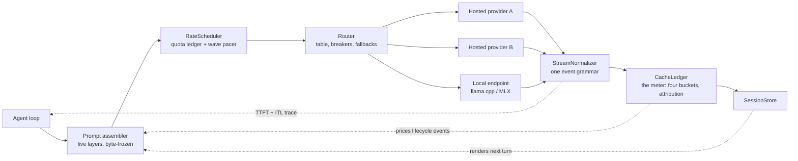

# 18. Your own engine room

> **Part IV — Harness meets engine** — chapter 17 gave your sessions a ledger and a memory; this chapter bolts the whole machine together and hands you the keys. The last question the book asks is the first one it raised in disguise: now that you know what the engine room does, how much of it do you build, and how much do you rent?

Seventeen chapters ago you met a request. It left your agent's loop as bytes, crossed a network, joined a queue, was prefill-ed, batched, paged, decoded token by serial token, and came home as a stream of deltas. Since then you have taken the engine apart one machine at a time: batching's shuttle line, the KV (key-value) rack and its block tables, the prefill/decode divorce, the drafter-and-checker, the quantization ladder, the chips and their collectives, the contract layer — streaming, schemas, caches, quotas, routers, meters — and finally the session, the asset all of it serves.

This chapter does three things with that machinery. First it assembles: the instruments chapters 12 through 17 each built — the normalizer, the ledger, the scheduler, the router, the session store — become one shim with one request path, and you will see the whole of tinyengine in a single diagram. Second it asks the question every operator eventually asks: *when do I stop renting the engine entirely?* Local and edge inference — llama.cpp, MLX, a quantized model on your own silicon — has a real crossover arithmetic, and this chapter teaches it rather than vibes about it. Third it ends the book the way an engine room should: with a ship checklist you can actually run, and a short manifesto about what you now own.

One warning before the wrenches come out. Nothing in this chapter is new machinery. Every mechanism was built in an earlier chapter; the skill being taught here is *composition* — which is also the skill your day job actually requires. Nobody pays you to implement PagedAttention. They pay you to make six vendor APIs (application programming interfaces), two schedulers, and a billing spreadsheet behave like one engine. That is the engine room you own.

## 18.1 Words before machinery

| Term | Simple meaning | Everyday picture |
|---|---|---|
| Inference shim | A thin client-side layer between your agent and every model endpoint | The interpreter who stands between you and three foreign workshops |
| Normalizer | The component that turns each provider's stream grammar into one internal event set | A mailroom re-addressing every letter to one building |
| Meter | The ledger's pricing role — turning usage fields into priced, attributed events | The taxi's meter, itemized by trip |
| Rate scheduler | The component that holds work locally until quota and pacing allow | The airport ground crew holding planes at the gate, not on the runway |
| Router | The component that picks an endpoint, watches breakers, and walks fallback chains | The switchboard operator with a list of who is out sick |
| Session store | The component that renders each turn's prompt from a byte-exact session archive | The court clerk who reads back yesterday's record verbatim |
| GGUF | The single-file model container llama.cpp reads — weights, tokenizer, metadata | A recipe box: one card, whole dish |
| Quant ladder | The menu of numeric formats a GGUF can hold, from F16 to 1-bit experiments | Photocopy quality settings: crisp, fine, readable, faint |
| Unified memory | Apple Silicon's one pool shared by CPU and GPU | One water tank every tap draws from |
| Local endpoint | An inference server on hardware you control, speaking an API | The workshop behind your office instead of across town |
| Utilization | The fraction of time your own engine is actually serving | The delivery van's time on the road vs. parked |
| Crossover point | The workload size where owning beats renting | The mileage at which buying the van beats calling taxis |

Old friends ride along, unpurchased again: the **four-bucket usage events** and **client-side TTFT** (time to first token) from chapter 12, the **CacheLedger** multipliers from chapter 14, the **quota ledger** and **wave pacer** from chapter 15, the **breaker state machine** and **cost attribution** from chapter 16, and the **five-layer prompt contract** from chapter 17. Chapter 9 owns the quantization menu as served by fleets; this chapter visits the same mathematics dressed for one machine.

## 18.2 The assembly: six instruments, one request path

> **ELI5:** A ship's bridge does not talk to the engines directly. The captain rings a telegraph — "ahead half" — and the engine room decides which engine, which throttle, whether the port one is cooling down, and what the fuel log should record. The bridge never learns the details; it learns the *answer*, plus a receipt. Your agent loop is the bridge. tinyengine is the engine room: one telegraph cable in, one answer and one itemized receipt out, and between them, six duty officers who each watch exactly one gauge.

Here is the whole companion in one sentence: **tinyengine is roughly seven hundred lines of TypeScript — a tracer, a normalizer, a ledger that doubles as the money meter, a scheduler, a router, and a session store — that sit between your agent loop and every model endpoint it calls.** Each part was designed in the chapter that needed it, at the size that chapter estimated (the shipped companion, itemized in Appendix D, lands a little under the sum):

| Instrument | Built in | Lines | Watches one gauge |
|---|---|---|---|
| Call tracer | Chapter 1 | ~10 | TTFT, inter-token latency, the identity e2e (end-to-end) ≈ TTFT + (N−1) × ITL |
| StreamNormalizer | Chapter 12 | ~150 | One event grammar: `text_delta`, `tool_call_delta`, `usage`, `stop_reason` |
| CacheLedger | Chapter 14 | ~130 | Hit rate, write amortization, TTL (time to live) clocks, four-term cost |
| RateScheduler | Chapter 15 | ~120 | Quota ledgers, token bucket, retry caps, wave pacing |
| Router | Chapter 16 | ~150 | Routing table, breakers, fallback chains, price-table version |
| SessionStore | Chapter 17 | ~160 | The byte-exact session archive, renderer, TTL policy, spawn path |

Follow one request through the room:

Read it as the chapter numbers taught it. The agent hands over an intent — "complete this turn, guarantee tier strict, lane interactive." The **prompt assembler** (the session store's renderer) lays the turn out in the five-layer order chapter 17 froze: tools, system, static context, transcript, volatile tail — with breakpoints placed where chapter 14 put them. The **RateScheduler** checks the request against the per-provider quota ledger chapter 15 built — OpenAI's `max_tokens` reservation, Anthropic's split meters and cache-read exemption, Bedrock's burndown — and if a fanout is running, the wave pacer spaces it. The **router** picks the endpoint from chapter 16's table: weights, guarantee tier, session pinning, breaker states. The endpoint — hosted or, as section 18.4 will argue, your own — streams back in whatever grammar it speaks. The **normalizer** flattens it to the four events; the **tracer** stamps them; the **CacheLedger** — the assembly's money meter — prices them into four exclusive buckets, attributes the spend, and updates the session's cache arithmetic; the **SessionStore** appends the turn and renders the next one. The loop closes.

Three properties make the assembly more than the sum of its parts:

**Each instrument owns one dial.** The scheduler never inspects stream grammar; the normalizer never prices tokens. This is not architectural purity for its own sake — it is what makes the machine debuggable at 3 a.m. When latency degrades, you read the tracer, not the router. When the bill jumps, you read the ledger, not the breaker. Chapter 1's ownership test, turned into code layout: every failure has exactly one instrument that can see it.

**Every crossing is observable.** The agent sees one grammar. The meter sees every token. Nothing crosses a boundary without leaving an event — which means the harness can be audited end to end, the way chapter 16's worksheet audited a fanout and chapter 17's ledger audited a session. The assembly's defining feature is not any single instrument; it is that *there is no uninstrumented gap*.

**Policy lives in config, not code.** Prices, quotas, routing weights, TTL buckets, template versions — all loaded from dated configuration files, never hard-coded. This is chapter 14's price-table discipline generalized: when a provider reprices or re-limits, you edit a file with a date on it, and the diff is itself an event your meter can see. The alternative — numbers scattered through seven hundred lines — is how a repricing becomes a quiet 40% bill surprise.

What the assembly is *not* matters just as much. It is not a framework you install; it is a pattern you implement. It is not clever — there is no scheduling algorithm in here more advanced than a token bucket and a table lookup. The engine's own sophistication — continuous batching, paged KV, speculative decoding — stays rented on the other side of the endpoint, whether that endpoint is a provider's region or a llama.cpp server on a machine under your desk. The shim's entire job is to hold the contract steady while everything behind it moves.

## 18.3 The engine at home: local and edge inference

> **ELI5:** You can cook at a restaurant (a hosted API), or you can cook at home. At the restaurant, the kitchen is enormous, the staff is professional, and the bill arrives per dish. At home, the kitchen is small, you are the staff — and the dish cost is electricity plus groceries, no matter how many plates you serve. Whether home cooking wins depends on how much you cook, how fussy the dishes are, and whether anyone else is allowed to see the ingredients.

The local stack has three names that mean three different things — plus one latecomer. **llama.cpp** is the runtime: a C/C++ inference engine that runs transformer models on CPUs (central processing units), GPUs (graphics processing units), Apple Silicon, phones. **GGUF** — GPT-Generated Unified Format, the container llama.cpp reads — is a single file holding weights, tokenizer, and metadata, so a model ships as one artifact. **Ollama** is the packaging: model management and an OpenAI-compatible local endpoint on top. And **MLX** — Apple's machine-learning framework — is the Apple-native alternative runtime, tuned for unified memory; as of the Ollama team's announcement, Ollama on Apple Silicon is built on MLX in preview, precisely, they say, to exploit that architecture (Ollama blog, retrieved 2026-08-27).

The dial local inference turns first is the **quant ladder** — chapter 9's mathematics, packaged for one machine. A GGUF can hold each tensor in a defined rung of formats (llama.cpp GGUF docs, retrieved 2026-08-27): full floats (F32, F16, BF16), legacy quants (Q4_0 through Q8_0), K-Quants (Q2_K through Q8_K) that mix block sizes to claw back accuracy, I-Quants (IQ1_S through IQ4_NL) that push importance sampling to the lowest bit-widths, and experimental formats (TQ1_0, TQ2_0, MXFP4). The modern default for most users is **Q4_K_M** — applied with a one-line `llama-quantize` call — because it sits near the knee of the size/quality curve. The llama.cpp project's own tables put numbers on the trade (tools/quantize/quantize.cpp, retrieved 2026-08-27):

> **GGUF per-format snapshot — Llama-3-8B (llama.cpp quantizer tables, retrieved 2026-08-27)**
> - Q4_0: ≈ 4.34 GB, +0.4685 perplexity over F16
> - Q4_1: ≈ 4.78 GB, +0.4511
> - Q5_0: ≈ 5.21 GB, +0.1316
> - Q4_K_M is the recommended default; K-Quants and I-Quants trade compute at quantization time for quality at the same size.

That is the same story chapter 9 told at fleet scale — 4-bit costs quality points, method matters, the knee is real — told again in gigabytes and perplexity for a single file.

The second dial is the one no local machine can dodge: **decode is bandwidth-bound** (chapter 3's law, arriving at your desk). Every generated token requires reading essentially the whole model from memory once. A 70B model at Q4_K_M is roughly 40 GB of weights; a chip streaming 400 GB/s of unified memory can therefore emit at best about 400 ÷ 40 ≈ 10 tok/s — which is exactly where community measurements land. The ceiling on Apple Silicon is memory *bandwidth*, not memory capacity: this is why the same quant runs twice as fast on an Ultra-class chip with roughly double the bandwidth (community guides and internals write-ups, retrieved 2026-08-27).

> **Apple Silicon community snapshot (approximate, community-measured — not vendor-verified; retrieved 2026-08-27)**
> - 70B Q4_K_M on M4 Max 128 GB: community guides claim roughly 20–28 tok/s — the first consumer chip they describe as running 70B at "real-time" speeds. Treat the top of the range as optimistic: the bandwidth law above says 20–28 tok/s needs roughly 800–1,120 GB/s (derived) — Ultra-class territory — while the same community tables put Max-class chips nearer ~12 tok/s and reserve ~21 for an M4 Ultra. ~10–12 tok/s at Q8; ~43 GB of RAM (random-access memory) in use.
> - Community-aggregate tables: Llama 3.3 70B Q4_K_M at roughly 12 tok/s (Ollama) to 21 tok/s (MLX on M4 Ultra 192 GB); Mistral 7B Q4_K_M around 20 tok/s on a base M3 with 16 GB.
> - MLX is community-reported at roughly 15–30% faster than llama.cpp at the same quant on Apple Silicon, with ~10% less memory overhead — treat as order-of-magnitude.
> - The first peer-quality head-to-head of the local runtimes (MLX, MLC-LLM, Ollama, llama.cpp, PyTorch MPS — arXiv 2511.05502) ran on a Mac Studio M2 Ultra with 192 GB unified memory, measuring TTFT, throughput, latency percentiles, caching, and batching.

Note what the numbers whisper: even the optimists' 20–28 tok/s is a *single stream*. Chapter 5 taught you batching turns spare compute into throughput; a local single-user machine runs batch size one, so the bandwidth floor is the ceiling. Your hosted 70B endpoint serves hundreds of concurrent requests off the same law; your laptop serves one — you.

The local stack also changes two contracts from Part III in your favor, quietly. **Prefix caching is yours, free, and capacity-priced** — chapter 6's self-hosted regime: llama.cpp-style runtimes cache the prompt's KV state on your own silicon, with no provider TTL, no 5-minute shredder, no write premium — but also with no fleet behind it, so a cold start re-prefills on *your* bandwidth. And **no quota exists** — the rate limit is the machine. But every other lesson of this book arrives intact: the serial decode tax (chapter 2), TTFT-then-ITL clocks (chapter 12's client-side measurement, now measuring your own GPU), compaction decisions at long context (chapter 11 — with KV memory pressure arriving far sooner than the context window marketing suggests, per chapter 4's formula). A local engine is not an escape from inference engineering. It is inference engineering with a different landlord.

## 18.4 When to own the engine: the crossover arithmetic

> **ELI5:** A taxi charges per trip and is always there. A delivery van costs the same whether it drives or parks. Take a taxi twice a week and the van never pays for itself; run parcels all day and the taxi meter becomes a scandal. The whole decision is *miles*, and the miles are countable before you commit.

Should you run your own engine — a local machine, or a rented GPU running an open-weight model — instead of paying per token? This is a routing question, chapter 16's final table row, and it deserves arithmetic instead of ideology. Here is the honest version, with every rate dated:

> **Rental and per-token rates (dated snapshot; retrieved 2026-08-27, rates checked 2026-08-02 / April 2026)**
> - On-demand H100 rental: ≈ $2.39–2.49/hr (RunPod, Lambda)
> - Marketplace A100: ≈ $1.49–2.49/hr across Vast.ai, Spheron, RunPod, Lambda; 4090-class cards from ≈ $1.49/hr
> - Disaggregated per-token API: ≈ $0.02 per 1M input tokens (Llama 3.1 8B class) to ≈ $2.85 per 1M (frontier open-weight models), 2026, DeepInfra-listed

Now the worked crossover, assumptions stated the way the sources state them:

**A small workload never buys an engine.** Ten million tokens a month at a blended $0.60 per 1M (typical mid-tier open-weight model via a per-token API, 2026) is **$6/month**. A dedicated H100 running 24/7 costs 720 hours × $2.49 ≈ **$1,793/month**. Renting the GPU for a $6 problem is buying the restaurant because you wanted one dinner.

**A busy workload gets close, then argues about utilization.** At one billion tokens a month (a genuinely busy multi-agent deployment), the API bill is 1,000 × $0.60 = **$600/month**; a marketplace A100 at ~$1.49/hr × 720 ≈ **$1,073/month** is still more expensive — *before* you staff it. Run the breakeven the other way (derived): $1,073 ÷ $0.60/1M ≈ 1,790M tokens a month just to tie the API; at a community-typical sustained ~2,000 tok/s aggregate for a 70B-class model (an H100-class throughput figure — a marketplace A100 sustains less, which raises the breakeven share; throughput varies with batch size), that is ~895,000 seconds of serving — about **35% of every hour of every day**. The crossover lands where your utilization does: an engine that idles two-thirds of the time is a taxi you bought at taxi prices.

So when *does* owning win? Four reasons survive the arithmetic:

**Sustained utilization.** If your workload keeps a rented GPU busy well past that one-third-of-every-hour line — batch lanes (chapter 16's night train), continuous embedding or summarization fleets, eval farms — the per-token gap closes and then inverts. Re-run the arithmetic quarterly; the rates move.

**Privacy and compliance.** Some prompts may not leave the building — PII (personally identifiable information), client-privileged text, regulated data. A local endpoint is the *only* lane for that traffic, and its effective price includes whatever a breach would have cost. This is not sentiment; it is the routing table's sensitivity column made explicit.

**Offline and edge.** A harness that must run on a plane, a ship, a factory floor, or a device with no uplink owns its engine by definition. The quant ladder exists for exactly this: chapter 9's variant-reading skills (what does Q4_K_M do to *this* model on *your* evals?) are the due diligence.

**Data gravity.** When the prompts are enormous and already on your disks — a codebase, an archive — it can be cheaper to move the model to the data than the data to the model, especially with chapter 11's quadratic long-context costs in play.

And the honest costs, both sides:

**Owning makes you the provider.** Your pager, not theirs. Engine operations become your job: capacity, deploys, quant re-evaluations (chapter 9's quarterly ritual), goodput management (chapter 5 — your own overloaded GPU queues exactly like a provider's), preemption behavior under memory pressure (chapter 4). You gain the right to break the engine yourself.

**No SLA but physics.** Hosted providers sell uptime and someone else's on-call. Your local endpoint sells neither — but it also cannot have a region-wide 529, and chapter 15's entire retry taxonomy collapses to "wait for the GPU."

The harness decision, stated as policy rather than vibes: **route by sensitivity and volume, computed from dated arithmetic.** Pin PII-bearing and offline-capable tasks to the local lane; send bursty interactive traffic to hosted APIs; send the batch lane wherever the crossover says, which you recompute from current rental and per-token rates plus your measured utilization, on a calendar, not on a hunch. The routing table from chapter 16 already has the columns for this — `lane: local`, a sensitivity tag, a price refreshed with a date. tinyengine's router treats "local engine vs hosted API" as exactly what it is: the first routing decision, not a different religion.

> **Field note: the H100 that idled.** A team I know bought a dedicated H100 node for a privacy-sensitive document workload — genuinely sensitive, genuinely regulated. The lane was correct; the utilization was 4%, because the sensitive traffic was real but small. Cost per completed task landed *worse* than the API it had replaced, visible only because their meter (chapter 16's cost-per-completed-task ratio) was already running. The fix was not selling the node — it was routing the batch lane's open-weight evals and summarization jobs onto it too, past the breakeven line. The engine hadn't been wrong; it had been under-fed. Own an engine and you owe it traffic.

## 18.5 The ship checklist

> **ELI5:** A ship's pre-departure checklist is not a suggestion flyer. It is a fixed list of verifiable facts — hull, radio, charts, fuel — each checked by a named instrument, each with a pass condition. You cannot "mostly" cast off. Before your harness ships, the same discipline applies: every dial the book gave you becomes one line on one list, and every line has a test.

Here is the checklist the whole book has been writing, compressed to what you can actually run. Grouped by the instrument that owns each line:

**Contract lines (router):**
1. Every model referenced by *alias*, never by literal ID (chapter 16) — and every alias resolved by a pinned deployment with a version and a date.
2. Quarterly re-benchmark on the golden set: your pinned model's quality today is a measurement, not a memory (chapters 1, 9).
3. Breaker drill: inject a 429 storm and a slow-but-200 brownout in staging; verify trips, fallbacks, and the all-open bypass *log loudly* rather than dead-end (chapter 16 — and alert on cost-per-completed-task, because breakers cannot see dimming lights).

**Cache lines (session store and ledger):**
4. Byte-exactness in CI (continuous integration): store, render, hash; resume, render, hash; assert equality. Golden-file render across library versions (chapter 17).
5. Cache-read share above threshold across turns 2–5 of a scripted session, read from the usage fields (chapters 12, 14) — a *hit-rate gate*, treated as an SEV (severity) when it drops.
6. Deploy hook fires: template-byte hash changes are recorded as cache events, and a deploy's herd rewrite shows up priced in the ledger (chapters 6, 14).

**Limit lines (scheduler):**
7. Quota ledger per provider matches the documented meters — re-verified against the provider's own pages on the checklist date (chapter 15); rate sheets are dated config.
8. Retry budget enforced: injected failures show local rejection — chapter 15's ~10% fleet rule — not a zombie loop (chapter 15; chapter 10's mixture-of-experts peak rule keeps multiplicative budgets small for the same reason).
9. Fanout paced: a 1,000-request test wave leaves with jittered spacing, K-of-N contract attached (chapter 15).

**Money lines (ledger):**
10. Four-bucket usage identity holds per provider on live traffic (chapter 12's invariants), and daily invoice reconciliation runs — metered spend vs. billed spend, drift taxonomy from chapter 16 attached to any gap.
11. Price table carries a load date; a repricing shows up as a config diff event, not a bill surprise (chapters 14, 16).

**Latency and quality lines (tracer and evals):**
12. p50/p95 TTFT and ITL (inter-token latency) alerting per endpoint — client-side, from the tracer, because no hosted provider surfaces distributions (chapter 12); goodput alerts on SLO (service-level objective) violations, not raw throughput (chapter 5).
13. The golden set runs nightly on every live route, including the local lane (chapters 9, 16): a silent variant swap or quant regression is caught by *quality*, the only dial that can see it.

Run the whole list before every launch; run lines 5, 10, 12, and 13 nightly; run lines 1, 2, 7, and 11 quarterly. That cadence — ship, night, quarter — is the book's loop in three speeds.

## 18.6 The closing manifesto

> **ELI5:** Most people ride elevators their whole lives without knowing there is a machine room. One day the elevator stalls between floors, and they learn the machine room exists — by being trapped in it. You are now the person who has *visited* the machine room, read the gauges, and knows which cable does what. You will never ride an elevator — or an API — innocently again.

Volume I ended by teaching you to stop wasting the model. This volume's single claim, restated one last time, is that the engine room is *knowable* — and that knowing it is your job, because nobody else in the building holds your contract.

**You own the contract, not the engine.** The three layers from chapter 1 still stand: the model is rented from a catalog, the engine is the provider's craft, and the waste term — what the harness squanders in unstable prefixes, unbatched fanouts, retry storms, and unbudgeted context — is entirely yours. The durable equation closes the book as it opened it: agent economics = what the model knows × what the engine extracts × what the harness wastes. Sixteen of these eighteen chapters were about the third term.

**Every dial has a price.** There is no free latency, no free quality, no free context. Batch and you trade neighbors' TPOT (time per output token) for throughput; quantize and you trade points on a benchmark for bandwidth; cache and you trade prompt flexibility for a tenth-price read; speculate and you trade verifier compute for maybe-tokens; own the engine and you trade a per-token bill for a utilization commitment. "Latency, cost, quality — pick two" was the spine because it is not a slogan; it is the accounting identity of this whole machine, and you can now do the arithmetic on a napkin.

**Instrument everything; trust nothing unmeasured.** The instruments you built — tracer, normalizer, ledger, scheduler, router, store — are not overhead. They are the difference between an agent that works and an agent that *billably* works. The failure modes this book catalogued are all quiet: the cache that silently misses, the variant that silently swaps, the breaker that never trips, the retry loop that bills you for the privilege of failing. Quiet failures need loud instruments.

**The engine room will keep changing.** The dated numbers in these pages — prices, quotas, benchmarks, formats — are snapshots, and they will drift. That is why every chapter taught the formula and dated the value. When the rates move, re-run the arithmetic; when a new serving trick ships, ask which law of this book it bends. The laws — serial decode, bandwidth floors, queueing under load, cache as byte-exact asset, tail amplification — have outlived every architecture this book named, and they will outlive the next ones.

Monday morning, do this: wrap one real call with three timestamps (chapter 1, ten lines). Read one bill against the usage fields (chapter 12's invariants). Hash one prompt template and put a breakpoint on it (chapters 6 and 14). That is the whole book in an afternoon — the first three gauge-lines of your own engine room. Then keep going. The machine is not mysterious. It was never mysterious. It was just never opened.

## Where the picture stops

The bridge, the kitchen, the van, the checklist — each earns its keep, and each breaks somewhere specific:

**The engine room is not a product.** Roughly seven hundred lines of policy code is what the assembly is; it is not a framework, and it will not absorb your judgment calls for you. Which lane is sensitive, which golden set matters, what an acceptable hit-rate gate is — those decisions ride along unautomated. The duty officers watch gauges; the captain still has to want the right thing.

**Home cooking is not free cooking.** The local kitchen skips the per-dish bill and then hands you the grocery run: quant re-evals, ops pager, quality drift on a ladder rung, and a bandwidth ceiling no marketing slide lifts. "Free inference" is electricity plus maintenance plus the eval farm you now owe yourself (chapter 9). The crossover arithmetic prices the taxi honestly; price the van honestly too.

**The van's arithmetic assumes prices hold.** The 35%-of-every-hour breakeven is derived from 2026 rental and per-token rates; both ends move — GPU rentals fall, API prices drop, new models land. The decision is only ever as fresh as its dated inputs, which is why the policy says *recompute quarterly* rather than *decide once*.

**The checklist cannot see the one failure that matters most.** Lines 1–13 catch contract, cache, limit, money, latency, and quality regressions — but a misroute (chapter 16) or a compaction that quietly dropped the fact your task needed (chapter 11) still lands as a *silent quality failure* that only a golden set shaped like your real workload can see. The list is the floor, not the ceiling; the eval farm is the walls.

## Checkpoint

1. You have a 64 GB unified-memory Mac and want a 70B model locally. Which rung of the ladder, and why? *(Q4_K_M or smaller: at Q4_K_M a 70B is roughly 40 GB of weights — it fits with the OS (operating system) and a KV cache to spare, at community-measured 12–21 tok/s depending on chip. Q8 doubles the footprint past the comfortable envelope and roughly halves the speed, per the same community tables — all figures approximate, community-measured.)*
2. A chip streams 500 GB/s of unified memory. What single-stream decode ceiling should you expect for an 8B model at Q4_K_M (~4.5 GB)? *(≈ 500 ÷ 4.5 ≈ 110 tok/s — derived from the bandwidth law; prefill and real overheads will shave it, and batching does not help a single user, per chapter 5.)*
3. Your agent does 100M tokens/month, blended $0.60 per 1M via API. A colleague proposes a dedicated A100 at $1.49/hr instead. Verdict? *(API: 100 × $0.60 = $60/month. GPU: 720 × $1.49 ≈ $1,073/month for the same traffic — 18× the API bill unless the lane also absorbs batch work past the ~35% utilization breakeven. Route the burst to the API; put only a sensitivity- or volume-proven lane on the GPU.)*
4. Same A100, assume the 2,000 tok/s aggregate from section 18.4. At what utilization does it beat $0.60 per 1M tokens? *(Breakeven spend ≈ $1,073 ÷ $0.60/1M ≈ 1,790M tokens/month; at 2,000 tok/s that is ~895,000 s ≈ 35% of a 30-day month — derived from dated rates; above it the GPU is cheaper per token, below it the taxi wins. The 2,000 figure is H100-class and optimistic for an A100 — a slower real GPU pushes the breakeven share higher.)*
5. A regulated workload may not leave the building, runs 2M tokens/month, and needs only 8B-class quality. Local or hosted? *(Local — the crossover arithmetic is irrelevant because the routing constraint is sensitivity, not price: the API lane is closed by policy. Run the 8B at Q4_K_M/Q5 class on existing hardware; the eval farm from chapter 9 prices the quality loss before anyone ships.)*
6. The bill jumped 40% overnight. Nothing in your code changed. Checklist order? *(Lines 10–11 first: metered-vs-billed reconciliation and the price-table diff — a provider repricing is the classic silent culprit and shows up as a dated config event. Then line 5: did cache-read share fall (a provider-side caching change)? Then line 1: did a deployment silently change under an alias? The meter saw it first because the meter sees everything.)*

## Build it / Break it / Prove it / See it in the wild

**Build it.** The assembly itself — Appendix D owns the full companion guide with the code; this chapter's job is the wiring order. Start with the tracer (ten lines, chapter 1) wrapping one real call. Add the normalizer (chapter 12) so all providers speak one grammar. Add the CacheLedger (chapter 14, fed by chapter 12's usage events) — the money meter — so every event is priced. Add the RateScheduler (chapter 15) so the fleet stops tripping its own quota. Add the router (chapter 16) so an endpoint can fail without failing you. Add the SessionStore (chapter 17) so sessions render byte-exact across days. Then — the only new line this chapter adds — a `local` deployment entry pointing at a llama.cpp or Ollama endpoint with its own dated price row (electricity, amortized), its own breaker (the machine can brown out too), and its own golden-set lane. Roughly seven hundred lines; every one of them specified in an earlier chapter.

**Break it.** Kill each instrument in turn and watch what fails silently. Stop the meter: run one day with pricing disabled — can anyone tell you what the day cost? Break one wire in the normalizer's finish-reason map to `unknown`: does the agent loop hang on a stop it never heard? Open the router's breakers all at once: does the bypass *log loudly*, or dead-end with a shrug? Point the scheduler's ledger at last quarter's quota sheet while the provider changed meters: what breaks first, the 429s or your forecast? Every silent failure you can produce in staging is one that cannot surprise you in production.

**Prove it.** The end-to-end proof is three scripts on a timer. Nightly: the golden set across every live route including local, the cache-hit gate on a scripted session, and invoice reconciliation against the meter — lines 5, 10, 12, 13 of the checklist, automated. Weekly: the byte-exactness hash across a stored session resumed cold, plus one forced fallback walk on a canary alias. Quarterly: re-run the crossover arithmetic of section 18.4 with current rental and per-token rates, and re-benchmark every pinned deployment. When all three rings of the cadence pass, you can answer the only three questions an operator is ever really asked: what did it cost, why was it slow, and is it still good?

**See it in the wild.** llama.cpp's repository — the GGUF format docs, the quantize tool's own size/perplexity tables, the benchmark discussions — is the primary source for the local ladder; the Ollama blog documents the MLX transition on Apple Silicon; the M2 Ultra runtime comparison (arXiv 2511.05502) is the first peer-quality head-to-head of the home kitchens; community tables (llmcheck.net and the M4 Max guides) are honest but approximate — read them as order-of-magnitude. For the crossover, watch GPU rental indices and DeepInfra-style per-token listings move quarter to quarter; the arithmetic of section 18.4 is only as current as its dates. Then look at your own stack and find the seam: somewhere between your agent loop and your most expensive endpoint is a boundary nobody instruments. That seam is your engine room. You know how to open it.
