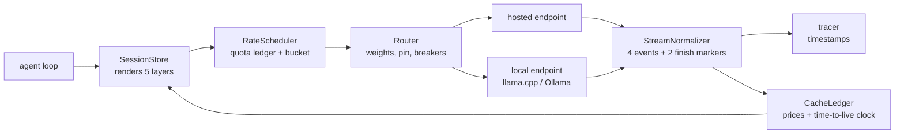

# Appendix D. The tinyengine companion guide

> **Appendices — the reference shelf.** The chapters estimated the code; this guide delivers it. Every "Build it" in the book, assembled in one place.

The chapters said it in one sentence, and it remains the truest sentence in this appendix: **tinyengine is roughly seven hundred lines that sit between your agent loop and every model endpoint it calls.** Each module was designed in the chapter that needed it, at the size that chapter estimated, and every estimate carried a tilde. The shipped code keeps those promises — with one deliberate exception, noted under the table below.

| Module | Designed in | Estimated | Shipped | Owns |
|---|---|---|---|---|
| `tracer.ts` | Chapter 1 | ~10 | 20 | TTFT (time to first token), inter-token latency (ITL), the decode-time identity (chapter 2's e2e law) |
| `stream-normalizer.ts` | Chapter 12 | ~150 | 193 | one event grammar for four provider grammars |
| `cache-ledger.ts` | Chapter 14 | ~130 | 141 | the money meter |
| `rate-scheduler.ts` | Chapter 15 | ~120 | 127 | quota ledger, bucket, jitter, wave pacer |
| `router.ts` | Chapter 16 | ~150 | 133 | routing, breakers, classified fallback |
| `session-store.ts` | Chapter 17 | ~160 | 114 | byte-exact sessions |

(The estimates were tildes, not contracts. The first draft ran a little under them — TypeScript type declarations compress what the chapters described in prose. A late adversarial code review then added the four boundary guards described in their sections below — the ones an operator copies into production — pushing three modules over their tildes: the normalizer furthest, 193 against ~150, the guards being most of that growth. The six-module total is 728 lines against the 720 sum: within a rounding. No chapter's promise is broken — every interface this table's chapters named exists in the code, under the name the chapter used, with one aggregation: chapters 15 and 18 name a `RateScheduler`, and its four parts ship in `rate-scheduler.ts` under their own names — `QuotaLedger`, `TokenBucket` and `Semaphore`, `RetryPolicy`, the wave pacer's `waveDelays` and `kOfN` — and one deliberate omission: chapter 13's `SchemaGuard` stays in your harness because its schemas are yours; what ships of that chapter is the guarantee-tier ladder itself (`router.ts`'s `GuaranteeTier`) plus free-form `tags` on each deployment, so the tier is a routing input (D.6) even though the validator is yours.)

## D.1 The wiring order

Chapter 18's assembly sequence, made concrete. Read it as the request does:



The composition properties from chapter 18 hold by construction: **one dial per instrument** (the scheduler never inspects stream grammar; the normalizer never prices tokens), **no uninstrumented crossings** (every arrow in the diagram passes through a metered component), and **policy in config, not code** — prices and quotas arrive as dated, typed config rows (`PriceRow` for prices, `QuotaMeters` for quotas); nothing commercial is hardcoded, so when a price sheet ages, you replace data, not logic.

## D.2 The tracer (chapters 1–2)

The seed instrument — chapter 1's ten-line promise, kept:

```typescript
export function traceCall(sentAt: number, deltasAt: number[],
                          tokens: number): Trace {
  const first = deltasAt[0], last = deltasAt[deltasAt.length - 1];
  const itl = deltasAt.slice(1).map((t, i) => t - deltasAt[i]);
  const mean = itl.reduce((a, b) => a + b, 0) / (itl.length || 1);
  return { ttftSeconds: first - sentAt, e2eSeconds: last - sentAt,
    itlSamples: itl, tokens,
    identityGapSeconds: (last - sentAt)
      - (first - sentAt + (tokens - 1) * mean) };
}
```

Three timestamps in, the decode-time identity out, and — the part most tracers omit — the **identity gap**: `e2e − (TTFT + (N−1) × mean ITL)`, where N is the reply's token count. When that residual grows, the queue grew (chapter 5) or the network did (chapter 12); when it is zero, your latency is all engine, and chapters 3 through 11 own the explanation.

## D.3 The stream normalizer (chapter 12)

Intake: raw SSE (server-sent events) lines from any of the four grammars (`openai-chat`, `openai-responses`, `anthropic`, `gemini`). Output: the four streaming events — `text_delta`, `tool_call_delta`, `usage`, `stop_reason` — plus two finish-time markers the accumulator emits (the assembled `tool_call`, and `incomplete_call` when arguments do not parse), each stamped with a receive timestamp, and `ttftSeconds` on the first content delta. A `usage` event whose fields come back non-numeric (a wrapper renamed or stringified them) coerces them to 0 and carries `incomplete: true` — visible, never `NaN`, because `NaN` poisons every sum downstream forever. Three rules carry the chapter's lessons:

1. **Meta-only events skip, never crash.** Lines that do not start with `data:` — comments, `event:`, pings — return nothing, and a `data:` payload that parses to something other than an object (`null`, an array, a bare string) is skipped the same way. The WHATWG (the web-standards body behind the SSE spec) allows them; the normalizer survives them — one bad keep-alive payload never kills the stream loop.
2. **Tool arguments parse exactly once, at the finish.** A tool call's arguments arrive chopped into pieces spread across many stream events; the accumulator's whole job is to glue the pieces back together in the right order and read the reassembled whole exactly once. The `ToolCallAccumulator` keys fragments by provider-agnostic call id (Chat `index` → id once it arrives, Responses `item_id`, Anthropic block index → `toolu_` id from `content_block_start`, Gemini function name), concatenates blindly, and parses once when the stream ends. Keying Anthropic deltas by their block index means interleaved tool blocks attribute correctly, and a delta with no prior block start (lost on a dropped event) is an orphan that merges into nothing. A fragment split mid-escape-sequence (`\"Portla` / `nd\"`) reassembles fine because no fragment is ever parsed alone. Empty arguments coerce `""` → `{}`; unparseable arguments — or arguments that parse to a non-object, such as a string-typed `functionCall.args` — become an `incomplete_call` marker, not an exception.
3. **Unknown finish reasons map to `unknown` and stay audible.** A provider's mid-stream `network_error` maps to `unknown` with the raw value preserved — the loop lives, the log knows. And one stream, one stop: a repeated finish chunk (a retried transport, a replayed tail) never re-fires the stop event — first stop wins.

## D.4 The cache ledger (chapter 14)

The money meter. Four-term cost from dated config, never from code:

```typescript
cost = (freshIn × P.in + cacheWriteIn × write_mult × P.in
      + cachedIn × read_mult × P.in + out × P.out) / 1e6;
```

Prices are per million tokens — hence the divide-by-a-million. `breakEvenReads` implements the docs' own arithmetic — N ≥ (w−1)/(1−r), with N the reads to break even, w the write premium, r the read discount (chapter 14's notation) — so 1.25×/0.1× pricing answers "one read" and the 1-hour 2× write answers "two." A model missing from the price map (chapter 16's renamed-alias suspect) throws a named `UnknownModelError` before any session state is touched, so the caller routes it instead of the meter dying mid-loop; `hitRate` computes the same formula the nightly gate does — cached ÷ (cached + fresh), writes priced but excluded — so a dashboard and a gate can never disagree on the same rows. The meter is also the trust boundary for its inputs: usage fields clamp non-negative (non-finite to zero) at `record`'s edge, with a note on the event — an upstream clamp bug becomes visible, never negative money. And a turn that both reads cached bytes and writes new ones logs *both* a `read` and a `write` event, costs split so a turn's events always sum to its full cost — a replay of the event stream never understates reads. The ledger's test is the chapter's worked example, verbatim: a 100,000-token prefix on a $3-per-million model, ten turns, **$0.645 cached against $3.00 uncached**. The TTL (time to live) clock starts at `requestStart` (stream duration burns the window), expiry is an event (`ttl_expired`) before it is a surprise, `keepAliveDue` fires a minimal cache-reading tick only when a session is idle, likely to resume, *and* the injected rate budget (chapter 15's gate) admits it — and `deploy()` hashes your frozen-template bytes so a one-token template change arrives as a `deploy` cache event across the fleet, which is what chapter 6 promised deploys look like.

## D.5 The rate scheduler (chapter 15)

Four parts, one per chapter section. The **quota ledger** encodes each provider's actual meter: OpenAI reserves `max(max_tokens, character-estimate)`, Anthropic books the input meter with cache reads exempt (the output meter's OTPM (output tokens per minute) cap is declared in `QuotaMeters` but not yet debited — add an output bucket before relying on it), Bedrock books `input + cache-write + max_tokens` up front and reconciles at completion against the burndown multiplier — re-crediting under-runs and debiting over-runs, because output × burndown can outrun the `max_tokens` reservation. Reservations are atomic: a TPM (tokens per minute) miss leaves the RPM (requests per minute) slot untouched, so a full token meter can never manufacture phantom request-429s; reservation fields clamp at the door, so a malformed negative estimate or cache-write can never cancel positive terms into a zero charge. The **token bucket** refills continuously and ignores a non-monotonic clock — an NTP step or a VM resume that moves time backwards never drains the bucket — and the burst-trap test in the suite proves a 60-per-minute bucket refuses the 61st token of a second-one burst (59 admitted instantly; the next request — two more tokens, 61 in all — is refused whole, not half: reservations are all-or-nothing; the refill readmits it), which is the provider-side arithmetic chapter 15 documented. The **retry module** classifies before it retries: billing 429s fail fast, spend-cap 429s (no `Retry-After`, "regain access" wording) park the fleet instead of burning attempts all night, `Retry-After` is a floor, full jitter spreads `random(0, min(cap, base·2^attempt))`, a 3-attempt cap bounds amplification at 3×, and a ~10% retry budget rejects surplus retries locally. The **wave pacer** spaces a fanout with jittered delays and a K-of-N completion contract — the tail law's answer from chapter 15's close.

## D.6 The router (chapter 16)

The routing table is data: alias → deployments, each with weight, guarantee tier (chapter 13's ladder, so the structured-output tier is a routing input), and lane. Session pins resolve at session start and survive until a fallback breaks them — and the break is *recorded as a cache event on the ledger*, because re-pinning re-prices the next turn at a write. Breakers are error-class-aware: a 429 benches for seconds (LiteLLM's 5-second default is the anchor), 401/404 benches permanently pending a human, sustained failure benches for a cooldown — and half-open admits a probe, never full traffic. The rule chapter 16 risked its Break-it on is enforced in code: **fallbacks fire only on classified errors.** A malformed 400 never walks the chain; a garbage 200 goes to the validator path and comes back `null` with a loud log line — the failure fallbacks cannot see. When every deployment is open, the bypass serves from the first one anyway and logs `ALL DEPLOYMENTS OPEN` rather than dead-ending.

## D.7 The session store (chapter 17)

The renderer emits a template header banner, then the five layers in the frozen order — tools, system, static context, transcript, tail — with tool order sorted at render time and object keys sorted recursively (`stableStringify`). The same data can come back in a different internal order — hash-map key order being chapter 14's named cache-breaker — and sorting before hashing makes identical content produce identical bytes, and identical bytes mean identical cache hits. The test the chapter demanded is the test the suite runs: render → hash → render again → hash again → **equality**, including across a store rebuilt with the tool array deliberately reordered (the lying-serializer defense, inverted). Breakpoints hold the four-max with the leapfrog — the oldest mark rolls, never a fifth. `classifyIdle` maps idle minutes to interactive / think-time / overnight and requests the 5-minute or 1-hour entry class accordingly; keep-alive ticks route through the injected scheduler gate. `spawn()` renders shared-preamble children — template layers only, never the parent transcript — staggered behind the first child's write so the first child pays the full write premium and its siblings pay the tenth-price read.

## D.8 Running and proving it

```bash
cd companion/tinyengine
npm test  # tsc && both suites: smoke + cadence
```

No network. Every stream is a fixture string (a saved, fake input the tests replay); every price is a test constant. The smoke suite is the chapters' Prove-it list: Portland in three fragments split mid-escape; the meta-only ping; the unknown finish reason; the usage identity; the $0.645 worked example; both break-evens; the TTL-expiry event; the budget-gated keep-alive; full-jitter bounds with `Retry-After` as floor; the burst trap; the zombie-fleet classifier; the dead-primary failover; the garbage-200 no-fallback rule; the all-open bypass; the priced pin break; the byte-exact hash; the leapfrog; the idle taxonomy; child isolation. The cadence suite replays the three nightly operator instruments over fixture files — the same gates, offline. Four `node:` built-ins are used (`crypto` for hashing, `assert` for tests, `fs` for fixtures, `process` for argv/exit in the CLIs) with minimal type shims in `env.d.ts`, so the project compiles with a bare `tsc` and zero npm dependencies — delete the shim if you install `@types/node`.

Chapter 18's closing rule applies to the companion too: kill each instrument in turn and read what fails silently. The tests are the staging version of that drill — and the nightly cadence ships with it, three operator CLIs (command-line tools) beyond the instruments (about 370 lines with shared plumbing, fixtures included):

```bash
node dist/golden-set.js --tasks fixtures/golden-tasks.json \
  --results fixtures/golden-results.jsonl \
  --baseline fixtures/golden-baseline.json
node dist/cache-hit-gate.js --usage fixtures/usage-day.jsonl \
  --floor 0.6
node dist/invoice-reconcile.js \
  --meter fixtures/meter-day.jsonl \
  --invoice fixtures/invoice-day.csv --tolerance 0.02
```

**`golden-set.js`** is chapter 9's field note as code: a fixed task set, replayed nightly against the pinned variant, diffed against a dated baseline. A task that passed yesterday and failed tonight is DRIFT and fails the gate *even when the overall pass rate clears its floor* — the per-task diff catches the drift that averages away, and the floor catches the broad kind. Known failures (recorded in the baseline) do not page; the floor still applies to them; and a task retired from the set is never reported `fixed` — only a task still in the set can be. A `--floor` that does not parse as a finite number exits 2 instead of silently disabling the floor comparison — a typo (`--floor o.9`) must fail the invocation, not the check's purpose. `--update-baseline` re-records tonight as the new dated reference only after you have reviewed the drift it reported. **`cache-hit-gate.js`** is chapter 14's "first-class production metric" as a gate: the day's usage rows (chapter 12's normalizer output, one JSON object per request) yield the book's hit rate — cached ÷ (cached + fresh input), writes reported as re-admissions but excluded from the rate — overall and per model, with thin models (fewer than `--min-rows` rows) reported but not gated, because thin data is noise. **`invoice-reconcile.js`** is chapter 16's daily rule: the ledger's four-term totals per model against the provider's invoice CSV within a tolerance, gaps reported signed as invoice − meter because provider billing wins ties, and the four usual suspects named by symptom — only-on-the-meter (batch usage up to 24 h late, or usage stripped so the meter estimated), only-on-the-invoice (a bucket the meter does not know), amount drift (stale price map, or their tokenizer versus your estimate). Duplicate rows — retry/partial exports on the invoice side, a cron (a scheduled job) overlap writing the meter twice — are summed before comparison, never last-wins: dropped money is invisible money.

What the three scripts never do is call a model, trust a price, or invent a baseline: your cron replays the tasks and appends one result row per task, your invoice export feeds the reconciler, and every gate is a comparison of two things you already have. The fixtures double as executable documentation — `fixtures/golden-results.jsonl` carries a deliberately new failure (`ex-011`), and running the CLIs against the fixtures shows both the pass and the drift shapes.

---

*The companion is deliberately not a framework. It does not manage your prompts, choose your models, or hide a single decision from you. It instruments them. If you extend it, keep the three properties: one dial per instrument, no uninstrumented crossings, policy in dated config. The code will age with the provider facts it is fed; the properties are the durable part, and they are the book's.*
