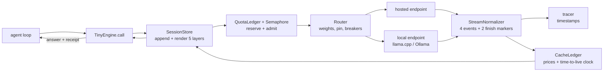

# Appendix D. The tinyengine companion guide

> **Appendices — the reference shelf.** The chapters estimated the code; this guide delivers it. Every "Build it" in the book, assembled in one place.

Get the complete companion from the public
[Inference Engineering repository](https://github.com/arbazkhan971/inference-engineering-book);
the code in this appendix lives under `companion/tinyengine` in that checkout.

The durable claim is a contract, not a line count: **tinyengine is an inspectable request path between your agent loop and every model endpoint it calls.** The chapters specify one policy instrument at a time; `engine.ts` assembles them, and `demo.ts` proves the assembled path offline.

| Module | Designed in | Owns |
|---|---|---|
| `tracer.ts` | Chapters 1–2 | TTFT (time to first token), inter-token latency (ITL), the decode-time identity |
| `stream-normalizer.ts` | Chapter 12 | one event grammar for four provider grammars, stamped from wire send |
| `cache-ledger.ts` | Chapter 14 | the four-bucket money meter and cache lifecycle |
| `rate-scheduler.ts` | Chapter 15 | quota ledger, buckets, concurrency permits, retry policy, wave pacer |
| `router.ts` | Chapter 16 | weighted/pinned routing, breakers, classified fallback, attributed receipts |
| `session-store.ts` | Chapter 17 | deterministic prompts, append-only persistence, replay, compaction projection |
| `engine.ts` | Chapter 18 | the single request path and returned engine receipt |
| `demo.ts` | Chapter 18 | credential-free, network-free executable proof |

Chapters 15 and 18 use `RateScheduler` as the name of a responsibility. The code keeps its parts explicit: `QuotaLedger`, `TokenBucket`, `Semaphore`, `RetryPolicy`, `waveDelays`, and `kOfN`. Chapter 13's `SchemaGuard` remains in your harness because its schemas are yours; the companion carries guarantee tier (`router.ts`'s `GuaranteeTier`) and free-form tags as deployment metadata, then passes the chosen tier to an injected validator. Your harness chooses the policy alias; the router does not pretend one generic classifier understands your task.

## D.1 The wiring order

Chapter 18's assembly sequence, made concrete. Read it as the request does:



The composition properties from chapter 18 hold by construction: **one dial per instrument** (the scheduler never inspects stream grammar; the normalizer never prices tokens), **no uninstrumented crossings** (every arrow in the diagram passes through a metered component), and **policy in config, not code** — prices and quotas arrive as dated, typed config rows (`PriceRow` for prices, `QuotaMeters` for quotas); nothing commercial is hardcoded, so when a price sheet ages, you replace data, not logic.

## D.2 The tracer (chapters 1–2)

The seed instrument — chapter 1's ten-line promise, kept:

```typescript
export function traceCall(sentAt: number, deltasAt: number[],
                          tokens: number): Trace {
  const first = deltasAt[0], last = deltasAt[deltasAt.length - 1];
  const itl = deltasAt.slice(1).map((t, i) => t - deltasAt[i]);
  const mean = itl.reduce((a, b) => a + b, 0) / (itl.length || 1);
  return { ttftSeconds: first - sentAt, e2eSeconds: last - sentAt,
    itlSamples: itl, tokens,
    identityGapSeconds: (last - sentAt)
      - (first - sentAt + (tokens - 1) * mean) };
}
```

Three timestamps in, the decode-time identity out, and — the part most tracers omit — the **identity gap**: `e2e − (TTFT + (N−1) × mean ITL)`, where N is the reply's token count. When that residual grows, the queue grew (chapter 5) or the network did (chapter 12); when it is zero, your latency is all engine, and chapters 3 through 11 own the explanation.

## D.3 The stream normalizer (chapter 12)

Intake: raw SSE (server-sent events) lines from any of the four grammars (`openai-chat`, `openai-responses`, `anthropic`, `gemini`). Output: the four streaming events — `text_delta`, `tool_call_delta`, `usage`, `stop_reason` — plus two finish-time markers the accumulator emits (the assembled `tool_call`, and `incomplete_call` when arguments do not parse), each stamped with a receive timestamp, and `ttftSeconds` on the first text or tool-call delta. The clock is injectable. Pass `sentAt` when the transport sends, or construct earlier and call `markSent()` immediately before the wire call; a second mark or any mark after content begins throws. TTFT therefore excludes local admission and parser-construction time. Receive timestamps clamp monotonically if a wall clock steps backward. A `usage` event whose fields come back non-numeric (a wrapper renamed or stringified them) coerces them to 0 and carries `incomplete: true` — visible, never `NaN`, because `NaN` poisons every sum downstream forever. Three rules carry the chapter's lessons:

1. **Meta-only events skip, never crash.** Lines that do not start with `data:` — comments, `event:`, pings — return nothing, and a `data:` payload that parses to something other than an object (`null`, an array, a bare string) is skipped the same way. The WHATWG (the web-standards body behind the SSE spec) allows them; the normalizer survives them — one bad keep-alive payload never kills the stream loop.
2. **Tool arguments parse exactly once, at the finish.** A tool call's arguments arrive chopped into pieces spread across many stream events; the accumulator's whole job is to glue the pieces back together in the right order and read the reassembled whole exactly once. The `ToolCallAccumulator` keys fragments by provider-agnostic call id (Chat `index` → id once it arrives, Responses `item_id`, Anthropic block index → `toolu_` id from `content_block_start`, Gemini function name), concatenates blindly, and parses once when the stream ends. One stream, one finish: a second `finish()` emits nothing, and a fragment arriving after it is dropped — both are artifacts of a stream that already ended. A Chat fragment whose id has not arrived yet banks under a synthetic `idx:` id and is re-keyed whole when the id lands, so a proxy that reorders the id field cannot split one call into two markers. Keying Anthropic deltas by their block index means interleaved tool blocks attribute correctly, and a delta with no prior block start (lost on a dropped event) is an orphan that merges into nothing. Gemini's key sequences per name (`step:f`, `step:f#1`, …) because its grammar delivers each `functionCall` part complete — parallel calls to the same function are two calls, not more fragments of one. A fragment split mid-escape-sequence (`\"Portla` / `nd\"`) reassembles fine because no fragment is ever parsed alone. Empty arguments coerce `""` → `{}`; unparseable arguments — or arguments that parse to a non-object, such as a string-typed `functionCall.args` — become an `incomplete_call` marker, not an exception.
3. **Unknown finish reasons map to `unknown` and stay audible.** A provider's mid-stream `network_error` maps to `unknown` with the raw value preserved — the loop lives, the log knows. And one stream, one stop: a repeated finish chunk (a retried transport, a replayed tail) never re-fires the stop event — first stop wins.

## D.4 The cache ledger (chapter 14)

The money meter. Four-term cost from dated config, never from code:

```typescript
cost = (freshIn × P.in + cacheWriteIn × write_mult × P.in
      + cachedIn × read_mult × P.in + out × P.out) / 1e6;
```

Prices are per million tokens — hence the divide-by-a-million. `breakEvenReads` implements the docs' own arithmetic — N ≥ (w−1)/(1−r), with N the reads to break even, w the write premium, r the read discount (chapter 14's notation) — so 1.25×/0.1× pricing answers "one read" and the 1-hour 2× write answers "two." A model missing from the price map (chapter 16's renamed-alias suspect) throws a named `UnknownModelError` before any session state is touched — `record()` keeps that fail-fast contract for callers that want the error — while `recordSafe()` is the route a meter *loop* calls: the unknown model prices 0, a `mispriced` event names it in the log the nightly instruments already read, and the loop keeps metering every other turn. The meter never dies mid-stream, and the mispricing stays visible. `hitRate` computes the same formula the nightly gate does — cached ÷ (cached + fresh), writes priced but excluded — so a dashboard and a gate can never disagree on the same rows. The meter is also the trust boundary for its inputs: usage fields clamp non-negative (non-finite to zero) at `record`'s edge, with a note on the event — an upstream clamp bug becomes visible, never negative money. And a turn that both reads cached bytes and writes new ones logs *both* a `read` and a `write` event, costs split so a turn's events always sum to its full cost — a replay of the event stream never understates reads. The ledger's test is the chapter's worked example, verbatim: a 100,000-token prefix on a $3-per-million model, ten turns, **$0.645 cached against $3.00 uncached**. The TTL (time to live) clock starts at `requestStart` (stream duration burns the window), expiry is an event (`ttl_expired`) before it is a surprise, `keepAliveDue` fires a minimal cache-reading tick only when a session is idle, likely to resume, *and* the injected rate budget (chapter 15's gate) admits it — and `deploy()` hashes your frozen-template bytes so a one-token template change arrives as a `deploy` cache event across the fleet, which is what chapter 6 promised deploys look like.

## D.5 The rate scheduler (chapter 15)

Four parts, one per chapter section. The **quota ledger** encodes each provider's meter: OpenAI reserves `max(max_tokens, character-estimate)`; Anthropic books fresh input with cache reads exempt and charges actual output against a separate OTPM (output tokens per minute) bucket, carrying any overrun as debt that blocks later admission until refill; Bedrock books `input + cache-write + max_tokens` up front and reconciles at completion against actual usage and the configured burndown multiplier. `reserveRequest()` returns a reservation id. The assembled path scopes it to the engine request plus deployment, and `reconcile()` settles that exact stored charge, so concurrent responses may finish out of order without crediting each other. A duplicate, unknown, or already-settled id is a no-op. Under-runs re-credit and over-runs debit because output × burndown can outrun `max_tokens`.

Reservations are atomic: a TPM (tokens per minute) miss leaves the RPM (requests per minute) slot untouched, so a full token meter cannot manufacture phantom request-429s. Reservation fields clamp at the door, so a malformed negative estimate or cache-write cannot cancel positive terms into a zero charge. The **token bucket** refills continuously and ignores a non-monotonic clock — an NTP step or a VM resume that moves time backwards never drains it. The **concurrency gate** exposes one-use permits and `withPermit()`; releasing a permit twice cannot admit a second holder into the same slot. The **retry module** classifies before it retries: billing 429s fail fast, spend-cap 429s park the fleet, `Retry-After` is a floor, full jitter spreads attempts, an attempt cap bounds amplification, and the retry budget rejects surplus retries locally. The **wave pacer** spaces a fanout with jittered delays and a K-of-N completion contract.

## D.6 The router (chapter 16)

The routing table is data: alias → deployments, each with weight, guarantee tier (chapter 13's ladder), tags, and lane. The caller resolves task, lane, and guarantee policy into the alias; inside that alias, `execute()` begins with the same weighted or pinned decision that `pick()` reports. The executor does not quietly ignore its selection policy. A classified failure walks the remaining deployments. A pin is keyed by alias plus session and commits only after a successful, validated response, so a failed first attempt cannot poison the next turn and one session can pin independent aliases. A later classified failure breaks that pin, and the break is *recorded as a cache event on the ledger*, because re-pinning re-prices the next turn at a write.

Breakers are error-class-aware: a 429 benches briefly, 401/404 benches permanently pending a human, and a failure fraction above the configured threshold opens the breaker only after a minimum sample count in the rolling 60-second window. HALF_OPEN grants exactly one probe lease; concurrent probes stay local, and only the leased probe's success may close the breaker. A stale in-flight success cannot erase a newer outage. Fallbacks fire only on classified errors: a malformed 400 never walks the chain; a garbage 200 goes to the validator path and returns `null` with a loud log line. When every deployment is in a finite cooldown, the first bypassable last resort executes and logs `ALL DEPLOYMENTS OPEN`. Permanent auth/not-found breakers are never bypassed; an all-permanent pool returns no route and logs `ALL DEPLOYMENTS REQUIRE HUMAN ACTION`.

Every successful call carries a `RouteReceipt`: alias, deployment id, model, provider, price-table version, selection reason (`weighted`, `pin`, `fallback`, or `all_open_bypass`), attempt number, and timestamp. That is the join key between reliability and money: it tells you which exact deployment served the answer and which dated table priced it.

## D.7 The session store (chapter 17)

The renderer emits a template header banner, then the five layers in the frozen order — tools, system, static context, transcript, tail — with tool order sorted at render time and object keys sorted recursively (`stableStringify`). Sorting before hashing makes identical content produce identical bytes, and identical bytes mean identical cache hits. Breakpoints hold the four-max with the leapfrog — the oldest mark rolls, never a fifth. `classifyIdle` maps idle minutes to interactive / think-time / overnight and requests the 5-minute or 1-hour entry class accordingly; keep-alive ticks route through the injected scheduler gate. `spawn()` renders shared-preamble children — template layers only, never the parent transcript — staggered behind the first child's write.

Durability is injected through `SessionEventStore`. The default `MemorySessionEventStore` is useful for tests and ephemeral embedders; `JsonlSessionEventStore` appends one versioned, sequenced event per physical line before the in-memory projection changes. A new `SessionStore` replays those facts into the same byte-exact prompt. Replay validates event shape, sequence, and message/compaction hashes; middle corruption and gaps fail closed. A missing final newline always makes the tail read-only: a complete JSON object is replayed, an invalid partial object is dropped, and either shape blocks further appends until repaired. Compaction appends a summary fact and changes only the active prompt projection. `history()` and the JSONL log retain the original messages, so compression never rewrites the archive.

The file implementation is deliberately **single-writer**. It has no cross-process lock or transaction around load-plus-append; use it when one process owns the session log. Multiple workers must supply a serialized database or log-backed `SessionEventStore` rather than point at the same JSONL path.

## D.8 The assembled engine (chapter 18)

`TinyEngine.call()` is the missing crossing that turns six instruments into one product-facing contract. A per-session tail serializes complete turns before the global one-use concurrency permit, so the next same-session prompt cannot render until the prior assistant turn is appended; different sessions still run up to `maxInFlight`. The call creates or resumes the session (`SessionStore.has()` distinguishes a replayed session); appends the user turn; renders and hashes the prompt; starts the cache clock; and allocates an engine request id. `TinyEngineConfig.sessionEventStore` exposes the durable replay seam. The router's transport boundary reserves quota under that request plus deployment id immediately before each real attempt. A local quota miss takes a marked local fallback path without sending bytes or changing endpoint breaker health.

The transport must call its `markSent` callback exactly once, immediately before wire I/O. Omitting it, calling it twice, or producing a non-finite timestamp aborts as a caller-contract error and never falls through to another deployment, because replaying a possibly successful call would duplicate work. A successful transport returns both the stream and that exact send timestamp. `StreamNormalizer` measures the first text or tool-call delta from the successful attempt, not from parser construction, local queue admission, or failed earlier routes. The engine then prices normalized usage, records actual output against any OTPM bucket, reconciles the matching Bedrock reservation, appends assistant text, derives the trace, and returns an `EngineReceipt` beside the answer. The receipt joins request id, prompt hash, route receipt, price-table version, exclusive usage, cost, and the output-quota result.

One boundary remains outside the router: if an async stream iterator throws after the successful response is accepted, that error bubbles to the caller. It does not mutate breaker state or trigger fallback. A fallback at that point could duplicate partial text or a tool call, so recovery belongs to the caller's checkpoint/replay policy; record post-header stream failures as their own transport signal.

`demo.ts` exercises that path without credentials or a network. Its injected transport emits fixture SSE, so `npm run demo` must print `engine ready` and the attributed receipt from a clean checkout.

## D.9 Running and proving it

```bash
git clone \
  https://github.com/arbazkhan971/inference-engineering-book.git
cd inference-engineering-book
cd companion/tinyengine
npm install
npm test
npm run demo
```

No model or network call occurs. Every stream is a fixture string; every price is a test constant. `npm test` first runs `tsc`, then the scripted smoke, cadence, and adversarial regression programs, then discovers the named `node:test` contract files. Those named contracts prove the assembled engine path and same-session serialization, exact route receipts and half-open leases, request-id quota settlement and OTPM enforcement, and durable session replay/corruption behavior. The smoke regressions retain the chapters' earlier Prove-it cases, while the cadence program replays the nightly operator instruments over fixture files. The project has no runtime npm dependency; TypeScript is its pinned development dependency, and minimal Node type shims keep the compiled surface explicit.

Chapter 18's closing rule applies to the companion too: kill each instrument in turn and read what fails silently. The tests are the staging version of that drill — and the nightly cadence ships with it, three operator CLIs (command-line tools) beyond the request-path instruments:

```bash
node dist/golden-set.js --tasks fixtures/golden-tasks.json \
  --results fixtures/golden-results.jsonl \
  --baseline fixtures/golden-baseline.json
node dist/cache-hit-gate.js --usage fixtures/usage-day.jsonl \
  --floor 0.6
node dist/invoice-reconcile.js \
  --meter fixtures/meter-day.jsonl \
  --invoice fixtures/invoice-day.csv --tolerance 0.02
```

**`golden-set.js`** is chapter 9's field note as code: a fixed task set, replayed nightly against the pinned variant, diffed against a dated baseline. A task that passed yesterday and failed tonight is DRIFT and fails the gate *even when the overall pass rate clears its floor* — the per-task diff catches the drift that averages away, and the floor catches the broad kind. Known failures (recorded in the baseline) do not page; the floor still applies to them; and a task retired from the set is never reported `fixed` — only a task still in the set can be. A `--floor` that does not parse as a finite number exits 2 instead of silently disabling the floor comparison — a typo (`--floor o.9`) must fail the invocation, not the check's purpose — and a floor outside 0–1 is the same misconfiguration one typo over, so it exits 2 too. Duplicate task ids in the set are deduped and reported as a reason (a copy-paste in the task file never inflates the scored count), and a corrupt baseline — `failing` that is not a list — is a DRIFT reason telling you to re-record, never a crash or a silent shape change. `--update-baseline` re-records tonight as the new dated reference only after you have reviewed the drift it reported. **`cache-hit-gate.js`** is chapter 14's "first-class production metric" as a gate: the day's usage rows (chapter 12's normalizer output, one JSON object per request) yield the book's hit rate — cached ÷ (cached + fresh input), writes reported as re-admissions but excluded from the rate — overall and per model, with thin models (fewer than `--min-rows` rows) reported but not gated, because thin data is noise. A typo'd `--floor` or `--min-rows` exits 2 here too: a floor or row threshold that parses to `NaN` would silently un-gate every model, and the gate refuses to run in that state. **`invoice-reconcile.js`** is chapter 16's daily rule: the ledger's four-term totals per model against the provider's invoice CSV within a tolerance, gaps reported signed as invoice − meter because provider billing wins ties, and the four usual suspects named by symptom — only-on-the-meter (batch usage up to 24 h late, or usage stripped so the meter estimated), only-on-the-invoice (a bucket the meter does not know), amount drift (stale price map, or their tokenizer versus your estimate). Duplicate rows — retry/partial exports on the invoice side, a cron (a scheduled job) overlap writing the meter twice — are summed before comparison, never last-wins: dropped money is invisible money.

What the three scripts never do is call a model, trust a price, or invent a baseline: your cron replays the tasks and appends one result row per task, your invoice export feeds the reconciler, and every gate is a comparison of two things you already have. The fixtures double as executable documentation — `fixtures/golden-results.jsonl` carries a deliberately new failure (`ex-011`), and running the CLIs against the fixtures shows both the pass and the drift shapes. The read edge tolerates the real world's file shapes — Windows line endings, negative refund amounts that net against the day's spend, and a UTF-8 BOM (the byte-order mark some editors prepend) is stripped before `JSON.parse`, which rejects one outright; quoted commas remain deliberately unparsed (the header comment says so) — a quoted export fails the reconciliation loudly rather than passing on half a number, which is the safe direction for a money check.

---

*The companion is deliberately not a framework. It does not manage your prompts, choose your models, or hide a single decision from you. It instruments them. If you extend it, keep the three properties: one dial per instrument, no uninstrumented crossings, policy in dated config. The code will age with the provider facts it is fed; the properties are the durable part, and they are the book's.*
